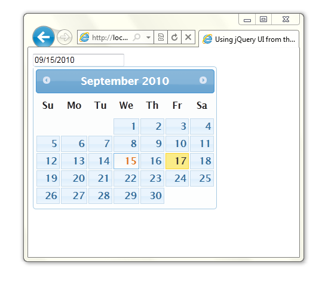

Microsoft Ajax Content Delivery Network
====================
## Table of Contents

**[ajax.microsoft.com renamed to ajax.aspnetcdn.com](#ajaxmicrosoftcom_renamed_to_ajaxaspnetcdncom_18)**  
**[Visual Studio .vsdoc Support](#Visual_Studio_vsdoc_Support_19)**  
**[Using ASP.NET Ajax from the CDN](#Using_ASPNET_Ajax_from_the_CDN_20)**  
**[Using jQuery from the CDN](#Using_jQuery_from_the_CDN_21)**  
**[Using jQuery UI from the CDN](#Using_jQuery_UI_from_the_CDN_22)**  
**[Third-Party Files on the CDN](#Third-Party_Files_on_the_CDN_23)**  
  
 [jQuery Releases on the CDN](#jQuery_Releases_on_the_CDN_0)  
 [jQuery Migrate Releases on the CDN](#jQuery_Migrate_Releases_on_the_CDN_1)  
 [jQuery UI Releases on the CDN](#jQuery_UI_Releases_on_the_CDN_2)  
 [jQuery Validation Releases on the CDN](#jQuery_Validation_Releases_on_the_CDN_3)  
 [jQuery Mobile Releases on the CDN](#jQuery_Mobile_Releases_on_the_CDN_4)  
 [jQuery Templates Releases on the CDN](#jQuery_Templates_Releases_on_the_CDN_5)  
 [jQuery Cycle Releases on the CDN](#jQuery_Cycle_Releases_on_the_CDN_6)  
 [jQuery DataTables Releases on the CDN](#jQuery_DataTables_Releases_on_the_CDN_7)  
 [Modernizr Releases on the CDN](#Modernizr_Releases_on_the_CDN_8)  
 [JSHint Releases on the CDN](#JSHint_Releases_on_the_CDN_10)  
 [Knockout Releases on the CDN](#Knockout_Releases_on_the_CDN_11)  
 [Globalize Releases on the CDN](#Globalize_Releases_on_the_CDN_12)  
 [Respond Releases on the CDN](#Respond_Releases_on_the_CDN_13)  
 [Bootstrap Releases on the CDN](#Bootstrap_Releases_on_the_CDN_14)  
 [Bootstrap TouchCarousel Releases on the CDN](#BootstrapTouchCarousel_Releases_on_the_CDN_18)  
 [Hammer.js Releases on the CDN](#Hammerjs_Releases_on_the_CDN_19)  
 [ASP.NET Web Forms and Ajax Releases on the CDN](#ASPNET_Web_Forms_and_Ajax_Releases_on_the_CDN_15)  
 [ASP.NET MVC Releases on the CDN](#ASPNET_MVC_Releases_on_the_CDN_16)  
 [ASP.NET SignalR Releases on the CDN](#ASPNET_SignalR_Releases_on_the_CDN_17)

**Note: The Microsoft Ajax CDN is not intended for production scenarios.**

The Microsoft Ajax Content Delivery Network (CDN) hosts popular third party JavaScript libraries such as jQuery and enables you to easily add them to your Web applications. For example, you can start using jQuery which is hosted on this CDN simply by adding a &lt;script&gt; tag to your page that points to ajax.aspnetcdn.com.

By taking advantage of the CDN, you can significantly improve the performance of your Ajax applications. The contents of the CDN are cached on servers located around the world. In addition, the CDN enables browsers to reuse cached third party JavaScript files for web sites that are located in different domains.

The CDN supports SSL (HTTPS) in case you need to serve a web page using the Secure Sockets Layer.

The CDN hosts the following third party script libraries which have been uploaded, and are licensed to you, by the owners of those libraries:

- jQuery (www.jquery.com)
- jQuery UI (www.jqueryui.com)
- jQuery Mobile (www.jquerymobile.com)
- jQuery Validation (www.jquery.com)
- jQuery Cycle (www.malsup.com/jquery/cycle/)
- jQuery DataTables (http://datatables.net/)

The Microsoft Ajax CDN also includes the following libraries which have been uploaded by Microsoft:

- ASP.NET Ajax
- ASP.NET MVC JavaScript Files
- ASP.NET SignalR JavaScript Files

Microsoft does not claim ownership of any third-party libraries hosted on this CDN. The copyright owners of the libraries are licensing these libraries to you. Any rights that you may have to download and use such libraries are granted solely by the respective copyright owners. Because these are not Microsoft libraries, Microsoft provides no warranties or intellectual property rights licenses (including no implied patent rights) for the third party libraries hosted on this CDN.

If you wish to submit your JavaScript library and your library is one of the top JavaScript libraries (as listed on http://trends.builtwith.com) or extensions/plugins to these libraries that are (a) popular; or (b) helpful for use on ASP.NET then please contact AjaxCDNSubmission@Microsoft.com.

## ajax.microsoft.com renamed to ajax.aspnetcdn.com

The CDN used to use the microsoft.com domain name and has been changed to use the aspnetcdn.com domain name. This change was made to increase performance because when a browser referenced the microsoft.com domain it would send any cookies from that domain across the wire with each request. By renaming to a domain name other than microsoft.com performance can be increased by as much to 25%. Note ajax.microsoft.com will continue to function but ajax.aspnetcdn.com is recommended.

- Old Format: http://ajax.microsoft.com/ajax/jQuery/jquery-1.8.0.js
- New Format: http://ajax.aspnetcdn.com/ajax/jQuery/jquery-1.8.0.js

## Visual Studio .vsdoc Support

To use the .vsdoc files properly with Visual Studio 2008 you need to make sure that you have VS 2008 SP1 installed and the hotfix for vsdoc files installed. You can get these from here:

- [Download Visual Studio 2008 SP1](https://www.microsoft.com/downloads/en/details.aspx?FamilyId=FBEE1648-7106-44A7-9649-6D9F6D58056E&amp;displaylang=en "Download Visual Studio 2008 SP1")
- [Download .vsdoc hotfix for Visual Studio 2008 SP1](https://code.msdn.microsoft.com/KB958502/Release/ProjectReleases.aspx?ReleaseId=1736 "Download .vsdoc hotfix for Visual Studio 2008 SP1")

Visual Studio 2010 supports .vsdoc files without any additional patches.

## Using ASP.NET Ajax from the CDN

When using ASP.NET 4, you can redirect all requests for ASP.NET framework scripts to the CDN. Retrieving scripts from the CDN instead of your local web server can substantially improve the performance of public ASP.NET websites.

Use the ScriptManager EnableCDN property to redirect all ASP.NET framework script requests to the Microsoft Ajax CDN:

[!code-aspx[Main](overview/samples/sample1.aspx)]

## Using jQuery from the CDN

You can use jQuery scripts hosted on CDN in your Web application by adding the following script element to a page:

[!code-html[Main](overview/samples/sample2.html)]

The CDN also includes the minified version of the jQuery script, which you can get using the following element:

[!code-html[Main](overview/samples/sample3.html)]

To allow your page to fallback to loading jQuery from a local path on your own website if the CDN happens to be unavailable, add the following element immediately after the element referencing the CDN:

[!code-html[Main](overview/samples/sample4.html)]

The following sample page uses the CDN version of the jQuery library (with fallback to a local copy) to display the contents of a div element when a button is clicked.

[!code-html[Main](overview/samples/sample5.html)]

You can learn more about jQuery and download a local copy of jQuery by visiting the [jQuery](http://jquery.com/) Web site.

## Using jQuery UI from the CDN

The CDN also hosts the jQuery UI library. The jQuery UI library includes a rich set of widgets and effects that you can use in your ASP.NET applications. For example, the following page illustrates how you can use the jQuery UI Datepicker in the context of an ASP.NET Web Forms application to display a pop-up calendar:

[!code-aspx[Main](overview/samples/sample6.aspx)]

When you move focus to the TextBox using your keyboard, a calendar is displayed:

Notice that you must include three files from the CDN in the code above:

- The jQuery library &mdash; The jQuery UI library depends on the jQuery library. You must add the jQuery library to your page before you add the jQuery UI library.
- The jQuery UI library &mdash; The jQuery UI library contains all of the jQuery UI effects and widgets such as the Datepicker widget used in the page above.
- A jQuery UI theme &mdash; The jQuery UI supports different themes. The page above includes a link to a CSS file to import the Redmond theme.

All of the standard jQuery UI themes are hosted on the CDN. [Visit this page](jquery-ui/cdnjqueryui1910.md "jQuery UI 1.8.10 on the Microsoft Ajax CDN") to view thumbnails for each theme.

To learn more about the jQuery UI library, visit the official [jQuery UI website](http://jQueryUI.com "jQuery UI website").

## Third-Party Files on the CDN

The CDN hosts some of the most popular third party JavaScript libraries. Microsoft does not claim ownership of any third-party libraries hosted on this CDN. The copyright owners of the libraries are licensing these libraries to you. Any rights that you may have to download and use such libraries are granted solely by the respective copyright owners. Because these are not Microsoft libraries, Microsoft provides no warranties or intellectual property rights licenses (including no implied patent rights) for the third party libraries hosted on this CDN.

### jQuery Releases on the CDN

The following releases of jQuery are hosted on the CDN:

#### jQuery version 3.2.1
- http://ajax.aspnetcdn.com/ajax/jQuery/jquery-3.2.1.js
- http://ajax.aspnetcdn.com/ajax/jQuery/jquery-3.2.1.min.js
- http://ajax.aspnetcdn.com/ajax/jQuery/jquery-3.2.1.min.map
- http://ajax.aspnetcdn.com/ajax/jQuery/jquery-3.2.1.slim.js
- http://ajax.aspnetcdn.com/ajax/jQuery/jquery-3.2.1.slim.min.js
- http://ajax.aspnetcdn.com/ajax/jQuery/jquery-3.2.1.slim.min.map

#### jQuery version 3.2.0

- http://ajax.aspnetcdn.com/ajax/jQuery/jquery-3.2.0.js
- http://ajax.aspnetcdn.com/ajax/jQuery/jquery-3.2.0.min.js
- http://ajax.aspnetcdn.com/ajax/jQuery/jquery-3.2.0.min.map
- http://ajax.aspnetcdn.com/ajax/jQuery/jquery-3.2.0.slim.js
- http://ajax.aspnetcdn.com/ajax/jQuery/jquery-3.2.0.slim.min.js
- http://ajax.aspnetcdn.com/ajax/jQuery/jquery-3.2.0.slim.min.map

#### jQuery version 3.1.1

- http://ajax.aspnetcdn.com/ajax/jQuery/jquery-3.1.1.js
- http://ajax.aspnetcdn.com/ajax/jQuery/jquery-3.1.1.min.js
- http://ajax.aspnetcdn.com/ajax/jQuery/jquery-3.1.1.min.map
- http://ajax.aspnetcdn.com/ajax/jQuery/jquery-3.1.1.slim.js
- http://ajax.aspnetcdn.com/ajax/jQuery/jquery-3.1.1.slim.min.js
- http://ajax.aspnetcdn.com/ajax/jQuery/jquery-3.1.1.slim.min.map

#### jQuery version 3.1.0

- http://ajax.aspnetcdn.com/ajax/jQuery/jquery-3.1.0.js
- http://ajax.aspnetcdn.com/ajax/jQuery/jquery-3.1.0.min.js
- http://ajax.aspnetcdn.com/ajax/jQuery/jquery-3.1.0.min.map
- http://ajax.aspnetcdn.com/ajax/jQuery/jquery-3.1.0.slim.js
- http://ajax.aspnetcdn.com/ajax/jQuery/jquery-3.1.0.slim.min.js
- http://ajax.aspnetcdn.com/ajax/jQuery/jquery-3.1.0.slim.min.map

#### jQuery version 3.0.0

- http://ajax.aspnetcdn.com/ajax/jQuery/jquery-3.0.0.js
- http://ajax.aspnetcdn.com/ajax/jQuery/jquery-3.0.0.min.js
- http://ajax.aspnetcdn.com/ajax/jQuery/jquery-3.0.0.min.map
- http://ajax.aspnetcdn.com/ajax/jQuery/jquery-3.0.0.slim.js
- http://ajax.aspnetcdn.com/ajax/jQuery/jquery-3.0.0.slim.min.js
- http://ajax.aspnetcdn.com/ajax/jQuery/jquery-3.0.0.slim.min.map

#### jQuery version 2.2.4

- http://ajax.aspnetcdn.com/ajax/jQuery/jquery-2.2.4.js
- http://ajax.aspnetcdn.com/ajax/jQuery/jquery-2.2.4.min.js
- http://ajax.aspnetcdn.com/ajax/jQuery/jquery-2.2.4.min.map

#### jQuery version 2.2.3

- http://ajax.aspnetcdn.com/ajax/jQuery/jquery-2.2.3.js
- http://ajax.aspnetcdn.com/ajax/jQuery/jquery-2.2.3.min.js
- http://ajax.aspnetcdn.com/ajax/jQuery/jquery-2.2.3.min.map

#### jQuery version 2.2.2

- http://ajax.aspnetcdn.com/ajax/jQuery/jquery-2.2.2.js
- http://ajax.aspnetcdn.com/ajax/jQuery/jquery-2.2.2.min.js
- http://ajax.aspnetcdn.com/ajax/jQuery/jquery-2.2.2.min.map

#### jQuery version 2.2.1

- http://ajax.aspnetcdn.com/ajax/jQuery/jquery-2.2.1.js
- http://ajax.aspnetcdn.com/ajax/jQuery/jquery-2.2.1.min.js
- http://ajax.aspnetcdn.com/ajax/jQuery/jquery-2.2.1.min.map

#### jQuery version 2.2.0

- http://ajax.aspnetcdn.com/ajax/jQuery/jquery-2.2.0.js
- http://ajax.aspnetcdn.com/ajax/jQuery/jquery-2.2.0.min.js
- http://ajax.aspnetcdn.com/ajax/jQuery/jquery-2.2.0.min.map

#### jQuery version 2.1.4

- http://ajax.aspnetcdn.com/ajax/jQuery/jquery-2.1.4.js
- http://ajax.aspnetcdn.com/ajax/jQuery/jquery-2.1.4.min.js
- http://ajax.aspnetcdn.com/ajax/jQuery/jquery-2.1.4.min.map

#### jQuery version 2.1.3

- http://ajax.aspnetcdn.com/ajax/jQuery/jquery-2.1.3.js
- http://ajax.aspnetcdn.com/ajax/jQuery/jquery-2.1.3.min.js
- http://ajax.aspnetcdn.com/ajax/jQuery/jquery-2.1.3.min.map

#### jQuery version 2.1.2

- http://ajax.aspnetcdn.com/ajax/jQuery/jquery-2.1.2.js
- http://ajax.aspnetcdn.com/ajax/jQuery/jquery-2.1.2.min.js

#### jQuery version 2.1.1

- http://ajax.aspnetcdn.com/ajax/jQuery/jquery-2.1.1.js
- http://ajax.aspnetcdn.com/ajax/jQuery/jquery-2.1.1.min.js
- http://ajax.aspnetcdn.com/ajax/jQuery/jquery-2.1.1.min.map

#### jQuery version 2.1.0

- http://ajax.aspnetcdn.com/ajax/jQuery/jquery-2.1.0.js
- http://ajax.aspnetcdn.com/ajax/jQuery/jquery-2.1.0.min.js
- http://ajax.aspnetcdn.com/ajax/jQuery/jquery-2.1.0-vsdoc.js
- http://ajax.aspnetcdn.com/ajax/jQuery/jquery-2.1.0.min.map

#### jQuery version 2.0.3

- http://ajax.aspnetcdn.com/ajax/jQuery/jquery-2.0.3.js
- http://ajax.aspnetcdn.com/ajax/jQuery/jquery-2.0.3.min.js
- http://ajax.aspnetcdn.com/ajax/jQuery/jquery-2.0.3-vsdoc.js
- http://ajax.aspnetcdn.com/ajax/jQuery/jquery-2.0.3.min.map

#### jQuery version 2.0.2

- http://ajax.aspnetcdn.com/ajax/jQuery/jquery-2.0.2.js
- http://ajax.aspnetcdn.com/ajax/jQuery/jquery-2.0.2.min.js
- http://ajax.aspnetcdn.com/ajax/jQuery/jquery-2.0.2-vsdoc.js
- http://ajax.aspnetcdn.com/ajax/jQuery/jquery-2.0.2.min.map

#### jQuery version 2.0.1

- http://ajax.aspnetcdn.com/ajax/jQuery/jquery-2.0.1.js
- http://ajax.aspnetcdn.com/ajax/jQuery/jquery-2.0.1.min.js
- http://ajax.aspnetcdn.com/ajax/jQuery/jquery-2.0.1-vsdoc.js
- http://ajax.aspnetcdn.com/ajax/jQuery/jquery-2.0.1.min.map

#### jQuery version 2.0.0

- http://ajax.aspnetcdn.com/ajax/jQuery/jquery-2.0.0.js
- http://ajax.aspnetcdn.com/ajax/jQuery/jquery-2.0.0.min.js
- http://ajax.aspnetcdn.com/ajax/jQuery/jquery-2.0.0-vsdoc.js
- http://ajax.aspnetcdn.com/ajax/jQuery/jquery-2.0.0.min.map

#### jQuery version 1.12.4

- http://ajax.aspnetcdn.com/ajax/jQuery/jquery-1.12.4.js
- http://ajax.aspnetcdn.com/ajax/jQuery/jquery-1.12.4.min.js
- http://ajax.aspnetcdn.com/ajax/jQuery/jquery-1.12.4.min.map

#### jQuery version 1.12.3

- http://ajax.aspnetcdn.com/ajax/jQuery/jquery-1.12.3.js
- http://ajax.aspnetcdn.com/ajax/jQuery/jquery-1.12.3.min.js
- http://ajax.aspnetcdn.com/ajax/jQuery/jquery-1.12.3.min.map

#### jQuery version 1.12.2

- http://ajax.aspnetcdn.com/ajax/jQuery/jquery-1.12.2.js
- http://ajax.aspnetcdn.com/ajax/jQuery/jquery-1.12.2.min.js
- http://ajax.aspnetcdn.com/ajax/jQuery/jquery-1.12.2.min.map

#### jQuery version 1.12.1

- http://ajax.aspnetcdn.com/ajax/jQuery/jquery-1.12.1.js
- http://ajax.aspnetcdn.com/ajax/jQuery/jquery-1.12.1.min.js
- http://ajax.aspnetcdn.com/ajax/jQuery/jquery-1.12.1.min.map

#### jQuery version 1.12.0

- http://ajax.aspnetcdn.com/ajax/jQuery/jquery-1.12.0.js
- http://ajax.aspnetcdn.com/ajax/jQuery/jquery-1.12.0.min.js
- http://ajax.aspnetcdn.com/ajax/jQuery/jquery-1.12.0.min.map

#### jQuery version 1.11.3

- http://ajax.aspnetcdn.com/ajax/jQuery/jquery-1.11.3.js
- http://ajax.aspnetcdn.com/ajax/jQuery/jquery-1.11.3.min.js
- http://ajax.aspnetcdn.com/ajax/jQuery/jquery-1.11.3.min.map

#### jQuery version 1.11.2

- http://ajax.aspnetcdn.com/ajax/jQuery/jquery-1.11.2.js
- http://ajax.aspnetcdn.com/ajax/jQuery/jquery-1.11.2.min.js
- http://ajax.aspnetcdn.com/ajax/jQuery/jquery-1.11.2.min.map

#### jQuery version 1.11.1

- http://ajax.aspnetcdn.com/ajax/jQuery/jquery-1.11.1.js
- http://ajax.aspnetcdn.com/ajax/jQuery/jquery-1.11.1.min.js
- http://ajax.aspnetcdn.com/ajax/jQuery/jquery-1.11.1.min.map

#### jQuery version 1.11.0

- http://ajax.aspnetcdn.com/ajax/jQuery/jquery-1.11.0.js
- http://ajax.aspnetcdn.com/ajax/jQuery/jquery-1.11.0.min.js
- http://ajax.aspnetcdn.com/ajax/jQuery/jquery-1.11.0-vsdoc.js
- http://ajax.aspnetcdn.com/ajax/jQuery/jquery-1.11.0.min.map

#### jQuery version 1.10.2

- http://ajax.aspnetcdn.com/ajax/jQuery/jquery-1.10.2.js
- http://ajax.aspnetcdn.com/ajax/jQuery/jquery-1.10.2.min.js
- http://ajax.aspnetcdn.com/ajax/jQuery/jquery-1.10.2-vsdoc.js
- http://ajax.aspnetcdn.com/ajax/jQuery/jquery-1.10.2.min.map

#### jQuery version 1.10.1

- http://ajax.aspnetcdn.com/ajax/jQuery/jquery-1.10.1.js
- http://ajax.aspnetcdn.com/ajax/jQuery/jquery-1.10.1.min.js
- http://ajax.aspnetcdn.com/ajax/jQuery/jquery-1.10.1-vsdoc.js
- http://ajax.aspnetcdn.com/ajax/jQuery/jquery-1.10.1.min.map

#### jQuery version 1.10.0

- http://ajax.aspnetcdn.com/ajax/jQuery/jquery-1.10.0.js
- http://ajax.aspnetcdn.com/ajax/jQuery/jquery-1.10.0.min.js
- http://ajax.aspnetcdn.com/ajax/jQuery/jquery-1.10.0-vsdoc.js
- http://ajax.aspnetcdn.com/ajax/jQuery/jquery-1.10.0.min.map

#### jQuery version 1.9.1

- http://ajax.aspnetcdn.com/ajax/jQuery/jquery-1.9.1.js
- http://ajax.aspnetcdn.com/ajax/jQuery/jquery-1.9.1.min.js
- http://ajax.aspnetcdn.com/ajax/jQuery/jquery-1.9.1-vsdoc.js
- http://ajax.aspnetcdn.com/ajax/jQuery/jquery-1.9.1.min.map

#### jQuery version 1.9.0

- http://ajax.aspnetcdn.com/ajax/jQuery/jquery-1.9.0.js
- http://ajax.aspnetcdn.com/ajax/jQuery/jquery-1.9.0.min.js
- http://ajax.aspnetcdn.com/ajax/jQuery/jquery-1.9.0-vsdoc.js
- http://ajax.aspnetcdn.com/ajax/jQuery/jquery-1.9.0.min.map

#### jQuery version 1.8.3

- http://ajax.aspnetcdn.com/ajax/jQuery/jquery-1.8.3.js
- http://ajax.aspnetcdn.com/ajax/jQuery/jquery-1.8.3.min.js
- http://ajax.aspnetcdn.com/ajax/jQuery/jquery-1.8.3-vsdoc.js

#### jQuery version 1.8.2

- http://ajax.aspnetcdn.com/ajax/jQuery/jquery-1.8.2.js
- http://ajax.aspnetcdn.com/ajax/jQuery/jquery-1.8.2.min.js
- http://ajax.aspnetcdn.com/ajax/jQuery/jquery-1.8.2-vsdoc.js

#### jQuery version 1.8.1

- http://ajax.aspnetcdn.com/ajax/jQuery/jquery-1.8.1.js
- http://ajax.aspnetcdn.com/ajax/jQuery/jquery-1.8.1.min.js
- http://ajax.aspnetcdn.com/ajax/jQuery/jquery-1.8.1-vsdoc.js

#### jQuery version 1.8.0

- http://ajax.aspnetcdn.com/ajax/jQuery/jquery-1.8.0.js
- http://ajax.aspnetcdn.com/ajax/jQuery/jquery-1.8.0.min.js
- http://ajax.aspnetcdn.com/ajax/jQuery/jquery-1.8.0-vsdoc.js

#### jQuery version 1.7.2

- http://ajax.aspnetcdn.com/ajax/jQuery/jquery-1.7.2.js
- http://ajax.aspnetcdn.com/ajax/jQuery/jquery-1.7.2.min.js

#### jQuery version 1.7.1

- http://ajax.aspnetcdn.com/ajax/jQuery/jquery-1.7.1.js
- http://ajax.aspnetcdn.com/ajax/jQuery/jquery-1.7.1.min.js
- http://ajax.aspnetcdn.com/ajax/jQuery/jquery-1.7.1-vsdoc.js

#### jQuery version 1.7

- http://ajax.aspnetcdn.com/ajax/jQuery/jquery-1.7.js
- http://ajax.aspnetcdn.com/ajax/jQuery/jquery-1.7.min.js
- http://ajax.aspnetcdn.com/ajax/jQuery/jquery-1.7-vsdoc.js

#### jQuery version 1.6.4

- http://ajax.aspnetcdn.com/ajax/jQuery/jquery-1.6.4.js
- http://ajax.aspnetcdn.com/ajax/jQuery/jquery-1.6.4.min.js
- http://ajax.aspnetcdn.com/ajax/jQuery/jquery-1.6.4-vsdoc.js

#### jQuery version 1.6.3

- http://ajax.aspnetcdn.com/ajax/jQuery/jquery-1.6.3.js
- http://ajax.aspnetcdn.com/ajax/jQuery/jquery-1.6.3.min.js
- http://ajax.aspnetcdn.com/ajax/jQuery/jquery-1.6.3-vsdoc.js

#### jQuery version 1.6.2

- http://ajax.aspnetcdn.com/ajax/jQuery/jquery-1.6.2.js
- http://ajax.aspnetcdn.com/ajax/jQuery/jquery-1.6.2.min.js
- http://ajax.aspnetcdn.com/ajax/jQuery/jquery-1.6.2-vsdoc.js

#### jQuery version 1.6.1

- http://ajax.aspnetcdn.com/ajax/jQuery/jquery-1.6.1.js
- http://ajax.aspnetcdn.com/ajax/jQuery/jquery-1.6.1.min.js
- http://ajax.aspnetcdn.com/ajax/jQuery/jquery-1.6.1-vsdoc.js

#### jQuery version 1.6

- http://ajax.aspnetcdn.com/ajax/jQuery/jquery-1.6.js
- http://ajax.aspnetcdn.com/ajax/jQuery/jquery-1.6.min.js
- http://ajax.aspnetcdn.com/ajax/jQuery/jquery-1.6-vsdoc.js

#### jQuery version 1.5.2

- http://ajax.aspnetcdn.com/ajax/jQuery/jquery-1.5.2.js
- http://ajax.aspnetcdn.com/ajax/jQuery/jquery-1.5.2.min.js
- http://ajax.aspnetcdn.com/ajax/jQuery/jquery-1.5.2-vsdoc.js

#### jQuery version 1.5.1

- http://ajax.aspnetcdn.com/ajax/jQuery/jquery-1.5.1.js
- http://ajax.aspnetcdn.com/ajax/jQuery/jquery-1.5.1.min.js
- http://ajax.aspnetcdn.com/ajax/jQuery/jquery-1.5.1-vsdoc.js

#### jQuery version 1.5

- http://ajax.aspnetcdn.com/ajax/jQuery/jquery-1.5.js
- http://ajax.aspnetcdn.com/ajax/jQuery/jquery-1.5.min.js
- http://ajax.aspnetcdn.com/ajax/jQuery/jquery-1.5-vsdoc.js

#### jQuery version 1.4.4

- http://ajax.aspnetcdn.com/ajax/jQuery/jquery-1.4.4.js
- http://ajax.aspnetcdn.com/ajax/jQuery/jquery-1.4.4.min.js
- http://ajax.aspnetcdn.com/ajax/jQuery/jquery-1.4.4-vsdoc.js

#### jQuery version 1.4.3

- http://ajax.aspnetcdn.com/ajax/jQuery/jquery-1.4.3.js
- http://ajax.aspnetcdn.com/ajax/jQuery/jquery-1.4.3.min.js
- http://ajax.aspnetcdn.com/ajax/jQuery/jquery-1.4.3-vsdoc.js

#### jQuery version 1.4.2

- http://ajax.aspnetcdn.com/ajax/jQuery/jquery-1.4.2.js
- http://ajax.aspnetcdn.com/ajax/jQuery/jquery-1.4.2.min.js
- http://ajax.aspnetcdn.com/ajax/jQuery/jquery-1.4.2-vsdoc.js

#### jQuery version 1.4.1

- http://ajax.aspnetcdn.com/ajax/jQuery/jquery-1.4.1.js
- http://ajax.aspnetcdn.com/ajax/jQuery/jquery-1.4.1.min.js
- http://ajax.aspnetcdn.com/ajax/jQuery/jquery-1.4.1-vsdoc.js

#### jQuery version 1.4

- http://ajax.aspnetcdn.com/ajax/jQuery/jquery-1.4.js
- http://ajax.aspnetcdn.com/ajax/jQuery/jquery-1.4.min.js

#### jQuery version 1.3.2

- http://ajax.aspnetcdn.com/ajax/jQuery/jquery-1.3.2.js
- http://ajax.aspnetcdn.com/ajax/jQuery/jquery-1.3.2.min.js
- http://ajax.aspnetcdn.com/ajax/jQuery/jquery-1.3.2-vsdoc.js
- http://ajax.aspnetcdn.com/ajax/jQuery/jquery-1.3.2.min-vsdoc.js

### jQuery Migrate Releases on the CDN

The following releases of jQuery Migrate are hosted on the CDN:

#### jQuery Migrate version 3.0.0

- http://ajax.aspnetcdn.com/ajax/jquery.migrate/jquery-migrate-3.0.0.js
- http://ajax.aspnetcdn.com/ajax/jquery.migrate/jquery-migrate-3.0.0.min.js

#### jQuery Migrate version 1.2.1

- http://ajax.aspnetcdn.com/ajax/jquery.migrate/jquery-migrate-1.2.1.js
- http://ajax.aspnetcdn.com/ajax/jquery.migrate/jquery-migrate-1.2.1.min.js

jQuery Migrate version 1.2.0

- http://ajax.aspnetcdn.com/ajax/jquery.migrate/jquery-migrate-1.2.0.js
- http://ajax.aspnetcdn.com/ajax/jquery.migrate/jquery-migrate-1.2.0.min.js

#### jQuery Migrate version 1.1.1

- http://ajax.aspnetcdn.com/ajax/jquery.migrate/jquery-migrate-1.1.1.js
- http://ajax.aspnetcdn.com/ajax/jquery.migrate/jquery-migrate-1.1.1.min.js

#### jQuery Migrate version 1.1.0

- http://ajax.aspnetcdn.com/ajax/jquery.migrate/jquery-migrate-1.1.0.js
- http://ajax.aspnetcdn.com/ajax/jquery.migrate/jquery-migrate-1.1.0.min.js

#### jQuery Migrate version 1.0.0

- http://ajax.aspnetcdn.com/ajax/jquery.migrate/jquery-migrate-1.0.0.js
- http://ajax.aspnetcdn.com/ajax/jquery.migrate/jquery-migrate-1.0.0.min.js

### jQuery UI Releases on the CDN

The following releases of the jQuery UI library are hosted on this CDN. Click each link to see the actual list of files.

- [jQuery UI 1.12.1](jquery-ui/cdnjqueryui1121.md "jQuery UI 1.12.1 on the Microsoft Ajax CDN")
- [jQuery UI 1.12.0](jquery-ui/cdnjqueryui1120.md "jQuery UI 1.12.0 on the Microsoft Ajax CDN")
- [jQuery UI 1.11.4](jquery-ui/cdnjqueryui1114.md "jQuery UI 1.11.4 on the Microsoft Ajax CDN")
- [jQuery UI 1.11.3](jquery-ui/cdnjqueryui1113.md "jQuery UI 1.11.3 on the Microsoft Ajax CDN")
- [jQuery UI 1.11.2](jquery-ui/cdnjqueryui1112.md "jQuery UI 1.11.2 on the Microsoft Ajax CDN")
- [jQuery UI 1.11.1](jquery-ui/cdnjqueryui1111.md "jQuery UI 1.11.1 on the Microsoft Ajax CDN")
- [jQuery UI 1.11.0](jquery-ui/cdnjqueryui1110.md "jQuery UI 1.11.0 on the Microsoft Ajax CDN")
- [jQuery UI 1.10.4](jquery-ui/cdnjqueryui1104.md "jQuery UI 1.10.4 on the Microsoft Ajax CDN")
- [jQuery UI 1.10.3](jquery-ui/cdnjqueryui1103.md "jQuery UI 1.10.3 on the Microsoft Ajax CDN")
- [jQuery UI 1.10.2](jquery-ui/cdnjqueryui1102.md "jQuery UI 1.10.2 on the Microsoft Ajax CDN")
- [jQuery UI 1.10.1](jquery-ui/cdnjqueryui1101.md "jQuery UI 1.10.1 on the Microsoft Ajax CDN")
- [jQuery UI 1.10.0](jquery-ui/cdnjqueryui1100.md "jQuery UI 1.10.0 on the Microsoft Ajax CDN")
- [jQuery UI 1.9.2](jquery-ui/cdnjqueryui192.md "jQuery UI 1.9.2 on the Microsoft Ajax CDN")
- [jQuery UI 1.9.1](jquery-ui/cdnjqueryui191.md "jQuery UI 1.9.1 on the Microsoft Ajax CDN")
- [jQuery UI 1.9.0](jquery-ui/cdnjqueryui190.md "jQuery UI 1.9.0 on the Microsoft Ajax CDN")
- [jQuery UI 1.8.24](jquery-ui/cdnjqueryui1824.md "jQuery UI 1.8.24 on the Microsoft Ajax CDN")
- [jQuery UI 1.8.23](jquery-ui/cdnjqueryui1823.md "jQuery UI 1.8.23 on the Microsoft Ajax CDN")
- [jQuery UI 1.8.22](jquery-ui/cdnjqueryui1822.md "jQuery UI 1.8.22 on the Microsoft Ajax CDN")
- [jQuery UI 1.8.21](jquery-ui/cdnjqueryui1821.md "jQuery UI 1.8.21 on the Microsoft Ajax CDN")
- [jQuery UI 1.8.20](jquery-ui/cdnjqueryui1820.md "jQuery UI 1.8.20 on the Microsoft Ajax CDN")
- [jQuery UI 1.8.19](jquery-ui/cdnjqueryui1819.md "jQuery UI 1.8.19 on the Microsoft Ajax CDN")
- [jQuery UI 1.8.18](jquery-ui/cdnjqueryui1818.md "jQuery UI 1.8.18 on the Microsoft Ajax CDN")
- [jQuery UI 1.8.17](jquery-ui/cdnjqueryui1817.md "jQuery UI 1.8.17 on the Microsoft Ajax CDN")
- [jQuery UI 1.8.16](jquery-ui/cdnjqueryui1816.md "jQuery UI 1.8.16 on the Microsoft Ajax CDN")
- [jQuery UI 1.8.15](jquery-ui/cdnjqueryui1815.md "jQuery UI 1.8.15 on the Microsoft Ajax CDN")
- [jQuery UI 1.8.14](jquery-ui/cdnjqueryui1814.md "jQuery UI 1.8.14 on the Microsoft Ajax CDN")
- [jQuery UI 1.8.13](jquery-ui/cdnjqueryui1813.md "jQuery UI 1.8.13 on the Microsoft Ajax CDN")
- [jQuery UI 1.8.12](jquery-ui/cdnjqueryui1812.md "jQuery UI 1.8.12 on the Microsoft Ajax CDN")
- [jQuery UI 1.8.11](jquery-ui/cdnjqueryui1811.md "jQuery UI 1.8.11 on the Microsoft Ajax CDN")
- [jQuery UI 1.8.10](jquery-ui/cdnjqueryui1910.md "jQuery UI 1.8.10 on the Microsoft Ajax CDN")
- [jQuery UI 1.8.9](jquery-ui/cdnjqueryui189.md "jQuery UI 1.8.9 on the Microsoft Ajax CDN")
- [jQuery UI 1.8.8](jquery-ui/cdnjqueryui188.md "jQuery UI 1.8.8 on the Microsoft Ajax CDN")
- [jQuery UI 1.8.7](jquery-ui/cdnjqueryui187.md "jQuery UI 1.8.7 on the Microsoft Ajax CDN")
- [jQuery UI 1.8.6](jquery-ui/cdnjqueryui186.md "jQuery UI 1.8.6 on the Microsoft Ajax CDN")
- [jQuery UI 1.8.5](jquery-ui/cdnjqueryui185.md "jQuery UI 1.8.5")

### jQuery Validation Releases on the CDN

The following releases of the jQuery Validation library are hosted on this CDN. Click each link to see the actual list of files.

- [jQuery Validate 1.16.0](jquery-validate/cdnjqueryvalidate1160.md "jQuery Validation 1.16.1")
- [jQuery Validate 1.15.1](jquery-validate/cdnjqueryvalidate1151.md "jQuery Validation 1.15.1")
- [jQuery Validate 1.15.0](jquery-validate/cdnjqueryvalidate1150.md "jQuery Validation 1.15.0")
- [jQuery Validate 1.14.0](jquery-validate/cdnjqueryvalidate1140.md "jQuery Validation 1.14.0")
- [jQuery Validate 1.13.1](jquery-validate/cdnjqueryvalidate1131.md "jQuery Validation 1.13.1")
- [jQuery Validate 1.13.0](jquery-validate/cdnjqueryvalidate1130.md "jQuery Validation 1.13.0")
- [jQuery Validate 1.12.0](jquery-validate/cdnjqueryvalidate1120.md "jQuery Validation 1.12.0")
- [jQuery Validate 1.11.1](jquery-validate/cdnjqueryvalidate1111.md "jQuery Validation 1.11.1")
- [jQuery Validate 1.11.0](jquery-validate/cdnjqueryvalidate111.md "jQuery Validation 1.11.0")
- [jQuery Validate 1.10.0](jquery-validate/cdnjqueryvalidate110.md "jQuery Validation 1.10.0")
- [jQuery Validate 1.9](jquery-validate/cdnjqueryvalidate19.md "jquery.validate version 1.9")
- [jQuery Validate 1.8.1](jquery-validate/cdnjqueryvalidate181.md "jquery.validate version 1.8.1")
- [jQuery Validate 1.8](jquery-validate/cdnjqueryvalidate18.md "jquery.validate version 1.8")
- [jQuery Validate 1.7](jquery-validate/cdnjqueryvalidate17.md "jquery.validate version 1.7")
- [jQuery Validate 1.6](jquery-validate/cdnjqueryvalidate16.md "jQuery Validate 1.6")
- [jQuery Validate 1.5.5](jquery-validate/cdnjqueryvalidate155.md "jQuery Validate 1.5.5")

### jQuery Mobile Releases on the CDN

The following releases of the jQuery Mobile library are hosted on this CDN. Click each link to see the actual list of files.

- [jQuery Mobile 1.4.5](jquery-mobile/cdnjquerymobile145.md "jQuery Mobile 1.4.5 on the Microsoft Ajax CDN")
- [jQuery Mobile 1.4.2](jquery-mobile/cdnjquerymobile142.md "jQuery Mobile 1.4.2 on the Microsoft Ajax CDN")
- [jQuery Mobile 1.4.1](jquery-mobile/cdnjquerymobile141.md "jQuery Mobile 1.4.1 on the Microsoft Ajax CDN")
- [jQuery Mobile 1.4.0](jquery-mobile/cdnjquerymobile140.md "jQuery Mobile 1.4.0 on the Microsoft Ajax CDN")
- [jQuery Mobile 1.3.2](jquery-mobile/cdnjquerymobile132.md "jQuery Mobile 1.3.2 on the Microsoft Ajax CDN")
- [jQuery Mobile 1.3.1](jquery-mobile/cdnjquerymobile131.md "jQuery Mobile 1.3.1 on the Microsoft Ajax CDN")
- [jQuery Mobile 1.3.0](jquery-mobile/cdnjquerymobile130.md "jQuery Mobile 1.3.0 on the Microsoft Ajax CDN")
- [jQuery Mobile 1.2.0](jquery-mobile/cdnjquerymobile120.md "jQuery Mobile 1.2.0 on the Microsoft Ajax CDN")
- [jQuery Mobile 1.1.2](jquery-mobile/cdnjquerymobile112.md "jQuery Mobile 1.1.2 on the Microsoft Ajax CDN")
- [jQuery Mobile 1.1.1](jquery-mobile/cdnjquerymobile111.md "jQuery Mobile 1.1.1 on the Microsoft Ajax CDN")
- [jQuery Mobile 1.1.0](jquery-mobile/cdnjquerymobile110.md "jQuery Mobile 1.1.0 on the Microsoft Ajax CDN")
- [jQuery Mobile 1.1.0 RC 2](jquery-mobile/cdnjquerymobile110rc2.md "jQuery Mobile 1.1.0 RC2 on the Microsoft Ajax CDN")
- [jQuery Mobile 1.0.1](jquery-mobile/cdnjquerymobile101.md "jQuery Mobile 1.0.1 on the Microsoft Ajax CDN")
- [jQuery Mobile 1.0](jquery-mobile/cdnjquerymobile10.md "jQuery Mobile 1.0 on the Microsoft Ajax CDN")
- [jQuery Mobile 1.0 RC 2](jquery-mobile/cdnjquerymobile10rc2.md "jQuery Mobile 1.0 RC2 on the Microsoft Ajax CDN")
- [jQuery Mobile 1.0 RC 1](jquery-mobile/cdnjquerymobile10rc1.md "jQuery Mobile 1.0 RC1 on the Microsoft Ajax CDN")
- [jQuery Mobile 1.0 beta 3](jquery-mobile/cdnjquerymobile10b3.md "jQuery Mobile 1.0 Beta 3 on the Microsoft Ajax CDN")

### jQuery Templates Releases on the CDN

The following releases of the jQuery Templates plugin are hosted on this CDN. Click each link to see the actual list of files.

- [jQuery Templates Beta 1](jquery-templates/cdnjquerytemplatesbeta1.md "jQuery Templates Beta 1")

### jQuery Cycle Releases on the CDN

The following releases of the jQuery Cycle plugin are hosted on this CDN. Click each link to see the actual list of files.

- [jQuery Cycle 2.99](jquery-cycle/cdnjquerycycle299.md "jQuery Cycle 2.99")
- [jQuery Cycle 2.94](jquery-cycle/cdnjquerycycle294.md "jQuery Cycle 2.94")
- [jQuery Cycle 2.88](jquery-cycle/cdnjquerycycle288.md "jQuery Cycle 2.88")

### jQuery DataTables Releases on the CDN

The following releases of the jQuery DataTables plugin are hosted on this CDN. Click each link to see the actual list of files.

- [jQuery DataTables 1.10.5](jquery-datatables/cdnjquerydatatables105.md "jQuery DataTables 1.10.5")
- [jQuery DataTables 1.10.4](jquery-datatables/cdnjquerydatatables104.md "jQuery DataTables 1.10.4")
- [jQuery DataTables 1.9.4](jquery-datatables/cdnjquerydatatables194.md "jQuery DataTables 1.9.4")
- [jQuery DataTables 1.9.3](jquery-datatables/cdnjquerydatatables193.md "jQuery DataTables 1.9.3")
- [jQuery DataTables 1.9.2](jquery-datatables/cdnjquerydatatables192.md "jQuery DataTables 1.9.2")
- [jQuery DataTables 1.9.1](jquery-datatables/cdnjquerydatatables191.md "jQuery DataTables 1.9.1")
- [jQuery DataTables 1.9.0](jquery-datatables/cdnjquerydatatables190.md "jQuery DataTables 1.9.0")
- [jQuery DataTables 1.8.2](jquery-datatables/cdnjquerydatatables182.md "jQuery DataTables 1.8.2")

### Modernizr Releases on the CDN

The following releases of [Modernizr](http://www.modernizr.com "Modernizr") are hosted on the CDN:

- http://ajax.aspnetcdn.com/ajax/modernizr/modernizr-2.0.6-development-only.js
- http://ajax.aspnetcdn.com/ajax/modernizr/modernizr-1.7-development-only.js
- http://ajax.aspnetcdn.com/ajax/modernizr/modernizr-2.6.2.js
- http://ajax.aspnetcdn.com/ajax/modernizr/modernizr-2.7.1.js
- http://ajax.aspnetcdn.com/ajax/modernizr/modernizr-2.7.2.js
- http://ajax.aspnetcdn.com/ajax/modernizr/modernizr-2.8.3.js

### JSHint Releases on the CDN

The following releases of [JSHint](http://www.jshint.com "JSHint") are hosted on the CDN:

- http://ajax.aspnetcdn.com/ajax/jshint/r07/jshint.js

### Knockout Releases on the CDN

The following releases of [Knockout](http://www.knockoutjs.com "Knockout") are hosted on the CDN:

- http://ajax.aspnetcdn.com/ajax/knockout/knockout-2.2.1.js
- http://ajax.aspnetcdn.com/ajax/knockout/knockout-2.2.1.debug.js
- http://ajax.aspnetcdn.com/ajax/knockout/knockout-2.2.0.js
- http://ajax.aspnetcdn.com/ajax/knockout/knockout-2.2.0.debug.js
- http://ajax.aspnetcdn.com/ajax/knockout/knockout-2.1.0.js
- http://ajax.aspnetcdn.com/ajax/knockout/knockout-2.1.0.debug.js
- http://ajax.aspnetcdn.com/ajax/knockout/knockout-3.0.0.js
- http://ajax.aspnetcdn.com/ajax/knockout/knockout-3.0.0.debug.js
- http://ajax.aspnetcdn.com/ajax/knockout/knockout-3.1.0.js
- http://ajax.aspnetcdn.com/ajax/knockout/knockout-3.1.0.debug.js
- http://ajax.aspnetcdn.com/ajax/knockout/knockout-3.2.0.js
- http://ajax.aspnetcdn.com/ajax/knockout/knockout-3.2.0.debug.js
- http://ajax.aspnetcdn.com/ajax/knockout/knockout-3.3.0.js
- http://ajax.aspnetcdn.com/ajax/knockout/knockout-3.3.0.debug.js
- http://ajax.aspnetcdn.com/ajax/knockout/knockout-3.4.0.js
- http://ajax.aspnetcdn.com/ajax/knockout/knockout-3.4.0.debug.js
- http://ajax.aspnetcdn.com/ajax/knockout/knockout-3.4.1.js
- http://ajax.aspnetcdn.com/ajax/knockout/knockout-3.4.1.debug.js
- http://ajax.aspnetcdn.com/ajax/knockout/knockout-3.4.2.js
- http://ajax.aspnetcdn.com/ajax/knockout/knockout-3.4.2.debug.js

### Globalize Releases on the CDN

The following releases of [Globalize](https://github.com/jquery/globalize "Globalize") are hosted on the CDN:

#### Globalize version 1.0.0

- http://ajax.aspnetcdn.com/ajax/globalize/1.0.0/globalize.js
- http://ajax.aspnetcdn.com/ajax/globalize/1.0.0/node-main.js
- http://ajax.aspnetcdn.com/ajax/globalize/1.0.0/globalize/currency.js
- http://ajax.aspnetcdn.com/ajax/globalize/1.0.0/globalize/date.js
- http://ajax.aspnetcdn.com/ajax/globalize/1.0.0/globalize/message.js
- http://ajax.aspnetcdn.com/ajax/globalize/1.0.0/globalize/number.js
- http://ajax.aspnetcdn.com/ajax/globalize/1.0.0/globalize/plural.js
- http://ajax.aspnetcdn.com/ajax/globalize/1.0.0/globalize/relative-time.js

#### Globalize version 0.1.1

- http://ajax.aspnetcdn.com/ajax/globalize/0.1.1/globalize.min.js
- http://ajax.aspnetcdn.com/ajax/globalize/0.1.1/globalize.js
- http://ajax.aspnetcdn.com/ajax/globalize/0.1.1/cultures/globalize.cultures.js

    - all cultures
- http://ajax.aspnetcdn.com/ajax/globalize/0.1.1/cultures/globalize.culture.{culture-code}.js

    - Replace "{culture-code}" with the desired culture code, e.g. globalize.culture.en-GB.js== Microsoft Files on the CDN ==These libraries were uploaded by Microsoft.

### Respond Releases on the CDN

The following releases of [https://github.com/scottjehl/Respond](https://github.com/scottjehl/Respond "https://github.com/scottjehl/Respond") Respond are hosted on the CDN:

#### Respond version 1.4.2

- http://ajax.aspnetcdn.com/ajax/respond/1.4.2/respond.js
- http://ajax.aspnetcdn.com/ajax/respond/1.4.2/respond.min.js
- http://ajax.aspnetcdn.com/ajax/respond/1.4.2/respond.matchmedia.addListener.js
- http://ajax.aspnetcdn.com/ajax/respond/1.4.2/respond.matchmedia.addListener.min.js

#### Respond version 1.4.1

- http://ajax.aspnetcdn.com/ajax/respond/1.4.1/respond.js
- http://ajax.aspnetcdn.com/ajax/respond/1.4.1/respond.min.js
- http://ajax.aspnetcdn.com/ajax/respond/1.4.1/respond.matchmedia.addListener.js
- http://ajax.aspnetcdn.com/ajax/respond/1.4.1/respond.matchmedia.addListener.min.js

#### Respond version 1.4.0

- http://ajax.aspnetcdn.com/ajax/respond/1.4.0/respond.js
- http://ajax.aspnetcdn.com/ajax/respond/1.4.0/respond.min.js
- http://ajax.aspnetcdn.com/ajax/respond/1.4.0/respond.matchmedia.addListener.js
- http://ajax.aspnetcdn.com/ajax/respond/1.4.0/respond.matchmedia.addListener.min.js

#### Respond version 1.3.0

- http://ajax.aspnetcdn.com/ajax/respond/1.3.0/respond.js

#### Respond version 1.2.0

- http://ajax.aspnetcdn.com/ajax/respond/1.2.0/respond.js

### Bootstrap Releases on the CDN

The following releases of [getbootstrap.com](http://getbootstrap.com "getbootstrap.com") bootstrap are hosted on the CDN:

#### Bootstrap version 3.3.7

- http://ajax.aspnetcdn.com/ajax/bootstrap/3.3.7/bootstrap.js
- http://ajax.aspnetcdn.com/ajax/bootstrap/3.3.7/bootstrap.min.js
- http://ajax.aspnetcdn.com/ajax/bootstrap/3.3.7/css/bootstrap.css
- http://ajax.aspnetcdn.com/ajax/bootstrap/3.3.7/css/bootstrap.css.map
- http://ajax.aspnetcdn.com/ajax/bootstrap/3.3.7/css/bootstrap.min.css
- http://ajax.aspnetcdn.com/ajax/bootstrap/3.3.7/css/bootstrap-theme.css
- http://ajax.aspnetcdn.com/ajax/bootstrap/3.3.7/css/bootstrap-theme.css.map
- http://ajax.aspnetcdn.com/ajax/bootstrap/3.3.7/css/bootstrap-theme.min.css
- http://ajax.aspnetcdn.com/ajax/bootstrap/3.3.7/fonts/glyphicons-halflings-regular.eot
- http://ajax.aspnetcdn.com/ajax/bootstrap/3.3.7/fonts/glyphicons-halflings-regular.svg
- http://ajax.aspnetcdn.com/ajax/bootstrap/3.3.7/fonts/glyphicons-halflings-regular.ttf
- http://ajax.aspnetcdn.com/ajax/bootstrap/3.3.7/fonts/glyphicons-halflings-regular.woff
- http://ajax.aspnetcdn.com/ajax/bootstrap/3.3.7/fonts/glyphicons-halflings-regular.woff2

#### Bootstrap version 3.3.6

- http://ajax.aspnetcdn.com/ajax/bootstrap/3.3.6/bootstrap.js
- http://ajax.aspnetcdn.com/ajax/bootstrap/3.3.6/bootstrap.min.js
- http://ajax.aspnetcdn.com/ajax/bootstrap/3.3.6/css/bootstrap.css
- http://ajax.aspnetcdn.com/ajax/bootstrap/3.3.6/css/bootstrap.css.map
- http://ajax.aspnetcdn.com/ajax/bootstrap/3.3.6/css/bootstrap.min.css
- http://ajax.aspnetcdn.com/ajax/bootstrap/3.3.6/css/bootstrap-theme.css
- http://ajax.aspnetcdn.com/ajax/bootstrap/3.3.6/css/bootstrap-theme.css.map
- http://ajax.aspnetcdn.com/ajax/bootstrap/3.3.6/css/bootstrap-theme.min.css
- http://ajax.aspnetcdn.com/ajax/bootstrap/3.3.6/fonts/glyphicons-halflings-regular.eot
- http://ajax.aspnetcdn.com/ajax/bootstrap/3.3.6/fonts/glyphicons-halflings-regular.svg
- http://ajax.aspnetcdn.com/ajax/bootstrap/3.3.6/fonts/glyphicons-halflings-regular.ttf
- http://ajax.aspnetcdn.com/ajax/bootstrap/3.3.6/fonts/glyphicons-halflings-regular.woff
- http://ajax.aspnetcdn.com/ajax/bootstrap/3.3.6/fonts/glyphicons-halflings-regular.woff2

#### Bootstrap version 3.3.5

- http://ajax.aspnetcdn.com/ajax/bootstrap/3.3.5/bootstrap.js
- http://ajax.aspnetcdn.com/ajax/bootstrap/3.3.5/bootstrap.min.js
- http://ajax.aspnetcdn.com/ajax/bootstrap/3.3.5/css/bootstrap.css
- http://ajax.aspnetcdn.com/ajax/bootstrap/3.3.5/css/bootstrap.css.map
- http://ajax.aspnetcdn.com/ajax/bootstrap/3.3.5/css/bootstrap.min.css
- http://ajax.aspnetcdn.com/ajax/bootstrap/3.3.5/css/bootstrap-theme.css
- http://ajax.aspnetcdn.com/ajax/bootstrap/3.3.5/css/bootstrap-theme.css.map
- http://ajax.aspnetcdn.com/ajax/bootstrap/3.3.5/css/bootstrap-theme.min.css
- http://ajax.aspnetcdn.com/ajax/bootstrap/3.3.5/fonts/glyphicons-halflings-regular.eot
- http://ajax.aspnetcdn.com/ajax/bootstrap/3.3.5/fonts/glyphicons-halflings-regular.svg
- http://ajax.aspnetcdn.com/ajax/bootstrap/3.3.5/fonts/glyphicons-halflings-regular.ttf
- http://ajax.aspnetcdn.com/ajax/bootstrap/3.3.5/fonts/glyphicons-halflings-regular.woff
- http://ajax.aspnetcdn.com/ajax/bootstrap/3.3.5/fonts/glyphicons-halflings-regular.woff2

#### Bootstrap version 3.3.4

- http://ajax.aspnetcdn.com/ajax/bootstrap/3.3.4/bootstrap.js
- http://ajax.aspnetcdn.com/ajax/bootstrap/3.3.4/bootstrap.min.js
- http://ajax.aspnetcdn.com/ajax/bootstrap/3.3.4/css/bootstrap.css
- http://ajax.aspnetcdn.com/ajax/bootstrap/3.3.4/css/bootstrap.css.map
- http://ajax.aspnetcdn.com/ajax/bootstrap/3.3.4/css/bootstrap.min.css
- http://ajax.aspnetcdn.com/ajax/bootstrap/3.3.4/css/bootstrap-theme.css
- http://ajax.aspnetcdn.com/ajax/bootstrap/3.3.4/css/bootstrap-theme.css.map
- http://ajax.aspnetcdn.com/ajax/bootstrap/3.3.4/css/bootstrap-theme.min.css
- http://ajax.aspnetcdn.com/ajax/bootstrap/3.3.4/fonts/glyphicons-halflings-regular.eot
- http://ajax.aspnetcdn.com/ajax/bootstrap/3.3.4/fonts/glyphicons-halflings-regular.svg
- http://ajax.aspnetcdn.com/ajax/bootstrap/3.3.4/fonts/glyphicons-halflings-regular.ttf
- http://ajax.aspnetcdn.com/ajax/bootstrap/3.3.4/fonts/glyphicons-halflings-regular.woff
- http://ajax.aspnetcdn.com/ajax/bootstrap/3.3.4/fonts/glyphicons-halflings-regular.woff2

#### Bootstrap version 3.3.2

- http://ajax.aspnetcdn.com/ajax/bootstrap/3.3.2/bootstrap.js
- http://ajax.aspnetcdn.com/ajax/bootstrap/3.3.2/bootstrap.min.js
- http://ajax.aspnetcdn.com/ajax/bootstrap/3.3.2/css/bootstrap.css
- http://ajax.aspnetcdn.com/ajax/bootstrap/3.3.2/css/bootstrap.css.map
- http://ajax.aspnetcdn.com/ajax/bootstrap/3.3.2/css/bootstrap.min.css
- http://ajax.aspnetcdn.com/ajax/bootstrap/3.3.2/css/bootstrap-theme.css
- http://ajax.aspnetcdn.com/ajax/bootstrap/3.3.2/css/bootstrap-theme.css.map
- http://ajax.aspnetcdn.com/ajax/bootstrap/3.3.2/css/bootstrap-theme.min.css
- http://ajax.aspnetcdn.com/ajax/bootstrap/3.3.2/fonts/glyphicons-halflings-regular.eot
- http://ajax.aspnetcdn.com/ajax/bootstrap/3.3.2/fonts/glyphicons-halflings-regular.svg
- http://ajax.aspnetcdn.com/ajax/bootstrap/3.3.2/fonts/glyphicons-halflings-regular.ttf
- http://ajax.aspnetcdn.com/ajax/bootstrap/3.3.2/fonts/glyphicons-halflings-regular.woff
- http://ajax.aspnetcdn.com/ajax/bootstrap/3.3.2/fonts/glyphicons-halflings-regular.woff2

#### Bootstrap version 3.3.1

- http://ajax.aspnetcdn.com/ajax/bootstrap/3.3.1/bootstrap.js
- http://ajax.aspnetcdn.com/ajax/bootstrap/3.3.1/bootstrap.min.js
- http://ajax.aspnetcdn.com/ajax/bootstrap/3.3.1/css/bootstrap.css
- http://ajax.aspnetcdn.com/ajax/bootstrap/3.3.1/css/bootstrap.css.map
- http://ajax.aspnetcdn.com/ajax/bootstrap/3.3.1/css/bootstrap.min.css
- http://ajax.aspnetcdn.com/ajax/bootstrap/3.3.1/css/bootstrap-theme.css
- http://ajax.aspnetcdn.com/ajax/bootstrap/3.3.1/css/bootstrap-theme.css.map
- http://ajax.aspnetcdn.com/ajax/bootstrap/3.3.1/css/bootstrap-theme.min.css
- http://ajax.aspnetcdn.com/ajax/bootstrap/3.3.1/fonts/glyphicons-halflings-regular.eot
- http://ajax.aspnetcdn.com/ajax/bootstrap/3.3.1/fonts/glyphicons-halflings-regular.svg
- http://ajax.aspnetcdn.com/ajax/bootstrap/3.3.1/fonts/glyphicons-halflings-regular.ttf
- http://ajax.aspnetcdn.com/ajax/bootstrap/3.3.1/fonts/glyphicons-halflings-regular.woff

#### Bootstrap version 3.3.0

- http://ajax.aspnetcdn.com/ajax/bootstrap/3.3.0/bootstrap.js
- http://ajax.aspnetcdn.com/ajax/bootstrap/3.3.0/bootstrap.min.js
- http://ajax.aspnetcdn.com/ajax/bootstrap/3.3.0/css/bootstrap.css
- http://ajax.aspnetcdn.com/ajax/bootstrap/3.3.0/css/bootstrap.css.map
- http://ajax.aspnetcdn.com/ajax/bootstrap/3.3.0/css/bootstrap.min.css
- http://ajax.aspnetcdn.com/ajax/bootstrap/3.3.0/css/bootstrap-theme.css
- http://ajax.aspnetcdn.com/ajax/bootstrap/3.3.0/css/bootstrap-theme.css.map
- http://ajax.aspnetcdn.com/ajax/bootstrap/3.3.0/css/bootstrap-theme.min.css
- http://ajax.aspnetcdn.com/ajax/bootstrap/3.3.0/fonts/glyphicons-halflings-regular.eot
- http://ajax.aspnetcdn.com/ajax/bootstrap/3.3.0/fonts/glyphicons-halflings-regular.svg
- http://ajax.aspnetcdn.com/ajax/bootstrap/3.3.0/fonts/glyphicons-halflings-regular.ttf
- http://ajax.aspnetcdn.com/ajax/bootstrap/3.3.0/fonts/glyphicons-halflings-regular.woff

#### Bootstrap version 3.2.0

- http://ajax.aspnetcdn.com/ajax/bootstrap/3.2.0/bootstrap.js
- http://ajax.aspnetcdn.com/ajax/bootstrap/3.2.0/bootstrap.min.js
- http://ajax.aspnetcdn.com/ajax/bootstrap/3.2.0/css/bootstrap.css
- http://ajax.aspnetcdn.com/ajax/bootstrap/3.2.0/css/bootstrap.css.map
- http://ajax.aspnetcdn.com/ajax/bootstrap/3.2.0/css/bootstrap.min.css
- http://ajax.aspnetcdn.com/ajax/bootstrap/3.2.0/css/bootstrap-theme.css
- http://ajax.aspnetcdn.com/ajax/bootstrap/3.2.0/css/bootstrap-theme.css.map
- http://ajax.aspnetcdn.com/ajax/bootstrap/3.2.0/css/bootstrap-theme.min.css
- http://ajax.aspnetcdn.com/ajax/bootstrap/3.2.0/fonts/glyphicons-halflings-regular.eot
- http://ajax.aspnetcdn.com/ajax/bootstrap/3.2.0/fonts/glyphicons-halflings-regular.svg
- http://ajax.aspnetcdn.com/ajax/bootstrap/3.2.0/fonts/glyphicons-halflings-regular.ttf
- http://ajax.aspnetcdn.com/ajax/bootstrap/3.2.0/fonts/glyphicons-halflings-regular.woff

#### Bootstrap version 3.1.1

- http://ajax.aspnetcdn.com/ajax/bootstrap/3.1.1/bootstrap.js
- http://ajax.aspnetcdn.com/ajax/bootstrap/3.1.1/bootstrap.min.js
- http://ajax.aspnetcdn.com/ajax/bootstrap/3.1.1/css/bootstrap.css
- http://ajax.aspnetcdn.com/ajax/bootstrap/3.1.1/css/bootstrap.css.map
- http://ajax.aspnetcdn.com/ajax/bootstrap/3.1.1/css/bootstrap.min.css
- http://ajax.aspnetcdn.com/ajax/bootstrap/3.1.1/css/bootstrap-theme.css
- http://ajax.aspnetcdn.com/ajax/bootstrap/3.1.1/css/bootstrap-theme.css.map
- http://ajax.aspnetcdn.com/ajax/bootstrap/3.1.1/css/bootstrap-theme.min.css
- http://ajax.aspnetcdn.com/ajax/bootstrap/3.1.1/fonts/glyphicons-halflings-regular.eot
- http://ajax.aspnetcdn.com/ajax/bootstrap/3.1.1/fonts/glyphicons-halflings-regular.svg
- http://ajax.aspnetcdn.com/ajax/bootstrap/3.1.1/fonts/glyphicons-halflings-regular.ttf
- http://ajax.aspnetcdn.com/ajax/bootstrap/3.1.1/fonts/glyphicons-halflings-regular.woff

#### Bootstrap version 3.1.0

- http://ajax.aspnetcdn.com/ajax/bootstrap/3.1.0/bootstrap.js
- http://ajax.aspnetcdn.com/ajax/bootstrap/3.1.0/bootstrap.min.js
- http://ajax.aspnetcdn.com/ajax/bootstrap/3.1.0/css/bootstrap.css
- http://ajax.aspnetcdn.com/ajax/bootstrap/3.1.0/css/bootstrap.css.map
- http://ajax.aspnetcdn.com/ajax/bootstrap/3.1.0/css/bootstrap.min.css
- http://ajax.aspnetcdn.com/ajax/bootstrap/3.1.0/css/bootstrap-theme.css
- http://ajax.aspnetcdn.com/ajax/bootstrap/3.1.0/css/bootstrap-theme.css.map
- http://ajax.aspnetcdn.com/ajax/bootstrap/3.1.0/css/bootstrap-theme.min.css
- http://ajax.aspnetcdn.com/ajax/bootstrap/3.1.0/fonts/glyphicons-halflings-regular.eot
- http://ajax.aspnetcdn.com/ajax/bootstrap/3.1.0/fonts/glyphicons-halflings-regular.svg
- http://ajax.aspnetcdn.com/ajax/bootstrap/3.1.0/fonts/glyphicons-halflings-regular.ttf
- http://ajax.aspnetcdn.com/ajax/bootstrap/3.1.0/fonts/glyphicons-halflings-regular.woff

#### Bootstrap version 3.0.3

- http://ajax.aspnetcdn.com/ajax/bootstrap/3.0.3/bootstrap.js
- http://ajax.aspnetcdn.com/ajax/bootstrap/3.0.3/bootstrap.min.js
- http://ajax.aspnetcdn.com/ajax/bootstrap/3.0.3/css/bootstrap.css
- http://ajax.aspnetcdn.com/ajax/bootstrap/3.0.3/css/bootstrap.min.css
- http://ajax.aspnetcdn.com/ajax/bootstrap/3.0.3/css/bootstrap-theme.css
- http://ajax.aspnetcdn.com/ajax/bootstrap/3.0.3/css/bootstrap-theme.min.css
- http://ajax.aspnetcdn.com/ajax/bootstrap/3.0.3/fonts/glyphicons-halflings-regular.eot
- http://ajax.aspnetcdn.com/ajax/bootstrap/3.0.3/fonts/glyphicons-halflings-regular.svg
- http://ajax.aspnetcdn.com/ajax/bootstrap/3.0.3/fonts/glyphicons-halflings-regular.ttf
- http://ajax.aspnetcdn.com/ajax/bootstrap/3.0.3/fonts/glyphicons-halflings-regular.woff

#### Bootstrap version 3.0.2

- http://ajax.aspnetcdn.com/ajax/bootstrap/3.0.2/bootstrap.js
- http://ajax.aspnetcdn.com/ajax/bootstrap/3.0.2/bootstrap.min.js
- http://ajax.aspnetcdn.com/ajax/bootstrap/3.0.2/css/bootstrap.css
- http://ajax.aspnetcdn.com/ajax/bootstrap/3.0.2/css/bootstrap.min.css
- http://ajax.aspnetcdn.com/ajax/bootstrap/3.0.2/css/bootstrap-theme.css
- http://ajax.aspnetcdn.com/ajax/bootstrap/3.0.2/css/bootstrap-theme.min.css
- http://ajax.aspnetcdn.com/ajax/bootstrap/3.0.2/fonts/glyphicons-halflings-regular.eot
- http://ajax.aspnetcdn.com/ajax/bootstrap/3.0.2/fonts/glyphicons-halflings-regular.svg
- http://ajax.aspnetcdn.com/ajax/bootstrap/3.0.2/fonts/glyphicons-halflings-regular.ttf
- http://ajax.aspnetcdn.com/ajax/bootstrap/3.0.2/fonts/glyphicons-halflings-regular.woff

#### Bootstrap version 3.0.1

- http://ajax.aspnetcdn.com/ajax/bootstrap/3.0.1/bootstrap.js
- http://ajax.aspnetcdn.com/ajax/bootstrap/3.0.1/bootstrap.min.js
- http://ajax.aspnetcdn.com/ajax/bootstrap/3.0.1/css/bootstrap.css
- http://ajax.aspnetcdn.com/ajax/bootstrap/3.0.1/css/bootstrap.min.css
- http://ajax.aspnetcdn.com/ajax/bootstrap/3.0.1/css/bootstrap-theme.css
- http://ajax.aspnetcdn.com/ajax/bootstrap/3.0.1/css/bootstrap-theme.min.css
- http://ajax.aspnetcdn.com/ajax/bootstrap/3.0.1/fonts/glyphicons-halflings-regular.eot
- http://ajax.aspnetcdn.com/ajax/bootstrap/3.0.1/fonts/glyphicons-halflings-regular.svg
- http://ajax.aspnetcdn.com/ajax/bootstrap/3.0.1/fonts/glyphicons-halflings-regular.ttf
- http://ajax.aspnetcdn.com/ajax/bootstrap/3.0.1/fonts/glyphicons-halflings-regular.woff

#### Bootstrap version 3.0.0

- http://ajax.aspnetcdn.com/ajax/bootstrap/3.0.0/bootstrap.js
- http://ajax.aspnetcdn.com/ajax/bootstrap/3.0.0/bootstrap.min.js
- http://ajax.aspnetcdn.com/ajax/bootstrap/3.0.0/css/bootstrap.css
- http://ajax.aspnetcdn.com/ajax/bootstrap/3.0.0/css/bootstrap.min.css
- http://ajax.aspnetcdn.com/ajax/bootstrap/3.0.0/css/bootstrap-theme.css
- http://ajax.aspnetcdn.com/ajax/bootstrap/3.0.0/css/bootstrap-theme.min.css
- http://ajax.aspnetcdn.com/ajax/bootstrap/3.0.0/fonts/glyphicons-halflings-regular.eot
- http://ajax.aspnetcdn.com/ajax/bootstrap/3.0.0/fonts/glyphicons-halflings-regular.svg
- http://ajax.aspnetcdn.com/ajax/bootstrap/3.0.0/fonts/glyphicons-halflings-regular.ttf
- http://ajax.aspnetcdn.com/ajax/bootstrap/3.0.0/fonts/glyphicons-halflings-regular.woff

#### Bootstrap version 2.3.2

- http://ajax.aspnetcdn.com/ajax/bootstrap/2.3.2/bootstrap.js
- http://ajax.aspnetcdn.com/ajax/bootstrap/2.3.2/bootstrap.min.js
- http://ajax.aspnetcdn.com/ajax/bootstrap/2.3.2/css/bootstrap.css
- http://ajax.aspnetcdn.com/ajax/bootstrap/2.3.2/css/bootstrap.min.css
- http://ajax.aspnetcdn.com/ajax/bootstrap/2.3.2/css/bootstrap-responsive.css
- http://ajax.aspnetcdn.com/ajax/bootstrap/2.3.2/css/bootstrap-responsive.min.css
- http://ajax.aspnetcdn.com/ajax/bootstrap/2.3.2/img/glyphicons-halflings.png
- http://ajax.aspnetcdn.com/ajax/bootstrap/2.3.2/img/glyphicons-halflings-white.png

#### Bootstrap version 2.3.1

- http://ajax.aspnetcdn.com/ajax/bootstrap/2.3.1/bootstrap.js
- http://ajax.aspnetcdn.com/ajax/bootstrap/2.3.1/bootstrap.min.js
- http://ajax.aspnetcdn.com/ajax/bootstrap/2.3.1/css/bootstrap.css
- http://ajax.aspnetcdn.com/ajax/bootstrap/2.3.1/css/bootstrap.min.css
- http://ajax.aspnetcdn.com/ajax/bootstrap/2.3.1/css/bootstrap-responsive.css
- http://ajax.aspnetcdn.com/ajax/bootstrap/2.3.1/css/bootstrap-responsive.min.css
- http://ajax.aspnetcdn.com/ajax/bootstrap/2.3.1/img/glyphicons-halflings.png
- http://ajax.aspnetcdn.com/ajax/bootstrap/2.3.1/img/glyphicons-halflings-white.png

### Bootstrap TouchCarousel Releases on the CDN

The following releases of [https://github.com/ixisio/bootstrap-touch-carousel](https://github.com/ixisio/bootstrap-touch-carousel "https://github.com/ixisio/bootstrap-touch-carousel") Bootstrap TouchCarousel releases are hosted on the CDN:

#### Bootstrap TouchCarousel version 0.8.0

- http://ajax.aspnetcdn.com/ajax/bootstrap-touch-carousel/0.8.0/css/bootstrap-touch-carousel.css
- http://ajax.aspnetcdn.com/ajax/bootstrap-touch-carousel/0.8.0/js/bootstrap-touch-carousel.js

### Hammer.js Releases on the CDN

The following releases of [http://hammerjs.github.io/](http://hammerjs.github.io/ "http://hammerjs.github.io/") Hammer.js releases are hosted on the CDN:

#### Hammer.js version 2.0.4

- http://ajax.aspnetcdn.com/ajax/hammer.js/2.0.4/hammer.js
- http://ajax.aspnetcdn.com/ajax/hammer.js/2.0.4/hammer.min.js
- http://ajax.aspnetcdn.com/ajax/hammer.js/2.0.4/hammer.min.map

### ASP.NET Web Forms and Ajax Releases on the CDN

The following releases of the ASP.NET Ajax Library are hosted on the CDN. Click each link to see the actual list of files.

- [ASP.NET Web Forms and Ajax version 4.5.2](cdnajax452.md "ASP.NET Web Forms and Ajax 4.5.2")
- [ASP.NET Web Forms and Ajax version 4](cdnajax4.md "ASP.NET Web Forms and Ajax 4")
- [ASP.NET Ajax version 3.5](cdnajax35.md "ASP.NET Ajax 3.5")

### ASP.NET MVC Releases on the CDN

The following ASP.NET MVC JavaScript files are hosted on this CDN:

#### ASP.NET MVC 5.2.3

- http://ajax.aspnetcdn.com/ajax/mvc/5.2.3/jquery.validate.unobtrusive.js
- http://ajax.aspnetcdn.com/ajax/mvc/5.2.3/jquery.validate.unobtrusive.min.js

#### ASP.NET MVC 5.1

- http://ajax.aspnetcdn.com/ajax/mvc/5.1/jquery.validate.unobtrusive.js
- http://ajax.aspnetcdn.com/ajax/mvc/5.1/jquery.validate.unobtrusive.min.js

#### ASP.NET MVC 5.0

- http://ajax.aspnetcdn.com/ajax/mvc/5.0/jquery.validate.unobtrusive.js
- http://ajax.aspnetcdn.com/ajax/mvc/5.0/jquery.validate.unobtrusive.min.js

#### ASP.NET MVC 4.0

- http://ajax.aspnetcdn.com/ajax/mvc/4.0/jquery.validate.unobtrusive.js
- http://ajax.aspnetcdn.com/ajax/mvc/4.0/jquery.validate.unobtrusive.min.js

#### ASP.NET MVC 3.0

- http://ajax.aspnetcdn.com/ajax/mvc/3.0/jquery.unobtrusive-ajax.js
- http://ajax.aspnetcdn.com/ajax/mvc/3.0/jquery.unobtrusive-ajax.min.js
- http://ajax.aspnetcdn.com/ajax/mvc/3.0/jquery.validate.unobtrusive.js
- http://ajax.aspnetcdn.com/ajax/mvc/3.0/jquery.validate.unobtrusive.min.js
- http://ajax.aspnetcdn.com/ajax/mvc/3.0/MicrosoftMvcAjax.js
- http://ajax.aspnetcdn.com/ajax/mvc/3.0/MicrosoftMvcAjax.debug.js

#### ASP.NET MVC 2.0

- http://ajax.aspnetcdn.com/ajax/mvc/2.0/MicrosoftMvcAjax.js
- http://ajax.aspnetcdn.com/ajax/mvc/2.0/MicrosoftMvcAjax.debug.js

#### ASP.NET MVC 1.0

- http://ajax.aspnetcdn.com/ajax/mvc/1.0/MicrosoftMvcAjax.js
- http://ajax.aspnetcdn.com/ajax/mvc/1.0/MicrosoftMvcAjax.debug.js

### ASP.NET SignalR Releases on the CDN

The following ASP.NET SignalR JavaScript files are hosted on this CDN:

#### ASP.NET SignalR 2.2.2

- http://ajax.aspnetcdn.com/ajax/signalr/jquery.signalr-2.2.2.min.js
- http://ajax.aspnetcdn.com/ajax/signalr/jquery.signalr-2.2.2.js

#### ASP.NET SignalR 2.2.1

- http://ajax.aspnetcdn.com/ajax/signalr/jquery.signalr-2.2.1.min.js
- http://ajax.aspnetcdn.com/ajax/signalr/jquery.signalr-2.2.1.js

#### ASP.NET SignalR 2.2.0

- http://ajax.aspnetcdn.com/ajax/signalr/jquery.signalr-2.2.0.min.js
- http://ajax.aspnetcdn.com/ajax/signalr/jquery.signalr-2.2.0.js

#### ASP.NET SignalR 2.1.0

- http://ajax.aspnetcdn.com/ajax/signalr/jquery.signalr-2.1.0.min.js
- http://ajax.aspnetcdn.com/ajax/signalr/jquery.signalr-2.1.0.js

#### ASP.NET SignalR 2.0.3

- http://ajax.aspnetcdn.com/ajax/signalr/jquery.signalr-2.0.3.min.js
- http://ajax.aspnetcdn.com/ajax/signalr/jquery.signalr-2.0.3.js

#### ASP.NET SignalR 2.0.2

- http://ajax.aspnetcdn.com/ajax/signalr/jquery.signalr-2.0.2.min.js
- http://ajax.aspnetcdn.com/ajax/signalr/jquery.signalr-2.0.2.js

#### ASP.NET SignalR 2.0.1

- http://ajax.aspnetcdn.com/ajax/signalr/jquery.signalr-2.0.1.min.js
- http://ajax.aspnetcdn.com/ajax/signalr/jquery.signalr-2.0.1.js

#### ASP.NET SignalR 2.0.0

- http://ajax.aspnetcdn.com/ajax/signalr/jquery.signalr-2.0.0.min.js
- http://ajax.aspnetcdn.com/ajax/signalr/jquery.signalr-2.0.0.js

#### ASP.NET SignalR 1.1.3

- http://ajax.aspnetcdn.com/ajax/signalr/jquery.signalr-1.1.3.min.js
- http://ajax.aspnetcdn.com/ajax/signalr/jquery.signalr-1.1.3.js

#### ASP.NET SignalR 1.1.2

- http://ajax.aspnetcdn.com/ajax/signalr/jquery.signalr-1.1.2.min.js
- http://ajax.aspnetcdn.com/ajax/signalr/jquery.signalr-1.1.2.js

#### ASP.NET SignalR 1.1.1

- http://ajax.aspnetcdn.com/ajax/signalr/jquery.signalr-1.1.1.min.js
- http://ajax.aspnetcdn.com/ajax/signalr/jquery.signalr-1.1.1.js

#### ASP.NET SignalR 1.1.0

- http://ajax.aspnetcdn.com/ajax/signalr/jquery.signalr-1.1.0.min.js
- http://ajax.aspnetcdn.com/ajax/signalr/jquery.signalr-1.1.0.js

#### ASP.NET SignalR 1.0.1

- http://ajax.aspnetcdn.com/ajax/signalr/jquery.signalr-1.0.1.min.js
- http://ajax.aspnetcdn.com/ajax/signalr/jquery.signalr-1.0.1.js

For information about the terms of use for the CDN, see [Microsoft Ajax CDN Terms of Use](https://www.asp.net/terms-of-use "Microsoft Ajax CDN Terms of Use").
