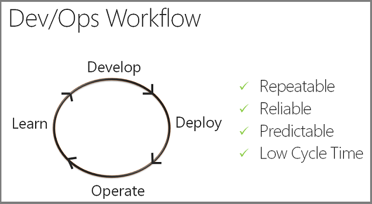
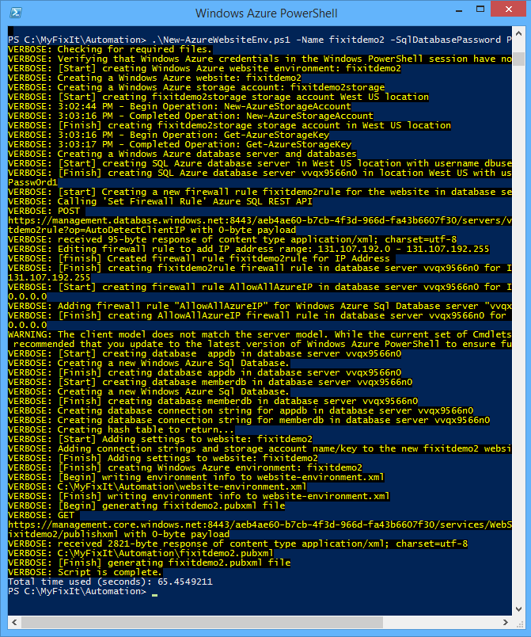
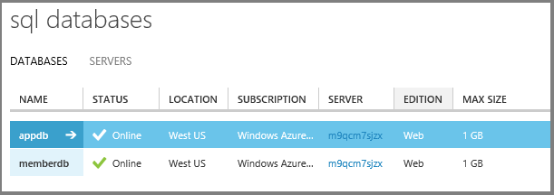
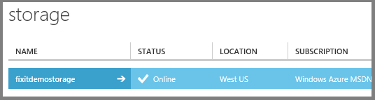
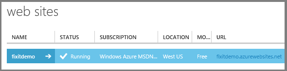
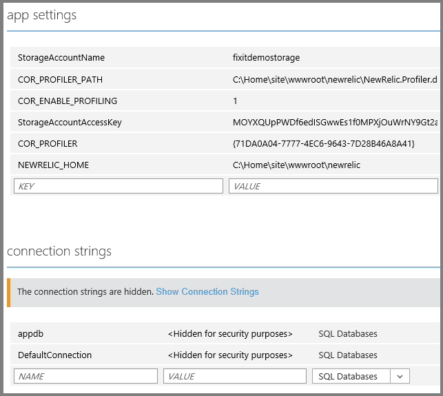
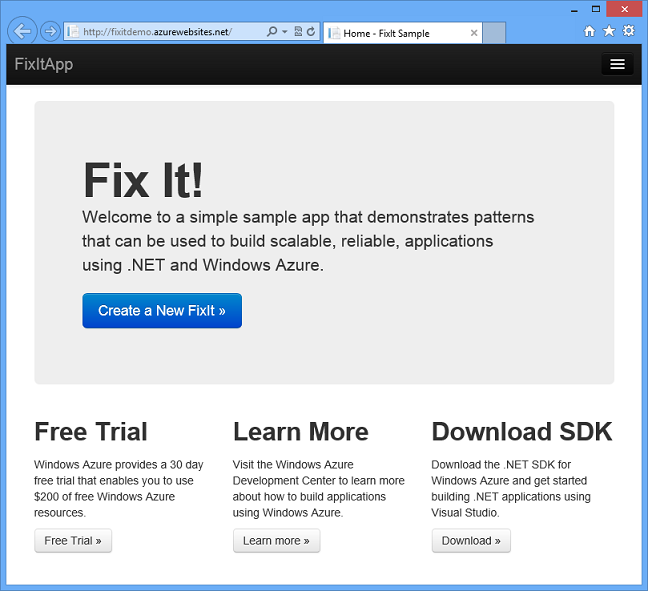

Automate Everything (Building Real-World Cloud Apps with Azure)
====================
by [Mike Wasson](https://github.com/MikeWasson), [Rick Anderson](https://github.com/Rick-Anderson), [Tom Dykstra](https://github.com/tdykstra)

[Download Fix It Project](http://code.msdn.microsoft.com/Fix-It-app-for-Building-cdd80df4) or [Download E-book](http://blogs.msdn.com/b/microsoft_press/archive/2014/07/23/free-ebook-building-cloud-apps-with-microsoft-azure.aspx)

> The **Building Real World Cloud Apps with Azure** e-book is based on a presentation developed by Scott Guthrie. It explains 13 patterns and practices that can help you be successful developing web apps for the cloud. For an introduction to the e-book, see [the first chapter](introduction.md).

The first three patterns we'll look at actually apply to any software development project, but especially to cloud projects. This pattern is about automating development tasks. It's an important topic because manual processes are slow and error-prone; automating as many of them as possible helps set up a fast, reliable, and agile workflow. It's uniquely important for cloud development because you can easily automate many tasks that are difficult or impossible to automate in an on-premises environment. For example, you can set up whole test environments including new web server and back-end VMs, databases, blob storage (file storage), queues, etc.

## DevOps Workflow

Increasingly you hear the term "DevOps." The term developed out of a recognition that you have to integrate development and operations tasks in order to develop software efficiently. The kind of workflow you want to enable is one in which you can develop an app, deploy it, learn from production usage of it, change it in response to what you've learned, and repeat the cycle quickly and reliably.

Some successful cloud development teams deploy multiple times a day to a live environment. The Azure team used to deploy a major update every 2-3 months, but now it releases minor updates every 2-3 days and major releases every 2-3 weeks. Getting into that cadence really helps you be responsive to customer feedback.

In order to do that, you have to enable a development and deployment cycle that is repeatable, reliable, predictable, and has low cycle time.

In other words, the period of time between when you have an idea for a feature and when the customers are using it and providing feedback must be as short as possible. The first three patterns – automate everything, source control, and continuous integration and delivery -- are all about best practices that we recommend in order to enable that kind of process.

## Azure management scripts

In the [introduction to this e-book](introduction.md), you saw the web-based console, the Azure Management Portal. The management portal enables you to monitor and manage all of the resources that you have deployed on Azure. It's an easy way to create and delete services such as web apps and VMs, configure those services, monitor service operation, and so forth. It's a great tool, but using it is a manual process. If you're going to develop a production application of any size, and especially in a team environment, we recommend that you go through the portal UI in order to learn and explore Azure, and then automate the processes that you'll be doing repetitively.

Nearly everything that you can do manually in the management portal or from Visual Studio can also be done by calling the REST management API. You can write scripts using [Windows PowerShell](https://msdn.microsoft.com/en-us/library/windowsazure/jj156055.aspx), or you can use an open source framework such as [Chef](http://www.opscode.com/chef/) or [Puppet](http://puppetlabs.com/puppet/what-is-puppet). You can also use the Bash command-line tool in a Mac or Linux environment. Azure has scripting APIs for all those different environments, and it has a [.NET management API](http://www.hanselman.com/blog/PennyPinchingInTheCloudAutomatingEverythingWithTheWindowsAzureManagementLibrariesAndNET.aspx) in case you want to write code instead of script.

For the Fix It app we've created some Windows PowerShell scripts that automate the processes of creating a test environment and deploying the project to that environment, and we'll review some of the contents of those scripts.

## Environment creation script

The first script we'll look at is named *New-AzureWebsiteEnv.ps1*. It creates an Azure environment that you can deploy the Fix It app to for testing. The main tasks that this script performs are the following:

- Create a web app.
- Create a storage account. (Required for blobs and queues, as you'll see in later chapters.)
- Create a SQL Database server and two databases: an application database, and a membership database.
- Store settings in Azure that the app will use to access the storage account and databases.
- Create settings files that will be used to automate deployment.

### Run the script

> [!NOTE]
> This part of the chapter shows examples of scripts and the commands that you enter in order to run them. This a demo and doesn't provide everything you need to know in order to run the scripts. For step-by-step how-to-do-it instructions, see [Appendix: The Fix It Sample Application](the-fix-it-sample-application.md#deploybase).

To run a PowerShell script that manages Azure services you have to install the Azure PowerShell console and configure it to work with your Azure subscription. Once you're set up, you can run the Fix It environment creation script with a command like this one:

`.\New-AzureWebsiteEnv.ps1 -Name <websitename> -SqlDatabasePassword <password>`

The `Name` parameter specifies the name to be used when creating the database and storage accounts, and the `SqlDatabasePassword` parameter specifies the password for the admin account that will be created for SQL Database. There are other parameters you can use that we'll look at later.

After the script finishes you can see in the management portal what was created. You'll find two databases:

A storage account:

And a web app:

On the **Configure** tab for the web app, you can see that it has the storage account settings and SQL database connection strings set up for the Fix It app.

The *Automation* folder now also contains a *&lt;websitename&gt;.pubxml* file. This file stores settings that MSBuild will use to deploy the application to the Azure environment that was just created. For example:

[!code-xml[Main](automate-everything/samples/sample1.xml)]

As you can see, the script has created a complete test environment, and the whole process is done in about 90 seconds.

If someone else on your team wants to create a test environment, they can just run the script. Not only is it fast, but also they can be confident that they are using an environment identical to the one you're using. You couldn't be quite as confident of that if everyone was setting things up manually by using the management portal UI.

### A look at the scripts

There are actually three scripts that do this work. You call one from the command line and it automatically uses the other two to do some of the tasks:

- *New-AzureWebSiteEnv.ps1* is the main script.

    - *New-AzureStorage.ps1* creates the storage account.
    - *New-AzureSql.ps1* creates the databases.

### Parameters in the main script

The main script, *New-AzureWebSiteEnv.ps1*, defines several parameters:

[!code-powershell[Main](automate-everything/samples/sample2.ps1)]

Two parameters are required:

- The name of the web app that the script creates. (This is also used for the URL: `<name>.azurewebsites.net`.)
- The password for the new administrative user of the database server that the script creates.

Optional parameters enable you to specify the data center location (defaults to "West US"), database server administrator name (defaults to "dbuser"), and a firewall rule for the database server.

### Create the web app

The first thing the script does is create the web app by calling the `New-AzureWebsite` cmdlet, passing in to it the web app name and location parameter values:

[!code-powershell[Main](automate-everything/samples/sample3.ps1?highlight=2)]

### Create the storage account

Then the main script runs the *New-AzureStorage.ps1* script, specifying "*&lt;websitename&gt;*storage" for the storage account name, and the same data center location as the web app.

[!code-powershell[Main](automate-everything/samples/sample4.ps1?highlight=3)]

*New-AzureStorage.ps1* calls the `New-AzureStorageAccount` cmdlet to create the storage account, and it returns the account name and access key values. The application will need these values in order to access the blobs and queues in the storage account.

[!code-powershell[Main](automate-everything/samples/sample5.ps1?highlight=2)]

You might not always want to create a new storage account; you could enhance the script by adding a parameter that optionally directs it to use an existing storage account.

### Create the databases

The main script then runs the database creation script, *New-AzureSql.ps1*, after setting up default database and firewall rule names:

[!code-powershell[Main](automate-everything/samples/sample6.ps1)]

[!code-powershell[Main](automate-everything/samples/sample7.ps1?highlight=2)]

The database creation script retrieves the dev machine's IP address and sets a firewall rule so the dev machine can connect to and manage the server. The database creation script then goes through several steps to set up the databases:

- Creates the server by using the `New-AzureSqlDatabaseServer` cmdlet.

    [!code-powershell[Main](automate-everything/samples/sample8.ps1?highlight=1)]
- Creates firewall rules to enable the dev machine to manage the server and to enable the web app to connect to it. 

    [!code-powershell[Main](automate-everything/samples/sample9.ps1?highlight=3,5)]
- Creates a database context that includes the server name and credentials, by using the `New-AzureSqlDatabaseServerContext` cmdlet.

    [!code-powershell[Main](automate-everything/samples/sample10.ps1?highlight=4)]

    `New-PSCredentialFromPlainText` is a function in the script that calls the `ConvertTo-SecureString` cmdlet to encrypt the password and returns a `PSCredential` object, the same type that the `Get-Credential` cmdlet returns.
- Creates the application database and the membership database by using the `New-AzureSqlDatabase` cmdlet.

    [!code-powershell[Main](automate-everything/samples/sample11.ps1?highlight=2,5)]
- Calls a locally defined function tocreates a connection string for each database. The application will use these connection strings to access the databases. 

    [!code-powershell[Main](automate-everything/samples/sample12.ps1?highlight=1-2)]

    Get-SQLAzureDatabaseConnectionString is a function defined in the script that creates the connection string from the parameter values supplied to it.

    [!code-powershell[Main](automate-everything/samples/sample13.ps1?highlight=1)]
- Returns a hash table with the database server name and the connection strings.

    [!code-powershell[Main](automate-everything/samples/sample14.ps1)]

The Fix It app uses separate membership and application databases. It's also possible to put both membership and application data in a single database. For an example that uses a single database, see [Create an ASP.NET MVC app with auth and SQL DB and deploy to Azure App Service](https://www.windowsazure.com/en-us/develop/net/tutorials/web-site-with-sql-database/).

### Store app settings and connection strings

Azure has a feature that enables you to store settings and connection strings that automatically override what is returned to the application when it tries to read the `appSettings` or `connectionStrings` collections in the Web.config file. This is an alternative to applying [Web.config transformations](../../../../web-forms/overview/deployment/visual-studio-web-deployment/web-config-transformations.md) when you deploy. For more information, see [Store sensitive data in Azure](source-control.md#appsettings) later in this e-book.

The environment creation script stores in Azure all of the `appSettings` and `connectionStrings` values that the application needs to access the storage account and databases when it runs in Azure.

[!code-powershell[Main](automate-everything/samples/sample15.ps1)]

[!code-powershell[Main](automate-everything/samples/sample16.ps1)]

[!code-powershell[Main](automate-everything/samples/sample17.ps1?highlight=2)]

[New Relic](http://newrelic.com/) is a telemetry framework that we demonstrate in the [Monitoring and Telemetry](monitoring-and-telemetry.md) chapter. The environment creation script also restarts the web app to make sure that it picks up the New Relic settings.

[!code-powershell[Main](automate-everything/samples/sample18.ps1?highlight=2)]

### Preparing for deployment

At the end of the process, the environment creation script calls two functions to create files that will be used by the deployment script.

One of these functions creates a publish profile *(&lt;websitename&gt;.pubxml* file). The code calls the Azure REST API to get the publish settings, and it saves the information in a *.publishsettings* file. Then it uses the information from that file along with a template file (*pubxml.template*) to create the *.pubxml* file that contains the publish profile. This two-step process simulates what you do in Visual Studio: download a *.publishsettings* file and import that to create a publish profile.

The other function uses another template file (website-environment.template) to create a *website-environment.xml* file that contains settings the deployment script will use along with the *.pubxml* file.

### Troubleshooting and error handling

Scripts are like programs: they can fail, and when they do you want to know as much as you can about the failure and what caused it. For this reason, the environment creation script changes the value of the `VerbosePreference` variable from `SilentlyContinue` to `Continue` so that all verbose messages are displayed. It also changes the value of the `ErrorActionPreference` variable from `Continue` to `Stop`, so that the script stops even when it encounters non-terminating errors:

[!code-powershell[Main](automate-everything/samples/sample19.ps1)]

Before it does any work, the script stores the start time so that it can calculate the elapsed time when it's done:

[!code-powershell[Main](automate-everything/samples/sample20.ps1)]

After it completes its work, the script displays the elapsed time:

[!code-powershell[Main](automate-everything/samples/sample21.ps1)]

And for every key operation the script writes verbose messages, for example:

[!code-powershell[Main](automate-everything/samples/sample22.ps1)]

## Deployment script

What the *New-AzureWebsiteEnv.ps1* script does for environment creation, the *Publish-AzureWebsite.ps1* script does for application deployment.

The deployment script gets the name of the web app from the *website-environment.xml* file created by the environment creation script.

[!code-powershell[Main](automate-everything/samples/sample23.ps1)]

It gets the deployment user password from the *.publishsettings* file:

[!code-powershell[Main](automate-everything/samples/sample24.ps1)]

It executes the [MSBuild](http://msbuildbook.com/) command that builds and deploys the project:

[!code-powershell[Main](automate-everything/samples/sample25.ps1)]

And if you've specified the `Launch` parameter on the command line, it calls the `Show-AzureWebsite` cmdlet to open your default browser to the website URL.

[!code-powershell[Main](automate-everything/samples/sample26.ps1?highlight=3)]

You can run the deployment script with a command like this one:

`.\Publish-AzureWebsite.ps1 ..\MyFixIt\MyFixIt.csproj -Launch`

And when it's done, the browser opens with the site running in the cloud at the `<websitename>.azurewebsites.net` URL.

## Summary

With these scripts you can be confident that the same steps will always be executed in the same order using the same options. This helps ensure that each developer on the team doesn't miss something or mess something up or deploy something custom on his own machine that won't actually work the same way in another team member's environment or in production.

In a similar way, you can automate most Azure management functions that you can do in the management portal, by using the REST API, Windows PowerShell scripts, a .NET language API, or a Bash utility that you can run on Linux or Mac.

In the [next chapter](source-control.md) we'll look at source code and explain why it's important to include your scripts in your source code repository.

## Resources

- [Install and Configure Windows PowerShell for Azure](https://www.windowsazure.com/en-us/manage/install-and-configure-windows-powershell/). Explains how to install the Azure PowerShell cmdlets and how to install the certificate that you need on your computer in order to manage your Azure account. This is a great place to get started because it also has links to resources for learning PowerShell itself.
- [Azure Script Center](https://www.windowsazure.com/en-us/documentation/scripts/). WindowsAzure.com portal to resources for developing scripts that manage Azure services, with links to getting started tutorials, cmdlet reference documentation and source code, and sample scripts
- [Weekend Scripter: Getting Started with Azure and PowerShell](http://blogs.technet.com/b/heyscriptingguy/archive/2013/06/22/weekend-scripter-getting-started-with-windows-azure-and-powershell.aspx). In a blog dedicated to Windows PowerShell, this post provides a great introduction to using PowerShell for Azure management functions.
- [Install and Configure the Azure Cross-Platform Command-Line Interface](https://www.windowsazure.com/en-us/manage/install-and-configure-cli/). Getting-started tutorial for an Azure scripting framework that works on Mac and Linux as well as Windows systems.
- [Azure Command Line Tools](https://www.windowsazure.com/en-us/downloads/#cmd-line-tools). Portal page for documentation and downloads related to command line tools for Azure.
- [Automating everything with the Azure Management Libraries and .NET](http://www.hanselman.com/blog/PennyPinchingInTheCloudAutomatingEverythingWithTheWindowsAzureManagementLibrariesAndNET.aspx). Scott Hanselman introduces the .NET management API for Azure.
- [Using Windows PowerShell Scripts to Publish to Dev and Test Environments](https://msdn.microsoft.com/library/azure/dn642480.aspx). MSDN documentation that explains how to use publish scripts that Visual Studio automatically generates for web projects.
- [PowerShell Tools for Visual Studio 2013](https://visualstudiogallery.msdn.microsoft.com/c9eb3ba8-0c59-4944-9a62-6eee37294597). Visual Studio extension that adds language support for Windows PowerShell in Visual Studio.

>[!div class="step-by-step"]
[Previous](introduction.md)
[Next](source-control.md)