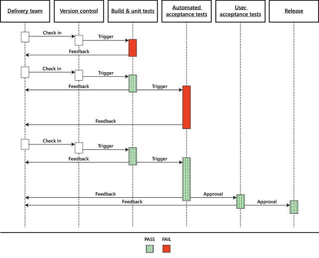

Continuous Integration and Continuous Delivery (Building Real-World Cloud Apps with Azure)
====================
by [Mike Wasson](https://github.com/MikeWasson), [Rick Anderson](https://github.com/Rick-Anderson), [Tom Dykstra](https://github.com/tdykstra)

[Download Fix It Project](http://code.msdn.microsoft.com/Fix-It-app-for-Building-cdd80df4) or [Download E-book](http://blogs.msdn.com/b/microsoft_press/archive/2014/07/23/free-ebook-building-cloud-apps-with-microsoft-azure.aspx)

> The **Building Real World Cloud Apps with Azure** e-book is based on a presentation developed by Scott Guthrie. It explains 13 patterns and practices that can help you be successful developing web apps for the cloud. For information about the e-book, see [the first chapter](introduction.md).

The first two recommended development process patterns were [Automate Everything](automate-everything.md) and [Source Control](source-control.md), and the third process pattern combines them. Continuous integration (CI) means that whenever a developer checks in code to the source repository, a build is automatically triggered. Continuous delivery (CD) takes this one step further: after a build and automated unit tests are successful, you automatically deploy the application to an environment where you can do more in-depth testing.

The cloud enables you to minimize the cost of maintaining a test environment because you only pay for the environment resources as long as you're using them. Your CD process can set up the test environment when you need it, and you can take down the environment when you're done testing.

## Continuous Integration and Continuous Delivery workflow

Generally we recommend that you do continuous delivery to your development and staging environments. Most teams, even at Microsoft, require a manual review and approval process for production deployment. For a production deployment you might want to make sure it happens when key people on the development team are available for support, or during low-traffic periods. But there's nothing to prevent you from completely automating your development and test environments so that all a developer has to do is check in a change and an environment is set up for acceptance testing.

The following diagram from [a Microsoft Patterns and Practices e-book about continuous delivery](http://aka.ms/ReleasePipeline) illustrates a typical workflow. Click the image to see it full size in its original context.

## How the cloud enables cost-effective CI and CD

Automating these processes in Azure is easy. Because you're running everything in the cloud, you don't have to buy or manage servers for your builds or your test environments. And you don't have to wait for a server to be available to do your testing on. With every build that you do, you could spin up a test environment in Azure using your automation script, run acceptance tests or more in-depth tests against it, and then when you're done just tear it down. And if you only run that server for 2 hours or 8 hours or a day, the amount of money that you have to pay for it is minimal, because you're only paying for the time that a machine is actually running. For example, the environment required for the Fix it application basically costs about 1 cent per hour if you go one tier up from the free level. Over the course of a month, if you only ran the environment an hour at a time, your testing environment would probably cost less than a latte that you buy at Starbucks.

## Visual Studio Team Services (VSTS)

VSTS provides a number of features to assist you with application development from planning to deployment.

- It supports both Git (distributed) and TFVC (centralized) source control.
- It offers an elastic build service, which means it dynamically creates build servers when they're needed and takes them down when they're done. You can automatically kick off a build when someone checks in source code changes, and you don't have to have allocate and pay for your own build servers that lie idle most of the time. The build service is free as long as you don't exceed a certain number of builds. If you expect to do a high volume of builds, you can pay a little extra for reserved build servers.
- It supports continuous delivery to Azure.
- It supports automated load testing. Load testing is critical to a cloud app but is often neglected until it's too late. Load testing simulates heavy use of an app by thousands of users, enabling you to find bottlenecks and improve throughput —before you release the app to production.
- It supports team room collaboration, which facilitates real-time communication and collaboration for small agile teams.
- It supports agile project management.

For more information on the continuous integration and delivery features of VSTS, see [Visual Studio Team Services](https://www.visualstudio.com/team-services/).

If you're looking for a turn-key project management, team collaboration, and source control solution, check out VSTS. The service is free for up to 5 users, and you can sign up for it at [Visual Studio Team Services](https://www.visualstudio.com/team-services/).

## Summary

The first three cloud development patterns have been about how to implement a repeatable, reliable, predictable development process with low cycle time. In the [next chapter](web-development-best-practices.md) we start to look at architectural and coding patterns.

## Resources

For more information, see [Deploy a web app in Azure App Service](https://azure.microsoft.com/en-us/documentation/articles/web-sites-deploy/).

See also the following resources:

- [Building a Release Pipeline with Team Foundation Server 2012](http://aka.ms/ReleasePipeline). E-book, hands-on labs, and sample code by Microsoft Patterns and Practices, provides an in-depth introduction to continuous delivery. Covers use of Visual Studio Lab Management and Visual Studio Release Management.
- [ALM Rangers DevOps Tooling and Guidance](https://vsardevops.codeplex.com/). The ALM Rangers introduced the DevOps Workbench sample companion solution and practical guidance in collaboration with the Patterns &amp; Practices book *Building a Release Pipeline with TFS 2012*, as a great way to start learning the concepts of DevOps &amp; Release Management for TFS 2012 and to kick the tires. The guidance shows how to build once and deploy to multiple environments.
- [Testing for Continuous Delivery with Visual Studio 2012](https://msdn.microsoft.com/en-us/library/jj159345.aspx). E-book by Microsoft Patterns and Practices, explains how to integrate automated testing with continuous delivery.
- [WindowsAzureDeploymentTracker](https://github.com/RyanTBerry/WindowsAzureDeploymentTracker). Source code for a tool designed to capture a build from TFS (based on a label), build it, package it, allow someone in the DevOps role to configure specific aspects of it, and push it into Azure. The tool tracks the deployment process in order to enable operations to "roll back" to a previously deployed version. The tool has no external dependencies and can function stand-alone using TFS APIs and the Azure SDK.
- [Continuous Delivery: Reliable Software Releases through Build, Test, and Deployment Automation](https://www.amazon.com/Continuous-Delivery-Deployment-Automation-Addison-Wesley/dp/0321601912/ref=sr_1_1?s=books&amp;ie=UTF8&amp;qid=1377126361). Book by Jez Humble.
- [Release It! Design and Deploy Production-Ready Software](https://www.amazon.com/Release-It-Production-Ready-Pragmatic-Programmers/dp/0978739213). Book by Michael T. Nygard.

>[!div class="step-by-step"]
[Previous](source-control.md)
[Next](web-development-best-practices.md)
