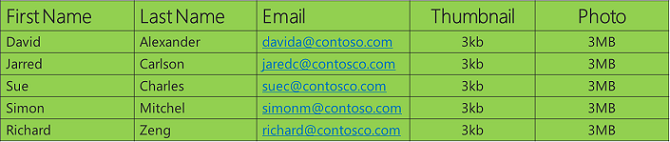
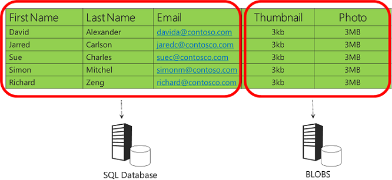
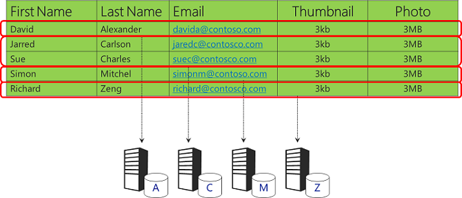
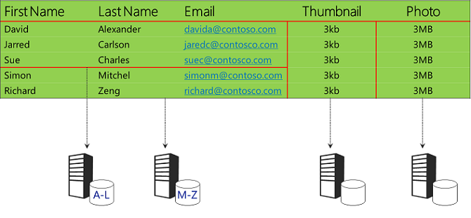

Data Partitioning Strategies (Building Real-World Cloud Apps with Azure)
====================
by [Mike Wasson](https://github.com/MikeWasson), [Rick Anderson](https://github.com/Rick-Anderson), [Tom Dykstra](https://github.com/tdykstra)

[Download Fix It Project](http://code.msdn.microsoft.com/Fix-It-app-for-Building-cdd80df4) or [Download E-book](http://blogs.msdn.com/b/microsoft_press/archive/2014/07/23/free-ebook-building-cloud-apps-with-microsoft-azure.aspx)

> The **Building Real World Cloud Apps with Azure** e-book is based on a presentation developed by Scott Guthrie. It explains 13 patterns and practices that can help you be successful developing web apps for the cloud. For information about the series, see [the first chapter](introduction.md).

Earlier we saw how easy it is to scale the web tier of a cloud application, by adding and removing web servers. But if they're all hitting the same data store, your application's bottleneck moves from the front-end to the back-end, and the data tier is the hardest to scale. In this chapter we look at how you can make your data tier scalable by partitioning data into multiple relational databases, or by combining relational database storage with other data storage options.

Setting up a partitioning scheme is best done up front for the same reason mentioned earlier: it's very difficult to change your data storage strategy after an app is in production. If you think hard up front about different approaches, you can avoid having a "Twitter moment" when your app crashes or goes down for a long time while you reorganize your app's data and data access code.

## The three Vs of data storage

In order to determine whether you need a partitioning strategy and what it should be, consider three questions about your data:

- Volume – How much data will you ultimately store? A couple gigabytes? A couple hundred gigabytes? Terabytes? Petabytes?
- Velocity – What is the rate at which your data will grow? Is it an internal app that isn't generating a lot of data? An external app that customers will be uploading images and videos into?
- Variety – What type of data will you store? Relational, images, key-value pairs, social graphs?

If you think you're going to have a lot of volume, velocity, or variety, you have to carefully consider what kind of partitioning scheme will best enable your app to scale efficiently and effectively as it grows, and to ensure you don't run into any bottlenecks.

There are basically three approaches to partitioning:

- Vertical partitioning
- Horizontal partitioning
- Hybrid partitioning

## Vertical partitioning

Vertical portioning is like splitting up a table by columns: one set of columns goes into one data store, and another set of columns goes into a different data store.

For example, suppose my app stores data about people, including images:

When you represent this data as a table and look at the different varieties of data, you can see that the three columns on the left have string data that can be efficiently stored by a relational database, while the two columns on the right are essentially byte arrays that come from image files. It's possible to storage image file data in a relational database, and a lot of people do that because they don't want to save the data to the file system. They might not have a file system capable of storing the required volumes of data or they might not want to manage a separate back-up and restore system. This approach works well for on-premises databases and for small amounts of data in cloud databases. In the on-premises environment, it might be easier to just let the DBA take care of everything.

But in a cloud database, storage is relatively expensive, and a high volume of images could make the size of the database grow beyond the limits at which it can operate efficiently. You can address these problems by partitioning the data vertically, which means you choose the most appropriate data store for each column in your table of data. What might work best for this example is to put the string data in a relational database and the images in Blob storage.

Storing images in Blob storage instead of a database is more practical in the cloud than in an on-premises environment because you don't have to worry about setting up file servers or managing back-up and restore of data stored outside of the relational database: all that is handled for you automatically by the Blob storage service.

This is the partitioning approach we implemented in the Fix It app, and we'll look at the code for that in the [Blob storage chapter](unstructured-blob-storage.md). Without this partitioning scheme, and assuming an average image size of 3 megabytes, the Fix It app would only be able to store about 40,000 tasks before hitting the maximum database size of 150 gigabytes. After removing the images, the database can store 10 times as many tasks; you can go much longer before you have to think about implementing a horizontal partitioning scheme. And as the app scales, your expenses grow more slowly because the bulk of your storage needs are going into very inexpensive Blob storage.

## Horizontal partitioning (sharding)

Horizontal portioning is like splitting up a table by rows: one set of rows goes into one data store, and another set of rows goes into a different data store.

Given the same set of data, another option would be to store different ranges of customer names in different databases.

You want to be very careful about your sharding scheme to make sure that data is evenly distributed in order to avoid hot spots. This simple example using the first letter of the last name doesn't meet that requirement, because a lot of people have last names that start with certain common letters. You'd hit table size limitations earlier than you might expect because some databases would get very large while most would remain small.

A down side of horizontal partitioning is that it might be hard to do queries across all of the data. In this example, a query would have to draw from up to 26 different databases to get all of the data stored by the app.

## Hybrid partitioning

You can combine vertical and horizontal partitioning. For example, in the example data you could store the images in Blob storage and horizontally partition the string data.

## Partitioning a production application

Conceptually it's easy to see how a partitioning scheme would work, but any partitioning scheme does increase code complexity and introduces many new complications that you have to deal with. If you're moving images to blob storage, what do you do when the storage service is down? How do you handle blob security? What happens if the database and blob storage get out of sync? If you're sharding, how will you handle querying across all of the databases?

The complications are manageable so long as you're planning for them before you go to production. Many people who didn't do that wish they had later. On average our Customer Advisory Team (CAT) team gets panicked phone calls about once a month from customers whose apps are taking off in a really big way, and they didn't do this planning. And they say something like: "Help! I put everything in a single data store, and in 45 days I'm going to run out of space on it!" And if you have a lot of business logic built into how you access your data store and you have customers who are using your app, there's no good time to go down for a day while you migrate. We end up going through herculean efforts to help the customer partition their data on the fly with no down time. It's very exciting and very scary, and not something you want to be involved in if you can avoid it! Thinking about this up front and integrating it into your app will make your life a lot easier if the app grows later.

## Summary

An effective partitioning scheme can enable your cloud app to scale to petabytes of data in the cloud without bottlenecks. And you don't have to pay up front for massive machines or extensive infrastructure as you might if you were running the app in an on-premises data center. In the cloud you can you can incrementally add capacity as you need it, and you're only paying for as much as you're using when you use it.

In the [next chapter](unstructured-blob-storage.md) we'll see how the Fix It app implements vertical partitioning by storing images in Blob storage.

## Resources

For more information about partitioning strategies, see the following resources.

Documentation:

- [Best Practices for the Design of Large-Scale Services on Windows Azure Cloud Services](https://msdn.microsoft.com/en-us/library/windowsazure/jj717232.aspx). White paper by Mark Simms and Michael Thomassy.
- [Microsoft Patterns and Practices - Cloud Design Patterns](https://msdn.microsoft.com/en-us/library/dn568099.aspx). See Data Partitioning guidance, Sharding pattern.

Videos:

- [FailSafe: Building Scalable, Resilient Cloud Services](https://channel9.msdn.com/Series/FailSafe). Nine-part series by Ulrich Homann, Marc Mercuri, and Mark Simms. Presents high-level concepts and architectural principles in a very accessible and interesting way, with stories drawn from Microsoft Customer Advisory Team (CAT) experience with actual customers. See the partitioning discussion in episode 7.
- [Building Big: Lessons learned from Windows Azure customers - Part I](https://channel9.msdn.com/Events/Build/2012/3-029). Mark Simms discusses partitioning schemes, sharding strategies, how to implement sharding, and SQL Database Federations, starting at 19:49. Similar to the Failsafe series but goes into more how-to details.

Sample code:

- [Cloud Service Fundamentals in Windows Azure](https://code.msdn.microsoft.com/Cloud-Service-Fundamentals-4ca72649). Sample application that includes a sharded database. For a description of the sharding scheme implemented, see [DAL – Sharding of RDBMS](https://blogs.msdn.com/b/windowsazure/archive/2013/09/05/dal-sharding-of-rdbms.aspx) on the Windows Azure blog.

>[!div class="step-by-step"]
[Previous](data-storage-options.md)
[Next](unstructured-blob-storage.md)