Data Storage Options (Building Real-World Cloud Apps with Azure)
====================
by [Mike Wasson](https://github.com/MikeWasson), [Rick Anderson](https://github.com/Rick-Anderson), [Tom Dykstra](https://github.com/tdykstra)

[Download Fix It Project](http://code.msdn.microsoft.com/Fix-It-app-for-Building-cdd80df4) or [Download E-book](http://blogs.msdn.com/b/microsoft_press/archive/2014/07/23/free-ebook-building-cloud-apps-with-microsoft-azure.aspx)

> The **Building Real World Cloud Apps with Azure** e-book is based on a presentation developed by Scott Guthrie. It explains 13 patterns and practices that can help you be successful developing web apps for the cloud. For information about the e-book, see [the first chapter](introduction.md).

Most people are used to relational databases, and they tend to overlook other data storage options when they're designing a cloud app. The result can be suboptimal performance, high expenses, or worse, because [NoSQL](http://en.wikipedia.org/wiki/NoSQL) (non-relational) databases can handle some tasks more efficiently than relational databases. When customers ask us for help resolving a critical data storage problem, it's often because they have a relational database where one of the NoSQL options would have worked better. In those situations the customer would have been better off if they had implemented the NoSQL solution before deploying the app to production.

On the other hand, it would also be a mistake to assume that a NoSQL database can do everything well or well enough. There is no single best data management choice for all data storage tasks; different data management solutions are optimized for different tasks. Most real-world cloud apps have a variety of data storage requirements and are often served best by a combination of multiple data storage solutions.

The purpose of this chapter is to give you a broader sense of the data storage options available to a cloud app, and some basic guidance on how to choose the ones that fit your scenario. It's best to be aware of the options available to you and think about their strengths and weaknesses before you develop an application. Changing data storage options in a production app can be extremely difficult, like having to change a jet engine while the plane is in flight.

## Data storage options on Azure

The cloud makes it relatively easy to use a variety of relational and NoSQL data stores. Here are some of the data storage platforms that you can use in Azure.

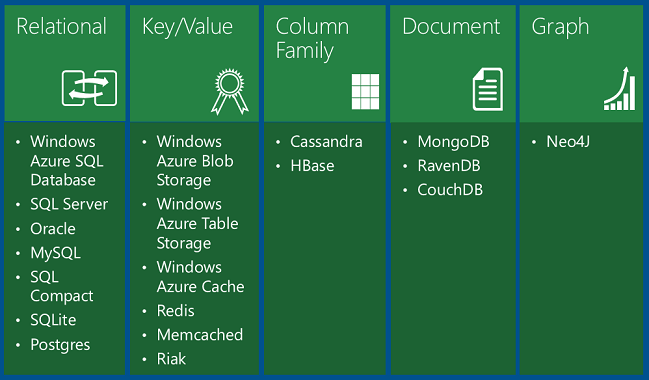

The table shows four types of NoSQL databases:

- [Key/value databases](https://msdn.microsoft.com/en-us/library/dn313285.aspx#sec7) store a single serialized object for each key value. They're good for storing large volumes of data where you want to get one item for a given key value and you don't have to query based on other properties of the item.

    [Azure Blob storage](https://azure.microsoft.com/en-us/documentation/articles/storage-dotnet-how-to-use-blobs/) is a key/value database that functions like file storage in the cloud, with key values that correspond to folder and file names. You retrieve a file by its folder and file name, not by searching for values in the file contents.

    [Azure Table storage](https://azure.microsoft.com/en-us/documentation/articles/storage-dotnet-how-to-use-tables/) is also a key/value database. Each value is called an *entity* (similar to a row, identified by a partition key and row key) and contains multiple *properties* (similar to columns, but not all entities in a table have to share the same columns). Querying on columns other than the key is extremely inefficient and should be avoided. For example, you can store user profile data, with one partition storing information about a single user. You could store data such as user name, password hash, birth date, and so forth, in separate properties of one entity or in separate entities in the same partition. But you wouldn't want to query for all users with a given range of birth dates, and you can't execute a join query between your profile table and another table. Table storage is more scalable and less expensive than a relational database, but it doesn't enable complex queries or joins.
- [Documentdatabases](https://msdn.microsoft.com/en-us/library/dn313285.aspx#sec8) are key/value databases in which the values are *documents*. "Document" here isn't used in the sense of a Word or Excel document but means a collection of named fields and values, any of which could be a child document. For example, in an order history table an order document might have order number, order date, and customer fields; and the customer field might have name and address fields. The database encodes field data in a format such as XML, YAML, JSON, or BSON; or it can use plain text. One feature that sets document databases apart from key/value databases is the ability to query on non-key fields and define secondary indexes to make querying more efficient. This ability makes a document database more suitable for applications that need to retrieve data based on criteria more complex than the value of the document key. For example, in a sales order history document database you could query on various fields such as product ID, customer ID, customer name, and so forth. [MongoDB](http://www.mongodb.org/) is a popular document database.
- [Column-family databases](https://msdn.microsoft.com/en-us/library/dn313285.aspx#sec9) are key/value data stores that enable you to structure data storage into collections of related columns called column families. For example, a census database might have one group of columns for a person's name (first, middle, last), one group for the person's address, and one group for the person's profile information (DOB, gender, etc.). The database can then store each column family in a separate partition while keeping all of the data for one person related to the same key. You can then read all profile information without having to read through all of the name and address information as well. [Cassandra](http://cassandra.apache.org/) is a popular column-family database.
- [Graph databases](https://msdn.microsoft.com/en-us/library/dn313285.aspx#sec10) store information as a collection of objects and relationships. The purpose of a graph database is to enable an application to efficiently perform queries that traverse the network of objects and the relationships between them. For example, the objects might be employees in a human resources database, and you might want to facilitate queries such as "find all employees who directly or indirectly work for Scott." [Neo4j](http://www.neo4j.org/) is a popular graph database.

Compared to relational databases, the NoSQL options offer far greater scalability and cost-effectiveness for storage and analysis of unstructured data. The tradeoff is that they don't provide the rich queryability and robust data integrity capabilities of relational databases. NoSQL would work well for IIS log data, which involves high volume with no need for join queries. NoSQL would not work so well for banking transactions, which requires absolute data integrity and involves many relationships to other account-related data.

There is also a newer category of database platform called [NewSQL](http://en.wikipedia.org/wiki/NewSQL) that combines the scalability of a NoSQL database with the queryability and transactional integrity of a relational database. NewSQL databases are designed for distributed storage and query processing, which is often hard to implement in "OldSQL" databases. [NuoDB](http://www.nuodb.com/) is an example of a NewSQL database that can be used on Azure.

## Hadoop and MapReduce

The high volumes of data that you can store in NoSQL databases may be difficult to analyze efficiently in a timely manner. To do that you can use a framework like [Hadoop](http://hadoop.apache.org/) which implements [MapReduce](http://en.wikipedia.org/wiki/MapReduce) functionality. Essentially what a MapReduce process does is the following:

- Limit the size of the data that needs to be processed by selecting out of the data store only the data you actually need to analyze. For example, you want to know the makeup of your user base by birth year, so you select only birth years out of your user profile data store.
- Break down the data into parts and send them to different computers for processing. Computer A calculates the number of people with 1950-1959 dates, computer B does 1960-1969, etc. This group of computers is called a *Hadoop cluster*.
- Put the results of each part back together after the processing on the parts is done. You now have a relatively short list of how many people for each birth year and the task of calculating percentages in this overall list is manageable.

On Azure, [HDInsight](https://azure.microsoft.com/en-us/services/hdinsight/) enables you to process, analyze, and gain new insights from big data using the power of Hadoop. For example, you could use it to analyze web server logs:

- Enable web server logging to your storage account. This sets up Azure to write logs to the Blob Service for every HTTP request to your application. The Blob Service is basically cloud file storage, and it integrates nicely with HDInsight. 

    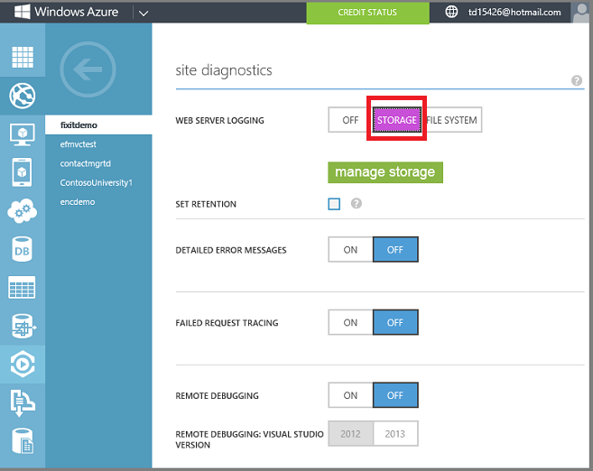
- As the app gets traffic, web server IIS logs are written to Blob storage. 

    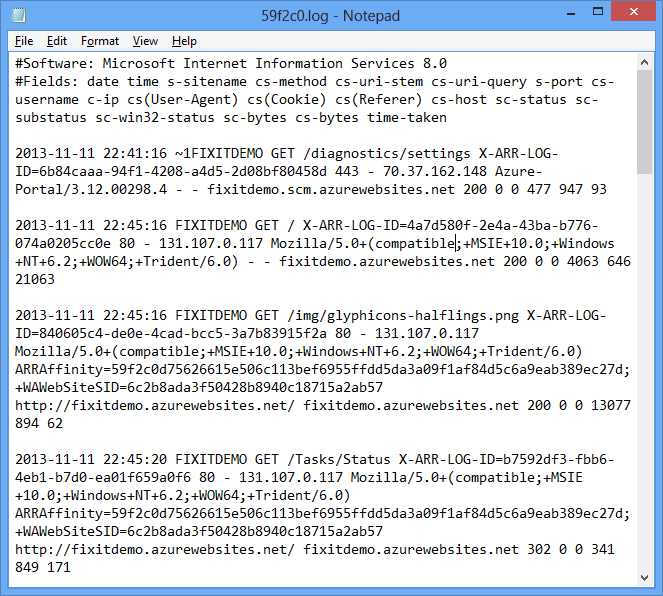
- In the portal, click **New** - **Data Services** - **HDInsight** - **Quick Create**, and specify an HDInsight cluster name, cluster size (number of HDInsight cluster data nodes), and a user name and password for the HDInsight cluster. 

    

You can now set up MapReduce jobs to analyze your logs and get answers to questions such as:

- What times of day does my app get the most or least traffic?
- What countries is my traffic coming from?
- What is the average neighborhood income of the areas my traffic comes from. (There's a public dataset that gives you neighborhood income by IP address, and you can match that against IP address in the web server logs.)
- How does neighborhood income correlate to specific pages or products in the site?

You could then use the answers to questions like these to target ads based on the likelihood a customer would be interested in or likely to buy a particular product.

As explained in the [Automate Everything chapter](automate-everything.md), most functions that you can do in the portal can be automated, and that includes setting up and executing HDInsight analysis jobs. A typical HDInsight script might contain the following steps:

- Provision an HDInsight cluster and link it to your storage account for Blob storage input.
- Upload the MapReduce job executables (.jar or .exe files) to the HDInsight cluster.
- Submit a MapReduce that stores the output data to Blob storage.
- Wait for the job to complete.
- Delete the HDInsight cluster.
- Access the output from Blob storage.

By running a script that does all this, you minimize the amount of time that the HDInsight cluster is provisioned, which minimizes your costs.

## Platform as a Service (PaaS) versus Infrastructure as a Service (IaaS)

The data storage options listed earlier include both Platform-as-a-Service (PaaS) and Infrastructure-as-a-Service (IaaS) solutions. PaaS means that we manage the hardware and software infrastructure and you just use the service. SQL Database is a PaaS feature of Azure. You ask for databases, and behind the scenes Azure sets up and configures the VMs and sets up the databases on them. You don't have direct access to the VMs and don't have to manage them.IaaS means that you set up, configure, and manage VMs that run in our data center infrastructure, and you put whatever you want on them. We provide a gallery of pre-configured VM images for common VM configurations. For example, you can install pre-configured VM images for Windows Server 2008, Windows Server 2012, BizTalk Server, Oracle WebLogic Server, Oracle Database, etc.

PaaS data solutions that Azure offers include:

- Azure SQL Database (formerly known as SQL Azure). A cloud relational database based on SQL Server.
- Azure Table storage. A key/value NoSQL database.
- Azure Blob storage. File storage in the cloud.

For IaaS, you can run anything you can load onto a VM, for example:

- Relational databases such as SQL Server, Oracle, MySQL, SQL Compact, SQLite, or Postgres.
- Key/value data stores such as Memcached, Redis, Cassandra, and Riak.
- Column data stores such as HBase.
- Document databases such as MongoDB, RavenDB, and CouchDB.
- Graph databases such as Neo4j.

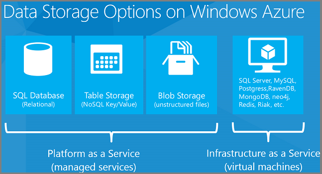

The IaaS option gives you almost unlimited data storage options, and many of them are especially easy to use because you can create VMs using preconfigured images. For example, in the management portal go to **Virtual Machines**, click the **Images** tab, and click **Browse VM Depot**.

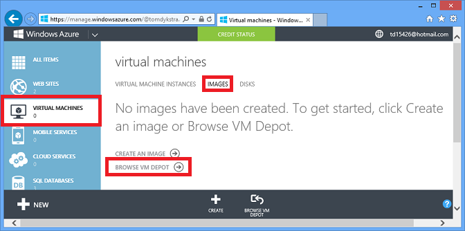

You then see a list of [hundreds of preconfigured VM images](http://www.hanselman.com/blog/Over400VirtualMachineImagesOfOpenSourceSoftwareStacksInTheVMDepotAzureGallery.aspx), and you can create a VM from an image that has a database management system preinstalled, such as MongoDB, Neo4J, Redis, Cassandra, or CouchDB:

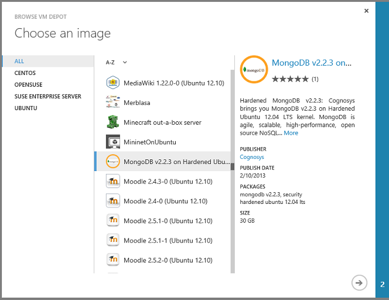

Azure makes IaaS data storage options as easy to use as possible, but the PaaS offerings have many advantages that make them more cost-effective and practical for many scenarios:

- You don't have to create VMs, you just use the portal or a script to set up a data store. If you want a 200 terabyte data store, you can just click a button or run a command, and in seconds it's ready for you to use.
- You don't have to manage or patch the VMs used by the service; Microsoft does that for you automatically.- You don't have to worry about setting up infrastructure for scaling or high availability; Microsoft handles all that for you.
- You don't have to buy licenses; license fees are included in the service fees.
- You only pay for what you use.

PaaS data storage options in Azure include offerings by third-party providers. For example, you can choose the [MongoLab Add-On](https://azure.microsoft.com/en-us/documentation/articles/store-mongolab-web-sites-dotnet-store-data-mongodb/) from the Azure Store to provision a MongoDB database as a service.

## Choosing a data storage option

No one approach is right for all scenarios. If anyone says that this technology is the answer, the first thing to ask is "What is the question?", because different solutions are optimized for different things. There are definite advantages to the relational model; that's why it's been around for so long. But there are also down-sides to SQL that can be addressed with a NoSQL solution.

Often what we see work best is a compositional approach, where you use SQL and NoSQL in a single solution. Even when people say they're embracing NoSQL, if you drill into what they're doing you often find that they're using several different NoSQL frameworks: they're using [CouchDB](http://wiki.apache.org/couchdb/Introduction), and [Redis](http://redis.io/), and [Riak](http://basho.com/riak/) for different things. Even Facebook, which uses NoSQL extensively, uses different NoSQL frameworks for different parts of the service. The flexibility to mix and match data storage approaches is one of the things that's nice about the cloud, because it's easy to use multiple data solutions and integrate them in a single app.

Here are some questions to think about when you're choosing an approach:

| Data semantic | - What is the core data storage and data access semantic (are you storing relational or unstructured data)? Unstructured data such as media files fits best in blob storage; a collection of related data such as products, inventories, suppliers, customer orders, etc., fits best in a relational database. |
| --- | --- |
| Query support | - How easy is it to query the data? - What types of questions can be efficiently asked? Key/value data stores are very good at getting a single row given a key value but not so good for complex queries. For a user profile data store where you are always getting the data for one particular user, a key/value data store could work well; for a product catalog where you want to get different groupings based on various product attributes a relational database might work better. NoSQL databases can store large volumes of data efficiently, but you have to structure the database around how the app queries the data, and this makes ad hoc queries harder to do. With a relational database, you can build almost any kind of query. |
| Functional projection | - Can questions, aggregations, etc., be executed server-side? If I run SELECT COUNT(\*) from a table in SQL, it will very efficiently do all the work on the server and return the number I'm looking for. If I want the same calculation from a NoSQL data store that doesn't support aggregation, this is an inefficient "unbounded query" and will probably time out. Even if the query succeeds I have to retrieve all of the data from the server to the client and count the rows on the client. - What languages or types of expressions can be used? With a relational database I can use SQL. With some NoSQL databases such as Azure Table storage, I'll be using [OData](http://www.odata.org/), and all I can do is filter on primary key and get projections (select a subset of the available fields). |
| Ease of scalability | - How often and how much will the data need to scale? - Does the platform natively implement scale-out? - How easy is it to add/remove capacity (size and throughput)? Relational databases and tables aren't automatically partitioned to make them scalable, so they are difficult to scale beyond certain limitations. NoSQL data stores like Azure Table storage inherently partition everything, and there is almost no limit to adding partitions. You can readily scale Table Storage up to 200 terabytes, but the maximum database size for Azure SQL Database is 500 gigabytes. You can scale relational data by partitioning it into multiple databases, but setting up an application to support that model involves a lot of programming work. |
| Instrumentation and Manageability | - How easy is the platform to instrument, monitor, and manage? You will need to keep informed about the health and performance of your data store, so you need to know up front what metrics a platform gives you for free, and what you have to develop yourself. |
| Operations | - How easy is the platform to deploy and run on Azure? PaaS? IaaS? Linux? Table Storage and SQL Database are easy to set up on Azure. Platforms that aren't built-in Azure PaaS solutions require more effort. |
| API Support | - Is an API available that makes it easy to work with the platform? For the Azure Table Service there's an SDK with a .NET API that supports the .NET 4.5 asynchronous programming model. If you're writing a .NET app, it'll be much easier to write and test code for the Azure Table Service compared to another key/value column data store platform that has no API or a less comprehensive one. |
| Transactional integrity and data consistency | - Is it critical that the platform support transactions in order to guarantee data consistency? For keeping track of bulk emails sent, performance and low data storage cost might be more important than automatic support for transactions or referential integrity in the data platform, making the Azure Table Service a good choice. For tracking bank account balances or purchase orders a relational database platform that provides strong transactional guarantees would be a better choice. |
| Business continuity | - How easy are backup, restore, and disaster recovery? Sooner or later production data will get corrupted and you'll need an undo function. Relational databases often have more fine-grained restore capabilities, such as the ability to restore to a point in time. Understanding what restore features are available in each platform you're considering is an important factor to consider. |
| Cost | - If more than one platform can support your data workload, how do they compare in cost? For example, if you use ASP.NET Identity, you can store user profile data in Azure Table Service or Azure SQL Database. If you don't need the rich querying facilities of SQL Database, you might choose Azure Tables in part because it costs much less for a given amount of storage. |

What we generally recommend is know the answer to the questions in each of these categories before you choose your data storage solutions.

In addition, your workload might have specific requirements that some platforms can support better than others. For example:

- Does your application require audit capabilities?
- What are your data longevity requirements -- do you require automated archival or purging capabilities?
- Do you have specialized security needs? For example, the data includes PII (personally identifiable information) but you have to be able to make sure that PII is excluded from query results.
- If you have some data that can't be stored in the cloud for regulatory or technological reasons, you might need a cloud data storage platform that facilitates integrating with your on-premises storage.

## Demo – using SQL Database in Azure

The Fix It app uses a relational database to store tasks. The environment creation Windows PowerShell script shown in the [Automate Everything chapter](automate-everything.md) creates two SQL Database instances. You can see these in the portal by clicking the **SQL Databases** tab.

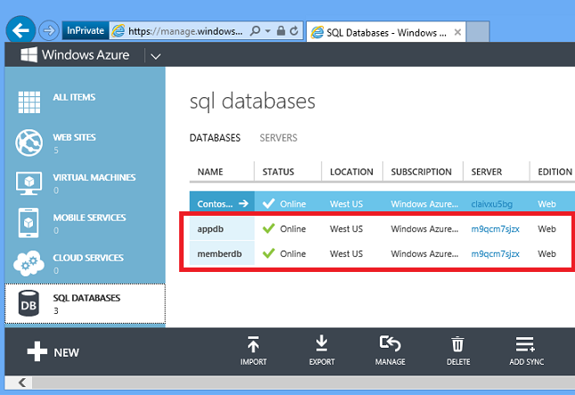

It's also easy to create databases by using the portal.

Click **New -- Data Services** -- **SQL Database** -- **Quick Create**, enter a database name, choose a server you already have in your account or create a new one, and click **Create SQL Database**.

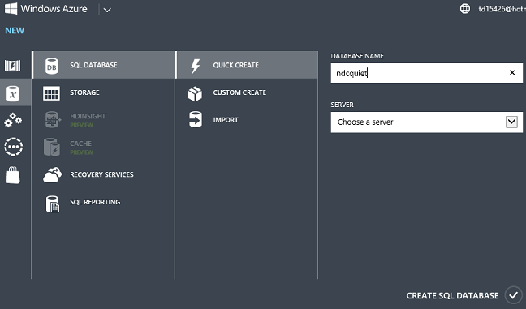

Wait several seconds, and you have a database in Azure ready for you to use.

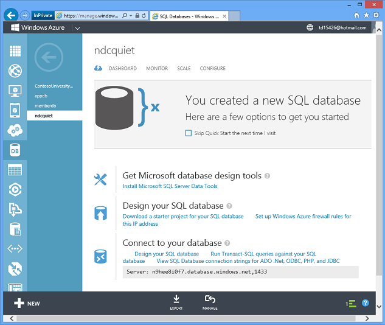

So Azure does in a few seconds what it may take you a day or a week or longer to accomplish in the on-premises environment. And since you can just as easily create databases automatically in a script or by using a management API, you can dynamically scale out by spreading your data across multiple <o:p>databases, so long as your application has been programmed for that.</o:p>

This is an example of our Platform-as-a-Service model. You don't have to manage the servers, we do it. You don't have to worry about backups, we do it. It's running in high availability – the data in the database is replicated across three servers automatically. If a machine dies, we automatically fail over and you lose no data. The server is patched regularly, you don't need to worry about that.

Click a button and you get the exact connection string you need and can immediately start using the new database.

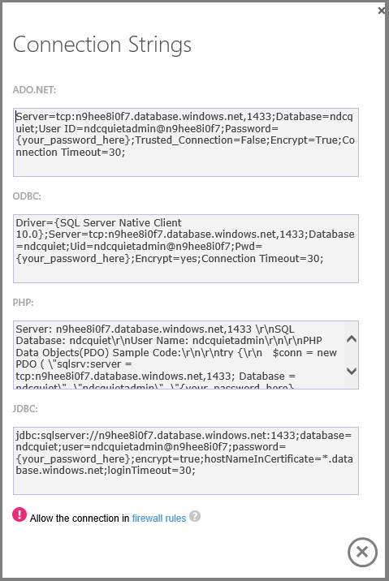

The Dashboard shows you connection history and amount of storage used.

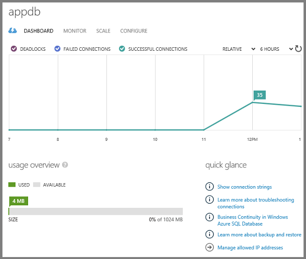

You can manage databases in the portal or by using SQL Server tools you're already familiar with, including SQL Server Management Studio (SSMS) and the Visual Studio tools SQL Server Object Explorer (SSOX) and Server Explorer.

Another nice thing is the pricing model. You can start development with a free 20 MB database, and a production database starts at about $5 per month. You pay only for the amount of data you actually store in the database, not the maximum capacity. You don't have to buy a license.

SQL Database is easy to scale. For the Fix It app, the database we create in our automation script is capped at 1 gig. If you want to scale it up to 150 gig, you can just go into the portal and change that setting, or execute a REST API command, and in seconds you have a 150 gig database that you can deploy data into.

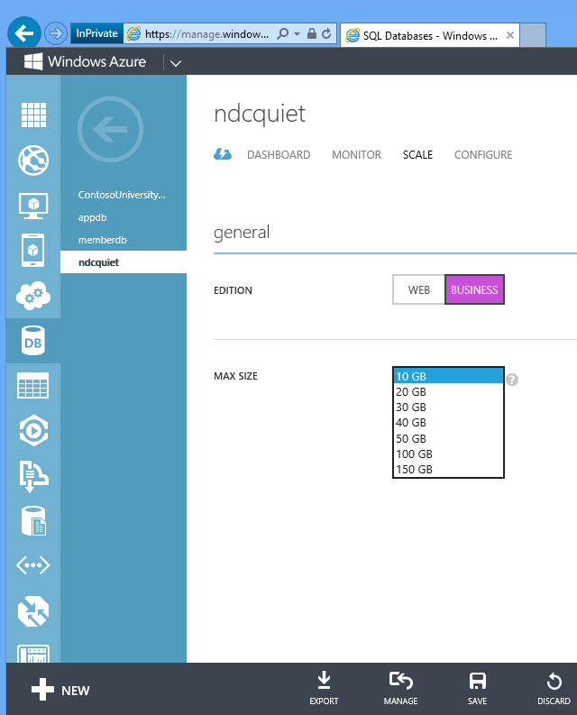

That's the power of the cloud to stand up infrastructure quickly and easily and start using it immediately.

The Fix It app uses two SQL databases, one for membership (authentication and authorization) and one for data, and this is all you have to do to provision it and scale it. You saw earlier how to provision the databases through Windows PowerShell scripts, and now you've also seen how easy it is to do in the portal.

## Entity Framework versus direct database access using ADO.NET

The Fix It app accesses these databases by using the Entity Framework, Microsoft's recommended ORM (object-relational mapper) for .NET applications. An ORM is a great tool that facilitates developer productivity, but productivity comes at the expense of degraded performance in some scenarios. In a real-world cloud app you won't be making a choice between using EF or using ADO.NET directly -- you'll use both. Most of the time when you're writing code that works with the database, getting maximum performance is not critical and you can take advantage of the simplified coding and testing that you get with the Entity Framework. In situations where the EF overhead would cause unacceptable performance, you can write and execute your own queries using ADO.NET, ideally by calling stored procedures.

Whatever method you use to access the database, you want to minimize "chattiness" as much as possible. In other words, if you can get all the data you need in one larger query result set rather than dozens or hundreds of smaller ones, that's usually preferable. For example, if you need to list students and the courses they're enrolled in, it's usually better to get all of the data in one join query rather than getting the students in one query and executing separate queries for each student's courses.

## SQL databases and the Entity Framework in the Fix It app

In the Fix It app the `FixItContext` class, which derives from the Entity Framework `DbContext` class, identifies the database and specifies the tables in the database. The context specifies an entity set (table) for tasks, and the code passes in to the context the connection string name. That name refers to a connection string that is defined in the Web.config file.

[!code-csharp[Main](data-storage-options/samples/sample1.cs?highlight=4,8)]

The connection string in the *Web.config* file is named appdb (here pointing to the local development database):

[!code-xml[Main](data-storage-options/samples/sample2.xml?highlight=3)]

The Entity Framework creates a *FixItTasks* table based on the properties included in the `FixItTask` entity class. This is a simple POCO (Plain Old CLR Object) class, which means it doesn't inherit from or have any dependencies on the Entity Framework. But Entity Framework knows how to create a table based on it and execute CRUD (create-read-update-delete) operations with it.

[!code-csharp[Main](data-storage-options/samples/sample3.cs)]

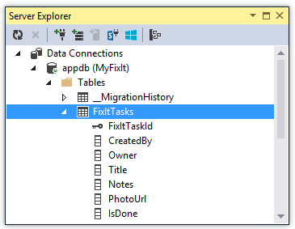

The Fix It app includes a repository interface that it uses for CRUD operations working with the data store.

[!code-csharp[Main](data-storage-options/samples/sample4.cs)]

Notice that the repository methods are all async, so all data access can be done in a completely asynchronous way.

The repository implementation calls Entity Framework async methods to work with the data, including LINQ queries as well as for insert, update, and delete operations. Here's an example of the code for looking up a Fix It task.

[!code-csharp[Main](data-storage-options/samples/sample5.cs)]

You'll notice there's also some timing and error logging code here, we'll look at that later in the [Monitoring and Telemetry chapter](monitoring-and-telemetry.md).

## Choosing SQL Database (PaaS) versus SQL Server in a VM (IaaS) in Azure

A nice thing about SQL Server and Azure SQL Database is that the core programming model for both of them is identical. You can use most of the same skills in both environments. You can even use a SQL Server database in development and a SQL Database instance in the cloud, which is how the Fix It app is set up.

As an alternative, you can run the same SQL Server in the cloud that you run on-premises by installing it on IaaS VMs. For some legacy applications, running SQL Server in a VM might be a better solution. Because a SQL Server database runs on a dedicated VM, it has more resources available to it than a SQL Database database that runs on a shared server. That means a SQL Server database can be larger and still perform well. In general, the smaller the database size and table size, the better the use case works for SQL Database (PaaS).

Here are some guidelines on how to choose between the two models.

| Azure SQL Database (PaaS) | SQL Server in a Virtual Machine (IaaS) |
| --- | --- |
| **Pros** - You don't have to create or manage VMs, update or patch OS or SQL; Azure does that for you. - Built-in High Availability, with a database-level SLA. - Low total cost of ownership (TCO) because you pay only for what you use (no license required). - Good for handling large numbers of smaller databases (&lt;=500 GB each). - Easy to dynamically create new databases to enable scale-out. | ***Pros*** - Feature-compatible with on-premises SQL Server. - Can implement SQL Server [High Availability via AlwaysOn](https://www.microsoft.com/en-us/sqlserver/solutions-technologies/mission-critical-operations/high-availability.aspx) in 2+ VMs, with VM-level SLA. - You have complete control over how SQL is managed. - Can re-use SQL licenses you already own, or pay by the hour for one. - Good for handling fewer but larger (1 TB+) databases. |
| **Cons** - Some feature gaps compared to on-premises SQL Server (lack of [CLR integration](https://technet.microsoft.com/en-us/library/ms131102.aspx), [TDE](https://technet.microsoft.com/en-us/library/bb934049.aspx), [compression support](https://technet.microsoft.com/en-us/library/cc280449.aspx), [SQL Server Reporting Services](https://technet.microsoft.com/en-us/library/ms159106.aspx), etc.) - Database size limit of 500GB. | ***Cons*** - Updates/patches (OS and SQL) are your responsibility - Creation and management of DBs are your responsibility - Disk IOPS (input/output operations per second) limited to about 8000 (via 16 data drives). |

If you want to use SQL Server in a VM, you can use your own SQL Server license, or you can pay for one by the hour. For example, in the portal or via the REST API you can create a new VM using a SQL Server image.

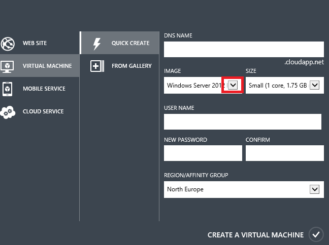

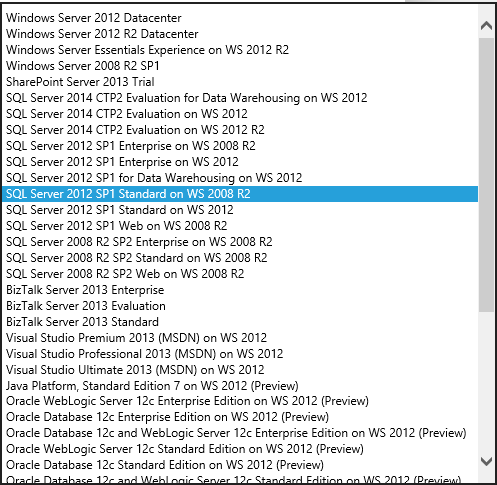

When you create a VM with a SQL Server image, we pro-rate the SQL Server license cost by the hour based on your usage of the VM. If you have a project that's only going to run for a couple of months, it's cheaper to pay by the hour. If you think your project is going to last for years, it's cheaper to buy the license the way you normally do.

## Summary

Cloud computing makes it practical to mix and match data storage approaches to best fit the needs of your application. If you're building a new application, think carefully about the questions listed here in order to pick approaches that will continue to work well when your application grows. The [next chapter](data-partitioning-strategies.md) will explain some partitioning strategies that you can use to combine multiple data storage approaches.

## Resources

For more information, see the following resources.

Choosing a database platform:

- [Data Access for Highly-Scalable Solutions: Using SQL, NoSQL, and Polyglot Persistence](http://aka.ms/dag-doc). E-book by Microsoft Patterns and Practices that goes in depth into the different kinds of data stores available for cloud applications.
- [Microsoft Patterns and Practices - Azure Guidance](https://msdn.microsoft.com/en-us/library/ff898430.aspx). See Data Consistency Primer, Data Replication and Synchronization Guidance, Index Table pattern, Materialized View pattern.
- [BASE: An Acid Alternative](http://queue.acm.org/detail.cfm?id=1394128). Article about tradeoffs between data consistency and scalability.
- [Seven Databases in Seven Weeks: A Guide to Modern Databases and the NoSQL Movement](https://www.amazon.com/Seven-Databases-Weeks-Modern-Movement/dp/1934356921). Book by Eric Redmond and Jim R. Wilson. Highly recommended for introducing yourself to the range of data storage platforms available today.

Choosing between SQL Server and SQL Database:

- [Premium Preview for SQL Database Guidance](https://msdn.microsoft.com/en-us/library/windowsazure/dn369873.aspx). An introduction to SQL Database Premium, and guidance on when to choose it over the SQL Database Web and Business editions.
- [Guidelines and Limitations (Azure SQL Database)](https://msdn.microsoft.com/en-us/library/windowsazure/ff394102.aspx). Portal page that links to documentation about limitations of SQL Database, including one that focuses on SQL Server features that SQL Database doesn't support.
- [SQL Server in Azure Virtual Machines](https://msdn.microsoft.com/en-us/library/windowsazure/jj823132.aspx). Portal page that links to documentation about running SQL Server in Azure.
- [Scott Guthrie explains SQL Databases in Azure](https://azure.microsoft.com/en-us/documentation/videos/sql-in-azure-scottgu/). 6-minute video introduction to SQL Database by Scott Guthrie.
- [Application Patterns and Development Strategies for SQL Server in Azure Virtual Machines](https://msdn.microsoft.com/en-us/library/windowsazure/dn574746.aspx).

Using Entity Framework and SQL Database in an ASP.NET Web app

- [Getting Started with EF 6 using MVC 5](../../../../mvc/overview/getting-started/getting-started-with-ef-using-mvc/creating-an-entity-framework-data-model-for-an-asp-net-mvc-application.md). Nine-part tutorial series that walks you through building an MVC app that uses EF and deploys the database to Azure and SQL Database.
- [ASP.NET Web Deployment using Visual Studio](../../../../web-forms/overview/deployment/visual-studio-web-deployment/introduction.md). Twelve-part tutorial series that goes into more depth about how to deploy a database by using EF Code First.
- [Deploy a Secure ASP.NET MVC 5 app with Membership, OAuth, and SQL Database to an Azure Web Site](https://azure.microsoft.com/en-us/documentation/articles/web-sites-dotnet-deploy-aspnet-mvc-app-membership-oauth-sql-database/). Step-by-step tutorial that walks you through creating a web app that uses authentication, stores application tables in the membership database, modifies the database schema, and deploys the app to Azure.
- [ASP.NET Data Access Content Map](https://go.microsoft.com/fwlink/p/?LinkId=282414). Links to resources for working with EF and SQL Database.

Using MongoDB on Azure:

- [MongoLab - MongoDB on Azure](http://msopentech.com/opentech-projects/mongolab-mongodb-on-windows-azure/). Portal page for documentation about running MongoDB on Azure.
- [Create an Azure web site that connects to MongoDB running on a virtual machine in Azure](https://azure.microsoft.com/en-us/documentation/articles/web-sites-dotnet-store-data-mongodb-vm/). Step-by-step tutorial that shows how to use a MongoDB database in an ASP.NET web application.

HDInsight (Hadoop on Azure):

- [HDInsight](https://azure.microsoft.com/en-us/documentation/services/hdinsight/). Portal to HDInsight documentation on the [Azure](https://azure.microsoft.com/) website.
- [Hadoop and HDInsight: Big Data in Azure](https://msdn.microsoft.com/en-us/magazine/dn385705.aspx). MSDN Magazine article by Bruno Terkaly and Ricardo Villalobos, introducing Hadoop on Azure.
- [Microsoft Patterns and Practices - Azure Guidance](https://msdn.microsoft.com/en-us/library/dn568099.aspx). See MapReduce pattern.

>[!div class="step-by-step"]
[Previous](single-sign-on.md)
[Next](data-partitioning-strategies.md)