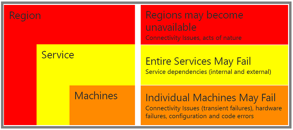
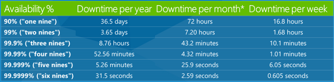
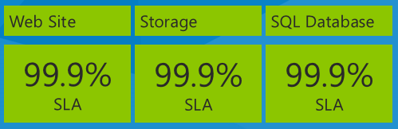
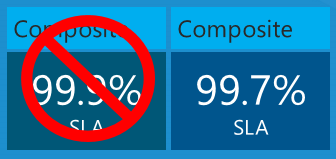

Design to Survive Failures (Building Real-World Cloud Apps with Azure)
====================
by [Mike Wasson](https://github.com/MikeWasson), [Rick Anderson](https://github.com/Rick-Anderson), [Tom Dykstra](https://github.com/tdykstra)

[Download Fix It Project](http://code.msdn.microsoft.com/Fix-It-app-for-Building-cdd80df4) or [Download E-book](http://blogs.msdn.com/b/microsoft_press/archive/2014/07/23/free-ebook-building-cloud-apps-with-microsoft-azure.aspx)

> The **Building Real World Cloud Apps with Azure** e-book is based on a presentation developed by Scott Guthrie. It explains 13 patterns and practices that can help you be successful developing web apps for the cloud. For information about the e-book, see [the first chapter](introduction.md).

One of the things you have to think about when you build any type of application, but especially one that will run in the cloud where lots of people will be using it, is how to design the app so that it can gracefully handle failures and continue to deliver value as much as possible. Given enough time, things are going to go wrong in any environment or any software system. How your app handles those situations determines how upset your customers will get and how much time you have to spend analyzing and fixing problems.

## Types of failures

There are two basic categories of failures that you'll want to handle differently:

- Transient, self-healing failures such as intermittent network connectivity issues.
- Enduring failures that require intervention.

For transient failures, you can implement a retry policy to ensure that most of the time the app recovers quickly and automatically. Your customers might notice slightly longer response time, but otherwise they won't be affected. We'll show some ways to handle these errors in the [Transient Fault Handling chapter](transient-fault-handling.md).

For enduring failures, you can implement monitoring and logging functionality that notifies you promptly when issues arise and that facilitates root cause analysis. We'll show some ways to help you stay on top of these kinds of errors in the [Monitoring and Telemetry chapter](monitoring-and-telemetry.md).

## Failure scope

You also have to think about failure scope – whether a single machine is affected, a whole service such as SQL Database or Storage, or an entire region.

### Machine failures

In Azure, a failed server is automatically replaced by a new one, and a well-designed cloud app recovers from this kind of failure automatically and quickly. Earlier we stressed the scalability benefits of a stateless web tier, and ease of recovery from a failed server is another benefit of statelessness. Ease of recovery is also one of the benefits of platform-as-a-service (PaaS) features such as SQL Database and Azure App Service Web Apps. Hardware failures are rare, but when they occur these services handle them automatically; you don't even have to write code to handle machine failures when you're using one of these services.

### Service failures

Cloud apps typically use multiple services. For example, the Fix It app uses the SQL Database service, the Storage service, and the web app is deployed to Azure App Service. What will your app do if one of the services you depend on fails? For some service failures a friendly "sorry, try again later" message might be the best you can do. But in many scenarios you can do better. For example, when your back-end data store is down, you can accept user input, display "your request has been received," and store the input someplace else temporarily; then when the service you need is operational again, you can retrieve the input and process it.

The [Queue-centric Work Pattern](queue-centric-work-pattern.md) chapter shows one way to handle this scenario. The Fix It app stores tasks in SQL Database, but it doesn't have to quit working when SQL Database is down. In that chapter we'll see how to store user input for a task in a queue, and use a worker process to read the queue and update the task. If SQL is down, the ability to create Fix It tasks is unaffected; the worker process can wait and process new tasks when SQL Database is available.

### Region failures

Entire regions may fail. A natural disaster might destroy a data center, it might get flattened by a meteor, the trunk line into the datacenter could be cut by a farmer burying a cow with a backhoe, etc. If your app is hosted in the stricken datacenter what do you do? It's possible to set up your app in Azure to run in multiple regions simultaneously so that if there's a disaster in one, you continue running in another region. Such failures are extremely rare occurrences, and most apps don't jump through the hoops necessary to ensure uninterrupted service through failures of this sort. See the Resources section at the end of the chapter for information about how to keep your app available even through a region failure.

A goal of Azure is to make handling all of these kinds of failures a lot easier, and you'll see some examples of how we're doing that in the following chapters.

## SLAs

People often hear about service-level agreements (SLAs) in the cloud environment. Basically these are promises that companies make about how reliable their service is. A 99.9% SLA means you should expect the service to be working correctly 99.9% of the time. That's a fairly typical value for an SLA and it sounds like a very high number, but you might not realize how much down time .1% actually amounts to. Here's a table that shows how much downtime various SLA percentages amount to over a year, a month, and a week.

So a 99.9% SLA means your service could be down 8.76 hours a year or 43.2 minutes a month. That's more down time than most people realize. So as a developer you want to be aware that a certain amount of down time is possible and handle it in a graceful way. At some point someone is going to be using your app, and a service is going to be down, and you want to minimize the negative impact of that on the customer.

One thing you should know about an SLA is what time-frame it refers to: does the clock get reset every week, every month, or every year? In Azure we reset the clock every month, which is better for you than a yearly SLA, since a yearly SLA could hide bad months by offsetting them with a series of good months.

Of course we always aspire to do better than the SLA; usually you'll be down much less than that. The promise is that if we're ever down for longer than the maximum down time you can ask for money back. The amount of money you get back probably wouldn't fully compensate you for the business impact of the excess down time, but that aspect of the SLA acts as an enforcement policy and lets you know that we do take it very seriously.

### Composite SLAs

An important thing to think about when you're looking at SLAs is the impact of using multiple services in an app, with each service having a separate SLA. For example, the Fix It app uses Azure App Service Web Apps, Azure Storage, and SQL Database. Here are their SLA numbers as of the date this e-book is being written in December, 2013:

What is the maximum down time you would expect for the app based on these service SLAs? You might think that your down time would be equal to the worst SLA percentage, or 99.9% in this case. That would be true if all three services always failed at the same time, but that isn't necessarily what actually happens. Each service may fail independently at different times, so you have to calculate the composite SLA by multiplying the individual SLA numbers.

So your app could be down not just 43.2 minutes a month but 3 times that amount, 108 minutes a month – and still be within the Azure SLA limits.

This issue is not unique to Azure. We actually provide the best cloud SLAs of any cloud service available, and you'll have similar issues to deal with if you use any vendor's cloud services. What this highlights is the importance of thinking about how you can design your app to handle the inevitable service failures gracefully, because they might happen often enough to impact your customers or users.

### Cloud SLAs compared to enterprise down-time experience

People sometimes say, "In my enterprise app I never have these problems." If you ask how much down time a month they actually have, they usually say, "Well, it happens occasionally." And if you ask how often, they admit that "Sometimes we do need to back up or install a new server or update software." Of course, that counts as down time. Most enterprise apps unless they are especially mission-critical are actually down for more than the amount of time allowed by our service SLAs. But when it's your server and your infrastructure and you're responsible for it and in control of it, you tend to feel less angst about down times. In a cloud environment you're dependent on someone else and you don't know what's going on, so you might tend to get more worried about it.

When an enterprise achieves a greater up-time percentage than you get from a cloud SLA, they do it by spending a lot more money on hardware. A cloud service could do that but would have to charge much more for its services. Instead, you take advantage of a cost-effective service and design your software so that the inevitable failures cause minimum disruption to your customers. Your job as a cloud app designer is not so much to avoid failure as to avoid catastrophe, and you do that by focusing on software, not on hardware. Whereas enterprise apps strive to maximize mean time between failures, cloud apps strive to minimize mean time to recover.

### Not all cloud services have SLAs

Be aware also that not every cloud service even has an SLA. If your app is dependent on a service with no up-time guarantee, you could be down far longer than you might imagine. For example, if you enable log-in to your site using a social provider such as Facebook or Twitter, check with the service provider to find out if there is an SLA, and you might find out there isn't one. But if the authentication service goes down or is unable to support the volume of requests you throw at it, your customers are locked out of your app. You could be down for days or longer. The creators of one new app expected hundreds of millions of downloads and took a dependency on Facebook authentication – but didn't talk to Facebook before going live and discovered too late that there was no SLA for that service.

### Not all downtime counts toward SLAs

Some cloud services may deliberately deny service if your app over-uses them. This is called *throttling*. If a service has an SLA, it should state the conditions under which you might be throttled, and your app design should avoid those conditions and react appropriately to the throttling if it happens. For example, if requests to a service start to fail when you exceed a certain number per second, you want to make sure automatic retries don't happen so fast that they cause the throttling to continue. We'll have more to say about throttling in the [Transient Fault Handling chapter](transient-fault-handling.md).

## Summary

This chapter has tried to help you realize why a real world cloud app has to be designed to survive failures gracefully. Starting with the [next chapter](monitoring-and-telemetry.md), the remaining patterns in this series go into more detail about some strategies you can use to do that:

- Have good [monitoring and telemetry](monitoring-and-telemetry.md), so that you find out quickly about failures that require intervention, and you have sufficient information to resolve them.
- [Handle transient faults](transient-fault-handling.md) by implementing intelligent retry logic, so that your app recovers automatically when it can and falls back to [circuit breaker](transient-fault-handling.md#circuitbreakers) logic when it can't.
- Use [distributed caching](distributed-caching.md) in order to minimize throughput, latency, and connection problems with database access.
- Implement loose coupling via the [queue-centric work pattern](queue-centric-work-pattern.md), so that your app front end can continue to work when the back end is down.

## Resources

For more information, see later chapters in this e-book and the following resources.

Documentation:

- [Failsafe: Guidance for Resilient Cloud Architectures](https://msdn.microsoft.com/en-us/library/windowsazure/jj853352.aspx). White paper by Marc Mercuri, Ulrich Homann, and Andrew Townhill. Web page version of the FailSafe video series.
- [Best Practices for the Design of Large-Scale Services on Azure Cloud Services](https://msdn.microsoft.com/en-us/library/windowsazure/jj717232.aspx). White paper by Mark Simms and Michael Thomassy.
- [Azure Business Continuity Technical Guidance](https://msdn.microsoft.com/en-us/library/windowsazure/hh873027.aspx). White paper by Patrick Wickline and Jason Roth.
- [Disaster Recovery and High Availability for Azure Applications](https://msdn.microsoft.com/en-us/library/windowsazure/dn251004.aspx). White paper by Michael McKeown, Hanu Kommalapati, and Jason Roth.
- [Microsoft Patterns and Practices - Azure Guidance](https://msdn.microsoft.com/en-us/library/dn568099.aspx). See Multi Data Center Deployment guidance, Circuit breaker pattern.
- [Azure Support - Service Level Agreements](https://www.windowsazure.com/en-us/support/legal/sla/).
- [Business Continuity in Azure SQL Database](https://msdn.microsoft.com/en-us/library/windowsazure/hh852669.aspx). Documentation about SQL Database high availability and disaster recovery features.
- [High Availability and Disaster Recovery for SQL Server in Azure Virtual Machines](https://msdn.microsoft.com/en-us/library/windowsazure/jj870962.aspx).

Videos:

- [FailSafe: Building Scalable, Resilient Cloud Services](https://channel9.msdn.com/Series/FailSafe). Nine-part series by Ulrich Homann, Marc Mercuri, and Mark Simms. Presents high-level concepts and architectural principles in a very accessible and interesting way, with stories drawn from Microsoft Customer Advisory Team (CAT) experience with actual customers. Episodes 1 and 8 go in depth into the reasons for designing cloud apps to survive failures. See also the follow-up discussion of throttling in episode 2 starting at 49:57, the discussion of failure points and failure modes in episode 2 starting at 56:05, and the discussion of circuit breakers in episode 3 starting at 40:55.
- [Building Big: Lessons learned from Azure customers - Part II](https://channel9.msdn.com/Events/Build/2012/3-030). Mark Simms talks about designing for failure and instrumenting everything. Similar to the Failsafe series but goes into more how-to details.

>[!div class="step-by-step"]
[Previous](unstructured-blob-storage.md)
[Next](monitoring-and-telemetry.md)