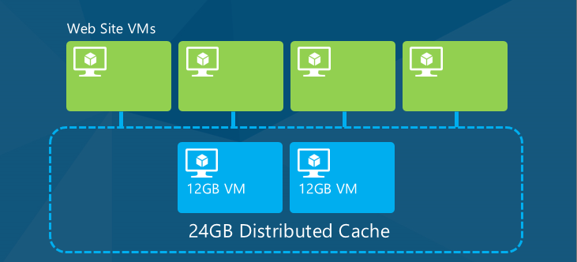

Distributed Caching (Building Real-World Cloud Apps with Azure)
====================
by [Mike Wasson](https://github.com/MikeWasson), [Rick Anderson](https://github.com/Rick-Anderson), [Tom Dykstra](https://github.com/tdykstra)

[Download Fix It Project](http://code.msdn.microsoft.com/Fix-It-app-for-Building-cdd80df4) or [Download E-book](http://blogs.msdn.com/b/microsoft_press/archive/2014/07/23/free-ebook-building-cloud-apps-with-microsoft-azure.aspx)

> The **Building Real World Cloud Apps with Azure** e-book is based on a presentation developed by Scott Guthrie. It explains 13 patterns and practices that can help you be successful developing web apps for the cloud. For information about the e-book, see [the first chapter](introduction.md).

The previous chapter looked at transient fault handling and mentioned caching as a circuit breaker strategy. This chapter gives more background about caching, including when to use it, common patterns for using it, and how to implement it in Azure.

## What is distributed caching

A cache provides high throughput, low-latency access to commonly accessed application data, by storing the data in memory. For a cloud app the most useful type of cache is distributed cache, which means the data is not stored on the individual web server's memory but on other cloud resources, and the cached data is made available to all of an application's web servers (or other cloud VMs that are used by the application).

When the application scales by adding or removing servers, or when servers are replaced due to upgrades or faults, the cached data remains accessible to every server that runs the application.

By avoiding the high latency data access of a persistent data store, caching can dramatically improve application responsiveness. For example, retrieving data from cache is much faster than retrieving it from a relational database.

A side benefit of caching is reduced traffic to the persistent data store, which may result in lower costs when there are data egress charges for the persistent data store.

## When to use distributed caching

Caching works best for application workloads that do more reading than writing of data, and when the data model supports the key/value organization that you use to store and retrieve data in cache. It's also more useful when application users share a lot of common data; for example, cache would not provide as many benefits if each user typically retrieves data unique to that user. An example where caching could be very beneficial is a product catalog, because the data does not change frequently, and all customers are looking at the same data.

The benefit of caching becomes increasingly measurable the more an application scales, as the throughput limits and latency delays of the persistent data store become more of a limit on overall application performance. However, you might implement caching for other reasons than performance as well. For data that doesn't have to be perfectly up-to-date when shown to the user, cache access can serve as a circuit breaker for when the persistent data store is unresponsive or unavailable.

## Popular cache population strategies

In order to be able to retrieve data from cache, you have to store it there first. There are several strategies for getting data that you need into a cache:

- On Demand / Cache Aside

    The application tries to retrieve data from cache, and when the cache doesn't have the data (a "miss"), the application stores the data in the cache so that it will be available the next time. The next time the application tries to get the same data, it finds what it's looking for in the cache (a "hit"). To prevent fetching cached data that has changed on the database, you invalidate the cache when making changes to the data store.
- Background Data Push

    Background services push data into the cache on a regular schedule, and the app always pulls from the cache. This approach works great with high latency data sources that don't require you always return the latest data.
- Circuit Breaker

    The application normally communicates directly with the persistent data store, but when the persistent data store has availability problems, the application retrieves data from cache. Data may have been put in cache using either the cache aside or background data push strategy. This is a fault handling strategy rather than a performance enhancing strategy.

In order to keep data in the cache current, you can delete related cache entries when your application creates, updates, or deletes data. If it's alright for your application to sometimes get data that is slightly out-of-date, you can rely on a configurable expiration time to set a limit on how old cache data can be.

You can configure absolute expiration (amount of time since the cache item was created) or sliding expiration (amount of time since the last time a cache item was accessed). Absolute expiration is used when you are depending on the cache expiration mechanism to prevent the data from becoming too stale. In the Fix It app, we'll manually evict stale cache items and we'll use sliding expiration to keep the most current data in cache. Regardless of the expiration policy you choose, the cache will automatically evict the oldest (Least Recently Used or LRU) items when the cache's memory limit is reached.

## Sample cache-aside code for Fix It app

In the following sample code, we check the cache first when retrieving a Fix It task. If the task is found in cache, we return it; if not found, we get it from the database and store it in the cache. The changes you'd make to add caching to the `FindTaskByIdAsync` method are highlighted.

[!code-csharp[Main](distributed-caching/samples/sample1.cs?highlight=5,9-11,13-15,19)]

When you update or delete a Fix It task, you have to invalidate (remove) the cached task. Otherwise, future attempts to read that task will continue to get the old data from the cache.

[!code-csharp[Main](distributed-caching/samples/sample2.cs?highlight=7)]

These are samples to illustrate simple caching code; caching has not been implemented in the downloadable Fix It project.

## Azure caching services

Azure offers the following caching services: [Azure Redis Cache](https://msdn.microsoft.com/en-us/library/dn690523.aspx) and [Azure Managed Cache](https://msdn.microsoft.com/en-us/library/dn386094.aspx). Azure Redis cache is based on the popular [open source Redis Cache](http://redis.io/) and is the first choice for most caching scenarios.

## ASP.NET session state using a cache provider

As mentioned in the [web development best practices chapter](web-development-best-practices.md), a best practice is to avoid using session state. If your application requires session state, the next best practice is to avoid the default in-memory provider because that doesn't enable scale out (multiple instances of the web server). The ASP.NET SQL Server session state provider enables a site that runs on multiple web servers to use session state, but it incurs a high latency cost compared to an in-memory provider. The best solution if you have to use session state is to use a cache provider, such as the [Session State Provider for Azure Cache](https://msdn.microsoft.com/en-us/library/windowsazure/gg185668.aspx).

## Summary

You've seen how the Fix It app could implement caching in order to improve response time and scalability, and to enable the app to continue to be responsive for read operations when the database is unavailable. In the [next chapter](queue-centric-work-pattern.md) we'll show how to further improve scalability and make the app continue to be responsive for write operations.

## Resources

For more information about caching, see the following resources.

Documentation

- [Azure Cache](https://msdn.microsoft.com/en-us/library/gg278356.aspx). Official MSDN documentation on caching in Azure.
- [Microsoft Patterns and Practices - Azure Guidance](https://msdn.microsoft.com/en-us/library/dn568099.aspx). See Caching guidance and Cache-Aside pattern.
- [Failsafe: Guidance for Resilient Cloud Architectures](https://msdn.microsoft.com/en-us/library/windowsazure/jj853352.aspx). White paper by Marc Mercuri, Ulrich Homann, and Andrew Townhill. See the section on Caching.
- [Best Practices for the Design of Large-Scale Services on Azure Cloud Services](https://msdn.microsoft.com/en-us/library/windowsazure/jj717232.aspx). W. White paper by Mark Simms and Michael Thomassy. See the section on distributed caching.
- [Distributed Caching On The Path To Scalability](https://msdn.microsoft.com/en-us/magazine/dd942840.aspx). An older (2009) MSDN Magazine article, but a clearly written introduction to distributed caching in general; goes into more depth than the caching sections of the FailSafe and Best Practices white papers.

Videos

- [FailSafe: Building Scalable, Resilient Cloud Services](https://channel9.msdn.com/Series/FailSafe). Nine-part series by Ulrich Homann, Marc Mercuri, and Mark Simms. Presents a 400-level view of how to architect cloud apps. This series focuses on theory and reasons why; for more how-to details, see the Building Big series by Mark Simms. See the caching discussion in episode 3 starting at 1:24:14.
- [Building Big: Lessons learned from Azure customers - Part I](https://channel9.msdn.com/Events/Build/2012/3-029). Simon Davies discusses distributed caching starting at 46:00. Similar to the Failsafe series but goes into more how-to details. The presentation was given October 31, 2012, so it does not cover caching service of Web Apps in Azure App Service that was introduced in 2013.

Code sample

- [Cloud Service Fundamentals in Azure](https://code.msdn.microsoft.com/Cloud-Service-Fundamentals-4ca72649). Sample application that implements distributed caching. See the accompanying blog post [Cloud Service Fundamentals – Caching Basics](https://blogs.msdn.com/b/windowsazure/archive/2013/10/03/cloud-service-fundamentals-caching-basics.aspx).

>[!div class="step-by-step"]
[Previous](transient-fault-handling.md)
[Next](queue-centric-work-pattern.md)