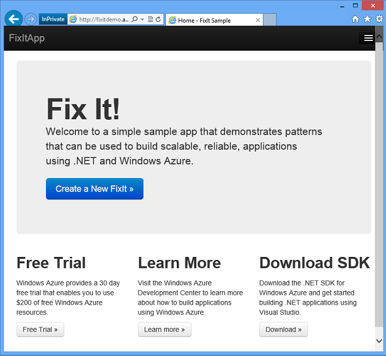
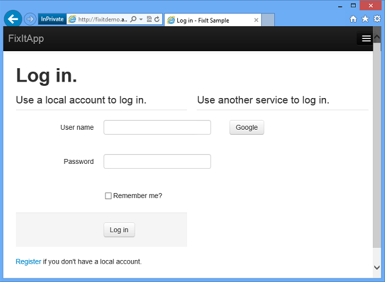
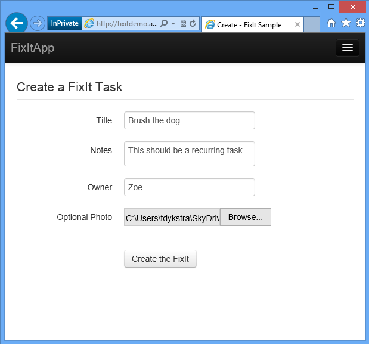
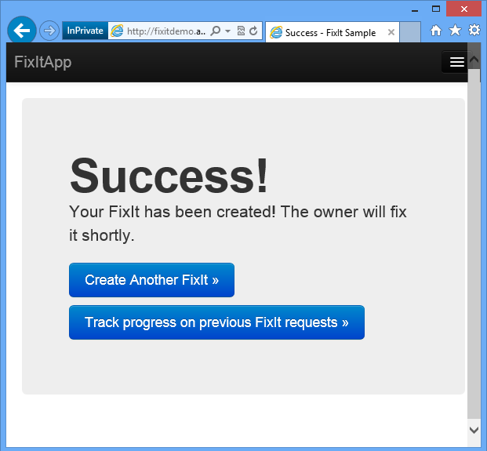
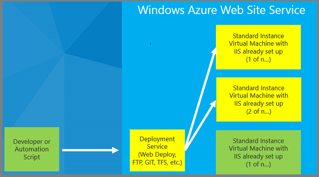
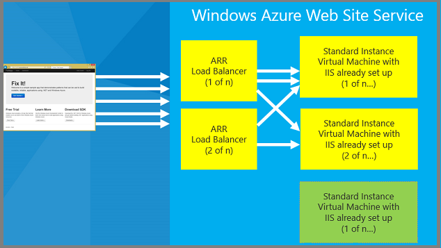
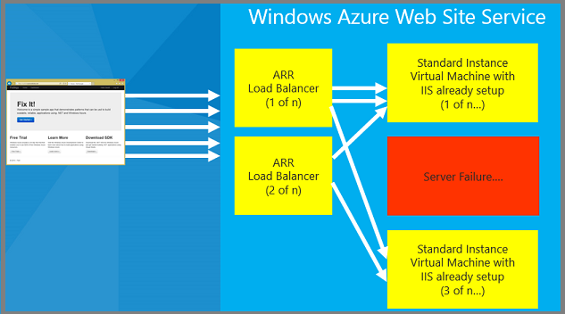

Building Real-World Cloud Apps with Azure
====================
by [Mike Wasson](https://github.com/MikeWasson), [Rick Anderson](https://github.com/Rick-Anderson), [Tom Dykstra](https://github.com/tdykstra)

[Download Fix It Project](http://code.msdn.microsoft.com/Fix-It-app-for-Building-cdd80df4) or [Download E-book](http://blogs.msdn.com/b/microsoft_press/archive/2014/07/23/free-ebook-building-cloud-apps-with-microsoft-azure.aspx)

> This e-book walks you through a patterns-based approach to building real-world cloud solutions. The patterns apply to the development process as well as to architecture and coding practices.
> 
> The content is based on a presentation developed by Scott Guthrie and delivered by him at the Norwegian Developers Conference (NDC) in June of 2013 ([part 1](http://vimeo.com/68215538), [part 2](http://vimeo.com/68215602)), and at Microsoft Tech Ed Australia in September, 2013 ([part 1](https://channel9.msdn.com/Events/TechEd/Australia/2013/AZR324), [part 2](https://channel9.msdn.com/Events/TechEd/Australia/2013/AZR325)). [Many others](more-patterns-and-guidance.md#acknowledgments) updated and augmented the content while transitioning it from video to written form.

## Intended Audience

Developers who are curious about developing for the cloud, considering a move to the cloud, or are new to cloud development will find here a concise overview of the most important concepts and practices they need to know. The concepts are illustrated with concrete examples, and each chapter links to other resources for more in-depth information. The examples and the links to additional resources are for Microsoft frameworks and services, but the principles illustrated apply to other web development frameworks and cloud environments as well.

Developers who are already developing for the cloud may find ideas here that will help make them more successful. Each chapter in the series can be read independently, so you can pick and choose topics that you're interested in.

Anyone who watched Scott Guthrie's *Building Real World Cloud Apps with Azure* presentation and wants more details and updated information will find that here.

## Cloud development patterns

This e-book explains thirteen recommended patterns for cloud development. "Pattern" is used here in a broad sense to mean a recommended way to do things: how best to go about developing, designing, and coding cloud apps. These are key patterns which will help you "fall into the pit of success" if you follow them.

- [Automate everything](automate-everything.md).

    - Use scripts to maximize efficiency and minimize errors in repetitive processes.
    - Demo: Azure management scripts.
- [Source control](source-control.md). 

    - Set up branching structure in source control to facilitate DevOps workflow.
    - Demo: add scripts to source control.
    - Demo: keep sensitive data out of source control.
    - Demo: use Git in Visual Studio.
- [Continuous integration and delivery](continuous-integration-and-continuous-delivery.md). 

    - Automate build and deployment with each source control check-in.
- [Web development best practices](web-development-best-practices.md). 

    - Keep web tier stateless.
    - Demo: scaling and auto-scaling in Web Apps in Azure App Service.
    - Avoid session state.
    - Use a CDN.
    - Use asynchronous programming model.
    - Demo: async in ASP.NET MVC and Entity Framework.
- [Single sign-on](single-sign-on.md). 

    - Introduction to Azure Active Directory.
    - Demo: create an ASP.NET app that uses Azure Active Directory.
- [Data storage options](data-storage-options.md). 

    - Types of data stores.
    - How to choose the right data store.
    - Demo: Azure SQL Database.
- [Data partitioning strategies](data-partitioning-strategies.md). 

    - Partition data vertically, horizontally, or both to facilitate scaling a relational database.
- [Unstructured blob storage](unstructured-blob-storage.md). 

    - Store files in the cloud by using the blob service.
    - Demo: using blob storage in the Fix It app.
- [Design to survive failures](design-to-survive-failures.md). 

    - Types of failures.
    - Failure Scope.
    - Understanding SLAs.
- [Monitoring and telemetry](monitoring-and-telemetry.md). 

    - Why you should both buy a telemetry app and write your own code to instrument your app.
    - Demo: New Relic for Azure
    - Demo: logging code in the Fix It app.
    - Demo: dependency injection in the Fix It app.
    - Demo: built-in logging support in Azure.
- [Transient fault handling](transient-fault-handling.md). 

    - Use smart retry/back-off logic to mitigate the effect of transient failures.
    - Demo: retry/back-off in Entity Framework 6.
- [Distributed caching](distributed-caching.md). 

    - Improve scalability and reduce database transaction costs by using distributed caching.
- [Queue-centric work pattern](queue-centric-work-pattern.md). 

    - Enable high availability and improve scalability by loosely coupling web and worker tiers.
    - Demo: Azure storage queues in the Fix It app.
- [More cloud app patterns and guidance](more-patterns-and-guidance.md).
- [Appendix: The Fix It Sample Application](the-fix-it-sample-application.md)

    - Known Issues
    - Best Practices
    - How to download, build, run, and deploy.

These patterns apply to all cloud environments, but we'll illustrate them by using examples based on Microsoft technologies and services, such as Visual Studio, Team Foundation Service, ASP.NET, and Azure.

This remainder of this chapter introduces the Fix It sample application and the Web Apps in Azure App Service cloud environment that the Fix It app runs in.

## The Fix it sample application

Most of the screen shots and code examples shown in this e-book are based on the Fix It app originally developed by [Scott Guthrie](https://weblogs.asp.net/scottgu/) to demonstrate recommended cloud app development patterns and practices.

The sample app is a simple work item ticketing system. When you need something fixed, you create a ticket and assign it to someone, and others can log in and see the tickets assigned to them and mark tickets as completed when the work is done.

It's a standard Visual Studio web project. It is built on ASP.NET MVC and uses a SQL Server database. It can run locally in IIS Express and can be deployed to a Azure Web Site to run in the cloud. You can log in using forms authentication and a local database or by using a social provider such as Google. (Later we'll also show how to log in with an Active Directory organizational account.)

Once you're logged in you can create a ticket, assign it to someone, and upload a picture of what you want to get fixed.

You can track the progress of work items you created, see tickets assigned to you, view ticket details, and mark items as completed.

This is a very simple app from a feature perspective, but you'll see how to build it so that it can scale to millions of users and will be resilient to things like database failures and connection terminations. You'll also see how to create an automated and agile development workflow, which enables you to start simple and make the app better and better by iterating the development cycle efficiently and quickly.

## Web Apps in Azure App Service

The cloud environment used for the Fix It application is a service of Azure that we call Web Sites. This service is a way that you can host your own web app in Azure without having to create VMs and keep them updated, install and configure IIS, etc. We host your site on our VMs and automatically provide backup and recovery and other services for you. The Web Sites service works with ASP.NET, Node.js, PHP, and Python. It enables you to deploy very quickly using Visual Studio, Web Deploy, FTP, Git, or TFS. It's usually just a few seconds between the time you start a deployment and the time your update is available over the Internet. It's all free to get started, and you can scale up as your traffic grows.

Behind the scenes, Web Apps in Azure App Service provides a lot of architectural components and features that you'd have to build yourself if you were going to host a web site using IIS on your own VMs. One component is a deployment end point that automatically configures IIS and installs your application on as many VMs as you want to run your site on.

When a user hits the web site, they don't hit the IIS VMs directly, they go through [Application Request Routing (ARR)](https://www.iis.net/downloads/microsoft/application-request-routing) load balancers. You can use these with your own servers, but the advantage here is that they're set up for you automatically. They use a smart heuristic that takes into account factors such as session affinity, queue depth in IIS, and CPU usage on each machine to direct traffic to the VMs that host your web site.

If a machine goes down, Azure automatically pulls it from the rotation, spins up a new VM instance, and starts directing traffic to the new instance -- all with no down time for your application.

All of this takes place automatically. All you need to do is create a web site and deploy your application to it, using Windows PowerShell, Visual Studio, or the Azure management portal.

For a quick and easy step-by-step tutorial that shows how to create a web application in Visual Studio and deploy it to a Azure Web Site, see [Get started with Azure and ASP.NET](https://azure.microsoft.com/en-us/documentation/articles/web-sites-dotnet-get-started/).

## Summary

This introduction has provided a list of topics the book will cover, screenshots of the sample application, and a brief overview of the Web Apps in Azure App Service cloud environment. One of the great advantages of developing apps in and for the cloud is that it's easy to automate repetitive development tasks such as creating a test environment and deploying your code to it. How to do that is the subject of the [next chapter](automate-everything.md).

## Resources

For more information about the topics covered in this chapter, see the following resources.

Documentation:

- [Web Apps in Azure App Service](https://azure.microsoft.com/en-us/services/app-service/web/). Portal page for Azure documentation about Web Apps.
- [Web Apps, Cloud Services, and VMs: When to use which?](https://azure.microsoft.com/en-us/documentation/articles/choose-web-site-cloud-service-vm/) WAWS as shown in this chapter is just one of three ways you can run web apps in Azure. This article explains the differences between the three ways and gives guidance on how to choose which one is right for your scenario. Like Web Sites, Cloud Services is a PaaS feature of Azure. VMs are an IaaS feature. For an explanation of PaaS versus IaaS, see the [Data Options](data-storage-options.md#paasiaas) chapter.

Videos:

- [Scott Guthrie starts at Step 0 - What is the Azure Cloud OS?](https://azure.microsoft.com/en-us/documentation/videos/what-is-the-cloud-os-scottgu/)
- [Web Sites Architecture - with Stefan Schackow](https://azure.microsoft.com/en-us/documentation/videos/why-azure-web-sites-plus-architecture/).
- [Azure Web Sites Internals with Nir Mashkowski](https://channel9.msdn.com/Shows/Web+Camps+TV/Windows-Azure-Web-Sites-Internals-with-Nir-Mashkowski).

>[!div class="step-by-step"]
[Next](automate-everything.md)