Monitoring and Telemetry (Building Real-World Cloud Apps with Azure)
====================
by [Mike Wasson](https://github.com/MikeWasson), [Rick Anderson](https://github.com/Rick-Anderson), [Tom Dykstra](https://github.com/tdykstra)

[Download Fix It Project](http://code.msdn.microsoft.com/Fix-It-app-for-Building-cdd80df4) or [Download E-book](http://blogs.msdn.com/b/microsoft_press/archive/2014/07/23/free-ebook-building-cloud-apps-with-microsoft-azure.aspx)

> The **Building Real World Cloud Apps with Azure** e-book is based on a presentation developed by Scott Guthrie. It explains 13 patterns and practices that can help you be successful developing web apps for the cloud. For information about the e-book, see [the first chapter](introduction.md).

A lot of people rely on customers to let them know when their application is down. That's not really a best practice anywhere, and especially not in the cloud. There's no guarantee of quick notification, and when you do get notified, you often get minimal or misleading data about what happened. With good telemetry and logging systems you can be aware of what's going on with your app, and when something does go wrong you find out right away and have helpful troubleshooting information to work with.

## Buy or rent a telemetry solution

One of the things that's great about the cloud environment is that it's really easy to buy or rent your way to victory. Telemetry is an example. Without a lot of effort you can get a really good telemetry system up and running, very cost-effectively. There are a bunch of great partners that integrate with Azure, and some of them have free tiers – so you can get basic telemetry for nothing. Here are just a few of the ones currently available on Azure:

- [New Relic](http://newrelic.com/)
- [AppDynamics](http://www.appdynamics.com/)
- [Dynatrace](https://datamarket.azure.com/application/b4011de2-1212-4375-9211-e882766121ff)

As of March 2015, [Microsoft Application Insights for Visual Studio Online](https://azure.microsoft.com/en-us/documentation/articles/app-insights-get-started/) is not released yet but is available in preview to try out. [Microsoft System Center](http://www.petri.co.il/microsoft-system-center-introduction.htm#) also includes monitoring features.

We'll quickly walk through setting up New Relic to show how easy it can be to use a telemetry system.

In the Azure management portal, sign up for the service. Click **New**, and then click **Store**. The **Choose an Add-on** dialog box appears. Scroll down and click **New Relic**.

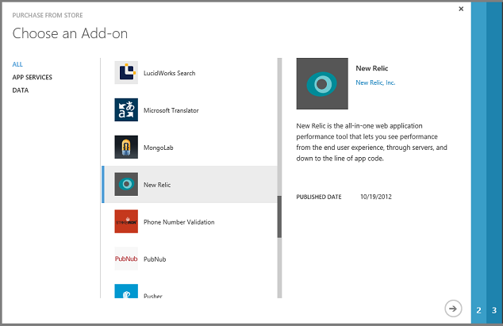

Click the right arrow and choose the service tier you want. For this demo we'll use the free tier.

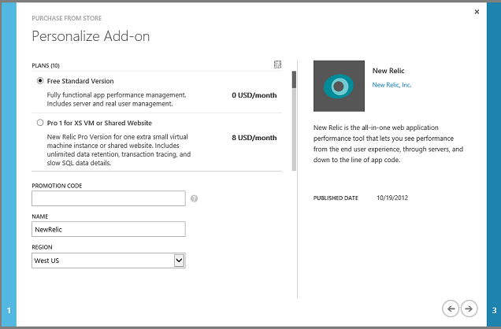

Click the right arrow, confirm the "purchase," and New Relic now shows up as an Add-on in the portal.

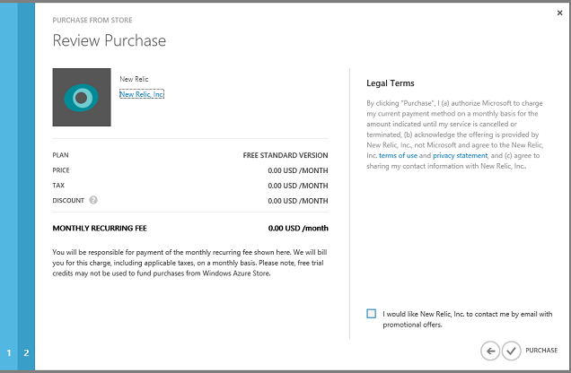

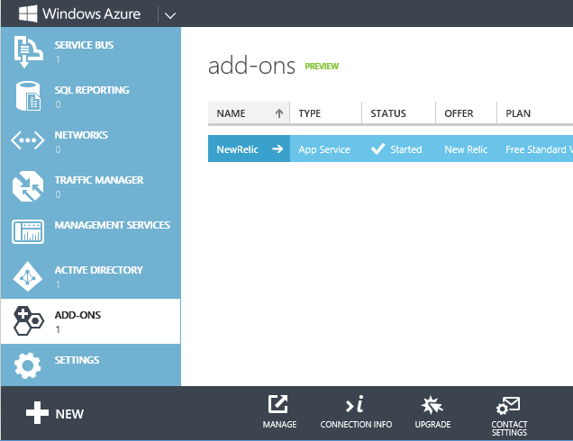

Click **Connection Info**, and copy the license key.

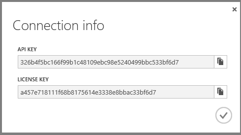

Go to the **Configure** tab for your web app in the portal, set **Performance Monitoring** to **Add-On**, and set the **Choose Add-On** drop-down list to **New Relic**. Then click **Save**.

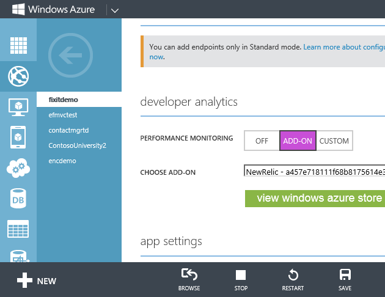

In Visual Studio, install the New Relic NuGet package in your app.

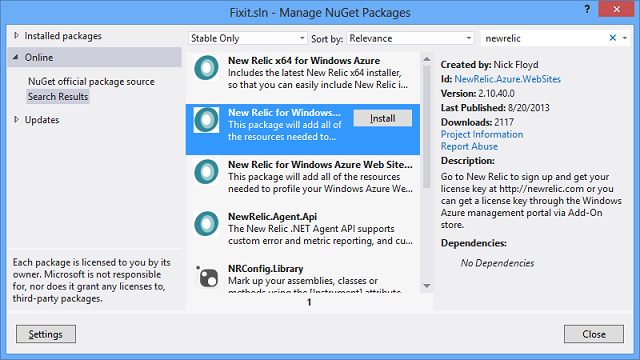

Deploy the app to Azure and start using it. Create a few Fix It tasks to provide some activity for New Relic to monitor.

Then go back to the **New Relic** page in the **Add-ons** tab of the portal and click **Manage**. The portal sends you to the New Relic management portal, using single sign-on for authentication so you don't have to enter your credentials again. The Overview page presents a variety of performance statistics. (Click the image to see the overview page full size.)

[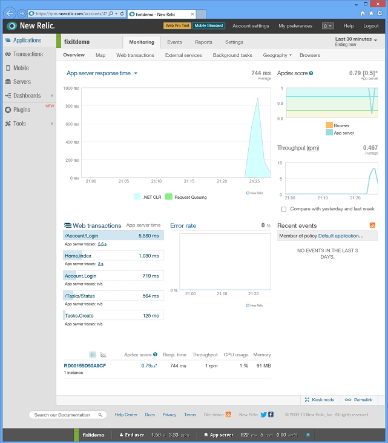](monitoring-and-telemetry/_static/image8.png)

Here are just a few of the statistics you can see:

- Average response time at different times of day.

    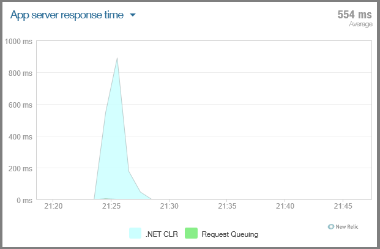
- Throughput rates (in requests per minute) at different times of day.

    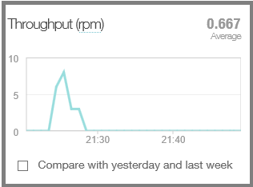
- Server CPU time spent handling different HTTP requests.

    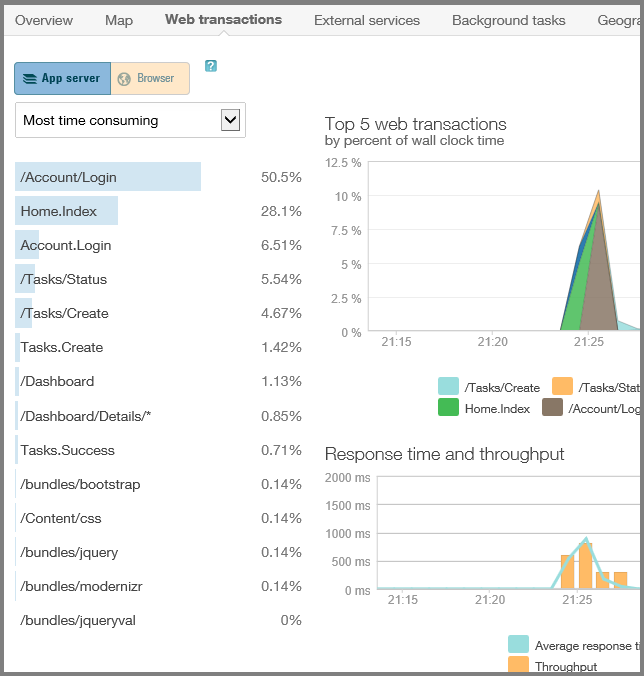
- CPU time spent in different parts of the application code:

    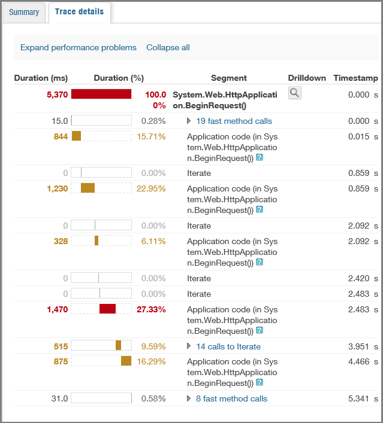
- Historical performance statistics.

    
- Calls to external services such as the Blob service and statistics about how reliable and responsive the service has been.

    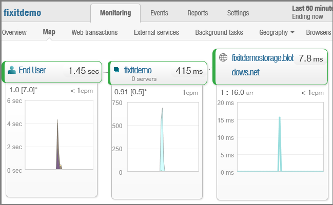

    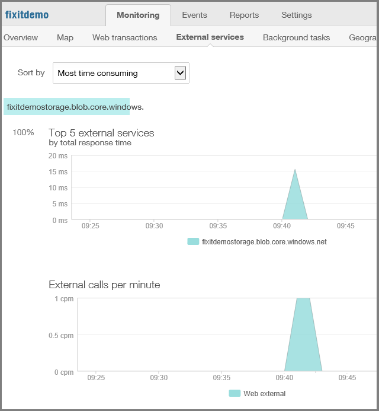

    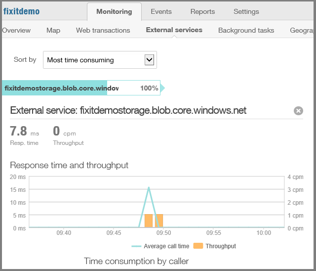
- Information about where in the world or where in the U.S. web app traffic came from.

    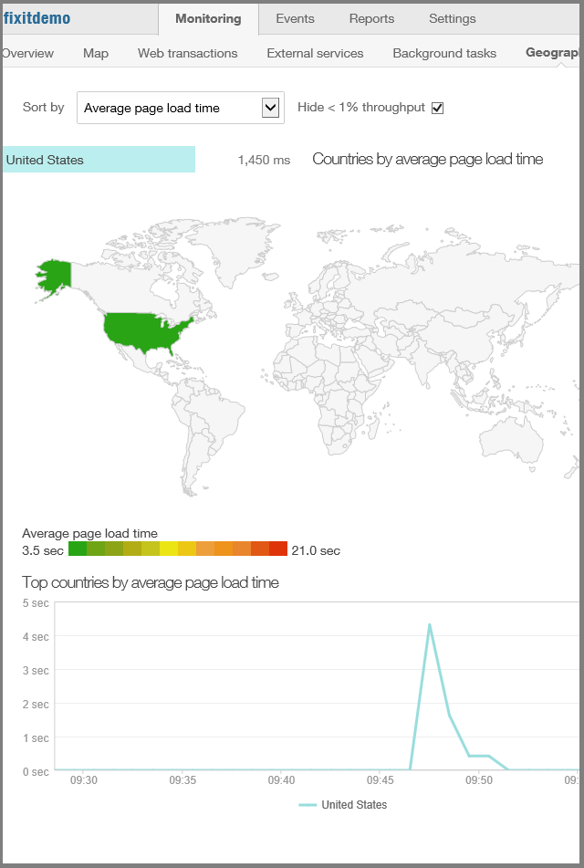

You can also set up reports and events. For example, you can say any time you start seeing errors, send an email to alert support staff to the problem.

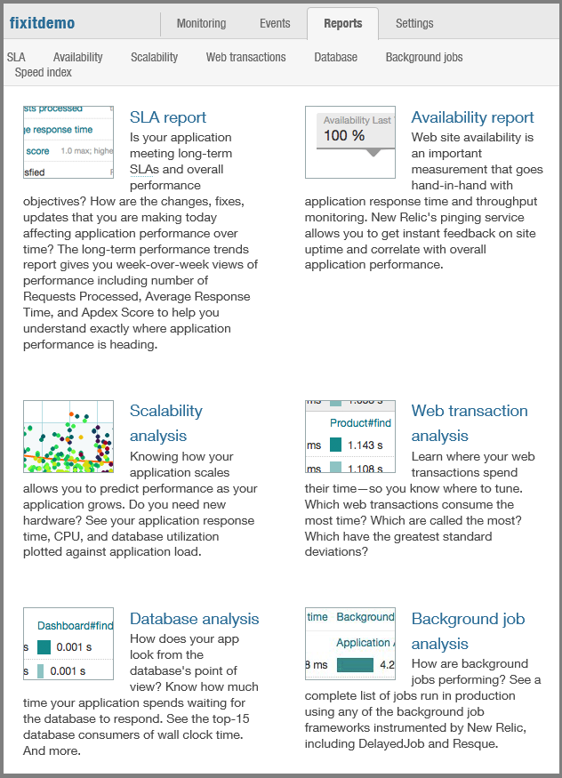

New Relic is just one example of a telemetry system; you can get all of this from other services as well. The beauty of the cloud is that without having to write any code, and for minimal or no expense, you suddenly can get a lot more information about how your application is being used and what your customers are actually experiencing.

## Log for insight

A telemetry package is a good first step, but you still have to instrument your own code. The telemetry service tells you when there's a problem and tells you what the customers are experiencing, but it may not give you a lot of insight into what's going on in your code.

You don't want to have to remote into a production server to see what your app is doing. That might be practical when you've got one server, but what about when you've scaled to hundreds of servers and you don't know which ones you need to remote into? Your logging should provide enough information that you never have to remote into production servers to analyze and debug problems. You should be logging enough information so that you can isolate issues solely through the logs.

### Log in production

A lot of people turn on tracing in production only when there's a problem and they want to debug. This can introduce a substantial delay between the time you're aware of a problem and the time you get useful troubleshooting information about it. And the information you get might not be helpful for intermittent errors.

What we recommend in the cloud environment where storage is cheap is that you always leave logging on in production. That way when errors happen you already have them logged, and you have historical data that can help you analyze issues that develop over time or happen regularly at different times. You could automate a purge process to delete old logs, but you might find that it's more expensive to set up such a process than it is to keep the logs.

The added expense of logging is trivial compared to the amount of troubleshooting time and money you can save by having all of the information you need already available when something goes wrong. Then when someone tells you they had a random error sometime around 8:00 last night, but they don't remember the error, you can readily find out what the problem was.

For less than $4 a month you can keep 50 gigabytes of logs on hand, and the performance impact of logging is trivial so long as you keep one thing in mind -- in order to avoid performance bottlenecks, make sure your logging library is asynchronous.

### Differentiate logs that inform from logs that require action

Logs are meant to INFORM (I want you to know something) or ACT (I want you to do something). Be careful to only write ACT logs for issues that genuinely require a person or an automated process to take action. Too many ACT logs will create noise, requiring too much work to sift through it all to find genuine issues. And if your ACT logs automatically trigger some action such as sending email to support staff, avoid letting thousands of such actions be triggered by a single issue.

In .NET System.Diagnostics tracing, logs can be assigned Error, Warning, Info, and Debug/Verbose level. You can differentiate ACT from INFORM logs by reserving the Error level for ACT logs and using the lower levels for INFORM logs.

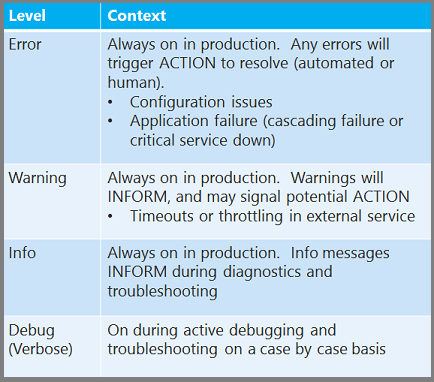

### Configure logging levels at run time

While it's worthwhile to have logging always on in production, another best practice is to implement a logging framework that enables you to adjust at run-time the level of detail that you're logging, without redeploying or restarting your application. For example when you use the tracing facility in `System.Diagnostics` you can create Error, Warning, Info, and Debug/Verbose logs. We recommend you always log Error, Warning, and Info logs in production, and you'll want to be able to dynamically add Debug/Verbose logging for troubleshooting on a case-by-case basis.

Web Apps in Azure App Service have built-in support for writing `System.Diagnostics` logs to the file system, Table storage, or Blob storage. You can select different logging levels for each storage destination, and you can change the logging level on the fly without restarting your application. The Blob storage support makes it easier to run [HDInsight](https://www.windowsazure.com/en-us/documentation/services/hdinsight/) analysis jobs on your application logs, because HDInsight knows how to work with Blob storage directly.

### Log Exceptions

Don't just put *exception.ToString()* in your logging code. That leaves out contextual information. In the case of SQL errors, it leaves out the SQL error number. For all exceptions, include context information, the exception itself, and inner exceptions to make sure that you are providing everything that will be needed for troubleshooting. For example, context information might include the server name, a transaction identifier, and a user name (but not the password or any secrets!).

If you rely on each developer to do the right thing with exception logging, some of them won't. To ensure that it gets done the right way every time, build exception handling right into your logger interface: pass the exception object itself to the logger class and log the exception data properly in the logger class.

### Log calls to services

We highly recommend that you write a log every time your app calls out to a service, whether it's to a database or a REST API or any external service. Include in your logs not only an indication of success or failure but how long each request took. In the cloud environment you'll often see problems related to slow-downs rather than complete outages. Something that normally takes 10 milliseconds might suddenly start taking a second. When someone tells you your app is slow, you want to be able to look at New Relic or whatever telemetry service you have and validate their experience, and then you want to be able to look are your own logs to dive into the details of why it's slow.

### Use an ILogger interface

What we recommend doing when you create a production application is to create a simple *ILogger* interface and stick some methods in it. This makes it easy to change the logging implementation later and not have to go through all your code to do it. We could be using the `System.Diagnostics.Trace` class throughout the Fix It app, but instead we're using it under the covers in a logging class that implements *ILogger*, and we make *ILogger* method calls throughout the app.

That way, if you ever want to make your logging richer, you can replace [`System.Diagnostics.Trace`](https://www.windowsazure.com/en-us/develop/net/tutorials/troubleshoot-web-sites-in-visual-studio/#apptracelogs) with whatever logging mechanism you want. For example, as your app grows you might decide that you want to use a more comprehensive logging package such as [NLog](http://nlog-project.org/) or [Enterprise Library Logging Application Block](https://msdn.microsoft.com/en-us/library/dn440731(v=pandp.60).aspx). ([Log4Net](http://logging.apache.org/log4net/) is another popular logging framework but it doesn't do asynchronous logging.)

One possible reason for using a framework such as NLog is to facilitate dividing up logging output into separate high-volume and high-value data stores. That helps you to efficiently store large volumes of INFORM data that you don't need to execute fast queries against, while maintaining quick access to ACT data.

### Semantic Logging

For a relatively new way to do logging that can produce more useful diagnostic information, see [Enterprise Library Semantic Logging Application Block (SLAB)](http://convective.wordpress.com/2013/08/12/semantic-logging-application-block-slab/). SLAB uses [Event Tracing for Windows](https://msdn.microsoft.com/en-us/library/windows/desktop/bb968803.aspx) (ETW) and [EventSource](https://msdn.microsoft.com/en-us/library/system.diagnostics.tracing.eventsource.aspx) support in .NET 4.5 to enable you to create more structured and queryable logs. You define a different method for each type of event that you log, which enables you to customize the information you write. For example, to log a SQL Database error you might call a `LogSQLDatabaseError` method. For that kind of exception, you know a key piece of information is the error number, so you could include an error number parameter in the method signature and record the error number as a separate field in the log record you write. Because the number is in a separate field you can more easily and reliably get reports based on SQL error numbers than you could if you were just concatenating the error number into a message string.

## Logging in the Fix It app

### The ILogger interface

Here is the *ILogger* interface in the Fix It app.

[!code-csharp[Main](monitoring-and-telemetry/samples/sample1.cs)]

These methods enable you to write logs at the same four levels supported by *System.Diagnostics*. The TraceApi methods are for logging external service calls with information about latency. You could also add a set of methods for Debug/Verbose level.

### The Logger implementation of the ILogger interface

The implementation of the interface is really simple. It basically just calls into the standard *System.Diagnostics* methods. The following snippet shows all three of the Information methods and one each of the others.

[!code-csharp[Main](monitoring-and-telemetry/samples/sample2.cs)]

### Calling the ILogger methods

Every time code in the Fix It app catches an exception, it calls an *ILogger* method to log the exception details. And every time it makes a call to the database, Blob service, or a REST API, it starts a stopwatch before the call, stops the stopwatch when the service returns, and logs the elapsed time along with information about success or failure.

Notice that the log message includes the class name and method name. It's a good practice to make sure that log messages identify what part of the application code wrote them.

[!code-csharp[Main](monitoring-and-telemetry/samples/sample3.cs?highlight=6,14,20-21,25)]

So now for every time the Fix It app has made a call to SQL Database, you can see the call, the method that called it, and exactly how much time it took.

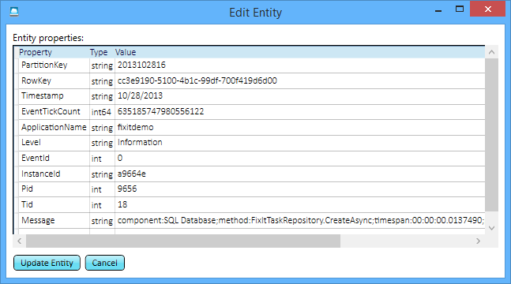

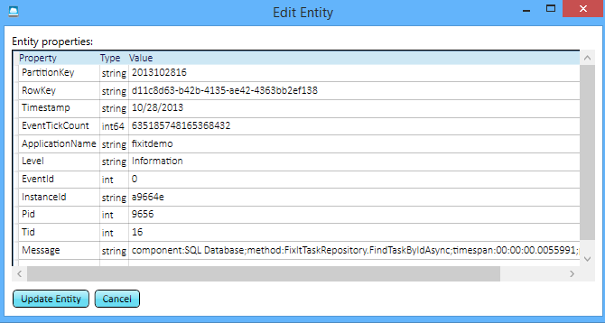

If you go browsing through the logs, you can see that the time database calls take is variable. That information could be useful: because the app logs all this you can analyze historical trends in how the database service is performing over time. For instance, a service might be fast most of the time but requests might fail or responses might slow down at certain times of day.

You can do the same thing for the Blob service – for every time the app uploads a new file, there's a log, and you can see exactly how long it took to upload each file.

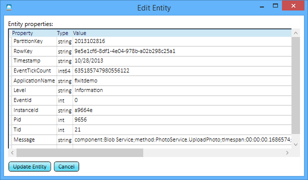

It's just a couple extra lines of code to write every time you call a service, and now whenever someone says they ran into an issue, you know exactly what the issue was, whether it was an error, or even if it was just running slow. You can pinpoint the source of the problem without having to remote into a server or turn on logging after the error happens and hope to re-create it.

## Dependency Injection in the Fix It app

You might wonder how the repository constructor in the example shown above gets the logger interface implementation:

[!code-csharp[Main](monitoring-and-telemetry/samples/sample4.cs?highlight=6)]

To wire up the interface to the implementation the app uses [dependency injection](http://en.wikipedia.org/wiki/Dependency_injection)(DI) with [AutoFac](http://autofac.org/). DI enables you to use an object based on an interface in many places throughout your code and only have to specify in one place the implementation that gets used when the interface is instantiated. This makes it easier to change the implementation: for example, you might want to replace the System.Diagnostics logger with an NLog logger. Or for automated testing you might want to substitute a mock version of the logger.

The Fix It application uses DI in all of the repositories and all of the controllers. The constructors of the controller classes get an *ITaskRepository* interface the same way the repository gets a logger interface:

[!code-csharp[Main](monitoring-and-telemetry/samples/sample5.cs?highlight=5)]

The app uses the AutoFac DI library to automatically provide *TaskRepository* and *Logger* instances for these constructors.

[!code-csharp[Main](monitoring-and-telemetry/samples/sample6.cs?highlight=8,10)]

This code basically says that anywhere a constructor needs an *ILogger* interface, pass in an instance of the *Logger* class, and whenever it needs an *IFixItTaskRepository* interface, pass in an instance of the *FixItTaskRepository* class.

[AutoFac](http://autofac.org/) is one of many dependency injection frameworks that you can use. Another popular one is [Unity](https://blogs.msdn.com/b/agile/archive/2013/08/20/new-guide-dependency-injection-with-unity.aspx), which is recommended and supported by Microsoft Patterns and Practices.

## Built-in logging support in Azure

Azure supports the following kinds of [logging for Web Apps in Azure App Service](https://www.windowsazure.com/en-us/develop/net/tutorials/troubleshoot-web-sites-in-visual-studio/):

- System.Diagnostics tracing (you can turn on and off and set levels on the fly without restarting the site).
- Windows Events.
- IIS Logs (HTTP/FREB).

Azure supports the following kinds of [logging in Cloud Services](https://www.windowsazure.com/en-us/develop/net/common-tasks/diagnostics/):

- System.Diagnostics tracing.
- Performance counters.
- Windows Events.
- IIS Logs (HTTP/FREB).
- Custom directory monitoring.

The Fix It app uses System.Diagnostics tracing. All you need to do to enable System.Diagnostics logging in an web app is flip a switch in the portal or call the REST API. In the portal, click the **Configuration** tab for your site, and scroll down to see the **Application Diagnostics** section. You can turn logging on or off and select the logging level you want. You can have Azure write the logs to the file system or to a storage account.

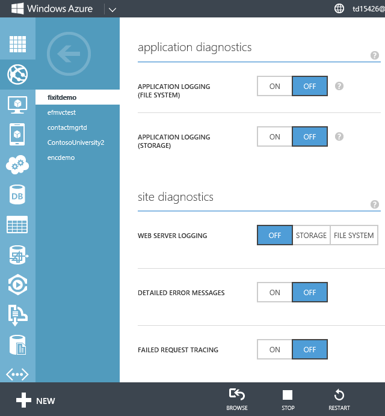

After you enable logging in Azure, you can see logs in the Visual Studio Output window as they are created.

You can also have logs written to your storage account and view them with any tool that can access the Azure Storage Table service, such as **Server Explorer** in Visual Studio or [Azure Storage Explorer](http://azurestorageexplorer.codeplex.com/).

## Summary

It's really simple to implement an out-of-the-box telemetry system, instrument logging in your own code, and configure logging in Azure. And when you have production issues, the combination of a telemetry system and custom logs will help you resolve problems quickly before they become major issues for your customers.

In the [next chapter](transient-fault-handling.md) we'll look at how to handle transient errors so they don't become production issues that you have to investigate.

## Resources

For more information, see the following resources.

Documentation mainly about telemetry:

- [Microsoft Patterns and Practices - Azure Guidance](https://msdn.microsoft.com/en-us/library/dn568099.aspx). See Instrumentation and Telemetry guidance, Service Metering  guidance, Health Endpoint Monitoring pattern, and Runtime Reconfiguration pattern.
- [Penny Pinching in the Cloud: Enabling New Relic Performance Monitoring on Azure Websites](http://www.hanselman.com/blog/PennyPinchingInTheCloudEnablingNewRelicPerformanceMonitoringOnWindowsAzureWebsites.aspx).
- [Best Practices for the Design of Large-Scale Services on Azure Cloud Services](https://msdn.microsoft.com/en-us/library/windowsazure/jj717232.aspx). White paper by Mark Simms and Michael Thomassy. See the Telemetry and Diagnostics section.
- [Next-Generation Development with Application Insights](https://msdn.microsoft.com/en-us/magazine/dn683794.aspx). MSDN Magazine article.

Documentation mainly about logging:

- [Semantic Logging Application Block (SLAB)](http://convective.wordpress.com/2013/08/12/semantic-logging-application-block-slab/). Neil Mackenzie presents the case for semantic logging with SLAB.
- [Creating Structured and Meaningful Logs with Semantic Logging](https://channel9.msdn.com/Events/Build/2013/3-336). (Video) Julian Dominguez presents the case for semantic logging with SLAB.
- [EF6 SQL Logging – Part 1: Simple Logging](http://blog.oneunicorn.com/2013/05/08/ef6-sql-logging-part-1-simple-logging/). Arthur Vickers shows how to log queries executed by Entity Framework in EF 6.
- [Connection Resiliency and Command Interception with the Entity Framework in an ASP.NET MVC Application](../../../../mvc/overview/getting-started/getting-started-with-ef-using-mvc/connection-resiliency-and-command-interception-with-the-entity-framework-in-an-asp-net-mvc-application.md). Fourth in a nine-part tutorial series, shows how to use the EF 6 command interception feature to log SQL commands sent to the database by Entity Framework.
- [Improve Logging using C# 5.0 Caller Info Attributes](http://www.dotnetcurry.com/showarticle.aspx?ID=972). How to easily log the name of the calling method without hard-coding it into literals or using reflection to get it manually.

Documentation mainly about troubleshooting:

- [Azure Troubleshooting &amp; Debugging blog](https://blogs.msdn.com/b/kwill/).
- [AzureTools – The Diagnostic Utility used by the Azure Developer Support Team](https://blogs.msdn.com/b/kwill/archive/2013/08/26/azuretools-the-diagnostic-utility-used-by-the-windows-azure-developer-support-team.aspx?Redirected=true). Introduces and provides a download link for a tool that can be used on an Azure VM to download and run a wide variety of diagnostic and monitoring tools. Useful when you need to diagnose an issue on a particular VM.
- [Troubleshoot a web app in Azure App Service using Visual Studio](https://www.windowsazure.com/en-us/develop/net/tutorials/troubleshoot-web-sites-in-visual-studio/). A step-by-step tutorial for getting started with System.Diagnostics tracing and remote debugging.

Videos:

- [FailSafe: Building Scalable, Resilient Cloud Services](https://channel9.msdn.com/Series/FailSafe). Nine-part series by Ulrich Homann, Marc Mercuri, and Mark Simms. Presents high-level concepts and architectural principles in a very accessible and interesting way, with stories drawn from Microsoft Customer Advisory Team (CAT) experience with actual customers. Episodes 4 and 9 are about monitoring and telemetry. Episode 9 includes an overview of monitoring services MetricsHub, AppDynamics, New Relic, and PagerDuty.
- [Building Big: Lessons learned from Azure customers - Part II](https://channel9.msdn.com/Events/Build/2012/3-030). Mark Simms talks about designing for failure and instrumenting everything. Similar to the Failsafe series but goes into more how-to details.

Code sample:

- [Cloud Service Fundamentals in Azure](https://code.msdn.microsoft.com/Cloud-Service-Fundamentals-4ca72649). Sample application created by the Microsoft Azure Customer Advisory Team. Demonstrates both telemetry and logging practices, as explained in the following articles. The sample implements application logging by using [NLog](http://nlog-project.org/). For related documentation, see the [series of four TechNet wiki articles about telemetry and logging](https://social.technet.microsoft.com/wiki/contents/articles/17987.cloud-service-fundamentals.aspx#Telemetry_coming_soon).

>[!div class="step-by-step"]
[Previous](design-to-survive-failures.md)
[Next](transient-fault-handling.md)