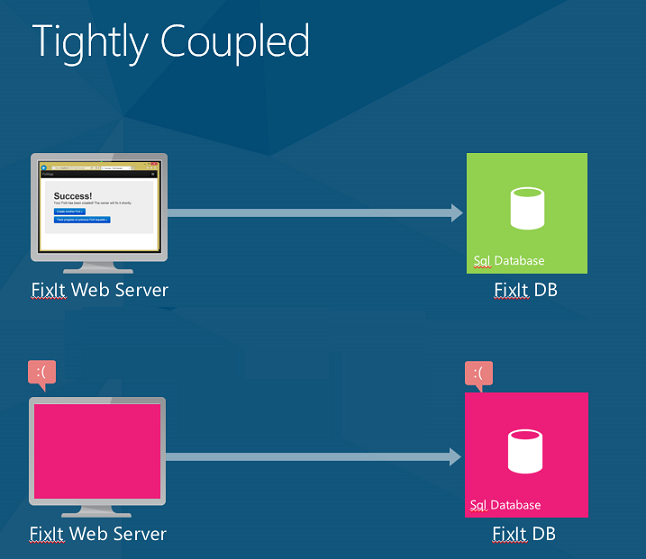
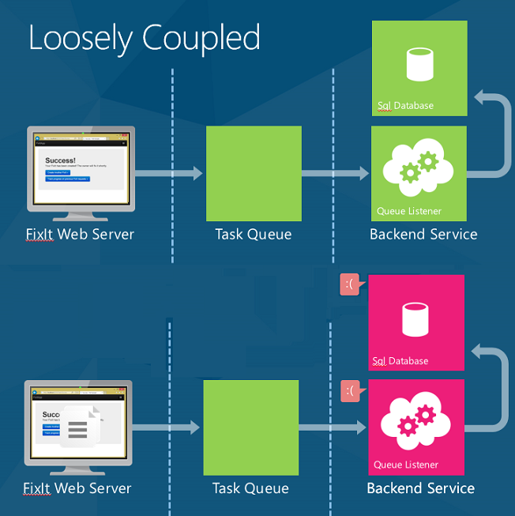
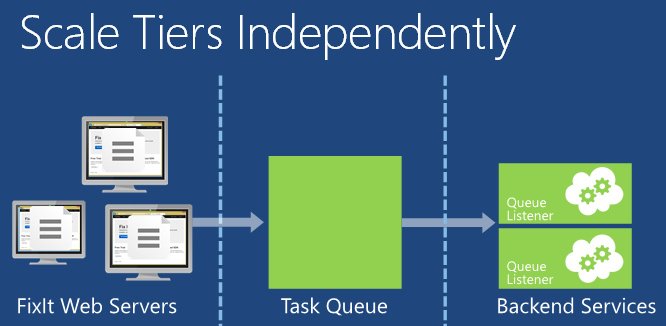
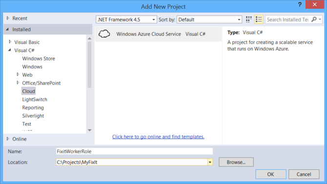
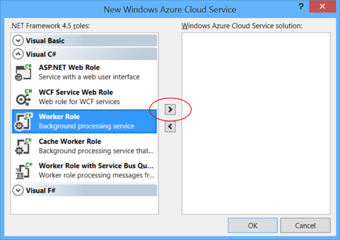
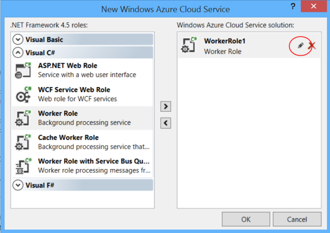
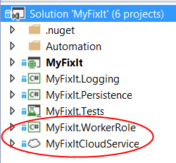

Queue-Centric Work Pattern (Building Real-World Cloud Apps with Azure)
====================
by [Mike Wasson](https://github.com/MikeWasson), [Rick Anderson](https://github.com/Rick-Anderson), [Tom Dykstra](https://github.com/tdykstra)

[Download Fix It Project](http://code.msdn.microsoft.com/Fix-It-app-for-Building-cdd80df4) or [Download E-book](http://blogs.msdn.com/b/microsoft_press/archive/2014/07/23/free-ebook-building-cloud-apps-with-microsoft-azure.aspx)

> The **Building Real World Cloud Apps with Azure** e-book is based on a presentation developed by Scott Guthrie. It explains 13 patterns and practices that can help you be successful developing web apps for the cloud. For information about the e-book, see [the first chapter](introduction.md).

Earlier, we saw that using multiple services can result in a "composite" SLA, where the app's effective SLA is the *product* of the individual SLAs. For example, the Fix It app uses Web Sites, Storage, and SQL Database. If any one of these services fails, the app will return an error to the user.

Caching is a good way to handle transient failures for read-only content. But what if your application needs to do work? For example, when the user submits a new Fix It task, the app can't just put the task into the cache. The app needs to write the Fix It task into a persistent data store, so it can be processed.

That's where the queue-centric work pattern comes in. This pattern enables loose coupling between a web tier and a backend service.

Here's how the pattern works. When the application gets a request, it puts a work item onto a queue and immediately returns the response. Then a separate backend process pulls work items from the queue and does the work.

The queue-centric work pattern is useful for:

- Work that is time consuming (high latency).
- Work that requires an external service that might not always be available.
- Work that is resource-intensive (high CPU).
- Work that would benefit from rate leveling (subject to sudden load bursts).

## Reduced Latency

Queues are useful any time you are doing time-consuming work. If a task takes a few seconds or longer, instead of blocking the end user, put the work item into a queue. Tell the user "We're working on it," and then use a queue listener to process the task in the background.

For example, when you purchase something at an online retailer, the web site confirms your order immediately. But that doesn't mean your stuff is already in a truck being delivered. They put a task in a queue, and in the background they are doing the credit check, preparing your items for shipping, and so forth.

For scenarios with short latency, the total end-to-end time might be longer using a queue, compared with doing the task synchronously. But even then, the other benefits can outweigh that disadvantage.

## Increased Reliability

In the version of Fix It that we've been looking at so far, the web front-end is tightly coupled with the SQL Database back-end. If the SQL database service is unavailable, the user gets an error. If retries don't work (that is, the failure is more than transient), the only thing you can do is show an error and ask the user to try again later.

Using queues, when a user submits a Fix It task, the app writes a message to the queue. The message payload is a [JSON](http://json.org/) representation of the task. As soon as the message is written to the queue, the app returns and immediately shows a success message to the user.

If any of the backend services – such as the SQL database or the queue listener -- go offline, users can still submit new Fix It tasks. The messages will just queue up until the backend services are available again. At that point, the backend services will catch up on the backlog.

Moreover, now you can add more backend logic without worrying about the resiliency of the front end. For example, you might want to send an email or SMS message to the owner whenever a new Fix It is assigned. If the email or SMS service becomes unavailable, you can process everything else, and then put a message into a separate queue for sending email/SMS messages.

Previously, our effective SLA was Web Apps &times; Storage &times; SQL Database = 99.7%. (See [Design to Survive Failures](design-to-survive-failures.md).)

When we change the app to use a queue, the web front end depends only on Web Apps and Storage, for a composite SLA of 99.8%. (Note that queues are part of the Azure storage service, so they are included in the same SLA as blob storage.)

If you need even better than 99.8%, you can create two queues in two different regions. Designate one as the primary, and the other as the secondary. In your app, fail over to the secondary queue if the primary queue is not available. The chance of both being unavailable at the same time is very small.

## Rate Leveling and Independent Scaling

Queues are also useful for something called *rate leveling* or *load leveling*.

Web apps are often susceptible to sudden bursts in traffic. While you can use autoscaling to automatically add web servers to handle increased web traffic, autoscaling might not be able to react quickly enough to handle abrupt spikes in load. If the web servers can offload some of the work they have to do by writing a message to a queue, they can handle more traffic. A backend service can then read messages from the queue and process them. The depth of the queue will grow or shrink as the incoming load varies.

With much of its time-consuming work off-loaded to a backend service, the web tier can more easily respond to sudden spikes in traffic. And you save money because any given amount of traffic can be handled by fewer web servers.

You can scale the web tier and backend service independently. For example, you might need three web servers but only one server processing queue messages. Or if you're running a compute-intensive task in the background, you might need more backend servers.

Autoscaling works with backend services as well as with the web tier. You can scale up or scale down the number of VMs that are processing the tasks in the queue, based on the CPU usage of the backend VMs. Or, you can autoscale based on how many items are in a queue. For example, you can tell autoscale to try to keep no more than 10 items in the queue. If the queue has more than 10 items, autoscale will add VMs. When they catch up, autoscale will tear down the extra VMs.

## Adding Queues to the Fix It Application

To implement the queue pattern, we need to make two changes to the Fix It app.

- When a user submits a new Fix It task, put the task in the queue, instead of writing it to the database.
- Create a back-end service that processes messages in the queue.

For the queue, we'll use the [Azure Queue Storage Service](https://www.windowsazure.com/en-us/develop/net/how-to-guides/queue-service/). Another option is to use [Azure Service Bus](https://www.windowsazure.com/en-us/documentation/services/service-bus/).

To decide which queue service to use, consider how your app needs to send and receive the messages in the queue:

- If you have cooperating producers and competing consumers, consider using Azure Queue Storage Service. "Cooperating producers" means multiple processes are adding messages to a queue. "Competing consumers" means multiple processes are pulling messages off the queue to process them, but any given message can only be processed by one "consumer." If you need more throughput than you can get with a single queue, use additional queues and/or additional storage accounts.
- If you need a [publish/subscribe model](http://en.wikipedia.org/wiki/Publish/subscribe), consider using Azure Service Bus Queues.

The Fix It app fits the cooperating producers and competing consumers model.

Another consideration is application availability. The Queue Storage Service is part of the same service that we're using for blob storage, so using it has no effect on our SLA. Azure Service Bus is a separate service with its own SLA. If we used Service Bus Queues, we would have to factor in an additional SLA percentage, and our composite SLA would be lower. When you're choosing a queue service, make sure you understand the impact of your choice on application availability. For more information, see the [Resources](#resources) section.

## Creating Queue Messages

To put a Fix It task on the queue, the web front end performs the following steps:

1. Create a [CloudQueueClient](https://msdn.microsoft.com/en-us/library/microsoft.windowsazure.storage.queue.cloudqueueclient.aspx) instance. The `CloudQueueClient` instance is used to execute requests against the Queue Service.
2. Create the queue, if it doesn't exist yet.
3. Serialize the Fix It task.
4. Call [CloudQueue.AddMessageAsync](https://msdn.microsoft.com/en-us/library/microsoft.windowsazure.storage.queue.cloudqueue.addmessageasync.aspx) to put the message onto the queue.

We'll do this work in the constructor and `SendMessageAsync` method of a new `FixItQueueManager` class.

[!code-csharp[Main](queue-centric-work-pattern/samples/sample1.cs?highlight=11-12,16,18-25)]

Here we are using the [Json.NET](http://json.codeplex.com/) library to serialize the fixit to JSON format. You can use whatever serialization approach you prefer. JSON has the advantage of being human-readable, while being less verbose than XML.

Production-quality code would add error handling logic, pause if the database became unavailable, handle recovery more cleanly, create the queue on application start-up, and manage "[poison" messages](https://msdn.microsoft.com/en-us/library/ms789028(v=vs.110).aspx). (A poison message is a message that cannot be processed for some reason. You don't want poison messages to sit in the queue, where the worker role will continually try to process them, fail, try again, fail, and so on.)

In the front-end MVC application, we need to update the code that creates a new task. Instead of putting the task into the repository, call the `SendMessageAsync` method shown above.

[!code-csharp[Main](queue-centric-work-pattern/samples/sample2.cs?highlight=10)]

## Processing Queue Messages

To process messages in the queue, we'll create a backend service. The backend service will run an infinite loop that performs the following steps:

1. Get the next message from the queue.
2. Deserialize the message to a Fix It task.
3. Write the Fix It task to the database.

To host the backend service, we'll create an Azure Cloud Service that contains a *worker role*. A worker role consists of one or more VMs that can do backend processing. The code that runs in these VMs will pull messages from the queue as they become available. For each message, we'll deserialize the JSON payload and write an instance of the Fix It Task entity to the database, using the same repository that we used earlier in the web tier.

The following steps show how to add a worker role project to a solution that has a standard web project. These steps have already been done in the Fix It project that you can download.

First add a Cloud Service project to the Visual Studio solution. Right-click the solution and select **Add**, then **New Project**. In the left pane, expand **Visual C#** and select **Cloud**.

In the **New Azure Cloud Service** dialog, expand the **Visual C#** node on the left pane. Select **Worker Role** and click the right-arrow icon.

(Notice that you can also add a *web role*. We could run the Fix It front-end in the same Cloud Service instead of running it in an Azure Web Site. That has some advantages in making connections between front-end and back-end easier to coordinate. However, to keep this demo simple, we're keeping the front-end in an Azure App Service Web App and only running the back-end in a Cloud Service.)

A default name is assigned to the worker role. To change the name, hover the mouse over the worker role in the right pane, then click the pencil icon.

Click **OK** to complete the dialog. This adds two projects to the Visual Studio solution.

- an Azure project that defines the cloud service, including configuration information.
- A worker role project that defines the worker role.

For more information, see [Creating an Azure Project with Visual Studio.](https://msdn.microsoft.com/en-us/library/windowsazure/ee405487.aspx)

Inside the worker role, we poll for messages by calling the `ProcessMessageAsync` method of the `FixItQueueManager` class that we saw earlier.

[!code-csharp[Main](queue-centric-work-pattern/samples/sample3.cs?highlight=25)]

The `ProcessMessagesAsync` method checks if there's a message waiting. If there is one, it deserializes the message into a `FixItTask` entity and saves the entity in the database. It loops until the queue is empty.

[!code-csharp[Main](queue-centric-work-pattern/samples/sample4.cs)]

Polling for queue messages incurs a small transaction charge, so when there's no message waiting to be processed, the worker role's `RunAsync` method waits a second before polling again by calling `Task.Delay(1000)`.

In a web project, adding asynchronous code can automatically improve performance because IIS manages a limited thread pool. That is not the case in a worker role project. To improve scalability of the worker role, you can write multi-threaded code or use asynchronous code to implement [parallel programming](https://msdn.microsoft.com/en-us/library/ff963553.aspx). The sample doesn't implement parallel programming but shows how to make the code asynchronous so you can implement parallel programming.

## Summary

In this chapter you've seen how to improve application responsiveness, reliability, and scalability by implementing the queue-centric work pattern.

This is the last of the 13 patterns covered in this e-book, but there are of course many other patterns and practices that can help you build successful cloud apps. The [final chapter](more-patterns-and-guidance.md) provides links to resources for topics that haven't been covered in these 13 patterns.

## Resources

For more information about queues, see the following resources.

Documentation:

- [Microsoft Azure Storage Queues Part 1: Getting Started](http://justazure.com/microsoft-azure-storage-queues-part-1-getting-started/). Article by Roman Schacherl.
- [Executing Background Tasks](https://msdn.microsoft.com/en-us/library/ff803365.aspx), chapter 5 of [Moving Applications to the Cloud, 3rd Edition](https://msdn.microsoft.com/en-us/library/ff728592.aspx) from Microsoft Patterns and Practices. (In particular, the section ["Using Azure Storage Queues"](https://msdn.microsoft.com/en-us/library/ff803365.aspx#sec7).)
- [Best Practices for Maximizing Scalability and Cost Effectiveness of Queue-Based Messaging Solutions on Azure](https://msdn.microsoft.com/en-us/library/windowsazure/hh697709.aspx). White paper by Valery Mizonov.
- [Comparing Azure Queues and Service Bus Queues](https://msdn.microsoft.com/en-us/magazine/jj159884.aspx). MSDN Magazine article, provides additional information that can help you choose which queue service to use. The article mentions that Service Bus is dependent on ACS for authentication, which means your SB queues would be unavailable when ACS is unavailable. However, since the article was written, SB was changed to enable you to use [SAS tokens](https://msdn.microsoft.com/en-us/library/windowsazure/dn170477.aspx) as an alternative to ACS.
- [Microsoft Patterns and Practices - Azure Guidance](https://msdn.microsoft.com/en-us/library/dn568099.aspx). See Asynchronous Messaging primer, Pipes and Filters pattern, Compensating Transaction pattern, Competing Consumers pattern, CQRS pattern.
- [CQRS Journey](https://msdn.microsoft.com/en-us/library/jj554200). E-book about CQRS by Microsoft Patterns and Practices.

Video:

- [FailSafe: Building Scalable, Resilient Cloud Services](https://channel9.msdn.com/Series/FailSafe). Nine-part video series by Ulrich Homann, Marc Mercuri, and Mark Simms. Presents high-level concepts and architectural principles in a very accessible and interesting way, with stories drawn from Microsoft Customer Advisory Team (CAT) experience with actual customers. For an introduction to the Azure Storage service and queues, see episode 5 starting at 35:13.

>[!div class="step-by-step"]
[Previous](distributed-caching.md)
[Next](more-patterns-and-guidance.md)