Single Sign-On (Building Real-World Cloud Apps with Azure)
====================
by [Mike Wasson](https://github.com/MikeWasson), [Rick Anderson](https://github.com/Rick-Anderson), [Tom Dykstra](https://github.com/tdykstra)

[Download Fix It Project](http://code.msdn.microsoft.com/Fix-It-app-for-Building-cdd80df4) or [Download E-book](http://blogs.msdn.com/b/microsoft_press/archive/2014/07/23/free-ebook-building-cloud-apps-with-microsoft-azure.aspx)

> The **Building Real World Cloud Apps with Azure** e-book is based on a presentation developed by Scott Guthrie. It explains 13 patterns and practices that can help you be successful developing web apps for the cloud. For information about the e-book, see [the first chapter](introduction.md).

There are many security issues to think about when you're developing a cloud app, but for this series we'll focus on just one: single sign-on. A question people often ask is this: "I'm primarily building apps for the employees of my company; how do I host these apps in the cloud and still enable them to use the same security model that my employees know and use in the on-premises environment when they're running apps that are hosted inside the firewall?" One of the ways we enable this scenario is called Azure Active Directory (Azure AD). Azure AD enables you to make enterprise line-of-business (LOB) apps available over the Internet, and it enables you to make these apps available to business partners as well.

## Introduction to Azure AD

[Azure AD](https://www.windowsazure.com/en-us/documentation/services/active-directory/) provides [Active Directory](https://msdn.microsoft.com/en-us/library/windows/desktop/aa746492.aspx) in the cloud. Key features include the following:

- It integrates with on-premises Active Directory.
- It enables single sign-on with your apps.
- It supports open standards such as [SAML](http://en.wikipedia.org/wiki/SAML_2.0), [WS-Fed](http://en.wikipedia.org/wiki/WS-Federation), and [OAuth 2.0](http://oauth.net/2/).
- It supports Enterprise [Graph REST API](https://msdn.microsoft.com/en-us/library/hh974476.aspx).

Suppose you have an on-premises Windows Server Active Directory environment that you use to enable employees to sign on to Intranet apps:

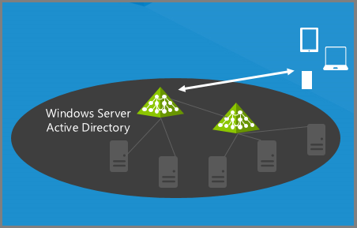

What Azure AD enables you to do is create a directory in the cloud. It's a free feature and easy to set up.

It can be entirely independent from your on-premises Active Directory; you can put anyone you want in it and authenticate them in Internet apps.

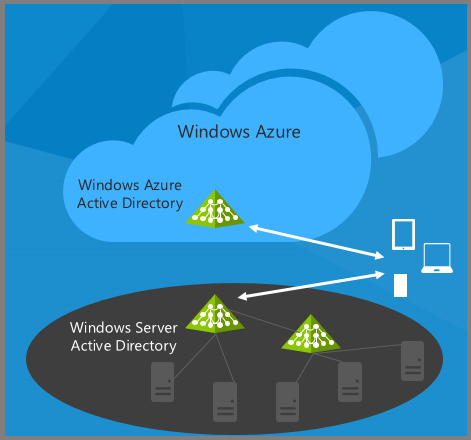

Or you can integrate it with your on-premises AD.

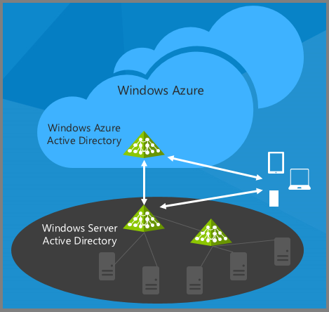

Now all the employees who can authenticate on-premises can also authenticate over the Internet – without you having to open up a firewall or deploy any new servers in your data center. You can continue to leverage all the existing Active Directory environment that you know and use today to give your internal apps single-sign on capability.

Once you've made this connection between AD and Azure AD, you can also enable your web apps and your mobile devices to authenticate your employees in the cloud, and you can enable third-party apps, such as Office 365, SalesForce.com, or Google apps, to accept your employees' credentials. If you're using Office 365, you're already set up with Azure AD because Office 365 uses Azure AD for authentication and authorization.

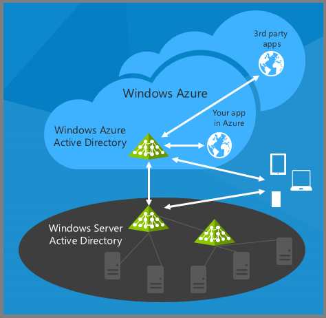

The beauty of this approach is that any time your organization adds or deletes a user, or a user changes a password, you use the same process that you use today in your on-premises environment. All of your on-premises AD changes are automatically propagated to the cloud environment.

If your company is using or moving to Office 365, the good news is that you'll have Azure AD set up automatically because Office 365 uses Azure AD for authentication. So you can easily use in your own apps the same authentication that Office 365 uses.

## Set up an Azure AD tenant

an Azure AD directory is called an Azure AD [tenant](https://technet.microsoft.com/en-us/library/jj573650.aspx), and setting up a tenant is pretty easy. We'll show you how it's done in the Azure Management Portal in order to illustrate the concepts, but of course like the other portal functions you can also do it by using a script or management API.

In the management portal click the Active Directory tab.

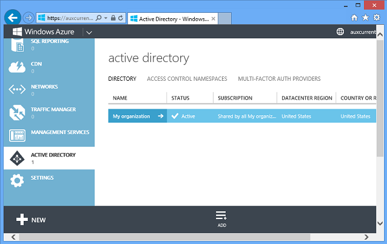

You automatically have one Azure AD tenant for your Azure account, and you can click the **Add** button at the bottom of the page to create additional directories. You might want one for a test environment and one for production, for example. Think carefully about what you name a new directory. If you use your name for the directory and then you use your name again for one of the users, that can be confusing.

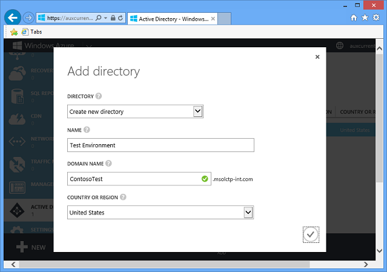

The portal has full support for creating, deleting, and managing users within this environment. For example, to add a user go to the **Users** tab and click the **Add User** button.

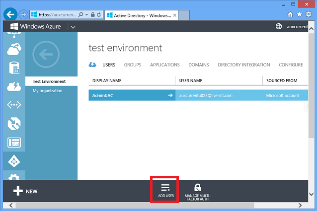

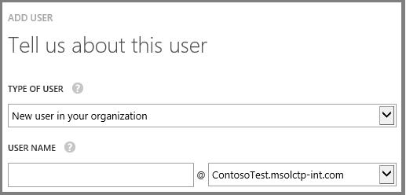

You can create a new user who exists only in this directory, or you can register a Microsoft Account as a user in this directory, or register or a user from another Azure AD directory as a user in this directory. (In a real directory, the default domain would be ContosoTest.onmicrosoft.com. You can also use a domain of your own choosing, like contoso.com.)

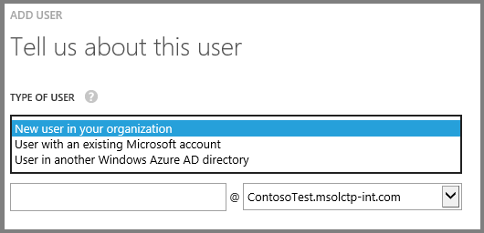

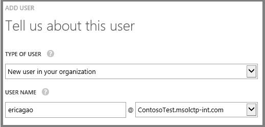

You can assign the user to a role.

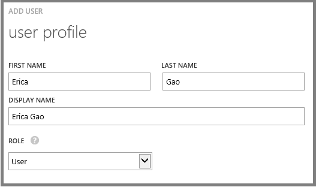

And the account is created with a temporary password.

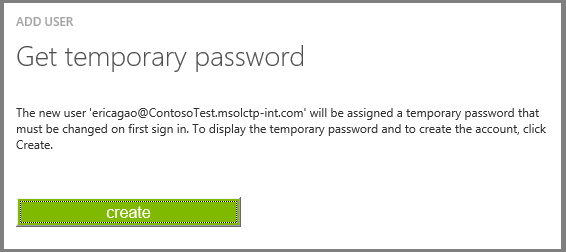

The users you create this way can immediately log in to your web apps using this cloud directory.

What's great for enterprise single sign-on, though, is the **Directory Integration** tab:

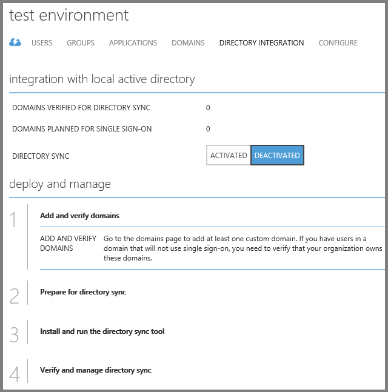

If you enable directory integration, and [download a tool](https://social.technet.microsoft.com/wiki/contents/articles/19098.howto-install-the-windows-azure-active-directory-sync-tool-now-with-pictures.aspx), you can sync this cloud directory with your existing on-premises Active Directory that you're already using inside your organization. Then all of the users stored in your directory will show up in this cloud directory. Your cloud apps can now authenticate all of your employees using their existing Active Directory credentials. And all this is free – both the sync tool and Azure AD itself.

The tool is a wizard that is easy to use, as you can see from these screen shots. These are not complete instructions, just an example showing you the basic process. For more detailed how-to-do-it information, see the links in the [Resources](#resources) section at the end of the chapter.

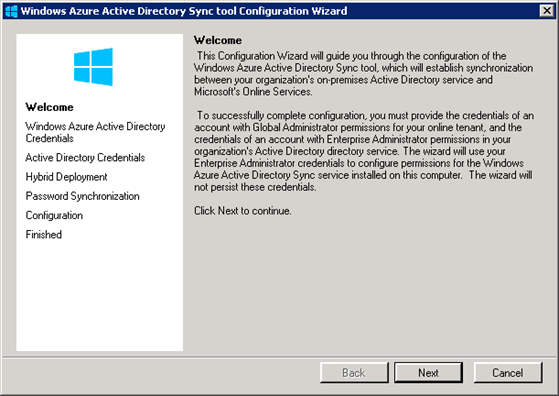

Click **Next**, and then enter your Azure Active Directory credentials.

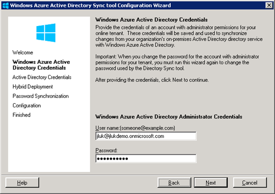

Click **Next**, and then enter your on-premises AD credentials.

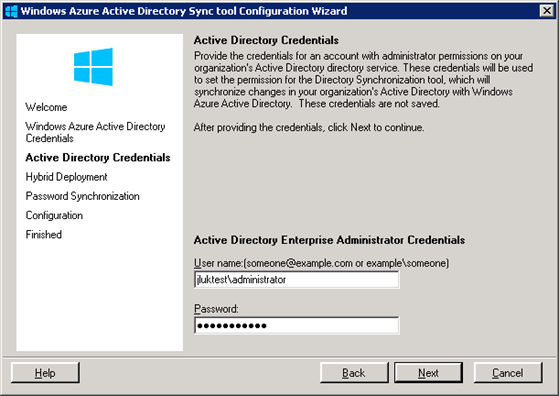

Click **Next**, and then indicate if you want to store a hash of your AD passwords in the cloud.

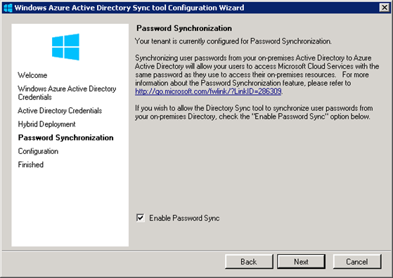

The password hash that you can store in the cloud is a one-way hash; actual passwords are never stored in Azure AD. If you decide against storing hashes in the cloud, you'll have to use [Active Directory Federation Services](https://technet.microsoft.com/en-us/library/hh831502.aspx) (ADFS). There are also [other factors to consider when choosing whether or not to use ADFS](https://technet.microsoft.com/en-us/library/jj573653.aspx). The ADFS option requires a few additional configuration steps.

If you choose to store hashes in the cloud, you're done, and the tool starts synchronizing directories when you click **Next**.

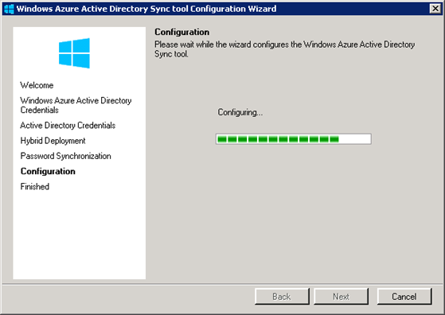

And in a few minutes you're done.

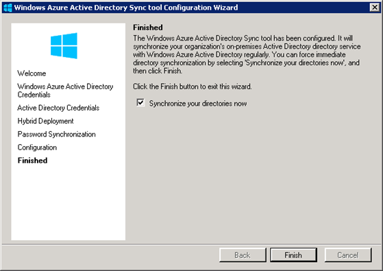

You only have to run this on one domain controller in the organization, on Windows 2003 or higher. And no need to reboot. When you're done, all of your users are in the cloud and you can do single sign-on from any web or mobile application, using SAML, OAuth, or WS-Fed.

Sometimes we get asked about how secure this is – does Microsoft use it for their own sensitive business data? And the answer is yes we do. For example, if you go to the internal Microsoft SharePoint site at [https://microsoft.sharepoint.com/](https://microsoft.sharepoint.com/), you get prompted to log in.

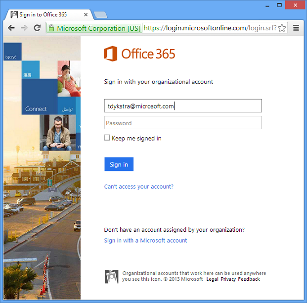

Microsoft has enabled ADFS, so when you enter a Microsoft ID, you get redirected to an ADFS log-in page.

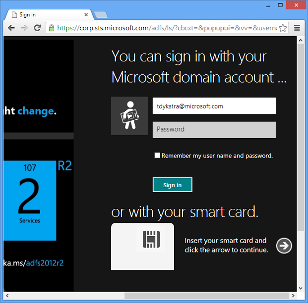

And once you enter credentials stored in an internal Microsoft AD account, you have access to this internal application.

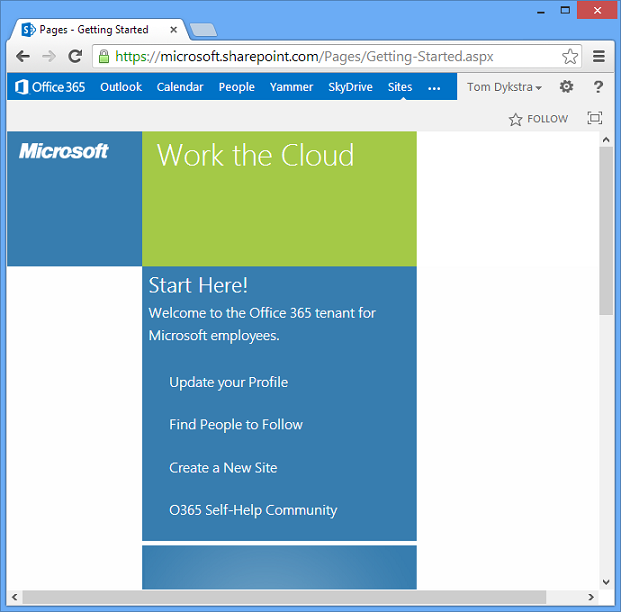

We're using an AD sign-in server mainly because we already had ADFS set up before Azure AD became available, but the log-in process is going through an Azure AD directory in the cloud. We put our important documents, source control, performance management files, sales reports, and more, in the cloud and are using this exact same solution to secure them.

## Create an ASP.NET app that uses Azure AD for single sign-on

Visual Studio makes it really easy to create an app that uses Azure AD for single sign-on, as you can see from a few screen shots.

When you create a new ASP.NET application, either MVC or Web Forms, the default authentication method is ASP.NET Identity. To change that to Azure AD, you click a **Change Authentication** button.

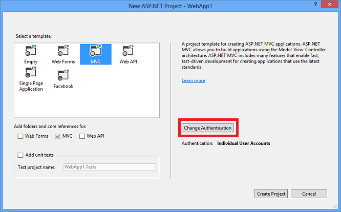

Select Organizational Accounts, enter your domain name, and then select Single Sign On.

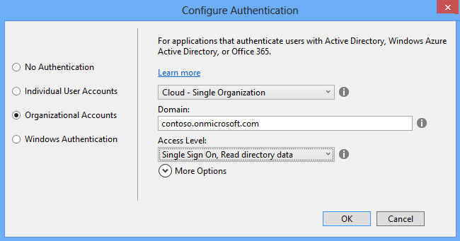

You can also give the app read or read/write permission for directory data. If you do that, it can use the [Azure Graph REST API](https://msdn.microsoft.com/en-us/library/windowsazure/hh974476.aspx) to look up users' phone number, find out if they're in the office, when they last logged on, etc.

That's all you have to do - Visual Studio asks for the credentials for an administrator for your Azure AD tenant, and then it configures both your project and your Azure AD tenant for the new application.

When you run the project, you'll see a sign-in page, and you can sign in with credentials of a user in your Azure AD directory.

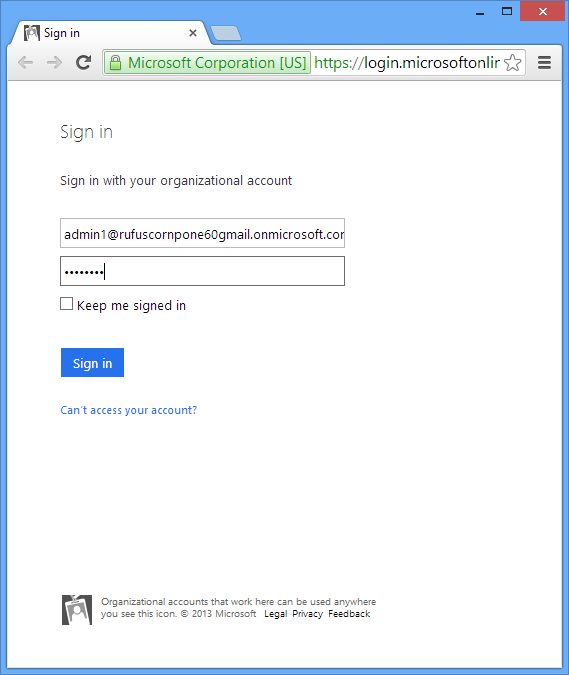

When you deploy the app to Azure, all you have to do is select an **Enable Organizational Authentication** check box, and once again Visual Studio takes care of all the configuration for you.

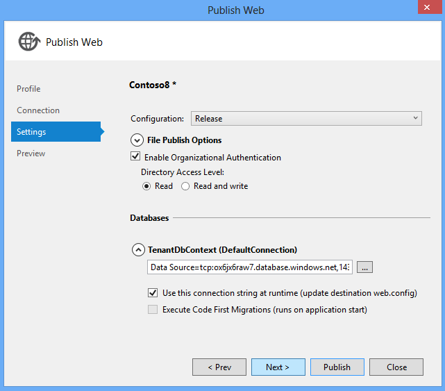

These screen shots come from a complete step-by-step tutorial that shows how to build an app that uses Azure AD authentication: [Developing ASP.NET Apps with Azure Active Directory](../../../../identity/overview/getting-started/developing-aspnet-apps-with-windows-azure-active-directory.md).

## Summary

In this chapter you saw that Azure Active Directory, Visual Studio, and ASP.NET, make it easy to set up single sign-on in Internet applications for your organization's users. Your users can sign on in Internet apps using the same credentials they use to sign on using Active Directory in your internal network.

The [next chapter](data-storage-options.md) looks at the data storage options available for a cloud app.

## Resources

For more information, see the following resources:

- [Azure Active Directory Documentation](https://www.windowsazure.com/en-us/documentation/services/active-directory/). Portal page for Azure AD documentation on the windowsazure.com site. For step by step tutorials, see the **Develop** section.
- [Azure Multi-Factor Authentication](https://www.windowsazure.com/en-us/documentation/services/multi-factor-authentication/). Portal page for documentation about multi-factor authentication in Azure.
- [Organizational account authentication options](../../../../visual-studio/overview/2013/creating-web-projects-in-visual-studio.md#orgauthoptions). Explanation of the Azure AD authentication options in the Visual Studio 2013 new-project dialog.
- [Microsoft Patterns and Practices - Federated Identity Pattern](https://msdn.microsoft.com/en-us/library/dn589790.aspx).
- [HowTo: Install the Azure Active Directory Sync Tool](https://social.technet.microsoft.com/wiki/contents/articles/19098.howto-install-the-windows-azure-active-directory-sync-tool-now-with-pictures.aspx).
- [Active Directory Federation Services 2.0 Content Map](https://social.technet.microsoft.com/wiki/contents/articles/2735.ad-fs-2-0-content-map.aspx). Links to documentation about ADFS 2.0.
- [Role-Based and ACL-Based Authorization in a Windows Azure AD Application](https://code.msdn.microsoft.com/Role-Based-and-ACL-Based-86ad71a1). Sample application.
- [Azure Active Directory Graph API blog](https://blogs.msdn.com/b/aadgraphteam/).
- [Access Control in BYOD and Directory Integration in a Hybrid Identity Infrastructure](https://channel9.msdn.com/Events/TechEd/NorthAmerica/2014/PCIT-B213#fbid=). Tech Ed 2014 session video by Gayana Bagdasaryan.

>[!div class="step-by-step"]
[Previous](web-development-best-practices.md)
[Next](data-storage-options.md)