Source Control (Building Real-World Cloud Apps with Azure)
====================
by [Mike Wasson](https://github.com/MikeWasson), [Rick Anderson](https://github.com/Rick-Anderson), [Tom Dykstra](https://github.com/tdykstra)

[Download Fix It Project](http://code.msdn.microsoft.com/Fix-It-app-for-Building-cdd80df4) or [Download E-book](http://blogs.msdn.com/b/microsoft_press/archive/2014/07/23/free-ebook-building-cloud-apps-with-microsoft-azure.aspx)

> The **Building Real World Cloud Apps with Azure** e-book is based on a presentation developed by Scott Guthrie. It explains 13 patterns and practices that can help you be successful developing web apps for the cloud. For information about the e-book, see [the first chapter](introduction.md).

Source control is essential for all cloud development projects, not just team environments. You wouldn't think of editing source code or even a Word document without an undo function and automatic backups, and source control gives you those functions at a project level where they can save even more time when something goes wrong. With cloud source control services, you no longer have to worry about complicated set-up, and you can use Visual Studio Online source control free for up to 5 users.

The first part of this chapter explains three key best practices to keep in mind:

- [Treat automation scripts as source code](#scripts) and version them together with your application code.
- [Never check in secrets](#secrets) (sensitive data such as credentials) into a source code repository.
- [Set up source branches](#devops) to enable the DevOps workflow.

The remainder of the chapter gives some sample implementations of these patterns in Visual Studio, Azure, and Visual Studio Online:

- [Add scripts to source control in Visual Studio](#vsscripts)
- [Store sensitive data in Azure](#appsettings)
- [Use Git in Visual Studio and Visual Studio Online](#gittfs)

## Treat automation scripts as source code

When you're working on a cloud project you're changing things frequently and you want to be able to react quickly to issues reported by your customers. Responding quickly involves using automation scripts, as explained in the [Automate Everything](automate-everything.md) chapter. All of the scripts that you use to create your environment, deploy to it, scale it, etc., need to be in sync with your application source code.

To keep scripts in sync with code, store them in your source control system. Then if you ever need to roll back changes or make a quick fix to production code which is different from development code, you don't have to waste time trying to track down which settings have changed or which team members have copies of the version you need. You're assured that the scripts you need are in sync with the code base that you need them for, and you're assured that all team members are working with the same scripts. Then whether you need to automate testing and deployment of a hot fix to production or new feature development, you'll have the right script for the code that needs to be updated.

## Don't check in secrets

A source code repository is typically accessible to too many people for it to be an appropriately secure place for sensitive data such as passwords. If scripts rely on secrets such as passwords, parameterize those settings so that they don't get saved in source code, and store your secrets somewhere else.

For example, Azure lets you download files that contain publish settings in order to automate the creation of publish profiles. These files include user names and passwords that are authorized to manage your Azure services. If you use this method to create publish profiles, and if you check in these files to source control, anyone with access to your repository can see those user names and passwords. You can safely store the password in the publish profile itself because it's encrypted and it's in a *.pubxml.user* file that by default is not included in source control.

## Structure source branches to facilitate DevOps workflow

How you implement branches in your repository affects your ability to both develop new features and fix issues in production. Here is a pattern that a lot of medium sized teams use:

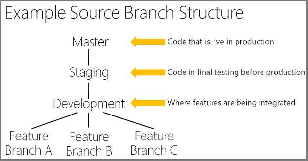

The master branch always matches code that is in production. Branches underneath master correspond to different stages in the development life cycle. The development branch is where you implement new features. For a small team you might just have master and development, but we often recommend that people have a staging branch between development and master. You can use staging for final integration testing before an update is moved to production.

For big teams there may be separate branches for each new feature; for a smaller team you might have everyone checking in to the development branch.

If you have a branch for each feature, when Feature A is ready you merge its source code changes up into the development branch and down into the other feature branches. This source code merging process can be time-consuming, and to avoid that work while still keeping features separate, some teams implement an alternative called *[feature toggles](http://en.wikipedia.org/wiki/Feature_toggle)* (also known as *feature flags*). This means all of the code for all of the features is in the same branch, but you enable or disable each feature by using switches in the code. For example, suppose Feature A is a new field for Fix It app tasks, and Feature B adds caching functionality. The code for both features can be in the development branch, but the app will only display the new field when a variable is set to true, and it will only use caching when a different variable is set to true. If Feature A isn't ready to be promoted but the Feature B is ready, you can promote all of the code to Production with the Feature A switch off and the Feature B switch on. You can then finish Feature A and promote it later, all with no source code merging.

Whether or not you use branches or toggles for features, a branching structure like this enables you to flow your code from development into production in an agile and repeatable way.

This structure also enables you to react quickly to customer feedback. If you need to make a quick fix to production, you can also do that efficiently in an agile way. You can create a branch off of master or staging, and when it's ready merge it up into master and down into development and feature branches.

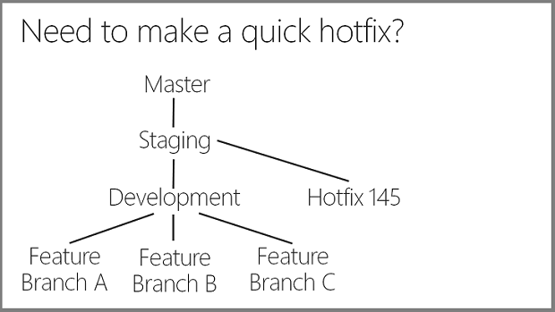

Without a branching structure like this with its separation of production and development branches, a production problem could put you in the position of having to promote new feature code along with your production fix. The new feature code might not be fully tested and ready for production and you might have to do a lot of work backing out changes that aren't ready. Or you might have to delay your fix in order to test changes and get them ready to deploy.

Next you'll see examples of how to implement these three patterns in Visual Studio, Azure, and Visual Studio Online. These are examples rather than detailed step-by-step how-to-do-it instructions; for detailed instructions that provide all of the context necessary, see the [Resources](#resources) section at the end of the chapter.

## Add scripts to source control in Visual Studio

You can add scripts to source control in Visual Studio by including them in a Visual Studio solution folder (assuming your project is in source control). Here's one way to do it.

Create a folder for the scripts in your solution folder (the same folder that has your *.sln* file).

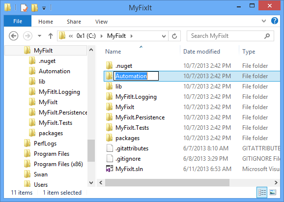

Copy the script files into the folder.

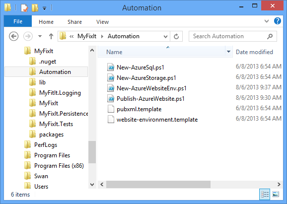

In Visual Studio, add a solution folder to the project.

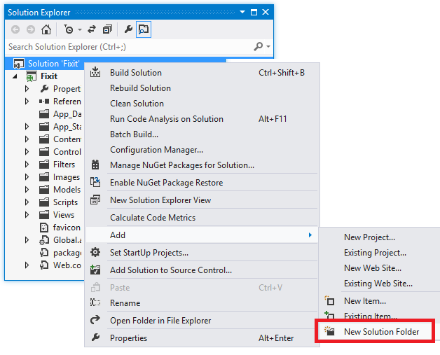

And add the script files to the solution folder.

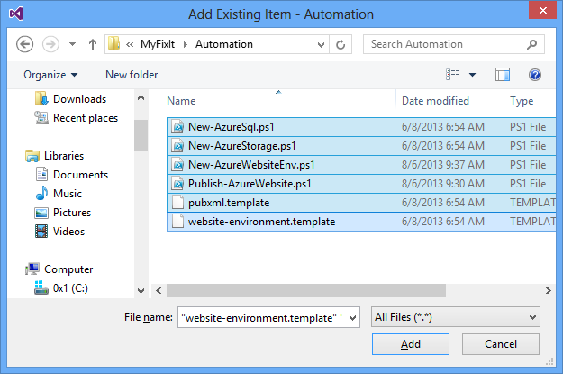

The script files are now included in your project and source control is tracking their version changes along with corresponding source code changes.

## Store sensitive data in Azure

If you run your application in an Azure Web Site, one way to avoid storing credentials in source control is to store them in Azure instead.

For example, the Fix It application stores in its Web.config file two connection strings that will have passwords in production and a key that gives access to your Azure storage account.

[!code-xml[Main](source-control/samples/sample1.xml?highlight=2-3,11)]

If you put actual production values for these settings in your *Web.config* file, or if you put them in the *Web.Release.config* file to configure a Web.config transform to insert them during deployment, they'll be stored in the source repository. If you enter the database connection strings into the production publish profile, the password will be in your *.pubxml* file. (You could exclude the *.pubxml* file from source control, but then you lose the benefit of sharing all the other deployment settings.)

Azure gives you an alternative for the **appSettings** and connection strings sections of the *Web.config* file. Here is the relevant part of the **Configuration** tab for a web site in the Azure management portal:

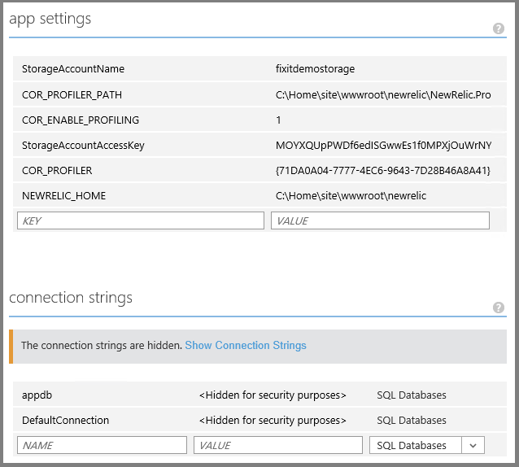

When you deploy a project to this web site and the application runs, whatever values you have stored in Azure override whatever values are in the Web.config file.

You can set these values in Azure by using either the management portal or scripts. The environment creation automation script you saw in the [Automate Everything](automate-everything.md) chapter creates an Azure SQL Database, gets the storage and SQL Database connection strings, and stores these secrets in the settings for your web site.

[!code-powershell[Main](source-control/samples/sample2.ps1)]

[!code-powershell[Main](source-control/samples/sample3.ps1)]

Notice that the scripts are parameterized so that actual values don't get persisted to the source repository.

When you run locally in your development environment, the app reads your local Web.config file and your connection string points to a LocalDB SQL Server database in the *App\_Data* folder of your web project. When you run the app in Azure and the app tries to read these values from the Web.config file, what it gets back and uses are the values stored for the Web Site, not what's actually in Web.config file.

## Use Git in Visual Studio and Visual Studio Online

You can use any source control environment to implement the DevOps branching structure presented earlier. For distributed teams a [distributed version control system](http://en.wikipedia.org/wiki/Distributed_revision_control) (DVCS) might work best; for other teams a [centralized system](http://en.wikipedia.org/wiki/Revision_control) might work better.

[Git](http://git-scm.com/) is a DVCS that is has become very popular. When you use Git for source control, you have a complete copy of the repository with all of its history on your local computer. Many people prefer that because it's easier to continue working when you're not connected to the network -- you can continue to do commits and rollbacks, create and switch branches, and so forth. Even when you're connected to the network, it's easier and quicker to create branches and switch branches when everything is local. You can also do local commits and rollbacks without having an impact on other developers. And you can batch commits before sending them to the server.

[Microsoft Visual Studio Online](https://www.visualstudio.com/)(VSO), formerly known as Team Foundation Service, offers both Git and [Team Foundation Version Control](https://msdn.microsoft.com/en-us/library/ms181237(v=vs.120).aspx) (TFVC; centralized source control). Here at Microsoft in the Azure group some teams use centralized source control, some use distributed, and some use a mix (centralized for some projects and distributed for other projects). The VSO service is free for up to 5 users. You can sign up for a free plan [here](https://go.microsoft.com/fwlink/?LinkId=307137).

Visual Studio 2013 includes built-in first-class [Git support](https://msdn.microsoft.com/en-us/library/hh850437.aspx); here's a quick demo of how that works.

With a project open in Visual Studio 2013, right-click the solution in **Solution Explorer**, and choose **Add Solution to Source Control**.

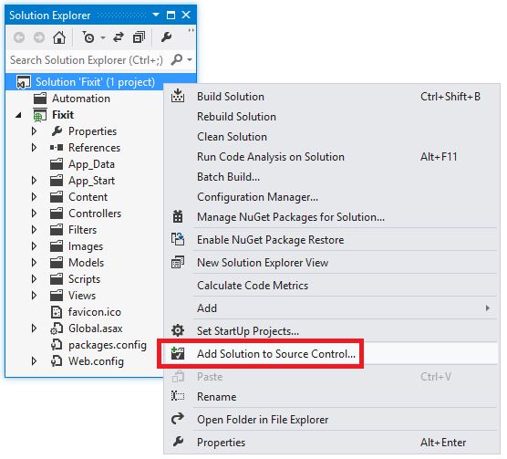

Visual Studio asks if you want to use TFVC (centralized version control) or Git.

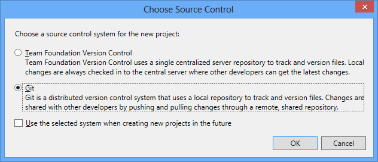

When you select Git and click **OK**, Visual Studio creates a new local Git repository in your solution folder. The new repository has no files yet; you have to add them to the repository by doing a Git commit. Right-click the solution in **Solution Explorer**, and then click **Commit**.

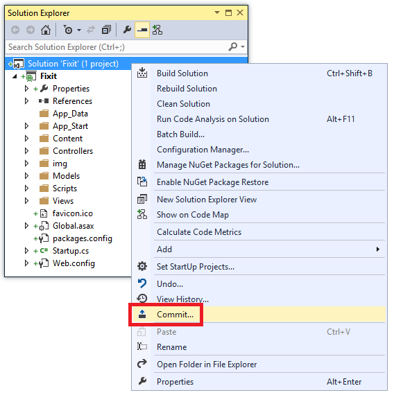

Visual Studio automatically stages all of the project files for the commit and lists them in **Team Explorer** in the **Included Changes** pane. (If there were some you didn't want to include in the commit, you could select them, right-click, and click **Exclude**.)

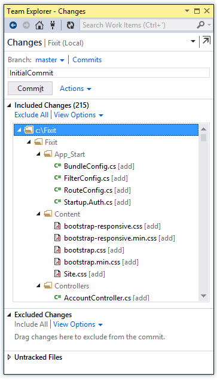

Enter a commit comment and click **Commit**, and Visual Studio executes the commit and displays the commit ID.

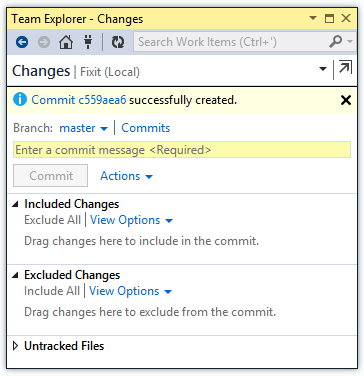

Now if you change some code so that it's different from what's in the repository, you can easily view the differences. Right-click a file that you've changed, select **Compare with Unmodified**, and you get a comparison display that shows your uncommitted change.

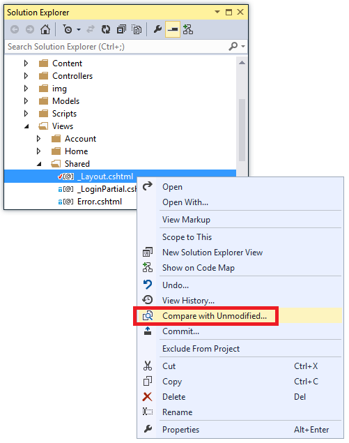

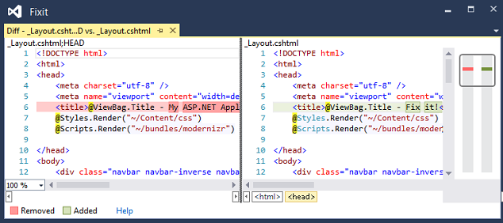

You can easily see what changes you're making and check them in.

Suppose you need to make a branch – you can do that in Visual Studio too. In **Team Explorer**, click **New Branch**.

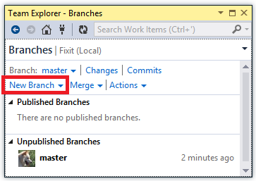

Enter a branch name, click **Create Branch**, and if you selected **Checkout branch**, Visual Studio automatically checks out the new branch.

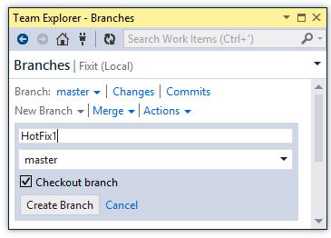

You can now make changes to files and check them in to this branch. And you can easily switch between branches and Visual Studio automatically syncs the files to whichever branch you have checked out. In this example the web page title in *\_Layout.cshtml* has been changed to "Hot Fix 1" in HotFix1 branch.

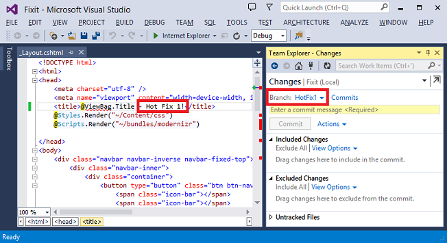

If you switch back to the master branch, the contents of the *\_Layout.cshtml* file automatically revert to what they are in the master branch.

This a simple example of how you can quickly create a branch and flip back and forth between branches. This feature enables a highly agile workflow using the branch structure and automation scripts presented in the [Automate Everything](automate-everything.md) chapter. For example, you can be working in the Development branch, create a hot fix branch off of master, switch to the new branch, make your changes there and commit them, and then switch back to the Development branch and continue what you were doing.

What you've seen here is how you work with a local Git repository in Visual Studio. In a team environment you typically also push changes up to a common repository. The Visual Studio tools also enable you to point to a remote Git repository. You can use GitHub.com for that purpose, or you can use [Git in Visual Studio Online](https://msdn.microsoft.com/en-us/library/hh850437.aspx) integrated with all the other Visual Studio Online capabilities such as work item and bug tracking.

This isn't the only way you can implement an agile branching strategy, of course. You can enable the same agile workflow using a centralized source control repository.

## Summary

Measure the success of your source control system based on how quickly you can make a change and get it live in a safe and predictable way. If you find yourself scared to make a change because you have to do a day or two of manual testing on it, you might ask yourself what you have to do process-wise or test-wise so that you can make that change in minutes or at worst no longer than an hour. One strategy for doing that is to implement continuous integration and continuous delivery, which we'll cover in the [next chapter](continuous-integration-and-continuous-delivery.md).

## Resources

The [Visual Studio Online](https://www.visualstudio.com/) portal provides documentation and support services, and you can sign up for an account. If you have Visual Studio 2012 and would like to use Git, see [Visual Studio Tools for Git](https://visualstudiogallery.msdn.microsoft.com/abafc7d6-dcaa-40f4-8a5e-d6724bdb980c).

For more information about TFVC (centralized version control) and Git (distributed version control), see the following resources:

- [Which version control system should I use: TFVC or Git?](https://msdn.microsoft.com/en-us/library/vstudio/ms181368.aspx#tfvc_or_git_summary) MSDN documentation, includes a table summarizing the differences between TFVC and Git.
- [Well, I like Team Foundation Server and I like Git, but which is better?](https://blogs.msdn.com/b/visualstudiouk/archive/2013/08/05/well-i-like-team-foundation-server-and-i-like-git-but-which-is-better.aspx) Comparison of Git and TFVC.

For more information about branching strategies, see the following resources:

- [Building a Release Pipeline with Team Foundation Server 2012](https://msdn.microsoft.com/en-us/library/dn449957.aspx). Microsoft Patterns and Practices documentation. See chapter 6 for a discussion of branching strategies. Advocates feature toggles over feature branches, and if branches for features are used, advocates keeping them short-lived (hours or days at most).
- [Version Control Guide](http://vsarbranchingguide.codeplex.com/). Guide to branching strategies by the ALM Rangers. See Branching Strategies.pdf on the Downloads tab.
- [Software Development with Feature Toggles](https://msdn.microsoft.com/en-us/magazine/dn683796.aspx). MSDN Magazine article.
- [Feature Toggle](http://martinfowler.com/bliki/FeatureToggle.html). Introduction to feature toggles / feature flags on Martin Fowler's blog.
- [Feature Toggles vs Feature Branches](http://geekswithblogs.net/Optikal/archive/2013/02/10/152069.aspx). Another blog post about feature toggles, by Dylan Smith.

For more information about how to handle sensitive information that should not be kept in source control repositories, see the following resources:

- [Best practices for deploying passwords and other sensitive data to ASP.NET and Azure App Service](../../../../identity/overview/features-api/best-practices-for-deploying-passwords-and-other-sensitive-data-to-aspnet-and-azure.md).
- [Azure Web Sites: How Application Strings and Connection Strings Work](https://azure.microsoft.com/blog/2013/07/17/windows-azure-web-sites-how-application-strings-and-connection-strings-work/). Explains the Azure feature that overrides `appSettings` and `connectionStrings` data in the *Web.config* file.
- [Custom configuration and application settings in Azure Web Sites - with Stefan Schackow](https://azure.microsoft.com/documentation/videos/configuration-and-app-settings-of-azure-web-sites/).

For information about other methods for keeping sensitive information out of source control, see [ASP.NET MVC: Keep Private Settings Out of Source Control](http://typecastexception.com/post/2014/04/06/ASPNET-MVC-Keep-Private-Settings-Out-of-Source-Control.aspx).

>[!div class="step-by-step"]
[Previous](automate-everything.md)
[Next](continuous-integration-and-continuous-delivery.md)