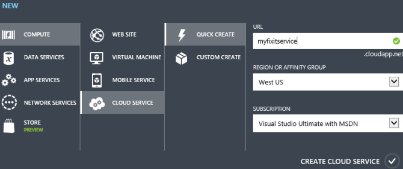

Appendix: The Fix It Sample Application (Building Real-World Cloud Apps with Azure)
====================
by [Mike Wasson](https://github.com/MikeWasson), [Rick Anderson](https://github.com/Rick-Anderson), [Tom Dykstra](https://github.com/tdykstra)

[Download The Fix It Project](http://code.msdn.microsoft.com/Fix-It-app-for-Building-cdd80df4)

> The **Building Real World Cloud Apps with Azure** e-book is based on a presentation developed by Scott Guthrie. It explains 13 patterns and practices that can help you be successful developing web apps for the cloud. For information about the e-book, see [the first chapter](introduction.md).

This appendix to the Building Real World Cloud Apps with Azure e-book contains the following sections that provide additional information about the Fix It sample application that you can download:

- [Known issues](#knownissues)
- [Best practices](#bestpractices)
- [How to run the app from Visual Studio on your local computer](#run-in-vs)
- [How to deploy the base app to Azure App Service Web Apps by using the Windows PowerShell scripts](#deploybase)
- [Troubleshooting the Windows PowerShell scripts](#troubleshooting)
- [How to deploy the app with queue processing to Azure App Service Web Apps and an Azure Cloud Service](#deployqueues)

## Known issues

The Fix It app was originally developed in order to illustrate as simply as possible some of the patterns presented in this e-book. However, since the e-book is about building real-world apps, we subjected the Fix It code to a review and testing process similar to what we'd do for released software. We found a number of issues, and as with any real-world application, some of them we fixed and some of them we deferred to a later release.

The following list includes issues that should be addressed in a production application, but for one reason or another we decided not to address in the initial release of the Fix It sample application.

### Security

- Ensure that you can't assign a task to a non-existent owner.
- Ensure that you can only view and modify tasks that you created or are assigned to you.
- Use HTTPS for sign-in pages and authentication cookies.
- Specify a time limit for authentication cookies.

### Input validation

In general, a production app would do more input validation than the Fix It app. For example, the image size / image file size allowed for upload should be limited.

### Administrator functionality

An administrator should be able to change ownership on existing tasks. For example, the creator of a task might leave the company, leaving no one with authority to maintain the task unless administrative access is enabled.

### Queue message processing

Queue message processing in the Fix It app was designed to be simple in order to illustrate the queue-centric work pattern with a minimum amount of code. This simple code would not be adequate for an actual production application.

- The code does not guarantee that each queue message will be processed at most once. When you get a message from the queue, there is a timeout period, during which the message is invisible to other queue listeners. If the timeout expires before the message is deleted, the message becomes visible again. Therefore, if a worker role instance spends a long time processing a message, it is theoretically possible for the same message to get processed twice, resulting in a duplicate task in the database. For more information about this issue, see [Using Azure Storage Queues](https://msdn.microsoft.com/en-us/library/ff803365.aspx#sec7).
- The queue polling logic could be more cost-effective, by batching message retrieval. Every time you call [CloudQueue.GetMessageAsync](https://msdn.microsoft.com/en-us/library/microsoft.windowsazure.storage.queue.cloudqueue.getmessageasync.aspx), there is a transaction cost. Instead, you can call [CloudQueue.GetMessagesAsync](https://msdn.microsoft.com/en-us/library/microsoft.windowsazure.storage.queue.cloudqueue.getmessagesasync.aspx) (note the plural 's'), which gets multiple messages in a single transaction. The transaction costs for Azure Storage Queues are very low, so the impact on costs is not substantial in most scenarios.
- The tight loop in the queue message-processing code causes CPU affinity, which does not utilize multi-core VMs efficiently. A better design would use task parallelism to run several async tasks in parallel.
- Queue message-processing has only rudimentary exception handling. For example, the code doesn't handle [poison messages](https://msdn.microsoft.com/en-us/library/ms789028.aspx). (When message processing causes an exception, you have to log the error and delete the message, or the worker role will try to process it again, and the loop will continue indefinitely.)

### SQL queries are unbounded

Current Fix It code places no limit on how many rows the queries for Index pages might return. If a large volume of tasks is entered into the database, the size of the resulting lists received could cause performance issues. The solution is to implement paging. For an example, see [Sorting, Filtering, and Paging with the Entity Framework in an ASP.NET MVC Application](../../../../mvc/overview/getting-started/getting-started-with-ef-using-mvc/sorting-filtering-and-paging-with-the-entity-framework-in-an-asp-net-mvc-application.md).

### View models recommended

The Fix It app uses the FixItTask entity class to pass information between the controller and the view. A best practice is to use view models. The domain model (e.g., the FixItTask entity class) is designed around what is needed for data persistence, while a view model can be designed for data presentation. For more information, see [12 ASP.NET MVC Best Practices](http://codeclimber.net.nz/archive/2009/10/27/12-asp.net-mvc-best-practices.aspx).

### Secure image blob recommended

The Fix It app stores uploaded images as public, meaning that anyone who finds the URL can access the images. The images could be secured instead of public.

### No PowerShell automation scripts for queues

Sample PowerShell automation scripts were written only for the base version of Fix It that runs entirely in Azure App Service Web Apps. We haven't provided scripts for setting up and deploying to the web app plus Cloud Service environment required for queue processing.

### Special handling for HTML codes in user input

ASP.NET automatically prevents many ways in which malicious users might attempt cross-site scripting attacks by entering script in user input text boxes. And the MVC `DisplayFor` helper used to display task titles and notes automatically HTML-encodes values that it sends to the browser. But in a production app you might want to take additional measures. For more information, see [Request Validation in ASP.NET](https://msdn.microsoft.com/en-us/library/hh882339.aspx).

## Best practices

Following are some issues that were fixed after being discovered in code review and testing of the original version of the Fix It app. Some were caused by the original coder not being aware of a particular best practice, some simply because the code was written quickly and wasn't intended for released software. We're listing the issues here in case there's something we learned from this review and testing that might be helpful to others who are also developing web apps.

### Dispose the database repository

The `FixItTaskRepository` class must dispose the Entity Framework `DbContext` instance. We did this by implementing `IDisposable` in the `FixItTaskRepository` class:

[!code-csharp[Main](the-fix-it-sample-application/samples/sample1.cs)]

Note that AutoFac will automatically dispose the `FixItTaskRepository` instance, so we don't need to explicitly dispose it.

Another option is to remove the `DbContext` member variable from `FixItTaskRepository`, and instead create a local `DbContext` variable within each repository method, inside a `using` statement. For example:

[!code-csharp[Main](the-fix-it-sample-application/samples/sample2.cs)]

### Register singletons as such with DI

Since only one instance of the `PhotoService` class and `Logger` class is needed, these classes should be [registered as single instances for dependency injection](https://code.google.com/p/autofac/wiki/InstanceScope) in *DependenciesConfig.cs*:

[!code-csharp[Main](the-fix-it-sample-application/samples/sample3.cs?highlight=1,3)]

### Security: Don't show error details to users

The original Fix It app didn't have a generic error page and just let all exceptions bubble up to the UI, so some exceptions such as database connection errors could result in a full stack trace being displayed to the browser. Detailed error information can sometimes facilitate attacks by malicious users. The solution is to log the exception details and display an error page to the user that doesn't include error details. The Fix It app was already logging, and in order to display an error page, we added `<customErrors mode=On>` in the Web.config file.

[!code-xml[Main](the-fix-it-sample-application/samples/sample4.xml?highlight=2)]

By default this causes *Views\Shared\Error.cshtml* to be displayed for errors. You can customize *Error.cshtml* or create your own error page view and add a `defaultRedirect` attribute. You can also specify different error pages for specific errors.

### Security: only allow a task to be edited by its creator

The Dashboard Index page only shows tasks created by the logged-on user, but a malicious user could create a URL with an ID to another user's task. We added code in *DashboardController.cs* to return a 404 in that case:

[!code-csharp[Main](the-fix-it-sample-application/samples/sample5.cs?highlight=9-14,24-29)]

### Don't swallow exceptions

The original Fix It app just returned null after logging an exception that resulted from a SQL query:

[!code-csharp[Main](the-fix-it-sample-application/samples/sample6.cs?highlight=4)]

This would make it look to the user as if the query succeeded but just didn't return any rows. Solution is to re-throw the exception after catching and logging:

[!code-csharp[Main](the-fix-it-sample-application/samples/sample7.cs)]

### Catch all exceptions in worker roles

Any unhandled exceptions in a worker role will cause the VM to be recycled, so you want to wrap everything you do in a try-catch block and handle all exceptions.

### Specify length for string properties in entity classes

In order to display simple code, the original version of the Fix It app didn't specify lengths for the fields of the FixItTask entity, and as a result they were defined as varchar(max) in the database. As a result, the UI would accept almost any amount of input. Specifying lengths sets limits that apply both to user input in the web page and column size in the database:

[!code-csharp[Main](the-fix-it-sample-application/samples/sample8.cs?highlight=4,7,10,12,14)]

### Mark private members as readonly when they aren't expected to change

For example, in the `DashboardController` class an instance of `FixItTaskRepository` is created and isn't expected to change, so we defined it as [readonly](https://msdn.microsoft.com/en-us/library/acdd6hb7.aspx).

[!code-csharp[Main](the-fix-it-sample-application/samples/sample9.cs?highlight=3)]

### Use list.Any() instead of list.Count() &gt; 0

If you all you care about is whether one or more items in a list fit the specified criteria, use the [Any](https://msdn.microsoft.com/en-us/library/bb534972.aspx) method, because it returns as soon as an item fitting the criteria is found, whereas the `Count` method always has to iterate through every item. The Dashboard *Index.cshtml* file originally had this code:

[!code-cshtml[Main](the-fix-it-sample-application/samples/sample10.cshtml)]

We changed it to this:

[!code-cshtml[Main](the-fix-it-sample-application/samples/sample11.cshtml?highlight=1)]

### Generate URLs in MVC views using MVC helpers

For the **Create a Fix It** button on the home page, the Fix It app hard coded an anchor element:

[!code-cshtml[Main](the-fix-it-sample-application/samples/sample12.cshtml)]

For View/Action links like this it's better to use the [Url.Action](https://msdn.microsoft.com/en-us/library/system.web.mvc.urlhelper.action.aspx) HTML helper, for example:

[!code-cshtml[Main](the-fix-it-sample-application/samples/sample13.cshtml)]

### Use Task.Delay instead of Thread.Sleep in worker role

The new-project template puts `Thread.Sleep` in the sample code for a worker role, but causing the thread to sleep can cause the thread pool to spawn additional unnecessary threads. You can avoid that by using [Task.Delay](https://msdn.microsoft.com/en-us/library/hh139096.aspx) instead.

[!code-csharp[Main](the-fix-it-sample-application/samples/sample14.cs?highlight=11)]

### Avoid async void

If an async method doesn't need to return a value, return a `Task` type rather than `void`.

This example is from the `FixItQueueManager` class: 

[!code-csharp[Main](the-fix-it-sample-application/samples/sample15.cs)]

You should use `async void` only for top-level event handlers. If you define a method as `async void`, the caller cannot **await** the method or catch any exceptions the method throws. For more information, see [Best Practices in Asynchronous Programming](https://msdn.microsoft.com/en-us/magazine/jj991977.aspx). 

### Use a cancellation token to break from worker role loop

Typically, the **Run** method on a worker role contains an infinite loop. When the worker role is stopping, the [RoleEntryPoint.OnStop](https://msdn.microsoft.com/en-us/library/windowsazure/microsoft.windowsazure.serviceruntime.roleentrypoint.onstop.aspx) method is called. You should use this method to cancel the work that is being done inside the **Run** method and exit gracefully. Otherwise, the process might be terminated in the middle of an operation.

### Opt out of Automatic MIME Sniffing Procedure

In some cases, Internet Explorer reports a MIME type different than the type specified by the web server. For instance, if Internet Explorer finds HTML content in a file delivered with the HTTP response header Content-Type: text/plain, Internet Explorer determines that the content should be rendered as HTML. Unfortunately, this "MIME-sniffing" can also lead to security problems for servers hosting untrusted content. To combat this problem, Internet Explorer 8 has made a number of changes to MIME-type determination code and allows application developers to [opt out of MIME-sniffing](https://blogs.msdn.com/b/ie/archive/2008/07/02/ie8-security-part-v-comprehensive-protection.aspx). The following code was added to the *Web.config* file.

[!code-xml[Main](the-fix-it-sample-application/samples/sample16.xml?highlight=2-7)]

### Enable bundling and minification

When Visual Studio creates a new web project, bundling and minification of JavaScript files is not enabled by default. We added a line of code in BundleConfig.cs:

[!code-csharp[Main](the-fix-it-sample-application/samples/sample17.cs?highlight=9)]

### Set an expiration time-out for authentication cookies

By default, authentication cookies expire in two weeks. A shorter time is more secure. You can change this setting in *StartupAuth.cs*:

[!code-csharp[Main](the-fix-it-sample-application/samples/sample18.cs?highlight=4-5)]

## How to run the app from Visual Studio on your local computer

There are two ways to run the Fix It app:

- Run the base application that writes new tasks directly to the SQL database.
- Run the application using a queue plus a backend service to create tasks. The queue pattern is described in the chapter [Queue-Centric Work Pattern](queue-centric-work-pattern.md).

### Run the base application

1. Install [Visual Studio 2013 or Visual Studio 2013 Express for Web](https://www.visualstudio.com/en-us/downloads).
2. Install the [Azure SDK for .NET for Visual Studio 2013.](https://go.microsoft.com/fwlink/p/?linkid=323510&amp;clcid=0x409)
3. Download the .zip file from the [MSDN Code Gallery](https://code.msdn.microsoft.com/Fix-It-app-for-Building-cdd80df4).
4. In File Explorer, right-click the .zip file and click Properties, then in the Properties window click Unblock.
5. Unzip the file.
6. Double-click the .sln file to launch Visual Studio.
7. From the Tools menu, click Library Package Manager, then Package Manager Console.
8. In the Package Manager Console (PMC), click Restore.
9. Exit Visual Studio.
10. Start the [Azure storage emulator](https://msdn.microsoft.com/en-us/library/windowsazure/hh403989.aspx).
11. Restart Visual Studio, opening the solution file you closed in the previous step.
12. Make sure the FixIt project is set as the startup project, and then press CTRL+F5 to run the project.

### Run the application with queue processing

1. Follow the directions for [Run the base application](#runbase), and then close the browser and close Visual Studio.
2. Start Visual Studio with administrator privileges. (You'll be using the Azure compute emulator, and that requires administrator privileges.)
3. In the application *Web.config* file in the *MyFixIt* project (the web project), change the value of `appSettings/UseQueues` to "true": 

    [!code-console[Main](the-fix-it-sample-application/samples/sample19.cmd?highlight=3)]
4. If the [Azure storage emulator](https://msdn.microsoft.com/en-us/library/windowsazure/hh403989.aspx) isn't still running, start it again.
5. Run the FixIt web project and the MyFixItCloudService project simultaneously.

    Using Visual Studio 2013:

    1. Press F5 to run the FixIt project.
    2. In **Solution Explorer**, right-click the MyFixItCloudService project, and then click **Debug** -- **Start New Instance**.

    Using Visual Studio 2013 Express for Web:

    1. In Solution Explorer, right-click the FixIt solution and select **Properties**.
    2. Select **Multiple Startup Projects**..
    3. In the **Action** dropdown list under MyFixIt and MyFixItCloudService, select **Start**.
    4. Click **OK**.
    5. Press F5 to run both projects.

    When you run the MyFixItCloudService project, Visual Studio starts the Azure compute emulator. Depending on your firewall configuration, you might need to allow the emulator through the firewall.

## How to deploy the base app to Azure App Service Web Apps by using the Windows PowerShell scripts

To illustrate the [Automate Everything](automate-everything.md) pattern, the Fix It app is supplied with scripts that set up an environment in Azure and deploy the project to the new environment. The following instructions explain how to use the scripts.

If you want to run in Azure without using queues, and you made the changes to run locally with queues, make sure you set the UseQueues appSetting value back to false before proceeding with the following instructions.

These instructions assume you have already downloaded and run the Fix It solution locally, and that you have an Azure account or have an Azure subscription that you are authorized to manage.

1. Install the **Azure PowerShell** console. For instructions, see [How to install and configure Azure PowerShell](https://www.windowsazure.com/en-us/manage/install-and-configure-windows-powershell/).

    This customized console is configured to work with your Azure subscription. The Azure module is installed in the *Program Files* directory and is automatically imported on every use of the Azure PowerShell console.

    If you prefer to work in a different host program, such as Windows PowerShell ISE, be sure to use the [Import-Module](https://go.microsoft.com/fwlink/?LinkID=141553) cmdlet to import the Azure module or use a command in the Azure module to trigger automatic importing of the module.
2. Start Azure PowerShell with the **Run as administrator** option.
3. Run the [Set-ExecutionPolicy](https://go.microsoft.com/fwlink/p/?linkid=293941) cmdlet to set the Azure PowerShell execution policy to `RemoteSigned`. Enter **Y** (for Yes) to complete the policy change.

    [!code-console[Main](the-fix-it-sample-application/samples/sample20.cmd)]

    This setting enables you to run local scripts that aren't digitally signed. (You can also set the execution policy to `Unrestricted`, which would eliminate the need for the unblock step later, but this is not recommended for security reasons.)
4. Run the `Add-AzureAccount` cmdlet to set up PowerShell with credentials for your account.

    [!code-console[Main](the-fix-it-sample-application/samples/sample21.cmd)]

    These credentials expire after a period of time and you have to re-run the `Add-AzureAccount` cmdlet. As this e-book is being written, the time limit before credentials expire is 12 hours.
5. If you have multiple subscriptions, use the Select-AzureSubscription cmdlet to specify the subscription you want to create the test environment in.
6. Import a management certificate for the same Azure subscription by using the `Get-AzurePublishSettingsFile` and `Import-AzurePublishSettingsFile` cmdlets. The first of these cmdlets downloads a certificate file, and in the second one you specify the location of that file in order to import it. > [!IMPORTANT]
 > Keep the downloaded file in a safe location or delete it when you're done with it, because it contains a certificate that can be used to manage your Azure services.

    [!code-console[Main](the-fix-it-sample-application/samples/sample22.cmd)]

    The certificate is used for a REST API call that detects the development machine's IP address in order to set a firewall rule on the SQL Database server.
7. Run the [Set-Location](https://go.microsoft.com/fwlink/p/?linkid=293912) cmdlet (aliases are `cd`, `chdir`, and `sl`) to navigate to the directory that contains the scripts. (They're located in the *Automation* folder in the Fix It solution folder.) Put the path in quotes if any of the directory names contain spaces. For example, to navigate to the `c:\Sample Apps\FixIt\Automation` directory you could enter the following command:

    [!code-console[Main](the-fix-it-sample-application/samples/sample23.cmd)]
8. To allow Windows PowerShell to run these scripts, use the [Unblock-File](https://go.microsoft.com/fwlink/p/?linkid=294021) cmdlet. (The scripts are blocked because they were downloaded from the Internet.)

    > [!WARNING]
    > Security - Before running `Unblock-File` on any script or executable file, open the file in Notepad, examine the commands, and verify that they do not contain any malicious code.

    For example, the following command runs the `Unblock-File` cmdlet on all scripts in the current directory.

    [!code-console[Main](the-fix-it-sample-application/samples/sample24.cmd)]
9. To create the web app for the base (no queues processing) Fix It app, run the environment creation script.

    The required `Name` parameter specifies the name of the database and is also used for the storage account that the script creates. The name must be globally unique within the azurewebsites.net domain. If you specify a name that is not unique, like Fixit or Test (or even as in the example, fixitdemo), the `New-AzureWebsite` cmdlet fails with an Internal Error that reports a conflict. The script converts the name to all lower-case to comply with name requirements for web apps, storage accounts, and databases.

    The required `SqlDatabasePassword` parameter specifies the password for the admin account that will be created for SQL Database. Don't include special XML characters in the password (&amp; &lt; &gt; ;). This is a limitation of the way the scripts were written, not a limitation of Azure.

    For example, if you want to create a web app named "fixitdemo" and use a SQL Server administrator password of "Passw0rd1", you could enter the following command:

    [!code-console[Main](the-fix-it-sample-application/samples/sample25.cmd)]

    The name must be unique in the azurewebsites.net domain, and the password must meet SQL Database requirements for password complexity. (The example Passw0rd1 does meet the requirements.)

    Note that the command begins with ".\". To help prevent malicious execution of scripts, Windows PowerShell requires that you provide the fully qualified path to the script file when you run a script. You can use a dot to indicate the current directory (".\") or provide the fully qualified path, such as:

    [!code-console[Main](the-fix-it-sample-application/samples/sample26.cmd)]

    For more information about the script, use the `Get-Help` cmdlet.

    [!code-console[Main](the-fix-it-sample-application/samples/sample27.cmd)]

    You can use the `Detailed`, `Full`, `Parameters`, and `Examples` parameters of the Get-Help cmdlet to filter the help that is returned.

    If the script fails or generates errors, such as "New-AzureWebsite : Call Set-AzureSubscription and Select-AzureSubscription first," you might not have completed the configuration of Azure PowerShell.

    After the script finishes, you can use the Azure Management Portal to see the resources that were created, as shown in the [Automate Everything](automate-everything.md) chapter.
10. To deploy the FixIt project to the new Azure environment, use the *AzureWebsite.ps1* script. For example:

    [!code-console[Main](the-fix-it-sample-application/samples/sample28.cmd)]

    When deployment is done, the browser opens with Fix It running in Azure.

## Troubleshooting the Windows PowerShell scripts

The most common errors encountered when running these scripts are related to permissions. Make sure that `Add-AzureAccount` and `Import-AzurePublishSettingsFile` were successful and that you used them for the same Azure subscription. Even if `Add-AzureAccount` was successful you might have to run it again. The permissions added by `Add-AzureAccount` expire in 12 hours.

### Object reference not set to an instance of an object.

If the script returns errors, such as "Object reference not set to an instance of an object," which means that Windows PowerShell can't find an object to process (this is a null reference exception), run the `Add-AzureAccount` cmdlet and try the script again.

[!code-console[Main](the-fix-it-sample-application/samples/sample29.cmd)]

### InternalError: The server encountered an internal error.

The `New-AzureWebsite` cmdlet returns an internal error when the name is not unique in the azurewebsites.net domain. To resolve the error, use a different value for the name, which is in the Name parameter of *New-AzureWebsiteEnv.ps1*.

[!code-console[Main](the-fix-it-sample-application/samples/sample30.cmd)]

### Restarting the script

If you need to restart the *New-AzureWebsiteEnv.ps1* script because it failed before it printed the "Script is complete" message, you might want to delete resources that the script created before it stopped. For example, if the script already created the ContosoFixItDemo web app and you run the script again with the same name, the script will fail because the name is in use.

To determine which resources the script created before it stopped, use the following cmdlets:

- `Get-AzureWebsite`
- `Get-AzureSqlDatabaseServer`
- `Get-AzureSqlDatabase`: To run this cmdlet, pipe the database server name to `Get-AzureSqlDatabase`:  
    `Get-AzureSqlDatabaseServer | Get-AzureSqlDatabase.`

To delete these resources, use the following commands. Note that if you delete the database server, you automatically delete the databases associated with the server.

- `Get-AzureWebsite -Name <WebsiteName> | Remove-AzureWebsite`
- `Get-AzureSqlDatabase -Name <DatabaseName> -ServerName <DatabaseServerName> | Remove-SqlAzureDatabase`
- `Get-AzureSqlDatabaseServer | Remove-AzureSqlDatabaseServer`

## How to deploy the app with queue processing to Azure App Service Web Apps and an Azure Cloud Service

To enable queues, make the following change in the MyFixIt\Web.config file. Under `appSettings`, change the value of `UseQueues` to "true": 

[!code-xml[Main](the-fix-it-sample-application/samples/sample31.xml)]

Then deploy the MVC application to an web app in Azure App Service, as described [earlier](#deploybase).

Next, create a new Azure cloud service. The scripts included with the Fix It app do not create or deploy the cloud service, so you must use Azure portal for this. In the portal, click **New** -- **Compute** – **Cloud Service** -- **Quick Create**, and then enter a URL and a data center location. Use the same data center where you deployed the web app.

Before you can deploy the cloud service, you need to update some of the configuration files.

In MyFixIt.WorkerRoler\app.config, under `connectionStrings`, replace the value of the `appdb` connection string with the actual connection string for the SQL Database. You can get the connection string from the portal. In the portal, click **SQL Databases** - **appdb** - **View SQL Database connection strings for ADO .Net, ODBC, PHP, and JDBC**. Copy the ADO.NET connection string and paste the value into the app.config file. Replace "{your\_password\_here}" with your database password. (Assuming you used the scripts to deploy the MVC app, you specified the database password in the `SqlDatabasePassword` script parameter.)

The result should look like the following:

[!code-xml[Main](the-fix-it-sample-application/samples/sample32.xml)]

In the same MyFixIt.WorkerRoler\app.config file, under `appSettings`, replace the two placeholder values for the Azure storage account.

[!code-xml[Main](the-fix-it-sample-application/samples/sample33.xml?highlight=2-3)]

You can get the access key from the portal. See [How To Manage Storage Accounts](https://www.windowsazure.com/en-us/manage/services/storage/how-to-manage-a-storage-account/).

In MyFixItCloudService\ServiceConfiguration.Cloud.cscfg, replace the same two placeholders values for the Azure storage account.

[!code-xml[Main](the-fix-it-sample-application/samples/sample34.xml?highlight=3)]

Now you are ready to deploy the cloud service. In Solution Explore, right-click the MyFixItCloudService project and select **Publish**. For more information, see "[Deploy the Application to Azure](https://www.windowsazure.com/en-us/develop/net/tutorials/multi-tier-web-site/2-download-and-run/#deployAz)", which is in part 2 of [this tutorial](https://www.windowsazure.com/en-us/develop/net/tutorials/multi-tier-web-site/1-overview/).

>[!div class="step-by-step"]
[Previous](more-patterns-and-guidance.md)