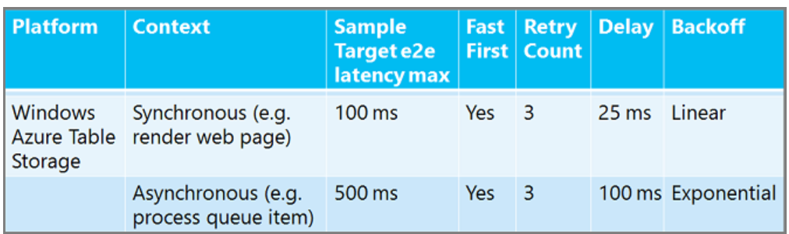

Transient Fault Handling (Building Real-World Cloud Apps with Azure)
====================
by [Mike Wasson](https://github.com/MikeWasson), [Rick Anderson](https://github.com/Rick-Anderson), [Tom Dykstra](https://github.com/tdykstra)

[Download Fix It Project](http://code.msdn.microsoft.com/Fix-It-app-for-Building-cdd80df4) or [Download E-book](http://blogs.msdn.com/b/microsoft_press/archive/2014/07/23/free-ebook-building-cloud-apps-with-microsoft-azure.aspx)

> The **Building Real World Cloud Apps with Azure** e-book is based on a presentation developed by Scott Guthrie. It explains 13 patterns and practices that can help you be successful developing web apps for the cloud. For information about the e-book, see [the first chapter](introduction.md).

When you're designing a real world cloud app, one of the things you have to think about is how to handle temporary service interruptions. This issue is uniquely important in cloud apps because you're so dependent on network connections and external services. You can frequently get little glitches that are typically self-healing, and if you aren't prepared to handle them intelligently, they'll result in a bad experience for your customers.

## Causes of transient failures

In the cloud environment you'll find that failed and dropped database connections happen periodically. That's partly because you're going through more load balancers compared to the on-premises environment where your web server and database server have a direct physical connection. Also, sometimes when you're dependent on a multi-tenant service you'll see calls to the service get slower or time out because someone else who uses the service is hitting it heavily. In other cases you might be the user who is hitting the service too frequently, and the service deliberately throttles you – denies connections – in order to prevent you from adversely affecting other tenants of the service.

## Use smart retry/back-off logic to mitigate the effect of transient failures

Instead of throwing an exception and displaying a not available or error page to your customer, you can recognize errors that are typically transient, and automatically retry the operation that resulted in the error, in hopes that before long you'll be successful. Most of the time the operation will succeed on the second try, and you'll recover from the error without the customer ever having been aware that there was a problem.

There are several ways you can implement smart retry logic.

- The Microsoft Patterns &amp; Practices group has a [Transient Fault Handling Application Block](https://msdn.microsoft.com/en-us/library/dn440719(v=pandp.60).aspx) that does everything for you if you're using ADO.NET for SQL Database access (not through Entity Framework). You just set a policy for retries – how many times to retry a query or command and how long to wait between tries – and wrap your SQL code in a *using* block.

    [!code-csharp[Main](transient-fault-handling/samples/sample1.cs)]

    TFH also supports [Azure In-Role Cache](https://msdn.microsoft.com/en-us/library/windowsazure/dn386103.aspx) and [Service Bus](https://www.windowsazure.com/en-us/services/messaging/).
- When you use the Entity Framework you typically aren't working directly with SQL connections, so you can't use this Patterns and Practices package, but Entity Framework 6 builds this kind of retry logic right into the framework. In a similar way you specify the retry strategy, and then EF uses that strategy whenever it accesses the database.

    To use this feature in the Fix It app, all we have to do is add a class that derives from *DbConfiguration* and turn on the retry logic.

    [!code-csharp[Main](transient-fault-handling/samples/sample2.cs)]

    For SQL Database exceptions that the framework identifies as typically transient errors, the code shown instructs EF to retry the operation up to 3 times, with an exponential back-off delay between retries, and a maximum delay of 5 seconds. Exponential back-off means that after each failed retry it will wait for a longer period of time before trying again. If three tries in a row fail, it will throw an exception. The following section about circuit breakers explains why you want exponential back-off and a limited number of retries.

    You can have similar issues when you're using the Azure Storage service, as the Fix It app does for Blobs, and the .NET storage client API already implements the same kind of logic. You just specify the retry policy, or you don't even have to do that if you're happy with the default settings.

## Circuit breakers

There are several reasons why you don't want to retry too many times over too long a period:

- Too many users persistently retrying failed requests might degrade other users' experience. If millions of people are all making repeated retry requests you could be tying up IIS dispatch queues and preventing your app from servicing requests that it otherwise could handle successfully.
- If everyone is retrying due to a service failure, there could be so many requests queued up that the service gets flooded when it starts to recover.
- If the error is due to throttling and there's a window of time the service uses for throttling, continued retries could move that window out and cause the throttling to continue.
- You might have a user waiting for a web page to render. Making people wait too long might be more annoying that relatively quickly advising them to try again later.

Exponential back-off addresses some of these issue by limiting the frequency of retries a service can get from your application. But you also need to have *circuit breakers*: this means that at a certain retry threshold your app stops retrying and takes some other action, such as one of the following:

- Custom fallback. If you can't get a stock price from Reuters, maybe you can get it from Bloomberg; or if you can't get data from the database, maybe you can get it from cache.
- Fail silent. If what you need from a service isn't all-or-nothing for your app, just return null when you can't get the data. If you're displaying a Fix It task and the Blob service isn't responding, you could display the task details without the image.
- Fail fast. Error out the user to avoid flooding the service with retry requests which could cause service disruption for other users or extend a throttling window. You can display a friendly "try again later" message.

There is no one-size-fits-all retry policy. You can retry more times and wait longer in an asynchronous background worker process than you would in a synchronous web app where a user is waiting for a response. You can wait longer between retries for a relational database service than you would for a cache service. Here are some sample recommended retry policies to give you an idea of how the numbers might vary. ("Fast First" means no delay before the first retry.

For SQL Database retry policy guidance, see [Troubleshoot transient faults and connection errors to SQL Database](https://azure.microsoft.com/documentation/articles/sql-database-connectivity-issues/).

## Summary

A retry/back-off strategy can help make temporary errors invisible to the customer most of the time, and Microsoft provides frameworks that you can use to minimize your work implementing a strategy whether you're using ADO.NET, Entity Framework, or the Azure Storage service.

In the [next chapter](distributed-caching.md), we'll look at how to improve performance and reliability by using distributed caching.

## Resources

For more information, see the following resources:

Documentation

- [Best Practices for the Design of Large-Scale Services on Azure Cloud Services](https://msdn.microsoft.com/en-us/library/windowsazure/jj717232.aspx). White paper by Mark Simms and Michael Thomassy. Similar to the Failsafe series but goes into more how-to details. See the Telemetry and Diagnostics section.
- [Failsafe: Guidance for Resilient Cloud Architectures](https://msdn.microsoft.com/en-us/library/windowsazure/jj853352.aspx). White paper by Marc Mercuri, Ulrich Homann, and Andrew Townhill. Web page version of the FailSafe video series.
- [Microsoft Patterns and Practices - Azure Guidance](https://msdn.microsoft.com/en-us/library/dn568099.aspx). See Retry pattern, Scheduler Agent Supervisor pattern.
- [Fault-tolerance in Azure SQL Database](https://blogs.msdn.com/b/windowsazure/archive/2012/07/30/fault-tolerance-in-windows-azure-sql-database.aspx). Blog post by Tony Petrossian.
- [Entity Framework - Connection Resiliency / Retry Logic](https://msdn.microsoft.com/en-us/data/dn456835). How to use and customize the transient fault handling feature of Entity Framework 6.
- [Connection Resiliency and Command Interception with the Entity Framework in an ASP.NET MVC Application](../../../../mvc/overview/getting-started/getting-started-with-ef-using-mvc/connection-resiliency-and-command-interception-with-the-entity-framework-in-an-asp-net-mvc-application.md). Fourth in a nine-part tutorial series, shows how to set up the EF 6 connection resilience feature for SQL Database.

Videos

- [FailSafe: Building Scalable, Resilient Cloud Services](https://channel9.msdn.com/Series/FailSafe). Nine-part series by Ulrich Homann, Marc Mercuri, and Mark Simms. Presents high-level concepts and architectural principles in a very accessible and interesting way, with stories drawn from Microsoft Customer Advisory Team (CAT) experience with actual customers. See the discussion of circuit breakers in episode 3 starting at 40:55.
- [Building Big: Lessons learned from Azure customers - Part II](https://channel9.msdn.com/Events/Build/2012/3-030). Mark Simms talks about designing for failure, transient fault handling, and instrumenting everything.

Code sample

- [Cloud Service Fundamentals in Azure](https://code.msdn.microsoft.com/Cloud-Service-Fundamentals-4ca72649). Sample application created by the Microsoft Azure Customer Advisory Team that demonstrates how to use the [Enterprise Library Transient Fault Handling Block](http://nuget.org/packages/EnterpriseLibrary.TransientFaultHandling/) (TFH). For more information, see [Cloud Service Fundamentals Data Access Layer – Transient Fault Handling](https://social.technet.microsoft.com/wiki/contents/articles/18665.cloud-service-fundamentals-data-access-layer-transient-fault-handling.aspx). TFH is recommended for database access using ADO.NET directly (without using Entity Framework).

>[!div class="step-by-step"]
[Previous](monitoring-and-telemetry.md)
[Next](distributed-caching.md)