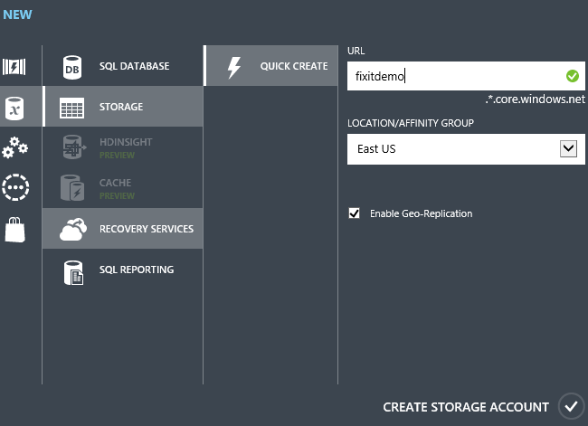
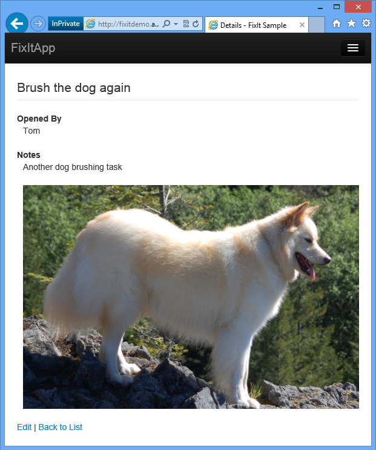

Unstructured Blob Storage (Building Real-World Cloud Apps with Azure)
====================
by [Mike Wasson](https://github.com/MikeWasson), [Rick Anderson](https://github.com/Rick-Anderson), [Tom Dykstra](https://github.com/tdykstra)

[Download Fix It Project](http://code.msdn.microsoft.com/Fix-It-app-for-Building-cdd80df4) or [Download E-book](http://blogs.msdn.com/b/microsoft_press/archive/2014/07/23/free-ebook-building-cloud-apps-with-microsoft-azure.aspx)

> The **Building Real World Cloud Apps with Azure** e-book is based on a presentation developed by Scott Guthrie. It explains 13 patterns and practices that can help you be successful developing web apps for the cloud. For information about the e-book, see [the first chapter](introduction.md).

In the previous chapter we looked at partitioning schemes and explained how the Fix It app stores images in the Azure Storage Blob service, and other task data in Azure SQL Database. In this chapter we go deeper into the Blob service and show how it's implemented in Fix It project code.

## What is Blob storage?

The Azure Storage Blob service provides a way to store files in the cloud. The Blob service has a number of advantages over storing files in a local network file system:

- It's highly scalable. A single Storage account can store [hundreds of terabytes](https://msdn.microsoft.com/en-us/library/windowsazure/dn249410.aspx), and you can have multiple Storage accounts. Some of the biggest Azure customers store hundreds of petabytes. Microsoft SkyDrive uses blob storage.
- It's durable. Every file you store in the Blob service is automatically backed up.
- It provides high availability. The [SLA for Storage](https://go.microsoft.com/fwlink/p/?linkid=159705&amp;clcid=0x409) promises 99.9% or 99.99% uptime, depending on which geo-redundancy option you choose.
- It's a platform-as-a-service (PaaS) feature of Azure, which means you just store and retrieve files, paying only for the actual amount of storage you use, and Azure automatically takes care of setting up and managing all of the VMs and disk drives required for the service.
- You can access the Blob service by using a REST API or by using a programming language API. SDKs are available for .NET, Java, Ruby, and others.
- When you store a file in the Blob service, you can easily make it publicly available over the Internet.
- You can secure files in the Blob service so they can accessed only by authorized users, or you can provide temporary access tokens that makes them available to someone only for a limited period of time.

Anytime you're building an app for Azure and you want to store a lot of data that in an on-premises environment would go in files -- such as images, videos, PDFs, spreadsheets, etc. -- consider the Blob service.

## Creating a Storage account

To get started with the Blob service you create a Storage account in Azure. In the portal, click **New** -- **Data Services** -- **Storage** -- **Quick Create**, and then enter a URL and a data center location. The data center location should be the same as your web app.

You pick the primary region where you want to store the content, and if you choose the [geo-replication](https://blogs.msdn.com/b/windowsazurestorage/archive/2013/12/11/introducing-read-access-geo-replicated-storage-ra-grs-for-windows-azure-storage.aspx#_Geo_Redundant_Storage) option, Azure creates replicas of all your data in a different data center in another region of the country. For example, if you choose the Western US data center, when you store a file it goes to the Western US data center, but in the background Azure also copies it to one of the other US data centers. If a disaster happens in one region of the country, your data is still safe.

Azure won't replicate data across geo-political boundaries: if your primary location is in the U.S., your files are only replicated to another region within the U.S.; if your primary location is Australia, your files are only replicated to another data center in Australia.

Of course, you can also create a Storage account by executing commands from a script, as we saw earlier. Here's a Windows PowerShell command to create a Storage account:

[!code-powershell[Main](unstructured-blob-storage/samples/sample1.ps1)]

Once you have a Storage account, you can immediately start storing files in the Blob service.

## Using Blob storage in the Fix It app

The Fix It app enables you to upload photos.

When you click **Create the FixIt**, the application uploads the specified image file and stores it in the Blob service.

### Set up the Blob container

In order to store a file in the Blob service you need a *container* to store it in. A Blob service container corresponds to a file system folder. The environment creation scripts that we reviewed in the [Automate Everything chapter](automate-everything.md) create the Storage account, but they don't create a container. So the purpose of the `CreateAndConfigure` method of the `PhotoService` class is to create a container if it doesn't already exist. This method is called from the `Application_Start` method in *Global.asax*.

[!code-csharp[Main](unstructured-blob-storage/samples/sample2.cs)]

The storage account name and access key are stored in the `appSettings` collection of the *Web.config* file, and code in the `StorageUtils.StorageAccount` method uses those values to build a connection string and establish a connection:

[!code-csharp[Main](unstructured-blob-storage/samples/sample3.cs)]

The `CreateAndConfigureAsync` method then creates an object that represents the Blob service, and an object that represents a container (folder) named "images" in the Blob service:

[!code-csharp[Main](unstructured-blob-storage/samples/sample4.cs)]

If a container named "images" doesn't exist yet -- which will be true the first time you run the app against a new storage account -- the code creates the container and sets permissions to make it public. (By default, new blob containers are private and are accessible only to users who have permission to access your storage account.)

[!code-csharp[Main](unstructured-blob-storage/samples/sample5.cs)]

### Store the uploaded photo in Blob storage

To upload and save the image file, the app uses an `IPhotoService` interface and an implementation of the interface in the `PhotoService` class. The *PhotoService.cs* file contains all of the code in the Fix It app that communicates with the Blob service.

The following MVC controller method is called when the user clicks **Create the FixIt**. In this code, `photoService` refers to an instance of the `PhotoService` class, and `fixittask` refers to an instance of the `FixItTask` entity class that stores data for a new task.

[!code-csharp[Main](unstructured-blob-storage/samples/sample6.cs?highlight=8)]

The `UploadPhotoAsync` method in the `PhotoService` class stores the uploaded file in the Blob service and returns a URL that points to the new blob.

[!code-csharp[Main](unstructured-blob-storage/samples/sample7.cs)]

As in the `CreateAndConfigure` method, the code connects to the storage account and creates an object that represents the "images" blob container, except here it assumes the container already exists.

Then it creates a unique identifier for the image about to be uploaded, by concatenating a new GUID value with the file extension:

[!code-csharp[Main](unstructured-blob-storage/samples/sample8.cs)]

The code then uses the blob container object and the new unique identifier to create a blob object, sets an attribute on that object indicating what kind of file it is, and then uses the blob object to store the file in blob storage.

[!code-csharp[Main](unstructured-blob-storage/samples/sample9.cs)]

Finally, it gets a URL that references the blob. This URL will be stored in the database and can be used in Fix It web pages to display the uploaded image.

[!code-csharp[Main](unstructured-blob-storage/samples/sample10.cs)]

This URL is stored in the database as one of the columns of the FixItTask table.

[!code-csharp[Main](unstructured-blob-storage/samples/sample11.cs?highlight=10)]

With only the URL in the database, and images in Blob storage, the Fix It app keeps the database small, scalable, and inexpensive, while the images are stored where storage is cheap and capable of handling terabytes or petabytes. One storage account can store hundreds of terabytes of Fix It photos, and you only pay for what you use. So you can start off small paying 9 cents for the first gigabyte, and add more images for pennies per additional gigabyte.

### Display the uploaded file

The Fix It application displays the uploaded image file when it displays details for a task.

To display the image, all the MVC view has to do is include the `PhotoUrl` value in the HTML sent to the browser. The web server and the database are not using cycles to display the image, they are only serving up a few bytes to the image URL. In the following Razor code, `Model` refers to an instance of the `FixItTask` entity class.

[!code-cshtml[Main](unstructured-blob-storage/samples/sample12.cshtml?highlight=11)]

If you look at the HTML of the page that displays, you see the URL pointing directly to the image in blob storage, something like this:

[!code-cshtml[Main](unstructured-blob-storage/samples/sample13.cshtml?highlight=11)]

## Summary

You've seen how the Fix It app stores images in the Blob service and only image URLs in the SQL database. Using the Blob service keeps the SQL database much smaller than it otherwise would be, makes it possible to scale up to an almost unlimited number of tasks, and can be done without writing a lot of code.

You can have hundreds of terabytes in a storage account, and the storage cost is much less expensive than SQL Database storage, starting at about 3 cents per gigabyte per month plus a small transaction charge. And keep in mind that you're not paying for the maximum capacity but only for the amount you actually store, so your app is ready to scale but you're not paying for all that extra capacity.

In the [next chapter](design-to-survive-failures.md) we'll talk about the importance of making a cloud app capable of gracefully handling failures.

## Resources

For more information see the following resources:

- [An Introduction to Azure BLOB Storage](https://www.simple-talk.com/cloud/cloud-data/an-introduction-to-windows-azure-blob-storage-/). Blog by Mike Wood.
- [How to use the Azure Blob Storage Service in .NET](https://www.windowsazure.com/en-us/develop/net/how-to-guides/blob-storage/). Official documentation on the MicrosoftAzure.com site. A brief introduction to blob storage followed by code examples showing how to connect to blob storage, create containers, upload and download blobs, etc.
- [FailSafe: Building Scalable, Resilient Cloud Services](https://channel9.msdn.com/Series/FailSafe). Nine-part video series by Ulrich Homann, Marc Mercuri, and Mark Simms. Presents high-level concepts and architectural principles in a very accessible and interesting way, with stories drawn from Microsoft Customer Advisory Team (CAT) experience with actual customers. For a discussion of Azure Storage service and blobs, see episode 5 starting at 35:13.
- [Microsoft Patterns and Practices - Azure Guidance](https://msdn.microsoft.com/en-us/library/dn568099.aspx). See Valet Key pattern.

>[!div class="step-by-step"]
[Previous](data-partitioning-strategies.md)
[Next](design-to-survive-failures.md)