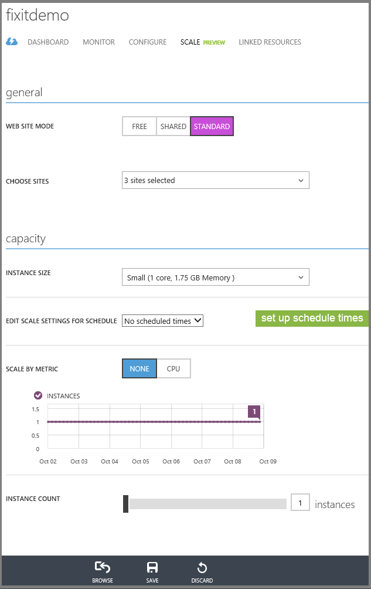
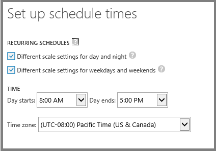
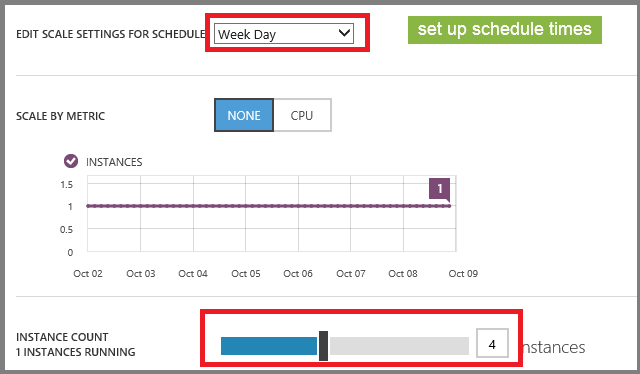
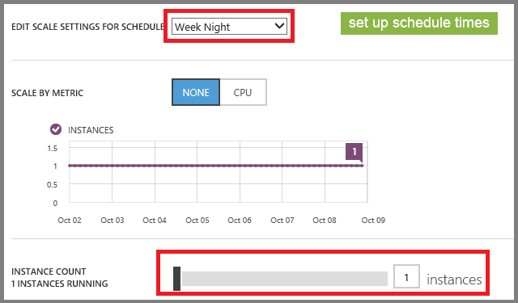
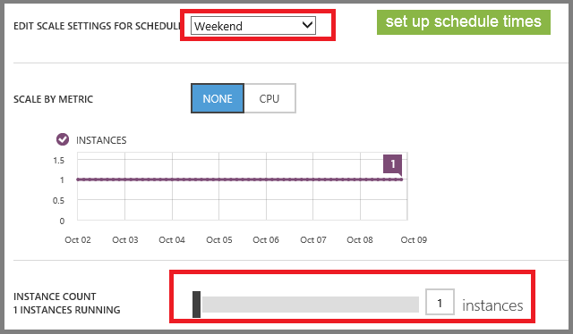

Web Development Best Practices (Building Real-World Cloud Apps with Azure)
====================
by [Mike Wasson](https://github.com/MikeWasson), [Rick Anderson](https://github.com/Rick-Anderson), [Tom Dykstra](https://github.com/tdykstra)

[Download Fix It Project](http://code.msdn.microsoft.com/Fix-It-app-for-Building-cdd80df4) or [Download E-book](http://blogs.msdn.com/b/microsoft_press/archive/2014/07/23/free-ebook-building-cloud-apps-with-microsoft-azure.aspx)

> The **Building Real World Cloud Apps with Azure** e-book is based on a presentation developed by Scott Guthrie. It explains 13 patterns and practices that can help you be successful developing web apps for the cloud. For information about the e-book, see [the first chapter](introduction.md).

The first three patterns were about setting up an agile development process; the rest are about architecture and code. This one is a collection of web development best practices:

- [Stateless web servers](#stateless) behind a smart load balancer.
- [Avoid session state](#sessionstate) (or if you can't avoid it, use distributed cache rather than a database).
- [Use a CDN](#cdn) to edge-cache static file assets (images, scripts).
- [Use .NET 4.5's async support](#async) to avoid blocking calls.

These practices are valid for all web development, not just for cloud apps, but they're especially important for cloud apps. They work together to help you make optimal use of the highly flexible scaling offered by the cloud environment. If you don't follow these practices, you'll run into limitations when you try to scale your application.

## Stateless web tier behind a smart load balancer

*Stateless web tier* means you don't store any application data in the web server memory or file system. Keeping your web tier stateless enables you to both provide a better customer experience and save money:

- If the web tier is stateless and it sits behind a load balancer, you can quickly respond to changes in application traffic by dynamically adding or removing servers. In the cloud environment where you only pay for server resources for as long as you actually use them, that ability to respond to changes in demand can translate into huge savings.
- A stateless web tier is architecturally much simpler to scale out the application. That too enables you to respond to scaling needs more quickly, and spend less money on development and testing in the process.
- Cloud servers, like on-premises servers, need to be patched and rebooted occasionally; and if the web tier is stateless, re-routing traffic when a server goes down temporarily won't cause errors or unexpected behavior.

Most real-world applications do need to store state for a web session; the main point here is not to store it on the web server. You can store state in other ways, such as on the client in cookies or out of process server-side in ASP.NET session state using a cache provider. You can store files in [Windows Azure Blob storage](unstructured-blob-storage.md) instead of the local file system.

As an example of how easy it is to scale an application in Windows Azure Web Sites if your web tier is stateless, see the **Scale** tab for a Windows Azure Web Site in the management portal:

If you want to add web servers, you can just drag the instance count slider to the right. Set it to 5 and click **Save**, and within seconds you have 5 web servers in Windows Azure handling your web site's traffic.

You can just as easily set the instance count down to 3 or back down to 1. When you scale back, you start saving money immediately because Windows Azure charges by the minute, not by the hour.

You can also tell Windows Azure to automatically increase or decrease the number of web servers based on CPU usage. In the following example, when CPU usage goes below 60%, the number of web servers will decrease to a minimum of 2, and if CPU usage goes above 80%, the number of web servers will be increased up to a maximum of 4.

Or what if you know that your site will only be busy during working hours? You can tell Windows Azure to run multiple servers during the daytime and decrease to a single server evenings, nights, and weekends. The following series of screen shots shows how to set up the web site to run one server in off hours and 4 servers during work hours from 8 AM to 5 PM.

And of course all of this can be done in scripts as well as in the portal.

The ability of your application to scale out is almost unlimited in Windows Azure, so long as you avoid impediments to dynamically adding or removing server VMs, by keeping the web tier stateless.

## Avoid session state

It's often not practical in a real-world cloud app to avoid storing some form of state for a user session, but some approaches impact performance and scalability more than others. If you have to store state, the best solution is to keep the amount of state small and store it in cookies. If that isn't feasible, the next best solution is to use ASP.NET session state with a provider for [distributed, in-memory cache](distributed-caching.md#sessionstate). The worst solution from a performance and scalability standpoint is to use a database backed session state provider.

## Use a CDN to cache static file assets

CDN is an acronym for Content Delivery Network. You provide static file assets such as images and script files to a CDN provider, and the provider caches these files in data centers all over the world so that wherever people access your application, they get relatively quick response and low latency for the cached assets. This speeds up the overall load time of the site and reduces the load on your web servers. CDNs are especially important if you are reaching an audience that is widely distributed geographically.

Windows Azure has a CDN, and you can use other CDNs in an application that runs in Windows Azure or any web hosting environment.

## Use .NET 4.5's async support to avoid blocking calls

.NET 4.5 enhanced the C# and VB programming languages in order to make it much simpler to handle tasks asynchronously. The benefit of asynchronous programming is not just for parallel processing situations such as when you want to kick off multiple web service calls simultaneously. It also enables your web server to perform more efficiently and reliable under high load conditions. A web server only has a limited number of threads available, and under high load conditions when all of the threads are in use, incoming requests have to wait until threads are freed up. If your application code doesn't handle tasks like database queries and web service calls asynchronously, many threads are unnecessarily tied up while the server is waiting for an I/O response. This limits the amount of traffic the server can handle under high load conditions. With asynchronous programming, threads that are waiting for a web service or database to return data are freed up to service new requests until the data the is received. In a busy web server, hundreds or thousands of requests can then be processed promptly which would otherwise be waiting for threads to be freed up.

As you saw earlier, it's as easy to decrease the number of web servers handling your web site as it is to increase them. So if a server can achieve greater throughput, you don't need as many of them and you can decrease your costs because you need fewer servers for a given traffic volume than you otherwise would.

Support for the .NET 4.5 asynchronous programming model is included in ASP.NET 4.5 for Web Forms, MVC, and Web API; in Entity Framework 6, and in the [Windows Azure Storage API](https://blogs.msdn.com/b/windowsazurestorage/archive/2013/07/12/introducing-storage-client-library-2-1-rc-for-net-and-windows-phone-8.aspx).

### Async support in ASP.NET 4.5

In ASP.NET 4.5, support for asynchronous programming has been added not just to the language but also to the MVC, Web Forms, and Web API frameworks. For example, an ASP.NET MVC controller action method receives data from a web request and passes the data to a view which then creates the HTML to be sent to the browser. Frequently the action method needs to get data from a database or web service in order to display it in a web page or to save data entered in a web page. In those scenarios it's easy to make the action method asynchronous: instead of returning an *ActionResult* object, you return *Task&lt;ActionResult&gt;* and mark the method with the *async* keyword. Inside the method, when a line of code kicks off an operation that involves wait time, you mark it with the await keyword.

Here is a simple action method that calls a repository method for a database query:

[!code-csharp[Main](web-development-best-practices/samples/sample1.cs)]

And here is the same method that handles the database call asynchronously:

[!code-csharp[Main](web-development-best-practices/samples/sample2.cs?highlight=1,4)]

Under the covers the compiler generates the appropriate asynchronous code. When the application makes the call to `FindTaskByIdAsync`, ASP.NET makes the `FindTask` request and then unwinds the worker thread and makes it available to process another request. When the `FindTask` request is done, a thread is restarted to continue processing the code that comes after that call. During the interim between when the `FindTask` request is initiated and when the data is returned, you have a thread available to do useful work which otherwise would be tied up waiting for the response.

There is some overhead for asynchronous code, but under low-load conditions, that overhead is negligible, while under high-load conditions you're able to process requests that otherwise would be held up waiting for available threads.

It has been possible to do this kind of asynchronous programming since ASP.NET 1.1, but it was difficult to write, error-prone, and difficult to debug. Now that we've simplified the coding for it in ASP.NET 4.5, there's no reason not to do it anymore.

### Async support in Entity Framework 6

As part of async support in 4.5 we shipped async support for web service calls, sockets, and file system I/O, but the most common pattern for web applications is to hit a database, and our data libraries didn't support async. Now Entity Framework 6 adds async support for database access.

In Entity Framework 6 all methods that cause a query or command to be sent to the database have async versions. The example here shows the async version of the *Find* method.

[!code-csharp[Main](web-development-best-practices/samples/sample3.cs?highlight=8)]

And this async support works not just for inserts, deletes, updates, and simple finds, it also works with LINQ queries:

[!code-csharp[Main](web-development-best-practices/samples/sample4.cs?highlight=7,10)]

There's an `Async` version of the `ToList` method because in this code that's the method that causes a query to be sent to the database. The `Where` and `OrderByDescending` methods only configure the query, while the `ToListAsync` method executes the query and stores the response in the `result` variable.

## Summary

You can implement the web development best practices outlined here in any web programming framework and any cloud environment, but we have tools in ASP.NET and Windows Azure to make it easy. If you follow these patterns, you can easily scale out your web tier, and you'll minimize your expenses because each server will be able to handle more traffic.

The [next chapter](single-sign-on.md) looks at how the cloud enables single sign-on scenarios.

## Resources

For more information see the following resources.

Stateless web servers:

- [Microsoft Patterns and Practices - Autoscaling guidance](https://msdn.microsoft.com/en-us/library/dn589774.aspx).
- [Disabling ARR's Instance Affinity in Windows Azure Web Sites](https://azure.microsoft.com/blog/2013/11/18/disabling-arrs-instance-affinity-in-windows-azure-web-sites/). Blog post by Erez Benari, explains session affinity in Windows Azure Web Sites.

CDN:

- [FailSafe: Building Scalable, Resilient Cloud Services](https://channel9.msdn.com/Series/FailSafe). Nine-part video series by Ulrich Homann, Marc Mercuri, and Mark Simms. See the CDN discussion in episode 3 starting at 1:34:00.
- [Microsoft Patterns and Practices Static Content Hosting pattern](https://msdn.microsoft.com/en-us/library/dn589776.aspx)
- [CDN Reviews](http://www.cdnreviews.com/). Overview of many CDNs.

Asynchronous programming:

- [Using Asynchronous Methods in ASP.NET MVC 4](../../../../mvc/overview/performance/using-asynchronous-methods-in-aspnet-mvc-4.md). Tutorial by Rick Anderson.
- [Asynchronous Programming with Async and Await (C# and Visual Basic)](https://msdn.microsoft.com/en-us/library/vstudio/hh191443.aspx). MSDN white paper that explains rationale for asynchronous programming, how it works in ASP.NET 4.5, and how to write code to implement it.
- [Entity Framework Async Query and Save](https://msdn.microsoft.com/en-us/data/jj819165)
- [How to Build ASP.NET Web Applications Using Async](https://channel9.msdn.com/Events/TechEd/NorthAmerica/2013/DEV-B337#fbid=tgkT4SR_DK7). Video presentation by Rowan Miller. Includes a graphic demonstration of how asynchronous programming can facilitate dramatic increases in web server throughput under high load conditions.
- [FailSafe: Building Scalable, Resilient Cloud Services](https://channel9.msdn.com/Series/FailSafe). Nine-part video series by Ulrich Homann, Marc Mercuri, and Mark Simms. For discussions about the impact of asynchronous programming on scalability, see episode 4 and episode 8.
- [The Magic of using Asynchronous Methods in ASP.NET 4.5 plus an important gotcha](http://www.hanselman.com/blog/TheMagicOfUsingAsynchronousMethodsInASPNET45PlusAnImportantGotcha.aspx). Blog post by Scott Hanselman, primarily about using async in ASP.NET Web Forms applications.

For additional web development best practices, see the following resources:

- [The Fix It Sample Application - Best Practices](the-fix-it-sample-application.md#bestpractices). The appendix to this e-book lists a number of best practices that were implemented in the Fix It application.
- [Web Developer Checklist](http://webdevchecklist.com/asp.net)

>[!div class="step-by-step"]
[Previous](continuous-integration-and-continuous-delivery.md)
[Next](single-sign-on.md)