Hands on Lab: Maintainable Azure Websites: Managing Change and Scale
====================
by [Web Camps Team](https://twitter.com/webcamps)

[Download Web Camps Training Kit](http://aka.ms/webcamps-training-kit)

> Microsoft Azure makes it easy to build and deploy websites to production. But you're not done when your application is live, you're just getting started! You'll need to handle changing requirements, database updates, scale, and more. Fortunately, Azure App Service has you covered, with plenty of features to help you keep your sites running smoothly.
> 
> Azure offers secure and flexible development, deployment and scaling options for any size web application. Leverage your existing tools to create and deploy applications without the hassle of managing infrastructure.
> 
> Provision a production web application yourself in minutes by easily deploying content created using your favorite development tool. You can deploy an existing site directly from source control with support for **Git**, **GitHub**, **Bitbucket**, **CodePlex**, **TFS**, and even **DropBox**. Deploy directly from your favorite IDE or from scripts using **PowerShell** in Windows or **CLI** tools running on any OS. Once deployed, keep your sites constantly up-to-date with support for continuous deployment.
> 
> Azure provides scalable, durable cloud storage, backup, and recovery solutions for any data, big or small. When deploying applications to a production environment, storage services such as Tables, Blobs and SQL Databases, help you scale your application in the cloud.
> 
> With SQL Databases, it is important to keep your productive database up-to-date when deploying new versions of your application. Thanks to **Entity Framework Code First Migrations**, the development and deployment of your data model has been simplified to update your environments in minutes. This hands-on lab will show you the different topics you could encounter when deploying your web app to production environments in Microsoft Azure.
> 
> All sample code and snippets are included in the Web Camps Training Kit, available at [http://aka.ms/webcamps-training-kit](http://aka.ms/webcamps-training-kit).
> 
> For more in-depth coverage of this topic, see the [Building Real-World Cloud Apps with Azure e-book](building-real-world-cloud-apps-with-windows-azure/introduction.md).

## Overview

### Objectives

In this hands-on lab, you will learn how to:

- Enable Entity Framework Migrations with an existing model
- Update the object model and database accordingly using Entity Framework Migrations
- Deploy to Azure App Service using Git
- Rollback to a previous deployment using the Azure Management portal
- Use Azure Storage to scale a web app
- Configure auto-scaling for a web app using the Azure Management Portal
- Create and configure a load test project in Visual Studio

### Prerequisites

The following is required to complete this hands-on lab:

- [Visual Studio Express 2013 for Web](https://www.microsoft.com/visualstudio/) or greater
- [Azure SDK for .NET 2.2](https://www.microsoft.com/windowsazure/sdk/)
- [GIT Version Control System](http://git-scm.com/download)
- A Microsoft Azure subscription 

    - Sign up for a [Free Trial](http://aka.ms/watk-freetrial)
    - If you are a Visual Studio Professional, Test Professional, Premium or Ultimate with MSDN or MSDN Platforms subscriber, activate your [MSDN benefit](http://aka.ms/watk-msdn) now to start developing and testing on Azure
    - [BizSpark](http://aka.ms/watk-bizspark) members automatically receive the Azure benefit through their Visual Studio Ultimate with MSDN subscriptions
    - Members of the [Microsoft Partner Network](http://aka.ms/watk-mpn) Cloud Essentials program receive monthly Azure credits at no charge

### Setup

In order to run the exercises in this hands-on lab, you will need to set up your environment first.

1. Open Windows Explorer and browse to the lab's **Source** folder.
2. Right-click on **Setup.cmd** and select **Run as administrator** to launch the setup process that will configure your environment and install the Visual Studio code snippets for this lab.
3. If the User Account Control dialog is shown, confirm the action to proceed.

> [!NOTE]
> Make sure you have checked all the dependencies for this lab before running the setup.

### Using the Code Snippets

Throughout the lab document, you will be instructed to insert code blocks. For your convenience, most of this code is provided as Visual Studio Code Snippets, which you can access from within Visual Studio 2013 to avoid having to add it manually.

> [!NOTE]
> Each exercise is accompanied by a starting solution located in the **Begin** folder of the exercise that allows you to follow each exercise independently of the others. Please be aware that the code snippets that are added during an exercise are missing from these starting solutions and may not work until you have completed the exercise. Inside the source code for an exercise, you will also find an **End** folder containing a Visual Studio solution with the code that results from completing the steps in the corresponding exercise. You can use these solutions as guidance if you need additional help as you work through this hands-on lab.

* * *

## Exercises

This hands-on lab includes the following exercises:

1. [Using Entity Framework Migrations](#Exercise1)
2. [Deploying a Web App to Staging](#Exercise2)
3. [Performing Deployment Rollback in Production](#Exercise3)
4. [Scaling Using Azure Storage](#Exercise4)
5. [Using Autoscale for Web Apps](#Exercise5) (Optional for Visual Studio 2013 Ultimate edition)

Estimated time to complete this lab: **75 minutes**

> [!NOTE]
> When you first start Visual Studio, you must select one of the predefined settings collections. Each predefined collection is designed to match a particular development style and determines window layouts, editor behavior, IntelliSense code snippets, and dialog box options. The procedures in this lab describe the actions necessary to accomplish a given task in Visual Studio when using the **General Development Settings** collection. If you choose a different settings collection for your development environment, there may be differences in the steps that you should take into account.

### Exercise 1: Using Entity Framework Migrations

When you are developing an application, your data model might change over time. These changes could affect the existing model in your database (if you are creating a new version) and it is important to keep your database up-to-date to prevent errors.

To simplify the tracking of these changes in your model, **Entity Framework Code First Migrations** automatically detect changes comparing your model with the database schema and generates specific code to update your database, creating new *versions* of your database.

This exercise shows you how to enable **Migrations** for your application and how you can easily detect and generate changes to update your databases.

#### Task 1 – Enabling Migrations

In this task, you will go through the steps of enabling **Entity Framework Code First Migrations** to the **Geek Quiz** database, changing the model and understanding how those changes are reflected in the database.

1. Open Visual Studio and open the **GeekQuiz.sln** solution file from **Source\Ex1-UsingEntityFrameworkMigrations\Begin**.
2. Build the solution in order to download and install the **NuGet** package dependencies. To do this, right-click the solution and click **Build Solution** or press **Ctrl + Shift + B**.
3. From the **Tools** menu in Visual Studio, select **Library Package Manager**, and then click **Package Manager Console**.
4. In the **Package Manager Console**, enter the following command and then press **Enter**. An initial migration based on the existing model will be created.

    [!code-powershell[Main](maintainable-azure-websites-managing-change-and-scale/samples/sample1.ps1)]

    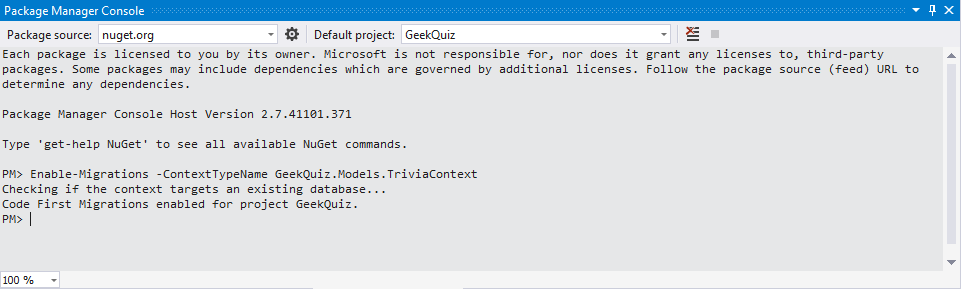

    *Enabling Migrations*

    > [!NOTE]
    > This command adds a **Migrations** folder to Geek Quiz project that contains a file called **Configuration.cs**. The **Configuration** class allows you to configure how Migrations behaves for your context.
5. With Migrations enabled, you need to update the **Configuration** class to populate the database with the initial data that **Geek Quiz** requires. Under **Migrations**, replace the **Configuration.cs** file with the one located in the **Source\Assets** folder of this lab.

    > [!NOTE]
    > Since **Migrations** will call the **Seed** method with every database update, you need to be sure that records are not duplicated in the database. The **AddOrUpdate** method will help to prevent duplicate data.
6. To add an initial migration, enter the following command and then press **Enter**.

    > [!NOTE]
    > Make sure that there is no database named &quot;GeekQuizProd&quot; in your LocalDB instance.

    [!code-powershell[Main](maintainable-azure-websites-managing-change-and-scale/samples/sample2.ps1)]

    

    *Adding base schema migration*

    > [!NOTE]
    > **Add-Migration** will scaffold the next migration based on changes you have made to your model since the last migration was created. In this case, as it is the first migration of the project, it will add the scripts to create all the tables defined in the **TriviaContext** class.
7. Execute the migration to update the database by running the following command. For this command you will specify the **Verbose** flag to view the SQL statements being applied to the target database.

    [!code-powershell[Main](maintainable-azure-websites-managing-change-and-scale/samples/sample3.ps1)]

    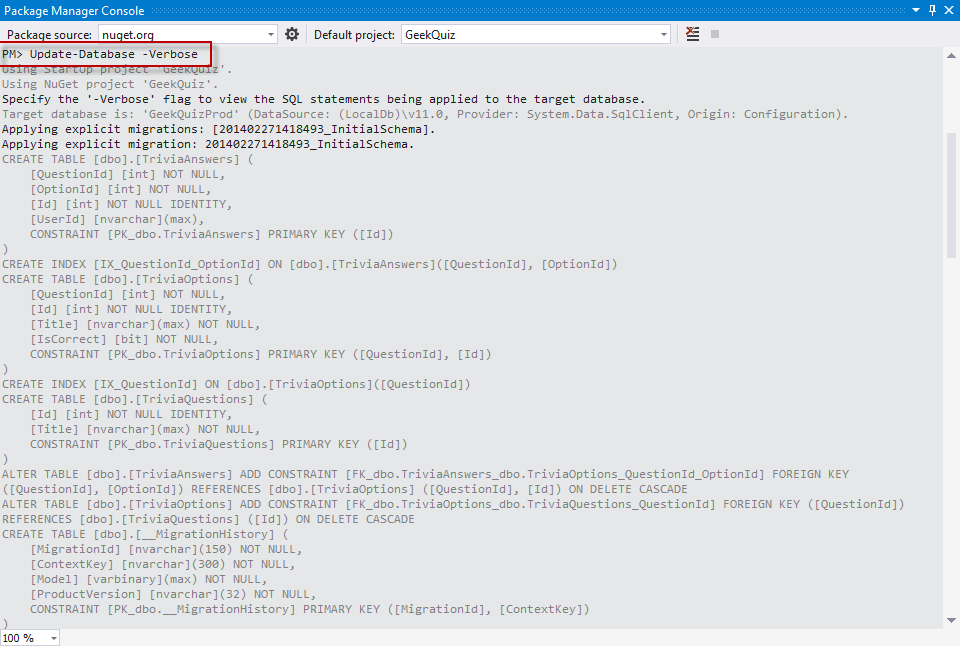

    *Creating initial database*

    > [!NOTE]
    > **Update-Database** will apply any pending migrations to the database. In this case, it will create the database using the connection string defined in your web.config file.
8. Go to **View** menu and open **SQL Server Object Explorer**.

    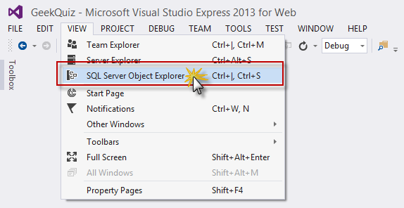

    *Open in SQL Server Object Explorer*
9. In the **SQL Server Object Explorer** window, connect to your LocalDB instance by right-clicking the **SQL Server** node and selecting **Add SQL Server...** option.

    

    *Adding a SQL Server instance to SQL Server Object Explorer*
10. Set the **server name** to *(localdb)\v11.0* and leave **Windows Authentication** as your authentication mode. Click **Connect** to continue.

    

    *Connecting to LocalDB*
11. Open the **GeekQuizProd** database and expand the **Tables** node. As you can see, the **Update-Database** command generated all the tables defined in the **TriviaContext** class. Locate the **dbo.TriviaQuestions** table and open the columns node. In the next task, you will add a new column to this table and update the database using **Migrations**.

    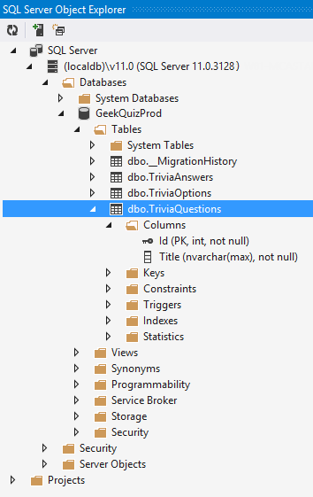

    *Trivia Questions Columns*

#### Task 2 – Updating Database Schema Using Migrations

In this task, you will use **Entity Framework Code First Migrations** to detect a change in your model and generate the necessary code to update the database. You will update the **TriviaQuestions** entity by adding a new property to it. Then you will run commands to create a new Migration to include the new column in the table.

1. In **Solution Explorer**, double-click the **TriviaQuestion.cs** file located inside the **Models** folder.
2. Add a new property named **Hint**, as shown in the following code snippet.

    [!code-csharp[Main](maintainable-azure-websites-managing-change-and-scale/samples/sample4.cs)]
3. In the **Package Manager Console**, enter the following command and then press **Enter**. A new migration will be created reflecting the change in our model.

    [!code-powershell[Main](maintainable-azure-websites-managing-change-and-scale/samples/sample5.ps1)]

    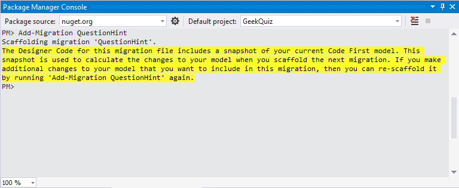

    *Add-Migration*

    > [!NOTE]
    > A Migration file is composed of two methods, **Up** and **Down**.
    > 
    > - The **Up** method will be used to specify what changes the current version of our application need to apply to the database.
    > - The **Down** is used to reverse the changes we have added to the **Up** method.
    > 
    > When the Database Migration updates the database, it will run all migrations in the timestamp order, and only those that have not been used since the last update (The \_MigrationHistory table keeps track of which migrations have been applied). The **Up** method of all migrations will be called and will make the changes we have specified to the database. If we decide to go back to a previous migration, the **Down** method will be called to redo the changes in a reverse order.
4. In the **Package Manager Console**, enter the following command and then press **Enter**.

    [!code-powershell[Main](maintainable-azure-websites-managing-change-and-scale/samples/sample6.ps1)]
5. The output of the **Update-Database** command generated an **Alter Table** SQL statement to add a new column to the **TriviaQuestions** table, as shown in the image below.

    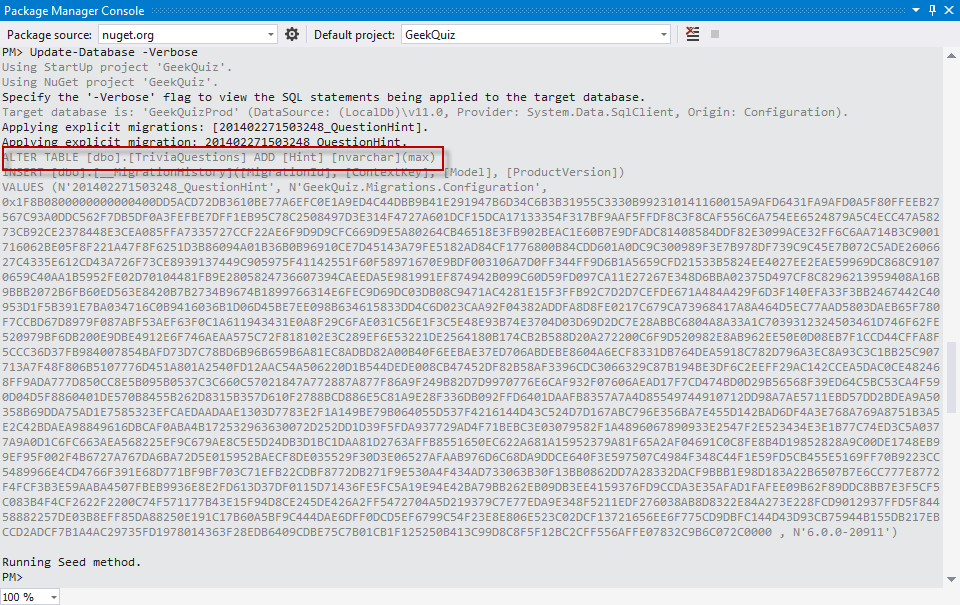

    *Add column SQL statement generated*
6. In **SQL Server Object Explorer**, refresh the **dbo.TriviaQuestions** table and check that the new **Hint** column is displayed.

    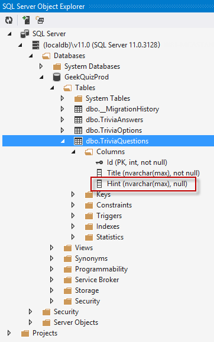

    *Showing the new Hint Column*
7. Back in the **TriviaQuestion.cs** editor, add a **StringLength** constraint to the *Hint* property, as shown in the following code snippet.

    [!code-csharp[Main](maintainable-azure-websites-managing-change-and-scale/samples/sample7.cs)]
8. In the **Package Manager Console**, enter the following command and then press **Enter**.

    [!code-powershell[Main](maintainable-azure-websites-managing-change-and-scale/samples/sample8.ps1)]
9. In the **Package Manager Console**, enter the following command and then press **Enter**.

    [!code-powershell[Main](maintainable-azure-websites-managing-change-and-scale/samples/sample9.ps1)]
10. The output of the **Update-Database** command generated an **Alter Table** SQL statement to update the *hint* column type of the **TriviaQuestions** table, as shown in the image below.

    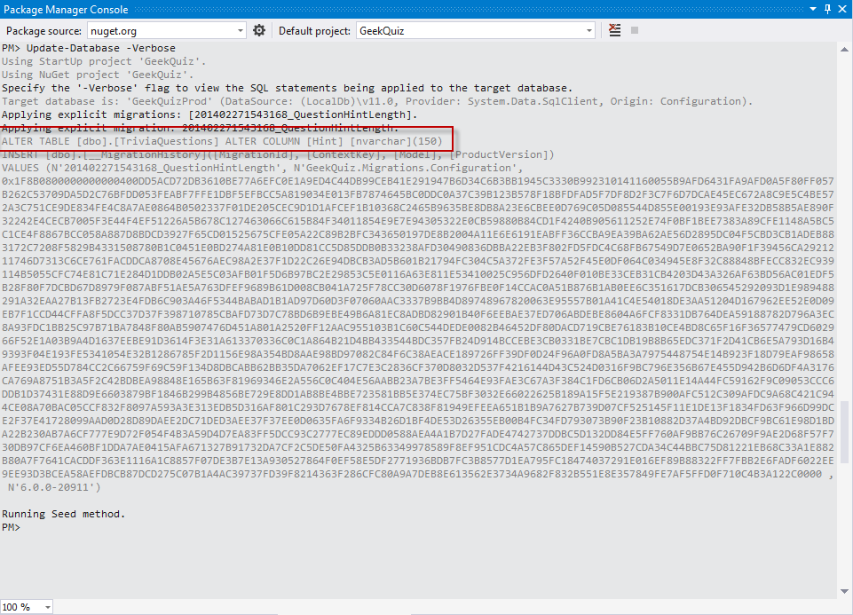

    *Alter column SQL statement generated*
11. In **SQL Server Object Explorer**, refresh the **dbo.TriviaQuestions** table and check that the **Hint** column type is **nvarchar(150)**.

    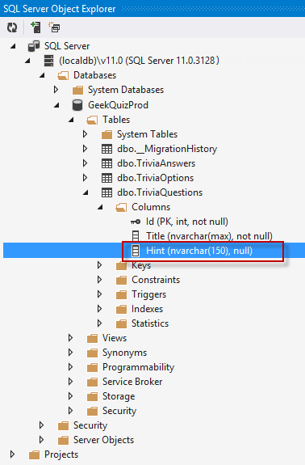

    *Showing the new constraint*

### Exercise 2: Deploying a Web App to Staging

**Web Apps in Azure App Service** enables you to perform staged publishing. Staged publishing creates a staging site slot for each default production site and enables you to swap these slots with no down time. This is really useful to validate changes before releasing to the public, incrementally integrate site content, and roll back if changes are not working as expected.

In this exercise, you will deploy the **Geek Quiz** application to the staging environment of your web app using Git source control. To do this, you will create the web app and provision the required components at the management portal, configure a **Git** repository and push the application source code from your local computer to the staging slot. You will also update your production database with the **Code First Migrations** you created in the previous exercise. You will then execute the application in this test environment to verify its operation. Once you are satisfied that it is working according to your expectations, you will promote the application to production.

> [!NOTE]
> To enable staged publishing, the web app must be in **Standard mode**. Note that additional charges will be incurred if you change your web app to Standard mode. For more information about pricing, see [App Service Pricing](https://azure.microsoft.com/en-us/pricing/details/app-service/).

#### Task 1 – Creating a Web App in Azure App Service

In this task, you will create a web app in **Azure App Service** from the management portal. You will also configure a **SQL Database** to persist the application data, and configure a local Git repository for source control.

1. Go to the [Azure management portal](https://manage.windowsazure.com) and sign in using the Microsoft account associated with your subscription.

    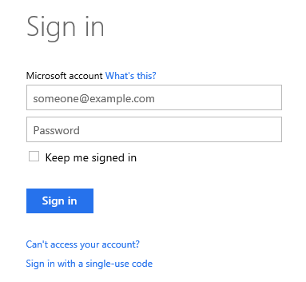

    *Sign in to the Azure management portal*
2. Click **New** in the command bar at the bottom of the page.

    

    *Creating a new web app*
3. Click **Compute**, **Website** and then **Custom Create**.

    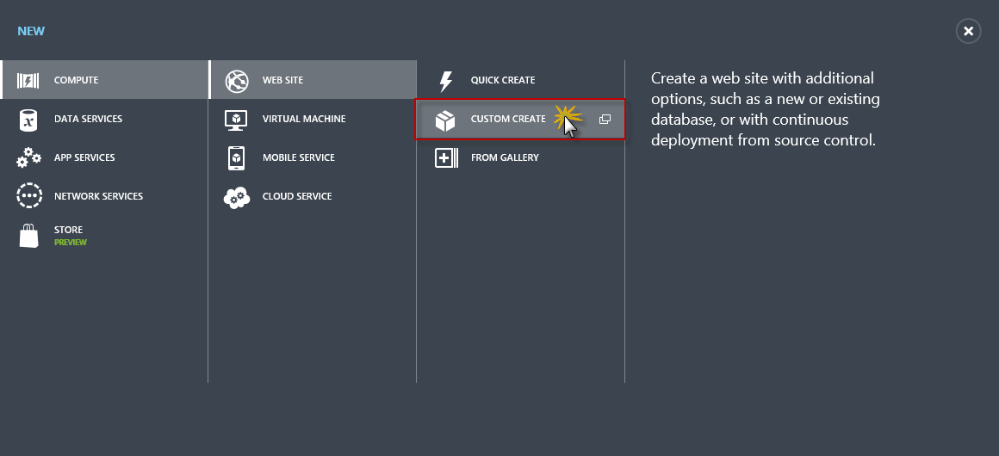

    *Creating a new web app using Custom Create*
4. In the **New Website - Custom Create** dialog box, provide an available **URL** (e.g. *geek-quiz*), select a location in the **Region** drop-down list, and select **Create a new SQL database** in the **Database** drop-down list. Finally, select the **Publish from source control** check box and click **Next**.

    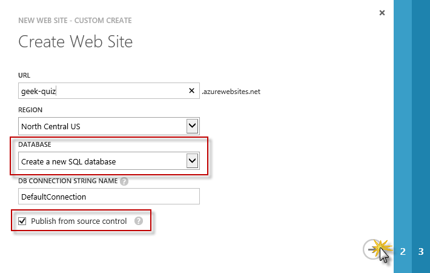

    *Customizing the new web app*
5. Specify the following information for the database settings:

    - In the **Name** text box, enter a database name (e.g. *geekquiz\_db*)
    - In the Server **drop-down** list, select **New SQL database server**. Alternatively, you can select an existing server.
    - In the **Database username** and **Database password** boxes, enter the administrator username and password for the SQL database server. If you select a server you have already created, you will be prompted for the password.

    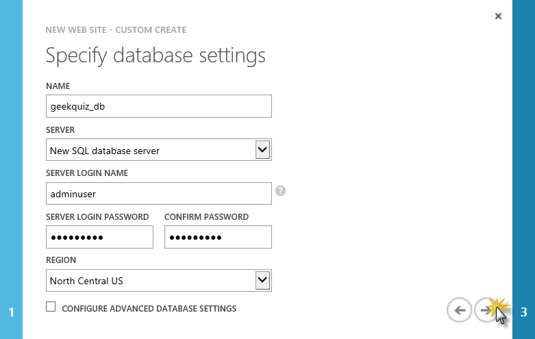

    *Specifying the database settings*
6. Click **Next** to continue.
7. Select **Local Git repository** for the source control to use and click **Next**.

    > [!NOTE]
    > You may be prompted for the deployment credentials (a username and password).

    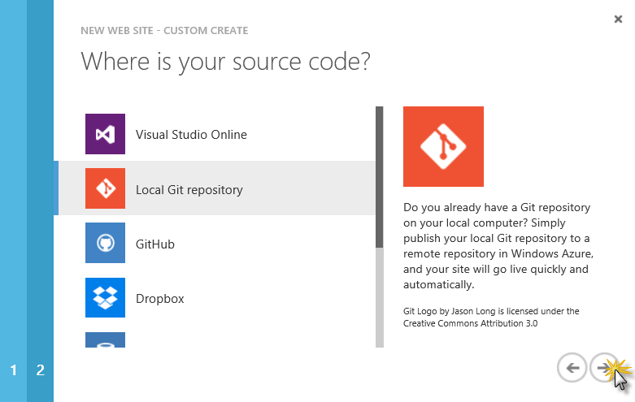

    *Creating the Git repository*
8. Wait until the new web app is created.

    > [!NOTE]
    > By default, Azure provides domains at *azurewebsites.net* but also gives you the possibility to set custom domains using the Azure management portal. However, you can only manage custom domains if you are using certain Azure App Service modes.
    > 
    > Azure App Service is available in Free, Shared, Basic, Standard, and Premium editions. In Free and Shared mode, all web apps run in a multi-tenant environment and have quotas for CPU, Memory, and Network usage. The maximum number of free apps may vary with your plan. In Standard mode, you choose which apps run on dedicated virtual machines that correspond to the standard Azure compute resources. You can find the web app mode configuration in the **Scale** menu of your web app.
    > 
    > 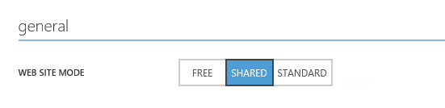
    > 
    > If you are using **Shared** or **Standard** mode, you will be able to manage custom domains for your web app by going to your app's **Configure** menu and clicking **Manage Domains** under *domain names*.
    > 
    > 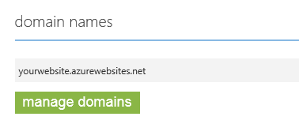
    > 
    > 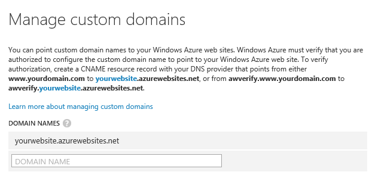
9. Once the web app is created, click the link under the **URL** column to check that the new web app is running.

    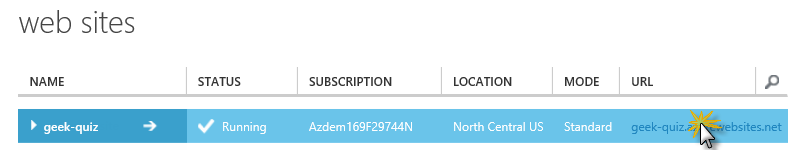

    *Browsing to the new web app*

    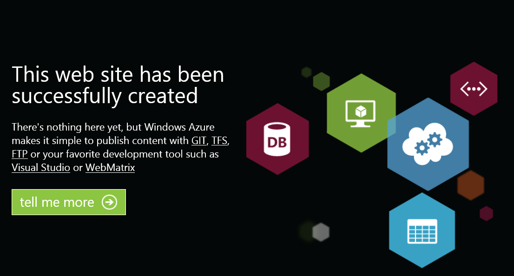

    *web app running*

#### Task 2 – Creating the Production SQL Database

In this task, you will use the **Entity Framework Code First Migrations** to create the database targeting the **Azure SQL Database** instance you created in the previous task.

1. In the Management Portal, navigate to the web app you created in the previous task and go to its **Dashboard**.
2. In the **Dashboard** page, click **View connection strings** link under the **quick glance** section.

    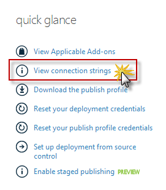

    *View connection strings*
3. Copy the **connection string** value and close the dialog box.

    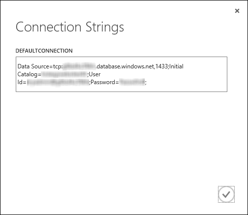

    *Connection String in Azure Management Portal*
4. Click **SQL Databases** to see the list of SQL databases in Azure

    

    *SQL Database menu*
5. Locate the database you created in the previous task and click on the Server.

    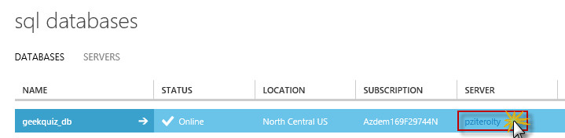

    *SQL Database server*
6. In the **Quick Start** page of the server, click on **Configure**.

    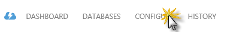

    *Configure menu*
7. In the **Allowed IP addresses** section, click on **Add to the allowed IP addresses** link to enable your IP to connect to the SQL Database server.

    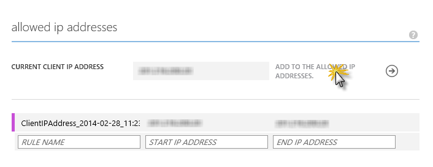

    *Allowed IP addresses*
8. Click **Save** at the bottom of the page to complete the step.
9. Switch back to Visual Studio.
10. In the **Package Manager Console**, execute the following command replacing *[YOUR-CONNECTION-STRING]* placeholder with the connection string you copied from Azure

    [!code-powershell[Main](maintainable-azure-websites-managing-change-and-scale/samples/sample10.ps1)]

    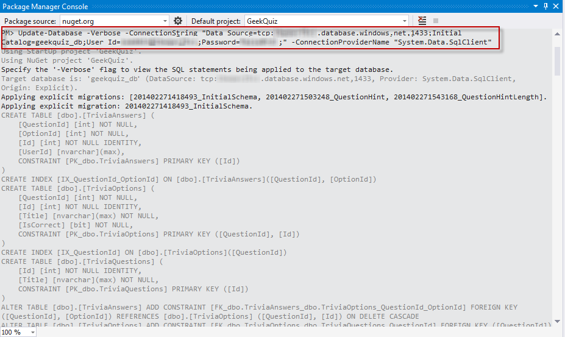

    *Update database targeting Azure SQL Database*

#### Task 3 – Deploying Geek Quiz to Staging Using Git

In this task, you will enable staged publishing in your web app. Then, you will use Git to publish the Geek Quiz application directly from your local computer to the staging environment of your web app.

1. Go back to the portal and click the name of the web app under the **Name** column to display the management pages.

    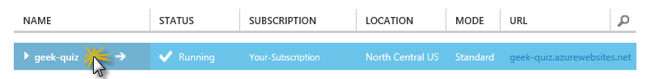

    *Opening the web app management pages*
2. Navigate to the **Scale** page. Under the **general** section, select **Standard** for the configuration and click **Save** in the command bar.

    > [!NOTE]
    > To run all web apps in the current region and subscription in **Standard** mode, leave the **Select All** check box selected in the **Choose Sites** configuration. Otherwise, clear the **Select All** check box.

    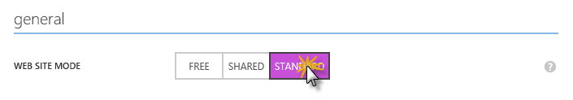

    *Upgrading the Web App to Standard mode*
3. Click **Yes** to confirm the changes.

    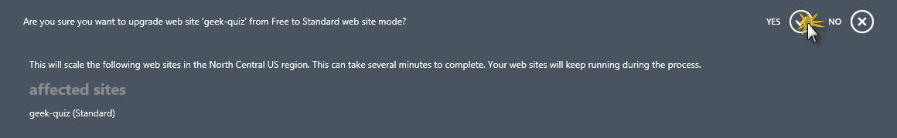

    *Confirming the change to Standard mode*
4. Go to the **Dashboard** page and click **Enable staged publishing** under the **quick glance** section.

    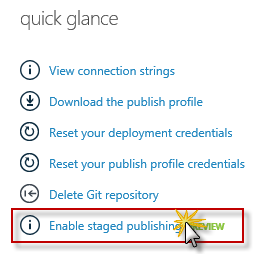

    *Enabling staged publishing*
5. Click **Yes** to enable staged publishing.

    

    *Confirming staged publishing*
6. In the list of web apps, expand the mark to the left of your web app name to display the staging site slot. It has the name of your web app followed by ***(staging)***. Click the staging site to go to the management page.

    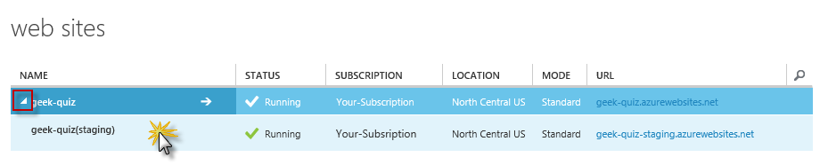

    *Navigating to the staging app*
7. Notice that he management page looks like any other web app's management page. Navigate to the **Deployments** page and copy the **Git URL** value. You will use it later in this exercise.

    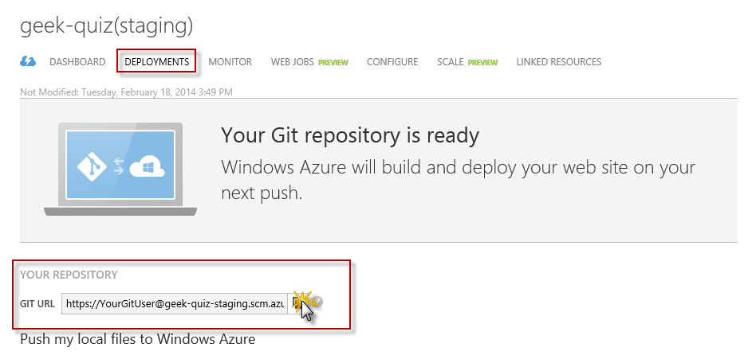

    *Copying the Git URL value*
8. Open a new **Git Bash** console and execute the following commands. Update the *[YOUR-APPLICATION-PATH]* placeholder with the path to the **GeekQuiz** solution, located in the **Source\Ex1-DeployingWebSiteToStaging\Begin** folder of this lab.

    [!code-console[Main](maintainable-azure-websites-managing-change-and-scale/samples/sample11.cmd)]

    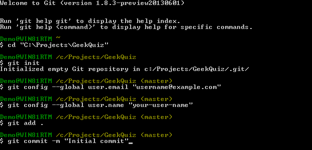

    *Git initialization and first commit*
9. Run the following command to push your web app to the remote **Git** repository. Replace the placeholder with the URL you obtained from the management portal. You will be prompted for your deployment password.

    [!code-console[Main](maintainable-azure-websites-managing-change-and-scale/samples/sample12.cmd)]

    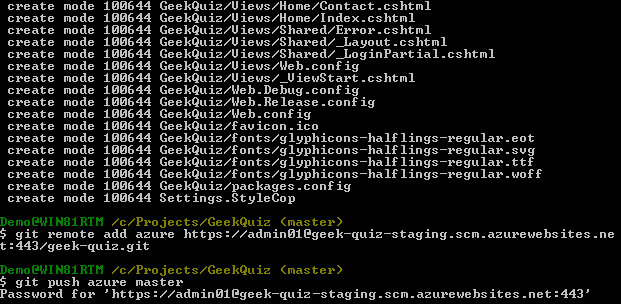

    *Pushing to Azure*

    > [!NOTE]
    > When you deploy content to the FTP host or GIT repository of a web app, you must authenticate using the **deployment credentials** that you created from the web app's **Quick Start** or **Dashboard** management pages. If you do not know your deployment credentials you can easily reset them using the management portal. Open the web app **Dashboard** page and click the **Reset your deployment credentials** link. Provide a new password and click **OK**. Deployment credentials are valid for use with all web apps associated with your subscription.
10. In order to verify the web app was successfully pushed to Azure, go back to the management portal and click **Websites**.
11. Locate your web app and expand the entry to display the staging site slot. Click its **Name** to go to the management page.
12. Click **Deployments** to see the **deployment history**. Verify that there is an **Active Deployment** with your *&quot;Initial Commit&quot;*.

    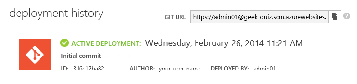

    *Active deployment*
13. Finally, click **Browse** in the command bar to go to the web app.

    

    *Browse web app*
14. If the application is successfully deployed, you will see the Geek Quiz login page.

    > [!NOTE]
    > The address URL of the deployed application contains the name of your web app followed by *-staging*.

    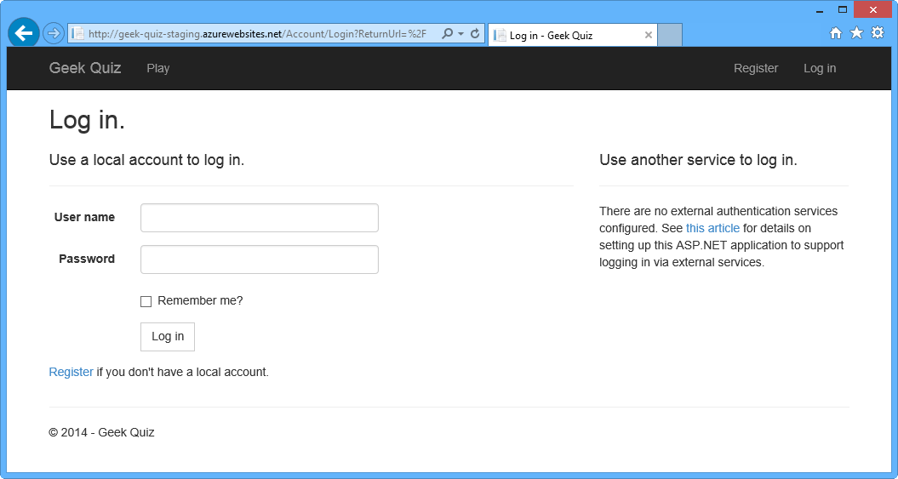

    *Application running in the staging environment*
15. If you wish to explore the application, click **Register** to register a new user. Complete the account details by entering a user name, email address and password. Next, the application shows the first question of the quiz. Answer a few questions to make sure it is working as expected.

    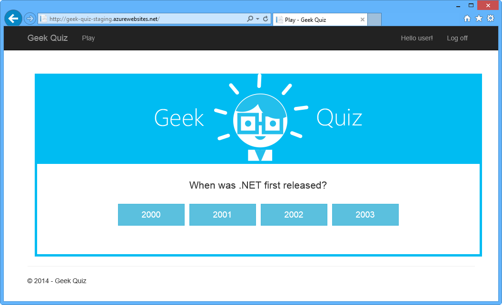

    *Application ready to be used*

#### Task 4 – Promoting the Web App to Production

Now that you have verified that the web app is working correctly in the staging environment, you are ready to promote it to production. In this task, you will swap the staging site slot with the production site slot.

1. Go back to the management portal and select the staging site slot. Click **Swap** in the command bar.

    

    *Swap to production*
2. Click **Yes** in the confirmation dialog box to proceed with the swap operation. Azure will immediately swap the content of the production site with the content of the staging site.

    > [!NOTE]
    > Some settings from the staged version will automatically be copied to the production version (e.g. connection string overrides, handler mappings, etc.) but other settings will not change (e.g. DNS endpoints, SSL bindings, etc.).

    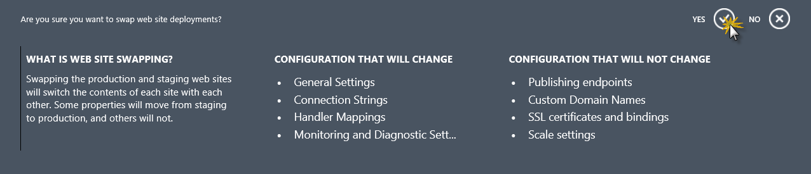

    *Confirming swap operation*
3. Once the swap is complete, select the production slot and click **Browse** in the command bar to open the production site. Notice the URL in the address bar.

    > [!NOTE]
    > You might need to refresh your browser to clear cache. In Internet Explorer, you can do this by pressing **CTRL+R**.

    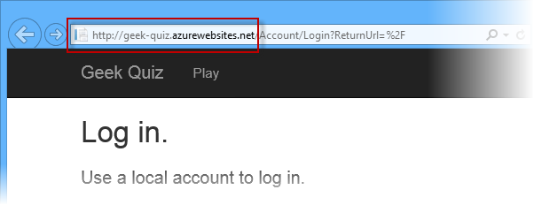
4. In the **GitBash** console, update the remote URL for the local Git repository to target the production slot. To do this, run the following command replacing the placeholders with your deployment username and the name of your web app.

    > [!NOTE]
    > In the following exercises, you will push changes to the production site instead of staging just for the simplicity of the lab. In a real-world scenario, it is recommended to verify the changes in the staging environment before promoting to production.

    [!code-console[Main](maintainable-azure-websites-managing-change-and-scale/samples/sample13.cmd)]

### Exercise 3: Performing Deployment Rollback in Production

There are scenarios where you do not have a staging slot to perform hot swap between staging and production, for example, if you are working with **Free** or **Shared** mode. In those scenarios, you should test your application in a testing environment –either locally or in a remote site– before deploying to production. However, it is possible that an issue not detected during the testing phase may arise in the production site. In this case, it is important to have a mechanism to easily switch to a previous and more stable version of the application as quickly as possible.

In **Azure App Service**, continuous deployment from source control makes this possible thanks to the **redeploy** action available in the management portal. Azure keeps track of the deployments associated with the commits pushed to the repository and provides an option to redeploy your application using any of your previous deployments, at any time.

In this exercise you will perform a change to the code in the **Geek Quiz** application that intentionally injects a *bug*. You will deploy the application to production to see the error, and then you will take advantage of the redeploy feature to go back to the previous state.

#### Task 1 – Updating the Geek Quiz Application

In this task, you will refactor a small piece of code of the **TriviaController** class to extract part of the logic that retrieves the selected quiz option from the database into a new method.

1. Switch to the Visual Studio instance with the **GeekQuiz** solution from the previous exercise.
2. In **Solution Explorer**, open the **TriviaController.cs** file inside the **Controllers** folder.
3. Locate the **StoreAsync** method and select the code highlighted in the following figure.

    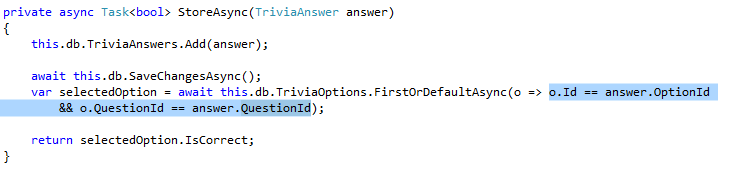

    *Selecting the code*
4. Right-click the selected code, expand the **Refactor** menu and select **Extract Method...**.

    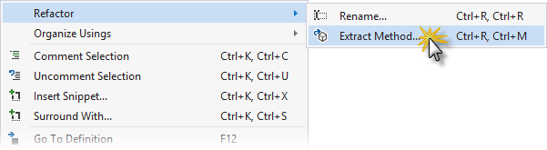

    *Selecting Extract Method*
5. In the **Extract Method** dialog box, name the new method *MatchesOption* and click **OK**.

    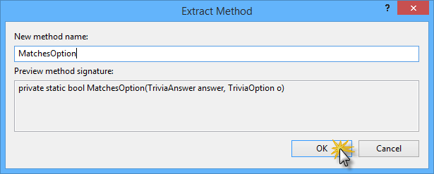

    *Specifying the name for the extracted method*
6. The selected code is then extracted into the **MatchesOption** method. The resulting code is shown in the following snippet.

    [!code-csharp[Main](maintainable-azure-websites-managing-change-and-scale/samples/sample14.cs)]
7. Press **CTRL + S** to save the changes.

#### Task 2 – Redeploying the Geek Quiz Application

You will now push the changes you made in the previous task to the repository, which will trigger a new deployment to the production environment. Then, you will troubleshot an issue using the **F12 development tools** provided by Internet Explorer, and then perform a rollback to the previous deployment from the Azure management portal.

1. Open a new **Git Bash** console to deploy the updated application to Azure App Service.
2. Execute the following commands to push the changes to Azure. Update the *[YOUR-APPLICATION-PATH]* placeholder with the path to the **GeekQuiz** solution. You will be prompted for your deployment password.

    [!code-console[Main](maintainable-azure-websites-managing-change-and-scale/samples/sample15.cmd)]

    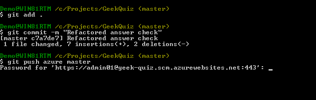

    *Pushing refactored code to Azure*
3. Open Internet Explorer and navigate to your web app (e.g. `http://<your-web-site>.azurewebsites.net`). Log in using the previously created credentials.
4. Press **F12** to launch the development tools, select the **Network** tab and click the **Play** button to start recording.

    

    *Starting network recording*
5. Select any option of the quiz. You will see that nothing happens.
6. In the **F12** window, the entry corresponding to the POST HTTP request shows an HTTP **500** result.

    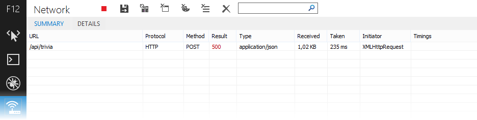

    *HTTP 500 error*
7. Select the **Console** tab. An error is logged with the details of the cause.

    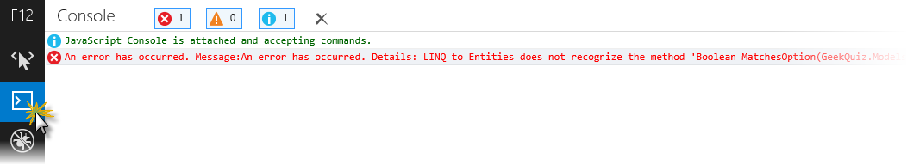

    *Logged error*
8. Locate the details part of the error. Clearly, this error is caused by the code refactoring you committed in the previous steps.

    `Details: LINQ to Entities does not recognize the method 'Boolean MatchesOption ...`.
9. Do not close the browser.
10. In a new browser instance, navigate to the [Azure management portal](https://manage.windowsazure.com) and sign in using the Microsoft account associated with your subscription.
11. Select **Websites** and click the web app you created in Exercise 2.
12. Navigate to the **Deployments** page. Notice that all the commits performed are listed in the deployment history.

    

    *List of existing deployments*
13. Select the previous commit and click **Redeploy** on the command bar.

    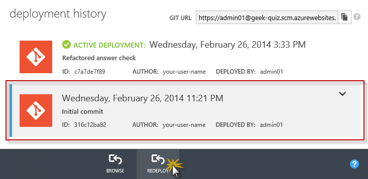

    *Redeploying the previous commit*
14. When prompted to confirm, click **Yes**.

    
15. When the deployment completes, switch back to the browser instance with your web app and press **CTRL + F5**.
16. Click any of the options. The flip animation will now take place and the result (*correct/incorrect*) will be displayed.
17. (Optional) Switch to the **Git Bash** console and execute the following commands to revert to the previous commit.

    > [!NOTE]
    > These commands create a new commit that undoes all changes in the Git repository that were made in the bad commit. Azure will then redeploy the application using the new commit.

    [!code-console[Main](maintainable-azure-websites-managing-change-and-scale/samples/sample16.cmd)]

### Exercise 4: Scaling Using Azure Storage

**Blobs** are the simplest way to store large amounts of unstructured text or binary data such as video, audio and images. Moving the static content of your application to Storage, helps to scale your application by serving images or documents directly to the browser.

In this exercise, you will move the static content of your application to a Blob container. Then you will configure your application to add an **ASP.NET URL rewrite rule** in the **Web.config** to redirect your content to the Blob container.

#### Task 1 – Creating an Azure Storage Account

In this task you will learn how to create a new storage account using the management portal.

1. Navigate to the [Azure management portal](https://manage.windowsazure.com) and sign in using the Microsoft account associated with your subscription.
2. Select **New | Data Services | Storage | Quick Create** to start creating a new storage account. Enter a unique name for the account and select a **Region** from the list. Click **Create Storage Account** to continue.

    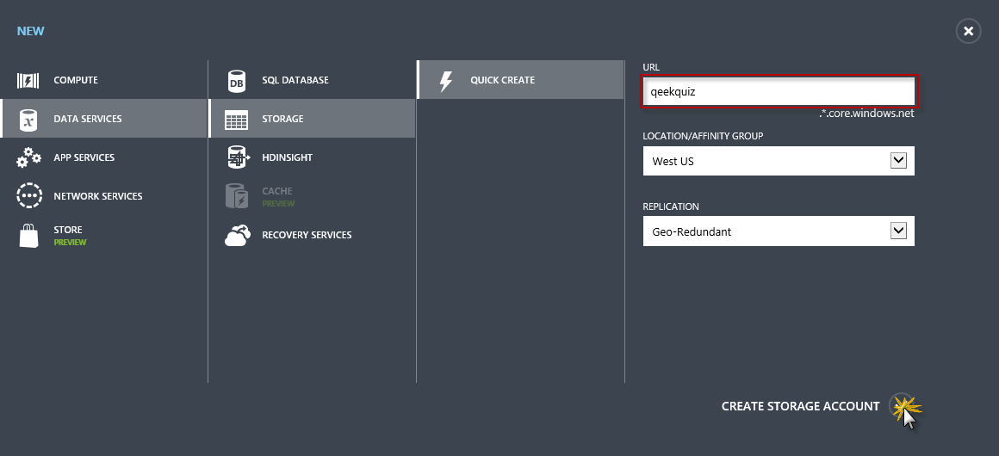

    *Creating a new storage account*
3. In the **Storage** section, wait until the status of the new storage account changes to *Online* in order to continue with the following step.

    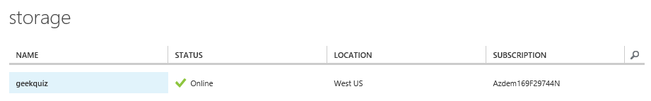

    *Storage Account created*
4. Click on the storage account name and then click the **Dashboard** link at the top of the page. The **Dashboard** page provides you with information about the status of the account and the service endpoints that can be used within your applications.

    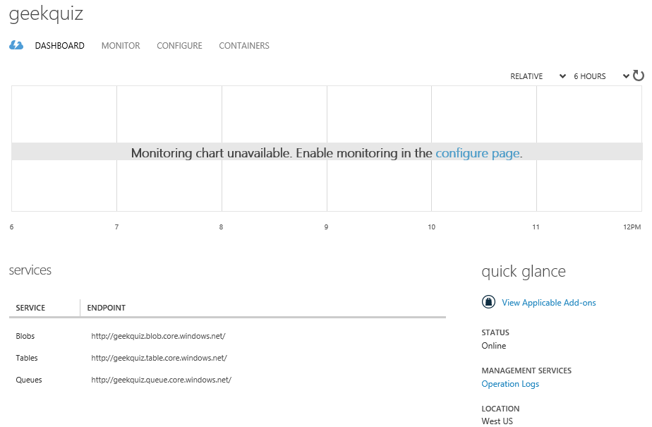

    *Displaying the Storage Account Dashboard*
5. Click the **Manage Access Keys** button in the navigation bar.

    

    *Manage Access Keys button*
6. In the **Manage Access Keys** dialog box, copy the **Storage Account Name** and **Primary Access Key** as you will need them in the following exercise. Then, close the dialog box.

    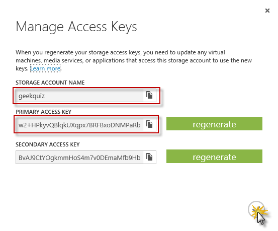

    *Manage Access Key dialog box*

#### Task 2 – Uploading an Asset to Azure Blob Storage

In this task, you will use the Server Explorer window from Visual Studio to connect to your storage account. You will then create a blob container and upload a file with the Geek Quiz logo to the container.

1. Switch to the Visual Studio instance with the **GeekQuiz** solution from the previous exercise.
2. From the menu bar, select **View** and then click **Server Explorer**.
3. In **Server Explorer**, right-click the **Azure** node and select **Connect to Azure...**. Sign in using the Microsoft account associated with your subscription.

    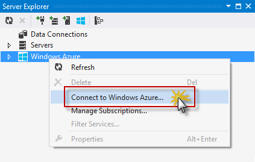

    *Connect to Azure*
4. Expand the **Azure** node, right-click **Storage** and select **Attach External Storage...**.
5. In the **Add New Storage Account** dialog box, enter the **Account name** and **Account key** you obtained in the previous task and click **OK**.

    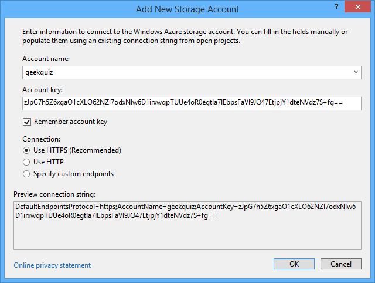

    *Add New Storage Account dialog box*
6. Your storage account should appear under the **Storage** node. Expand your storage account, right-click **Blobs** and select **Create Blob Container...**.

    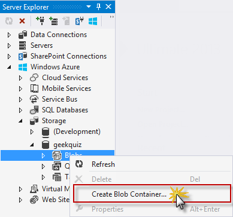

    *Create Blob Container*
7. In the **Create Blob Container** dialog box, enter a name for the blob container and click **OK**.

    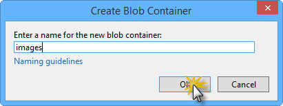

    *Create Blob Container dialog box*
8. The new blob container should be added to the **Blobs** node. Change the access permissions in the container to make the container public. To do this, right-click the **images** container and select **Properties**.

    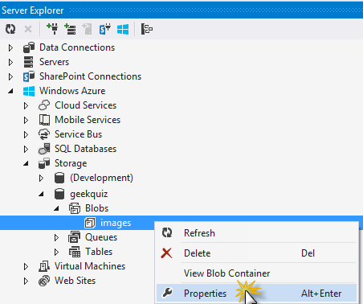

    *Images container properties*
9. In the **Properties** window, set the **Public Read Access** to **Container**.

    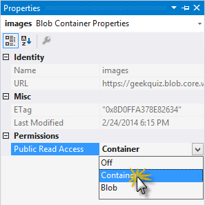

    *Changing public read access property*
10. When prompted if you are sure you want to change the public access property, click **Yes**.

    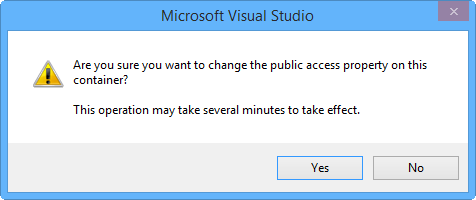

    *Microsoft Visual Studio warning*
11. In **Server Explorer**, right-click in the **images** blob container and select **View Blob Container**.

    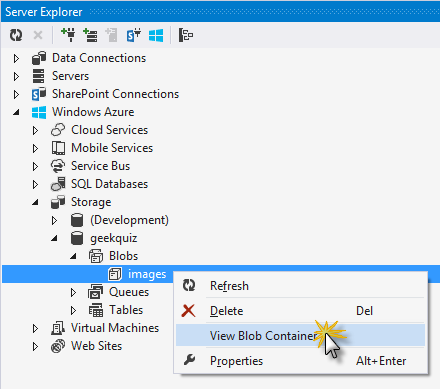

    *View Blob Container*
12. The images container should open in a new window and a legend with no entries should be shown. Click the **upload** icon to upload a file to the blob container.

    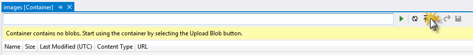

    *Images container with no entries*
13. In the **Upload Blob** dialog box, navigate to the **Assets** folder of the lab. Select the **logo-big.png** file and click **Open**.
14. Wait until the file is uploaded. When the upload completes, the file should be listed in the images container. Right-click the file entry and select **Copy URL**.

    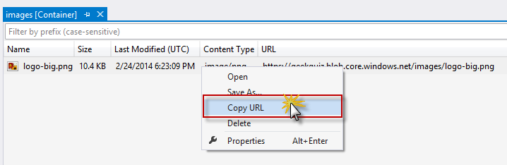

    *Copy blob URL*
15. Open Internet Explorer and paste the URL. The following image should be shown in the browser.

    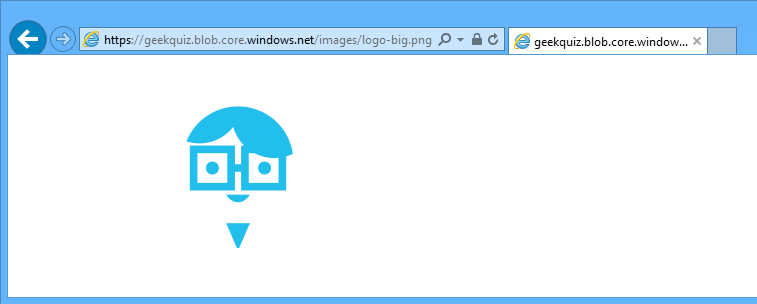

    *logo-big.png image from Azure Blob Storage*

#### Task 3 – Updating the Solution to Consume Static Content from Azure Blob Storage

In this task, you will configure the **GeekQuiz** solution to consume the image uploaded to Azure Blob Storage (instead of the image located in the web app) by adding an ASP.NET URL rewrite rule in the **web.config** file.

1. In Visual Studio, open the **Web.config** file inside the **GeekQuiz** project and locate the **&lt;system.webServer&gt;** element.
2. Add the following code to add an URL rewrite rule, updating the placeholder with your storage account name.

    (Code Snippet - *WebSitesInProduction - Ex4 - UrlRewriteRule*)

    [!code-xml[Main](maintainable-azure-websites-managing-change-and-scale/samples/sample17.xml)]

    > [!NOTE]
    > URL rewriting is the process of intercepting an incoming Web request and redirecting the request to a different resource. The URL rewriting rules tells the rewriting engine when a request needs to be redirected, and where should they be redirected. A rewriting rule is composed of two strings: the pattern to look for in the requested URL (usually, using regular expressions), and the string to replace the pattern with, if found. For more information, see [URL Rewriting in ASP.NET](https://msdn.microsoft.com/en-us/library/ms972974.aspx).
3. Press **CTRL + S** to save the changes.
4. Open a new **Git Bash** console to deploy the updated application to Azure App Service.
5. Execute the following commands to push the changes to Azure. Update the *[YOUR-APPLICATION-PATH]* placeholder with the path to the **GeekQuiz** solution. You will be prompted for your deployment password.

    [!code-console[Main](maintainable-azure-websites-managing-change-and-scale/samples/sample18.cmd)]

    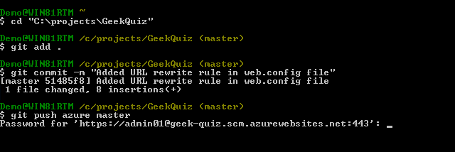

    *Deploying update to Azure*

#### Task 4 – Verification

In this task you will use **Internet Explorer** to browse the **Geek Quiz** application and check that the URL rewrite rule for images works and you are redirected to the image hosted on **Azure Blob Storage**.

1. Open Internet Explorer and navigate to your web app (e.g. `http://<your-web-site>.azurewebsites.net`). Log in using the previously created credentials.

    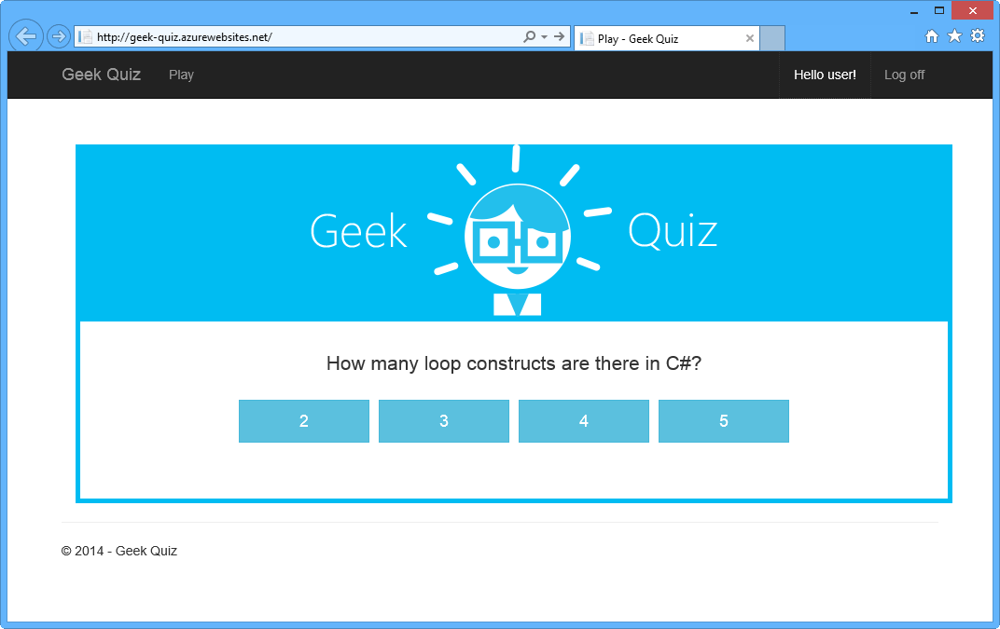

    *Showing the Geek Quiz web app with the image*
2. Press **F12** to launch the development tools, select the **Network** tab and start recording.

    

    *Starting network recording*
3. Press **CTRL + F5** to refresh the web page.
4. Once the page has finished loading, you should see an HTTP request for the **/img/logo-big.png** URL with an HTTP **301** result (redirect) and another request for `http://[YOUR-STORAGE-ACCOUNT].blob.core.windows.net/images/logo-big.png` URL with a HTTP **200** result.

    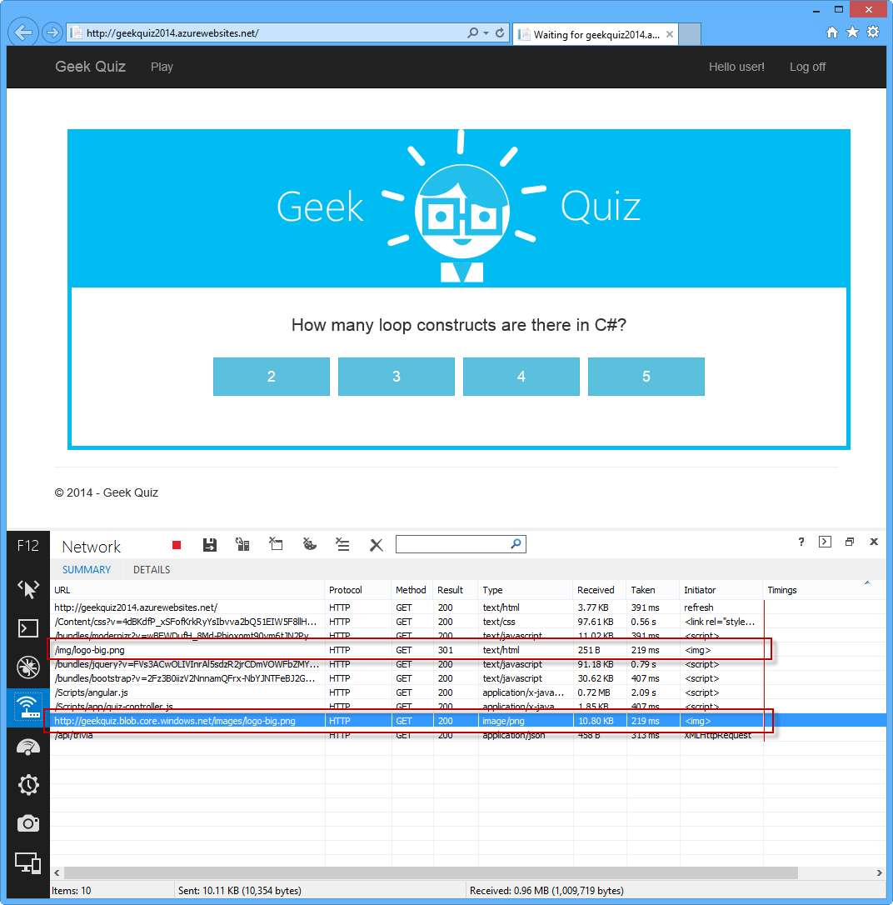

    *Verifying the URL redirect*

### Exercise 5: Using Autoscale for Web Apps

> [!NOTE]
> This exercise is optional, since it requires support for Web Load &amp; Performance Testing which is only available for **Visual Studio 2013 Ultimate Edition**. For more information on specific Visual Studio 2013 features, compare versions [here](https://www.microsoft.com/visualstudio/eng/products/compare).

**Azure App Service Web Apps** provides the Autoscale feature for web apps running in **Standard Mode**. Autoscale lets Azure automatically scale the instance count of your web app depending on the load. When Autoscale is enabled, Azure checks the CPU of your web app once every five minutes and adds instances as needed at that point in time. If the CPU usage is low, Azure will remove instances once every two hours to ensure that the performance of your web app is not degraded.

In this exercise you will go through the steps required to configure the **Autoscale** feature for the **Geek Quiz** web app. You will verify this feature by running a Visual Studio load test to generate enough CPU load on the application to trigger an instance upgrade.

#### Task 1 – Configuring Autoscale Based on the CPU Metric

In this task you will use the Azure management portal to enable the Autoscale feature for the web app you created in Exercise 2.

1. In the [Azure management portal](https://manage.windowsazure.com/), select **Websites** and click the web app you created in Exercise 2.
2. Navigate to the **Scale** page. Under the **capacity** section, select **CPU** for the **Scale by Metric** configuration.

    > [!NOTE]
    > When scaling by CPU, Azure dynamically adjusts the number of instances that the app uses if the CPU usage changes.

    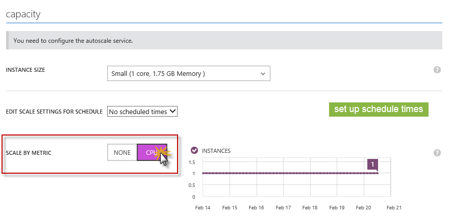

    *Selecting to scale by CPU*
3. Change the **Target CPU** configuration to **20**-**40** percent.

    > [!NOTE]
    > This range represents the average CPU usage for your web app. Azure will add or remove instances to keep your web app in this range. The minimum and maximum number of instances used for scaling is specified in the **Instance Count** configuration. Azure will never go above or beyond that limit.
    > 
    > The default **Target CPU** values are modified just for the purposes of this lab. By configuring the CPU range with small values, you are increasing the chances to trigger Autoscale when a moderate load is placed on the application.

    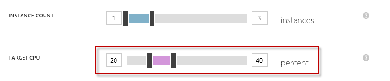

    *Changing the Target CPU to be between 20 and 40 percent*
4. Click **Save** in the command bar to save the changes.

#### Task 2 – Load Testing with Visual Studio

Now that **Autoscale** has been configured, you will create a **Web Performance and Load Test Project** in Visual Studio to generate some CPU load on your web app.

1. Open **Visual Studio Ultimate 2013** and select **File | New | Project...** to start a new solution.

    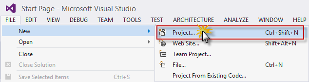

    *Creating a new project*
2. In the **New Project** dialog box, select **Web Performance and Load Test Project** under the **Visual C# | Test** tab. Make sure **.NET Framework 4.5** is selected, name the project *WebAndLoadTestProject*, choose a **Location** and click **OK**.

    

    *Creating a new Web and Load Test project*
3. In the **WebTest1.webtest** Right-click the **WebTest1** node and click **Add Request**.

    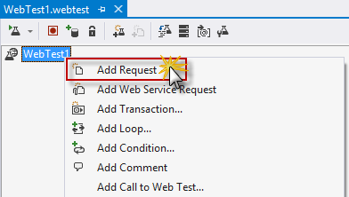

    *Adding a request to WebTest1*
4. In the **Properties** window of the new request node, update the **Url** property to point to the URL of your web app (e.g. *[http://geek-quiz.azurewebsites.net/](http://geek-quiz.azurewebsites.net/)*).

    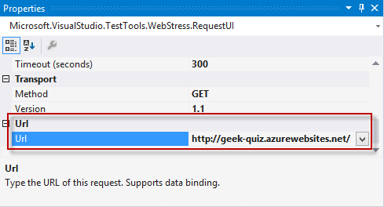

    *Changing the Url property*
5. In the **WebTest1.webtest** window, right-click **WebTest1** and click **Add Loop...**.

    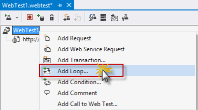

    *Adding a loop to WebTest1*
6. In the **Add Conditional Rule and Items to Loop** dialog box, select the **For Loop** rule and modify the following properties.

    1. **Terminating value:** 1000
    2. **Context Parameter Name:** Iterator
    3. **Increment Value:** 1

    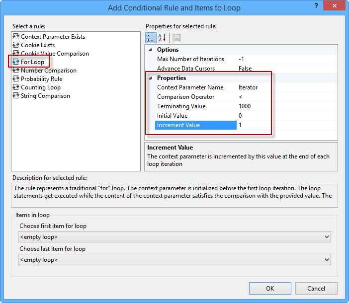

    *Selecting the For Loop rule and updating the properties*
7. Under the **Items in loop** section, select the request you created previously to be the first and last item for the loop. Click **OK** to continue.

    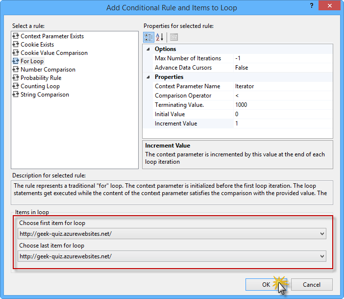

    *Selecting the first and last items for the loop*
8. In **Solution Explorer**, right-click the **WebAndLoadTestProject** project, expand the **Add** menu and select **Load Test...**.

    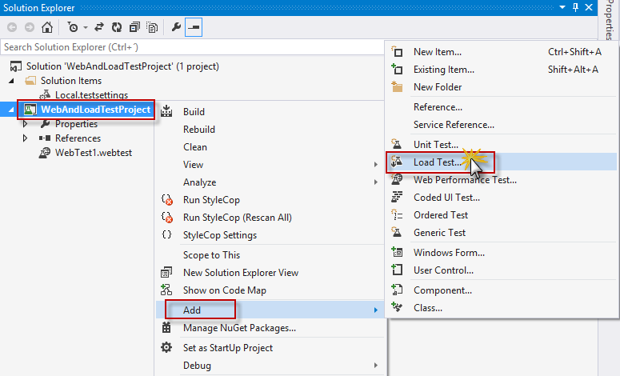

    *Adding a Load Test to the WebAndLoadTestProject project*
9. In the **New Load Test Wizard** dialog box, click **Next**.

    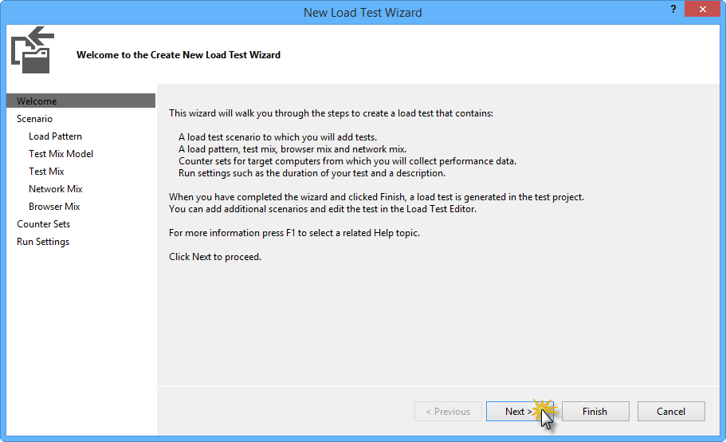

    *New Load Test Wizard*
10. In the **Scenario** page, select **Do not use think times** and click **Next**.

    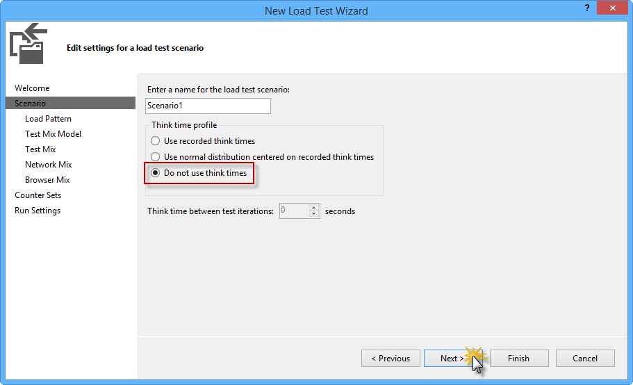

    *Selecting not to use think times*
11. In the **Load Pattern** page, make sure that the **Constant Load** option is selected. Change the **User Count** setting to **250** users and click **Next**.

    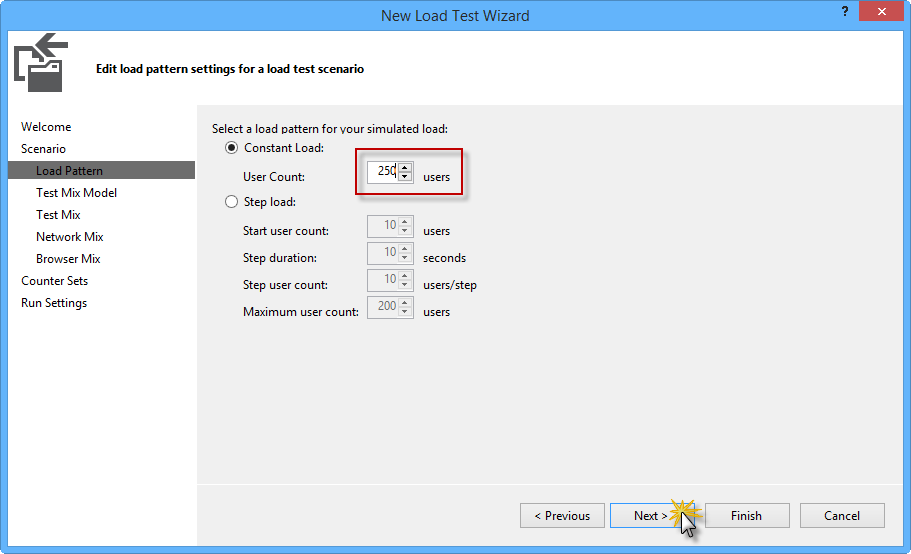

    *Changing the user count to 250*
12. In the **Test Mix Model** page, select **Based on sequential test order** and click **Next**.

    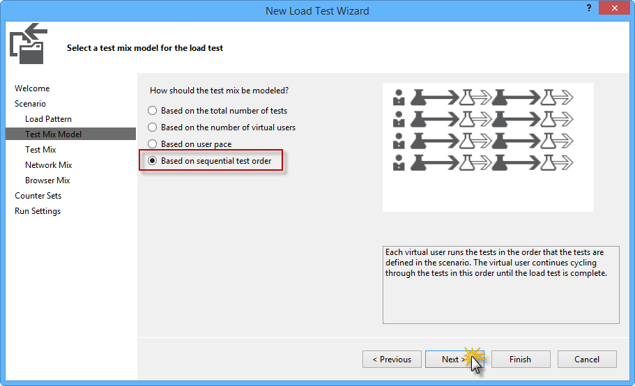

    *Selecting the test mix model*
13. In the **Test Mix Model** page, click **Add...** to add a test to the mix.

    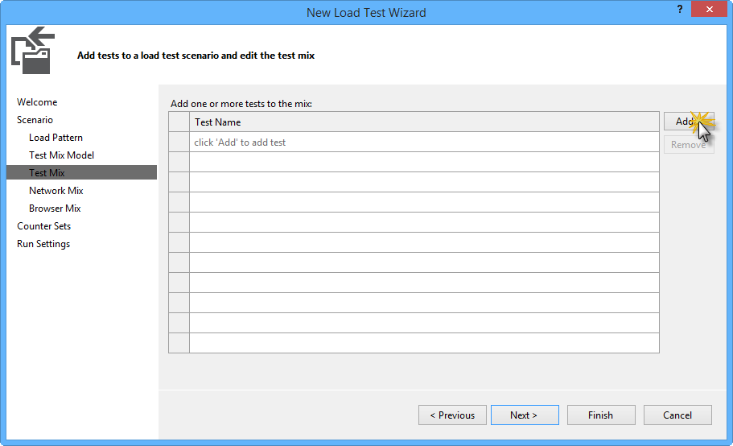

    *Adding a test to the test mix*
14. In the **Add Tests** dialog box, double-click **WebTest1** to add the test to the **Selected tests** list. Click **OK** to continue.

    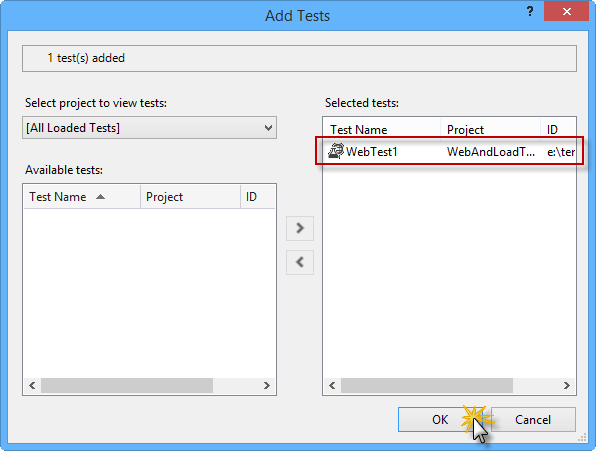

    *Adding the WebTest1 test*
15. Back in the **Test Mix** page, click **Next**.

    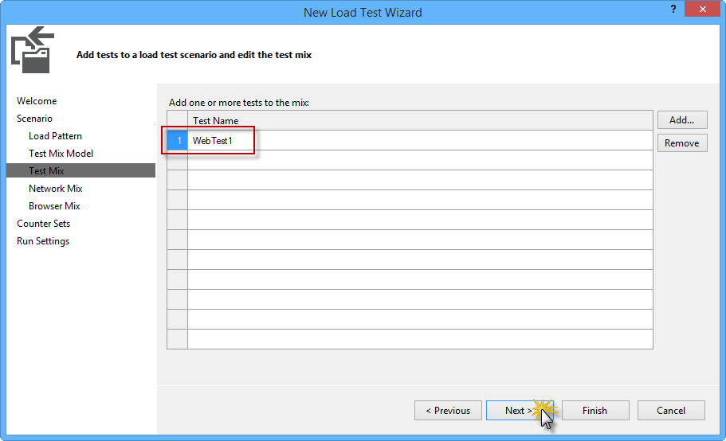

    *Completing the Test Mix page*
16. In the **Network Mix** page, click **Next**.

    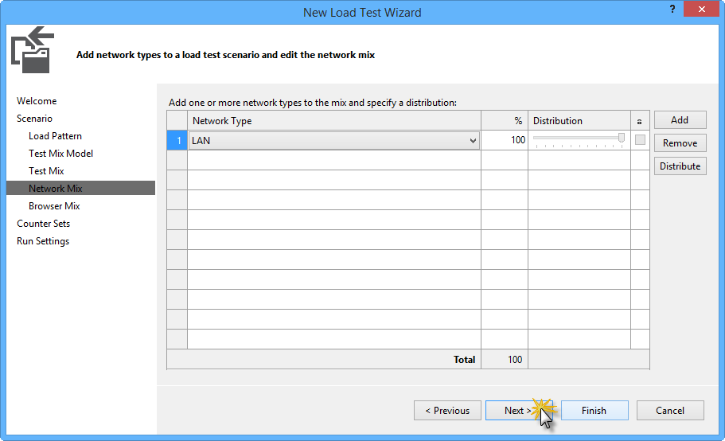

    *Clicking next in the Network Mix page*
17. In the **Browser Mix** page, select **Internet Explorer 10.0** as the browser type and click **Next**.

    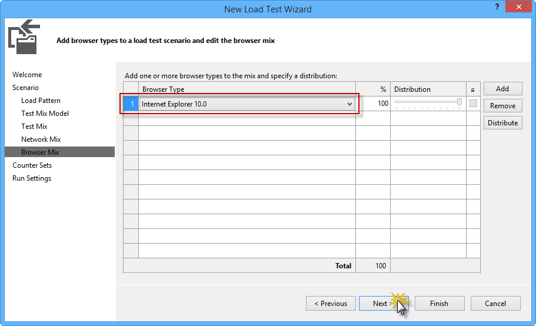

    *Selecting the browser type*
18. In the **Counter Sets** page, click **Next**.

    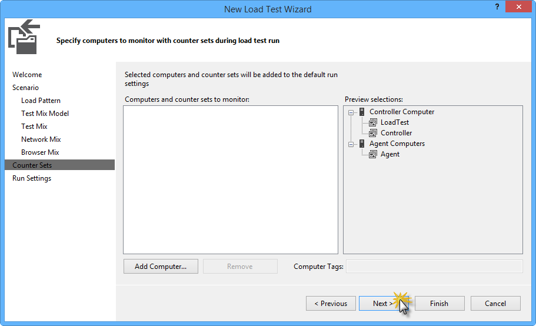

    *Clicking Next in the Counter Sets page*
19. In the **Run Settings** page, set the **Load test duration** to **5 minutes** and click **Finish**.

    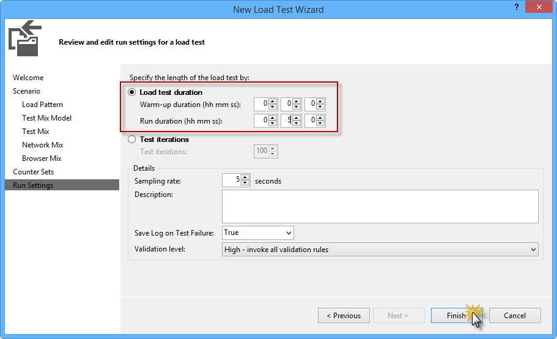

    *Setting the load test duration to 5 minutes*
20. In **Solution Explorer**, double-click the **Local.settings** file to explore the test settings. By default, Visual Studio uses your local computer to run the tests.

    > [!NOTE]
    > Alternatively, you can configure your test project to run the load tests in the cloud using **Visual Studio Online (VSO)**. VSO provides a cloud-based load testing service that simulates a more realistic load, avoiding local environment constraints like CPU capacity, available memory and network bandwidth. For more information about using VSO to run load tests, see [this article](https://www.visualstudio.com/get-started/load-test-your-app-vs).

    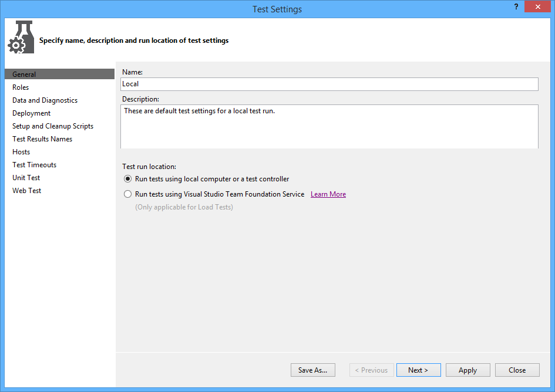

#### Task 3 – Autoscale Verification

You will now execute the load test you created in the previous task and see how your web app behaves under load.

1. In **Solution Explorer**, double-click **LoadTest1.loadtest** to open the load test.

    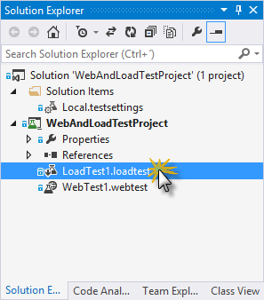

    *Opening LoadTest1.loadtest*
2. In the **LoadTest1.loadtest** window, click the first button in the toolbox to run the load test.

    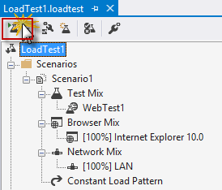

    *Running the load test*
3. Wait until the load test completes.

    > [!NOTE]
    > The load test simulates multiple users that send requests to the web app simultaneously. When the test is running, you can monitor the available counters to detect any errors, warnings or other information related to your load test run.

    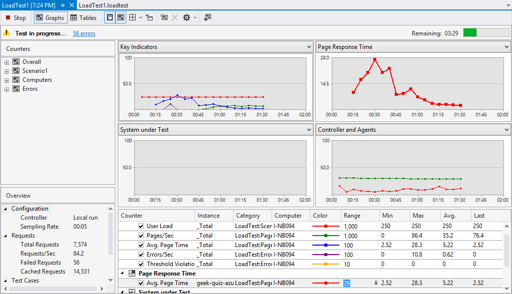

    *Load test running*
4. Once the test completes, go back to the management portal and navigate to the **Scale** page of your web app. Under the **capacity** section, you should see in the graph that a new instance was automatically deployed.

    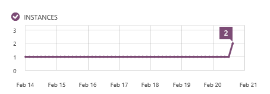

    *New instance automatically deployed*

    > [!NOTE]
    > It may take several minutes for the changes to appear in the graph (press **CTRL + F5** periodically to refresh the page). If you do not see any changes, you can try the following:
    > 
    > - Increase the duration of the load test (e.g. to **10 minutes**)
    > - Reduce the maximum and minimum values of the **Target CPU** range in the Autoscale configuration of your web app
    > - Run the load test in the cloud with **Visual Studio Online**. More information [here](https://www.visualstudio.com/en-us/get-started/load-test-your-app-vs.aspx)

* * *

## Summary

In this hands-on lab, you learned how to set up and deploy your application to production web apps in Azure. You started by detecting and updating your databases using **Entity Framework Code First Migrations**, then continued by deploying new versions of your site using **Git** and performing rollbacks to the latest stable version of your site. Additionally, you learned how to scale your app using Storage to move your static content to a Blob container.