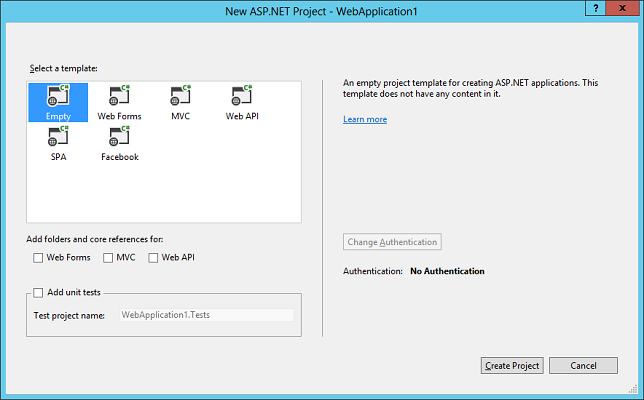
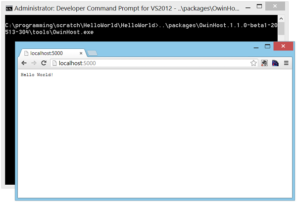
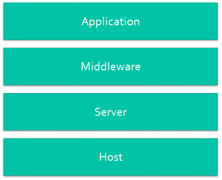
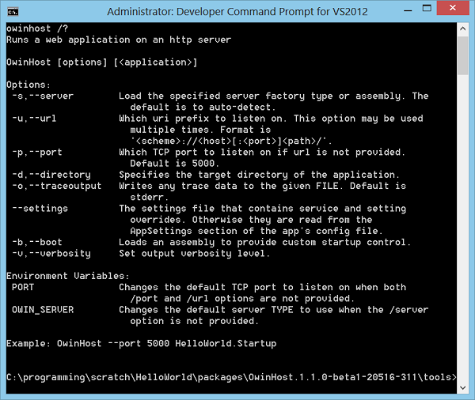
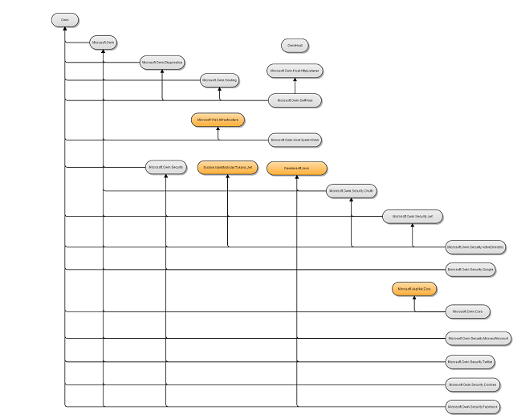

An Overview of Project Katana
====================
by [Howard Dierking](https://github.com/howarddierking)

> The ASP.NET Framework has been around for over ten years, and the platform has enabled the development of countless Web sites and services. As Web application development strategies have evolved, the framework has been able to evolve in step with technologies like ASP.NET MVC and ASP.NET Web API. As Web application development takes its next evolutionary step into the world of cloud computing, project [Katana](https://channel9.msdn.com/Shows/Web+Camps+TV/The-Katana-Project-OWIN-for-ASPNET) provides the underlying set of components to ASP.NET applications, enabling them to be flexible, portable, lightweight, and provide better performance – put another way, project [Katana](https://channel9.msdn.com/Shows/Web+Camps+TV/The-Katana-Project-OWIN-for-ASPNET) cloud optimizes your ASP.NET applications.

## Why Katana – Why Now?

 Regardless whether one is discussing a developer framework or end-user product, it's important to understand the underlying motivations for creating the product – and part of that includes knowing who the product was created for. ASP.NET was originally created with two customers in mind.   
  
**The first group of customers was classic ASP developers.** At the time, ASP was one of the primary technologies for creating dynamic, data-driven Web sites and applications by interweaving markup and server-side script. The ASP runtime supplied server-side script with a set of objects that abstracted core aspects of the underlying HTTP protocol and Web server and provided access to additional services such session and application state management, cache, etc. While powerful, classic ASP applications became a challenge to manage as they grew in size and complexity. This was largely due to the lack of structure found in in scripting environments coupled with the duplication of code resulting from the interleaving of code and markup. In order to capitalize on the strengths of classic ASP while addressing some of its challenges, ASP.NET took advantage of the code organization provided by the object-oriented languages of the .NET Framework while also preserving the server-side programming model to which classic ASP developers had grown accustomed.

**The second group of target customers for ASP.NET was Windows business application developers.** Unlike classic ASP developers, who were accustomed to writing HTML markup and the code to generate more HTML markup, WinForms developers (like the VB6 developers before them) were accustomed to a design time experience that included a canvas and a rich set of user interface controls. The first version of ASP.NET – also known as "Web Forms" provided a similar design time experience along with a server-side event model for user interface components and a set of infrastructure features (such as ViewState) to create a seamless developer experience between client and server side programming. Web Forms effectively hid the Web's stateless nature under a stateful event model that was familiar to WinForms developers.

### Challenges Raised by the Historical Model

**The net result was a mature, feature-rich runtime and developer programming model.** However, with that feature-richness came a couple notable challenges. Firstly, the framework was **monolithic**, with logically disparate units of functionality being tightly coupled in the same System.Web.dll assembly (for example, the core HTTP objects with the Web forms framework). Secondly, ASP.NET was included as a part of the larger .NET Framework, which meant that the **time between releases was on the order of years.** This made it difficult for ASP.NET to keep pace with all of the changes happening in rapidly evolving Web development. Finally, System.Web.dll itself was coupled in a few different ways to a specific Web hosting option: Internet Information Services (IIS).

### Evolutionary steps: ASP.NET MVC and ASP.NET Web API

And lots of change was happening in Web development! Web applications were increasingly being developed as a series of small, focused components rather than large frameworks. The number of components as well as the frequency with which they were released was increasing at an ever faster rate. It was clear that keeping pace with the Web would require frameworks to get smaller, decoupled and more focused rather than larger and more feature-rich, therefore the **ASP.NET team took several evolutionary steps to enable ASP.NET as a family of pluggable Web components rather than a single framework**.

One of the early changes was the rise in popularity of the well-known model-view-controller (MVC) design pattern thanks to Web development frameworks like Ruby on Rails. This style of building Web applications gave the developer greater control over her application's markup while still preserving the separation of markup and business logic, which was one of the initial selling points for ASP.NET. To meet the demand for this style of Web application development, Microsoft took the opportunity to position itself better for the future by **developing ASP.NET MVC out of band** (and not including it in the .NET Framework). ASP.NET MVC was released as an independent download. This gave the engineering team the flexibility to deliver updates much more frequently than had been previously possible.

Another major shift in Web application development was the shift from dynamic, server-generated Web pages to static initial markup with dynamic sections of the page generated from client-side script communicating **with backend Web APIs through AJAX requests**. This architectural shift helped propel the rise of Web APIs, and the development of the ASP.NET Web API framework. As in the case of ASP.NET MVC, the release of ASP.NET Web API provided another opportunity to evolve ASP.NET further as a more modular framework. The engineering team took advantage of the opportunity and **built ASP.NET Web API such that it had no dependencies on any of the core framework types found in System.Web.dll**. This enabled two things: first, it meant that ASP.NET Web API could evolve in a completely self-contained manner (and it could continue to iterate quickly because it is delivered via NuGet). Second, because there were no external dependencies to System.Web.dll, and therefore, no dependencies to IIS, ASP.NET Web API included the capability to run in a custom host (for example, a console application, Windows service, etc.)

### The Future: A Nimble Framework

By decoupling framework components from one another and then releasing them on NuGet, frameworks could now **iterate more independently and more quickly**. Additionally, the power and flexibility of Web API's self-hosting capability proved very attractive to developers who wanted a **small, lightweight host** for their services. It proved so attractive, in fact, that other frameworks also wanted this capability, and this surfaced a new challenge in that each framework ran in its own host process on its own base address and needed to be managed (started, stopped, etc.) independently. A modern Web application generally supports static file serving, dynamic page generation, Web API, and more recently real-time/push notifications. Expecting that each of these services should be run and managed independently was simply not realistic.

What was needed was a single hosting abstraction that would enable a developer to compose an application from a variety of different components and frameworks, and then run that application on a supporting host.

## The Open Web Interface for .NET (OWIN)

 Inspired by the benefits achieved by [Rack](http://rack.github.io/) in the Ruby community, several members of the .NET community set out to create an abstraction between Web servers and framework components. Two design goals for the OWIN abstraction were that it was simple and that it took the fewest possible dependencies on other framework types. These two goals help ensure:

- New components could be more easily developed and consumed.
- Applications could be more easily ported between hosts and potentially entire platforms/operating systems.

The resulting abstraction consists of two core elements. The first is the environment dictionary. This data structure is responsible for storing all of the state necessary for processing an HTTP request and response, as well as any relevant server state. The environment dictionary is defined as follows:

[!code-console[Main](an-overview-of-project-katana/samples/sample1.cmd)]

An OWIN-compatible Web server is responsible for populating the environment dictionary with data such as the body streams and header collections for an HTTP request and response. It is then the responsibility of the application or framework components to populate or update the dictionary with additional values and write to the response body stream.

In addition to specifying the type for the environment dictionary, the OWIN specification defines a list of core dictionary key value pairs. For example, the following table shows the required dictionary keys for an HTTP request:

| Key Name | Value Description |
| --- | --- |
| `"owin.RequestBody"` | A Stream with the request body, if any. Stream.Null MAY be used as a placeholder if there is no request body. See [Request Body](http://owin.org/html/owin.html#34-request-body-100-continue-and-completed-semantics). |
| `"owin.RequestHeaders"` | An `IDictionary<string, string[]>` of request headers. See [Headers](http://owin.org/html/owin.html#3-3-headers). |
| `"owin.RequestMethod"` | A `string` containing the HTTP request method of the request (e.g., `"GET"`, `"POST"`). |
| `"owin.RequestPath"` | A `string` containing the request path. The path MUST be relative to the "root" of the application delegate; see [Paths](http://owin.org/html/owin.html#5-3-paths). |
| `"owin.RequestPathBase"` | A `string` containing the portion of the request path corresponding to the "root" of the application delegate; see [Paths](http://owin.org/html/owin.html#5-3-paths). |
| `"owin.RequestProtocol"` | A `string` containing the protocol name and version (e.g. `"` HTTP/1.0 `"` or `"` HTTP/1.1 `"`). |
| `"owin.RequestQueryString"` | A `string` containing the query string component of the HTTP request URI, without the leading "?" (e.g., `"foo=bar&baz=quux"`). The value may be an empty string. |
| `"owin.RequestScheme"` | A `string` containing the URI scheme used for the request (e.g., `"http"`, `"https"`); see [URI Scheme](http://owin.org/html/owin.html#5-1-uri-scheme). |

The second key element of OWIN is the application delegate. This is a function signature which serves as the primary interface between all components in an OWIN application. The definition for the application delegate is as follows:

`Func<IDictionary<string, object>, Task>;`

The application delegate then is simply an implementation of the Func delegate type where the function accepts the environment dictionary as input and returns a Task. This design has several implications for developers:

- There are a very small number of type dependencies required in order to write OWIN components. This greatly increases the accessibility of OWIN to developers.
- The asynchronous design enables the abstraction to be efficient with its handling of computing resources, particularly in more I/O intensive operations.
- Because the application delegate is an atomic unit of execution and because the environment dictionary is carried as a parameter on the delegate, OWIN components can be easily chained together to create complex HTTP processing pipelines.

From an implementation perspective, OWIN is a specification ([http://owin.org/html/owin.html](http://owin.org/html/owin.html)). Its goal is not to be the next Web framework, but rather a specification for how Web frameworks and Web servers interact.

If you've investigated [OWIN](http://owin.org/) or [Katana](http://katanaproject.codeplex.com/documentation), you may also have noticed the [Owin NuGet package](http://nuget.org/packages/Owin) and Owin.dll. This library contains a single interface, [IAppBuilder](https://github.com/owin/owin/blob/master/src/Owin/IAppBuilder.cs), which formalizes and codifies the startup sequence described in [section 4](http://owin.org/html/owin.html#4-application-startup) of the OWIN specification. While not required in order to build OWIN servers, the [IAppBuilder](https://github.com/owin/owin/blob/master/src/Owin/IAppBuilder.cs) interface provides a concrete reference point, and it is used by the Katana project components.

## Project Katana

Whereas both the [OWIN](http://owin.org/html/owin.html) specification and *Owin.dll* are community owned and community run open source efforts, the [Katana](http://katanaproject.codeplex.com/documentation) project represents the set of OWIN components that, while still open source, are built and released by Microsoft. These components include both infrastructure components, such as hosts and servers, as well as functional components, such as authentication components and bindings to frameworks such as [SignalR](../../../signalr/index.md) and [ASP.NET Web API](../../../web-api/overview/getting-started-with-aspnet-web-api/index.md). The project has the following three high level goals: 

- **Portable** – Components should be able to be easily substituted for new components as they become available. This includes all types of components, from the framework to the server and host. The implication of this goal is that third party frameworks can seamlessly run on Microsoft servers while Microsoft frameworks can potentially run on third party servers and hosts.
- **Modular/flexible**– Unlike many frameworks which include a myriad of features that are turned on by default, Katana project components should be small and focused, giving control over to the application developer in determining which components to use in her application.
- **Lightweight/performant/scalable** – By breaking the traditional notion of a framework into a set of small, focused components which are added explicitly by the application developer, a resulting Katana application can consume fewer computing resources, and as a result, handle more load, than with other types of servers and frameworks. As the requirements of the application demand more features from the underlying infrastructure, those can be added to the OWIN pipeline, but that should be an explicit decision on the part of the application developer. Additionally, the substitutability of lower level components means that as they become available, new high performance servers can seamlessly be introduced to improve the performance of OWIN applications without breaking those applications.

## Getting Started with Katana Components

When it was first introduced, one aspect of the [Node.js](http://nodejs.org/) framework that immediately drew people's attention was the simplicity with which one could author and run a Web server. If Katana goals were framed in light of [Node.js](http://nodejs.org/), one might summarize them by saying that Katana brings many of the benefits of [Node.js](http://nodejs.org/) (and frameworks like it) without forcing the developer to throw out everything she knows about developing ASP.NET Web applications. For this statement to hold true, getting started with the Katana project should be equally simple in nature to [Node.js](http://nodejs.org/).

## Creating "Hello World!"

One notable difference between JavaScript and .NET development is the presence (or absence) of a compiler. As such, the starting point for a simple Katana server is a Visual Studio project. However, we can start with the most minimal of project types: the Empty ASP.NET Web Application.

Next, we will install the [Microsoft.Owin.Host.SystemWeb](http://nuget.org/packages/Microsoft.Owin.Host.SystemWeb) NuGet package into the project. This package provides an OWIN server that runs in the ASP.NET request pipeline. It can be found on the [NuGet gallery](http://nuget.org/packages/Microsoft.Owin.Host.SystemWeb) and can be installed using either the Visual Studio package manager dialog or the package manager console with the following command:

[!code-console[Main](an-overview-of-project-katana/samples/sample2.cmd)]

Installing the `Microsoft.Owin.Host.SystemWeb` package will install a few additional packages as dependencies. One of those dependencies is `Microsoft.Owin`, a library which provides several helper types and methods for developing OWIN applications. We can use those types to quickly write the following "hello world" server.

[!code-csharp[Main](an-overview-of-project-katana/samples/sample3.cs)]

This very simple Web server can now be run using Visual Studio's **F5** command and includes full support for debugging.

## Switching hosts

By default, the previous "hello world" example runs in the ASP.NET request pipeline, which uses System.Web in the context of IIS. This can by itself add tremendous value as it enables us to benefit from the flexibility and composability of an OWIN pipeline with the management capabilities and overall maturity of IIS. However, there may be cases where the benefits provided by IIS are not required and the desire is for a smaller, more lightweight host. What is needed, then, to run our simple Web server outside of IIS and System.Web?

To illustrate the portability goal, moving from a Web-server host to a command line host requires simply adding the new server and host dependencies to project's output folder and then starting the host. In this example, we'll host our Web server in a Katana host called `OwinHost.exe` and will use the Katana HttpListener-based server. Similarly to the other Katana components, these will be acquired from NuGet using the following command:

[!code-console[Main](an-overview-of-project-katana/samples/sample4.cmd)]

From the command line, we can then navigate to the project root folder and simply run the `OwinHost.exe` (which was installed in the tools folder of its respective NuGet package). By default, `OwinHost.exe` is configured to look for the HttpListener-based server and so no additional configuration is needed. Navigating in a Web browser to `http://localhost:5000/` shows the application now running through the console.

## Katana Architecture

 The Katana component architecture divides an application into four logical layers, as depicted below: *host, server, middleware,* and *application*. The component architecture is factored in such a way that implementations of these layers can be easily substituted, in many cases, without requiring recompilation of the application.   

## Host

 The host is responsible for:

- Managing the underlying process.
- Orchestrating the workflow that results in the selection of a server and the construction of an OWIN pipeline through which requests will be handled.

 At present, there are 3 primary hosting options for Katana-based applications:  
  
**IIS/ASP.NET**: Using the standard HttpModule and HttpHandler types, OWIN pipelines can run on IIS as a part of an ASP.NET request flow. ASP.NET hosting support is enabled by installing the Microsoft.AspNet.Host.SystemWeb NuGet package into a Web application project. Additionally, because IIS acts as both a host and a server, the OWIN server/host distinction is conflated in this NuGet package, meaning that if using the SystemWeb host, a developer cannot substitute an alternate server implementation.  
  
**Custom Host**: The Katana component suite gives a developer the ability to host applications in her own custom process, whether that is a console application, Windows service, etc. This capability looks similar to the self-host capability provided by Web API. The following example shows a custom host of Web API code:  

[!code-csharp[Main](an-overview-of-project-katana/samples/sample5.cs)]

The self-host setup for a Katana application is similar:

[!code-csharp[Main](an-overview-of-project-katana/samples/sample6.cs)]

One notable difference between the Web API and Katana self-host examples is that the Web API configuration code is missing from the Katana self-host example. In order to enable both portability and composability, Katana separates the code that starts the server from the code that configures the request processing pipeline. The code that configures Web API, then is contained in the class Startup, which is additionally specified as the type parameter in WebApplication.Start.

[!code-csharp[Main](an-overview-of-project-katana/samples/sample7.cs)]

The startup class will be discussed in greater detail later in the article. However, the code required to start a Katana self-host process looks strikingly similar to the code that you may be using today in ASP.NET Web API self-host applications.

**OwinHost.exe**: While some will want to write a custom process to run Katana Web applications, many would prefer to simply launch a pre-built executable that can start a server and run their application. For this scenario, the Katana component suite includes `OwinHost.exe`. When run from within a project's root directory, this executable will start a server (it uses the HttpListener server by default) and use conventions to find and run the user's startup class. For more granular control, the executable provides a number of additional command line parameters.

## Server

 While the host is responsible for starting and maintaining process within which the application runs, the responsibility of the server is to open a network socket, listen for requests, and send them through the pipeline of OWIN components specified by the user (as you may have already noticed, this pipeline is specified in the application developer's Startup class). Currently, the Katana project includes two server implementations: 

- **Microsoft.Owin.Host.SystemWeb**: As previously mentioned, IIS in concert with the ASP.NET pipeline acts as both a host and a server. Therefore, when choosing this hosting option, IIS both manages host-level concerns such as process activation and listens for HTTP requests. For ASP.NET Web applications, it then sends the requests into the ASP.NET pipeline. The Katana SystemWeb host registers an ASP.NET HttpModule and HttpHandler to intercept requests as they flow through the HTTP pipeline and send them through the user-specified OWIN pipeline.
- **Microsoft.Owin.Host.HttpListener**: As its name indicates, this Katana server uses the .NET Framework's HttpListener class to open a socket and send requests into a developer-specified OWIN pipeline. This is currently the default server selection for both the Katana self-host API and OwinHost.exe.

## Middleware/framework

 As previously mentioned, when the server accepts a request from a client, it is responsible for passing it through a pipeline of OWIN components, which are specified by the developer's startup code. These pipeline components are known as middleware.  
 At a very basic level, an OWIN middleware component simply needs to implement the OWIN application delegate so that it is callable.

[!code-console[Main](an-overview-of-project-katana/samples/sample8.cmd)]

However, in order to simplify the development and composition of middleware components, Katana supports a handful of conventions and helper types for middleware components. The most common of these is the `OwinMiddleware` class. A custom middleware component built using this class would look similar to the following: 

[!code-csharp[Main](an-overview-of-project-katana/samples/sample9.cs)]

 This class derives from `OwinMiddleware`, implements a constructor that accepts an instance of the next middleware in the pipeline as one of its arguments, and then passes it to the base constructor. Additional arguments used to configure the middleware are also declared as constructor parameters after the next middleware parameter.   
  
At runtime, the middleware is executed via the overridden `Invoke` method. This method takes a single argument of type `OwinContext`. This context object is provided by the `Microsoft.Owin` NuGet package described earlier and provides strongly-typed access to the request, response and environment dictionary, along with a few additional helper types.   
  
The middleware class can be easily added to the OWIN pipeline in the application startup code as follows:   

[!code-csharp[Main](an-overview-of-project-katana/samples/sample10.cs)]

Because the Katana infrastructure simply builds up a pipeline of OWIN middleware components, and because the components simply need to support the application delegate to participate in the pipeline, middleware components can range in complexity from simple loggers to entire frameworks like ASP.NET, Web API, or [SignalR](../../../signalr/index.md). For example, adding ASP.NET Web API to the previous OWIN pipeline requires adding the following startup code:

[!code-csharp[Main](an-overview-of-project-katana/samples/sample11.cs)]

The Katana infrastructure will build the pipeline of middleware components based on the order in which they were added to the IAppBuilder object in the Configuration method. In our example, then, LoggerMiddleware can handle all requests that flow through the pipeline, regardless of how those requests are ultimately handled. This enables powerful scenarios where a middleware component (e.g. an authentication component) can process requests for a pipeline that includes multiple components and frameworks (e.g. ASP.NET Web API, SignalR, and a static file server).
 
## Applications

As illustrated by the previous examples, OWIN and the Katana project should not be thought of as a new application programming model, but rather as an abstraction to decouple application programming models and frameworks from server and hosting infrastructure. For example, when building Web API applications, the developer framework will continue to use the ASP.NET Web API framework, irrespective of whether or not the application runs in an OWIN pipeline using components from the Katana project. The one place where OWIN-related code will be visible to the application developer will be the application startup code, where the developer composes the OWIN pipeline. In the startup code, the developer will register a series of UseXx statements, generally one for each middleware component that will process incoming requests. This experience will have the same effect as registering HTTP modules in the current System.Web world. Typically, a larger framework middleware, such as ASP.NET Web API or [SignalR](../../../signalr/index.md) will be registered at the end of the pipeline. Cross-cutting middleware components, such as those for authentication or caching, are generally registered towards the beginning of the pipeline so that they will process requests for all of the frameworks and components registered later in the pipeline. This separation of the middleware components from each other and from the underlying infrastructure components enables the components to evolve at different velocities while ensuring that the overall system remains stable.

## Components – NuGet Packages

Like many current libraries and frameworks, the Katana project components are delivered as a set of NuGet packages. For the upcoming version 2.0, the Katana package dependency graph looks as follows. (Click on image for larger view.)

Nearly every package in the Katana project depends, directly or indirectly, on the Owin package. You may remember that this is the package that contains the IAppBuilder interface, which provides a concrete implementation of the application startup sequence described in section 4 of the OWIN specification. Additionally, many of the packages depend on Microsoft.Owin, which provides a set of helper types for working with HTTP requests and responses. The remainder of the package can be classified as either hosting infrastructure packages (servers or hosts) or middleware. Packages dependencies that are external to the Katana project are displayed in orange.

The hosting infrastructure for Katana 2.0 includes both the SystemWeb and HttpListener-based servers, the OwinHost package for running OWIN applications using OwinHost.exe, and the Microsoft.Owin.Hosting package for self-hosting OWIN applications in a custom host (e.g. console application, Windows service, etc.)

For Katana 2.0, the middleware components are primarily focused on providing different means of authentication. One additional middleware component for diagnostics is provided, which enables support for a start and error page. As OWIN grows into the de facto hosting abstraction, the ecosystem of middleware components, both those developed by Microsoft and third parties, will also grow in number.

## Conclusion

 From its beginning, the Katana project's goal has not been to create and thereby force developers to learn yet another Web framework. Rather, the goal has been to create an abstraction to give .NET Web application developers more choice than has previously been possible. By breaking up the logical layers of a typical Web application stack into a set of replaceable components, the Katana project enables components throughout the stack to improve at whatever rate makes sense for those components. By building all components around the simple OWIN abstraction, Katana enables frameworks and the applications built on top of them to be portable across a variety of different servers and hosts. By putting the developer in control of the stack, Katana ensures that the developer makes the ultimate choice about how lightweight or how feature-rich her Web stack should be.  
  

## For more information about Katana

- The Katana project on GitHub: [https://github.com/aspnet/AspNetKatana/](https://github.com/aspnet/AspNetKatana/).
- Video: [The Katana Project - OWIN for ASP.NET](https://channel9.msdn.com/Shows/Web+Camps+TV/The-Katana-Project-OWIN-for-ASPNET), by Howard Dierking.

## Acknowledgements

- [Rick Anderson](https://blogs.msdn.com/b/rickandy/): (twitter [@RickAndMSFT](http://twitter.com/RickAndMSFT) ) Rick is a senior programming writer for Microsoft focusing on Azure and MVC.
- [Scott Hanselman](http://www.hanselman.com/blog/): (twitter [@shanselman](https://twitter.com/shanselman) )
- [Jon Galloway](https://weblogs.asp.net/jgalloway/default.aspx): (twitter [@jongalloway](https://twitter.com/jongalloway) )
