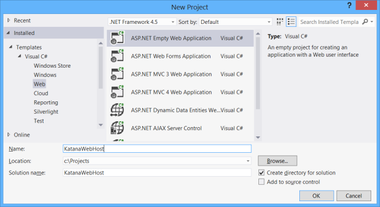
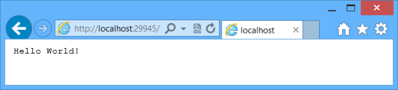
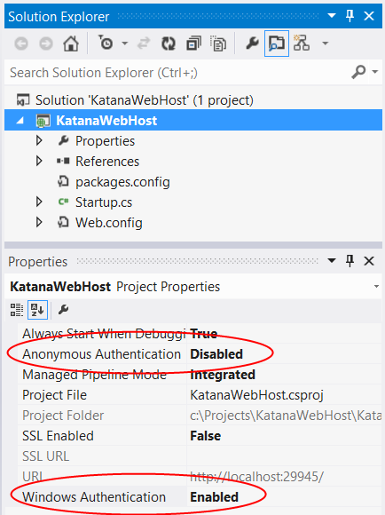

Enabling Windows Authentication in Katana
====================
by [Mike Wasson](https://github.com/MikeWasson)

> This article shows how to enable Windows Authentication in Katana. It covers two scenarios: Using IIS to host Katana, and using HttpListener to self-host Katana in a custom process. Thanks to Barry Dorrans, David Matson, and Chris Ross for reviewing this article.

Katana is Microsoft's implementation of [OWIN](http://owin.org/), the Open Web Interface for .NET. You can read an introduction to OWIN and Katana [here](an-overview-of-project-katana.md). The OWIN architecture has several layers:

- Host: Manages the process in which the OWIN pipeline runs.
- Server: Opens a network socket and listens for requests.
- Middleware: Processes the HTTP request and response.

Katana currently provides two servers, both of which support Windows Integrated Authentication:

- **Microsoft.Owin.Host.SystemWeb**. Uses IIS with the ASP.NET pipeline.
- **Microsoft.Owin.Host.HttpListener**. Uses [System.Net.HttpListener](https://msdn.microsoft.com/en-us/library/system.net.httplistener.aspx). This server is currently the default option when self-hosting Katana.

> [!NOTE]
> Katana does not currently provide OWIN middleware for Windows Authentication, because this functionality is already available in the servers.

## Windows Authentication in IIS

Using Microsoft.Owin.Host.SystemWeb, you can simply enable Windows Authentication in IIS.

Let's start by creating a new ASP.NET application, using the "ASP.NET Empty Web Application" project template.

Next, add NuGet packages. From the **Tools** menu, select **Library Package Manager**, then select **Package Manager Console**. In the Package Manager Console window, enter the following command:

[!code-console[Main](enabling-windows-authentication-in-katana/samples/sample1.cmd)]

Now add a class named `Startup` with the following code:

[!code-csharp[Main](enabling-windows-authentication-in-katana/samples/sample2.cs)]

That's all you need to create a "Hello world" application for OWIN, running on IIS. Press F5 to debug the application. You should see "Hello World!" in the browser window.

Next, we'll enable Windows Authentication in IIS Express. From the **View** menu, select **Properties**. Click on the project name in Solution Explorer to view the project properties.

In the **Properties** window, set **Anonymous Authentication** to **Disabled** and set **Windows Authentication** to **Enabled**.

When you run the application from Visual Studio, IIS Express will require the user's Windows credentials. You can see this by using [Fiddler](http://fiddler2.com/home) or another HTTP debugging tool. Here is an example HTTP response:

[!code-console[Main](enabling-windows-authentication-in-katana/samples/sample3.cmd?highlight=1,5-6)]

The WWW-Authenticate headers in this response indicate that the server supports the [Negotiate](http://www.ietf.org/rfc/rfc4559.txt) protocol, which uses either Kerberos or NTLM.

Later, when you deploy the application to a server, follow [these steps](https://www.iis.net/configreference/system.webserver/security/authentication/windowsauthentication) to enable Windows Authentication in IIS on that server.

## Windows Authentication in HttpListener

If you are using Microsoft.Owin.Host.HttpListener to self-host Katana, you can enable Windows Authentication directly on the **HttpListener** instance.

First, create a new console application. Next, add NuGet packages. From the **Tools** menu, select **Library Package Manager**, then select **Package Manager Console**. In the Package Manager Console window, enter the following command:

[!code-console[Main](enabling-windows-authentication-in-katana/samples/sample4.cmd)]

Now add a class named `Startup` with the following code:

[!code-csharp[Main](enabling-windows-authentication-in-katana/samples/sample5.cs)]

This class implements the same "Hello world" example from before, but it also sets Windows Authentication as the authentication scheme.

Inside the `Main` function, start the OWIN pipeline:

[!code-csharp[Main](enabling-windows-authentication-in-katana/samples/sample6.cs)]

You can send a request in Fiddler to confirm that the application is using Windows Authentication:

[!code-console[Main](enabling-windows-authentication-in-katana/samples/sample7.cmd?highlight=1,4-5)]

## Related Topics

[An Overview of Project Katana](an-overview-of-project-katana.md)

[System.Net.HttpListener](https://msdn.microsoft.com/en-us/library/system.net.httplistener.aspx)

[Understanding OWIN Forms Authentication in MVC 5](https://blogs.msdn.com/b/webdev/archive/2013/07/03/understanding-owin-forms-authentication-in-mvc-5.aspx)