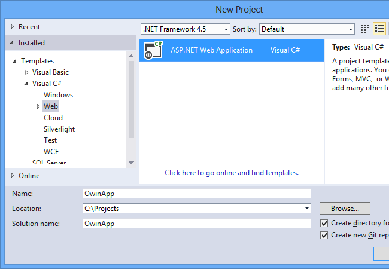
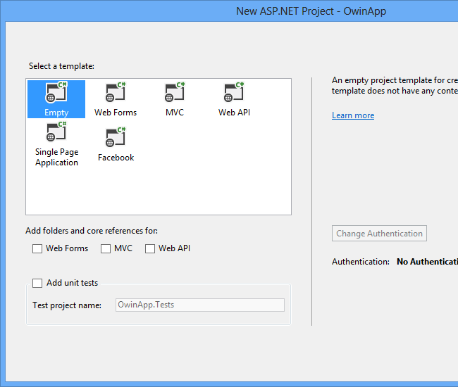
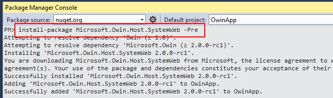
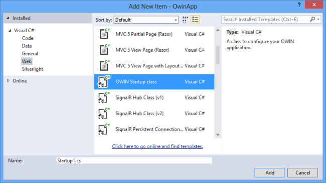
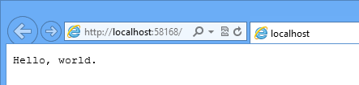
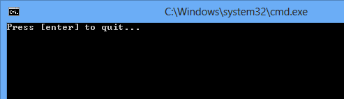
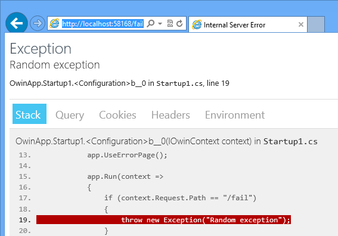

Getting Started with OWIN and Katana
====================
by [Mike Wasson](https://github.com/MikeWasson)

[Open Web Interface for .NET (OWIN)](http://owin.org/) defines an abstraction between .NET web servers and web applications. By decoupling the web server from the application, OWIN makes it easier to create middleware for .NET web development. Also, OWIN makes it easier to port web applications to other hosts&#8212;for example, self-hosting in a Windows service or other process.

OWIN is a community-owned specification, not an implementation. The Katana project is a set of open-source OWIN components developed by Microsoft. For a general overview of both OWIN and Katana, see [An Overview of Project Katana](an-overview-of-project-katana.md). In this article, I will jump right into code to get started.

This tutorial uses [Visual Studio 2013 Release Candidate](https://go.microsoft.com/fwlink/?LinkId=306566), but you can also use Visual Studio 2012. A few of the steps are different in Visual Studio 2012, which I note below.

## Host OWIN in IIS

In this section, we'll host OWIN in IIS. This option gives you the flexibility and composability of an OWIN pipeline together with the mature feature set of IIS. Using this option, the OWIN application runs in the ASP.NET request pipeline.

First, create a new ASP.NET Web Application project. (In Visual Studio 2012, use the ASP.NET Empty Web Application project type.)

In the **New ASP.NET Project** dialog, select the **Empty** template.

### Add NuGet Packages

Next, add the required NuGet packages. From the **Tools** menu, select **Library Package Manager**, then select **Package Manager Console**. In the Package Manager Console window, type the following command:

`install-package Microsoft.Owin.Host.SystemWeb –Pre`

### Add a Startup Class

Next, add an OWIN startup class. In Solution Explorer, right-click the project and select **Add**, then select **New Item**. In the **Add New Item** dialog, select **Owin Startup class**. For more info on configuring the startup class, see [OWIN Startup Class Detection](owin-startup-class-detection.md).

Add the following code to the `Startup1.Configuration` method:

[!code-csharp[Main](getting-started-with-owin-and-katana/samples/sample1.cs?highlight=3)]

This code adds a simple piece of middleware to the OWIN pipeline, implemented as a function that receives a **Microsoft.Owin.IOwinContext** instance. When the server receives an HTTP request, the OWIN pipeline invokes the middleware. The middleware sets the content type for the response and writes the response body.

> [!NOTE]
> The OWIN Startup class template is available in Visual Studio 2013. If you are using Visual Studio 2012, just add a new empty class named `Startup1`, and paste in the following code:

[!code-csharp[Main](getting-started-with-owin-and-katana/samples/sample2.cs)]

### Run the Application

Press F5 to begin debugging. Visual Studio will open a browser window to `http://localhost:*port*/`. The page should look like the following:

## Self-Host OWIN in a Console Application

It's easy to convert this application from IIS hosting to self-hosting in a custom process. With IIS hosting, IIS acts as both the HTTP server and as the process that host the sever. With self-hosting, your application creates the process and uses the **HttpListener** class as the HTTP server.

In Visual Studio, create a new console application. In the Package Manager Console window, type the following command:

`Install-Package Microsoft.Owin.SelfHost -Pre`

Add a `Startup1` class from part 1 of this tutorial to the project. You don't need to modify this class.

Implement the application's `Main` method as follows.

[!code-csharp[Main](getting-started-with-owin-and-katana/samples/sample3.cs)]

When you run the console application, the server starts listening to `http://localhost:9000`. If you navigate to this address in a web browser, you will see the "Hello world" page.

## Add OWIN Diagnostics

The Microsoft.Owin.Diagnostics package contains middleware that catches unhandled exceptions and displays an HTML page with error details. This page functions much like the ASP.NET error page that is sometimes called the "[yellow screen of death](http://en.wikipedia.org/wiki/Yellow_Screen_of_Death#Yellow)" (YSOD). Like the YSOD, the Katana error page is useful during development, but it's a good practice to disable it in production mode.

To install the Diagnostics package in your project, type the following command in the Package Manager Console window:

`install-package Microsoft.Owin.Diagnostics –Pre`

Change the code in your `Startup1.Configuration` method as follows:

[!code-csharp[Main](getting-started-with-owin-and-katana/samples/sample4.cs?highlight=4,9-12)]

Now use CTRL+F5 to run the application without debugging, so that Visual Studio will not break on the exception. The application behaves the same as before, until you navigate to `http://localhost/fail`, at which point the application throws the exception. The error page middleware will catch the exception and display an HTML page with information about the error. You can click the tabs to see the stack, query string, cookies, request header, and OWIN environment variables.

## Next Steps

- [OWIN Startup Class Detection](owin-startup-class-detection.md)
- [Use OWIN to Self-Host ASP.NET Web API](../../../web-api/overview/hosting-aspnet-web-api/use-owin-to-self-host-web-api.md)
- [Use OWIN to Self-Host SignalR](../../../signalr/overview/deployment/tutorial-signalr-self-host.md)