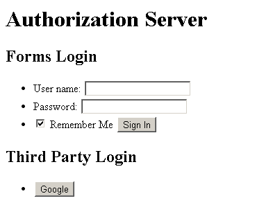
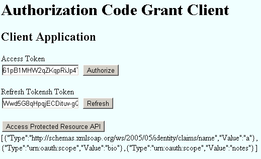
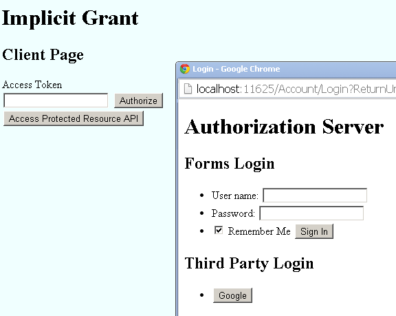

OWIN OAuth 2.0 Authorization Server
====================
by [Hongye Sun](https://github.com/hongyes), [Praburaj Thiagarajan](https://github.com/Praburaj), [Rick Anderson](https://github.com/Rick-Anderson)

> This tutorial will guide you on how to implement an OAuth 2.0 Authorization Server using OWIN OAuth middleware. This is an advanced tutorial that only outlines the steps to create an OWIN OAuth 2.0 Authorization Server. This is not a step by step tutorial. [Download the sample code](https://code.msdn.microsoft.com/OWIN-OAuth-20-Authorization-ba2b8783/file/114932/1/AuthorizationServer.zip).
> 
> > [!NOTE]
> > This outline should not be intended to be used for creating a secure production app. This tutorial is intended to provide only an outline on how to implement an OAuth 2.0 Authorization Server using OWIN OAuth middleware.
> 
> 
> ## Software versions
> 
> | **Shown in the tutorial** | **Also works with** |
> | --- | --- |
> | Windows 8.1 | Windows 8, Windows 7 |
> | [Visual Studio 2013](https://www.microsoft.com/visualstudio/eng/2013-downloads) | [Visual Studio 2013 Express for Desktop](https://www.microsoft.com/visualstudio/eng/2013-downloads#d-2013-express). Visual Studio 2012 with the latest update should work, but the tutorial has not been tested with it, and some menu selections and dialog boxes are different. |
> | .NET 4.5 |  |
> 
> ## Questions and Comments
> 
> If you have questions that are not directly related to the tutorial, you can post them at [http://katanaproject.codeplex.com/discussions](http://katanaproject.codeplex.com/discussions). For questions and comments regarding the tutorial itself, see the comments section at the bottom of the page.

The [OAuth 2.0 framework](http://tools.ietf.org/html/rfc6749) enables a third-party app to obtain limited access to an HTTP service. Instead of using the resource owner's credentials to access a protected resource, the client obtains an access token (which is a string denoting a specific scope, lifetime, and other access attributes). Access tokens are issued to third-party clients by an authorization server with the approval of the resource owner.

This tutorial will cover:

- How to create an authorization server to support four authorization grant types and refresh tokens:
    - Authorization code grant
    - Implicit Grant
    - Resource Owner Password Credentials Grant
    - Client Credentials Grant
- Creating a resource server which is protected by an access token.
- Creating OAuth 2.0 clients.

## Prerequisites

- [Visual Studio 2013](https://www.microsoft.com/visualstudio/eng/downloads#d-2013-editions) or the free [Visual Studio Express 2013](https://www.microsoft.com/visualstudio/eng/downloads#d-2013-express), as indicated in **Software Versions** at the top of the page.
- Familiarity with OWIN. See [Getting Started with the Katana Project](https://msdn.microsoft.com/en-us/magazine/dn451439.aspx) and [What's new in OWIN and Katana](index.md).
- Familiarity with [OAuth](http://tools.ietf.org/html/rfc6749) terminology, including [Roles](http://tools.ietf.org/html/rfc6749#section-1.1), [Protocol Flow](http://tools.ietf.org/html/rfc6749#section-1.2), and [Authorization Grant](http://tools.ietf.org/html/rfc6749#section-1.3). [OAuth 2.0 introduction](http://tools.ietf.org/html/rfc6749#section-1) provides a good introduction.

## Create an Authorization Server

In this tutorial, we will roughly sketch out how to use [OWIN](https://msdn.microsoft.com/en-us/magazine/dn451439.aspx) and ASP.NET MVC to create an authorization server. We hope to soon provide a download for the completed sample, as this tutorial does not include each step. First, create an empty web app named *AuthorizationServer* and install the following packages:

- Microsoft.AspNet.Mvc
- Microsoft.Owin.Host.SystemWeb
- Microsoft.Owin.Security.OAuth
- Microsoft.Owin.Security.Cookies
- Microsoft.Owin.Security.Google (Or any other social login package such as Microsoft.Owin.Security.Facebook)

Add an [OWIN Startup class](owin-startup-class-detection.md) under the project root folder named *Startup*.

[!code-csharp[Main](owin-oauth-20-authorization-server/samples/sample1.cs?highlight=8)]

Create an *App\_Start* folder. Select the *App\_Start* folder and use Shift+Alt+A to add the downloaded version of the *AuthorizationServer\App\_Start\Startup.Auth.cs* file.

[!code-csharp[Main](owin-oauth-20-authorization-server/samples/sample2.cs)]

The code above enables application/external sign in cookies and Google authentication, which are used by authorization server itself to manage accounts.

The `UseOAuthAuthorizationServer` extension method is to setup the authorization server. The setup options are:

- `AuthorizeEndpointPath`: The request path where client applications will redirect the user-agent in order to obtain the users consent to issue a token or code. It must begin with a leading slash, for example, "`/Authorize`".
- `TokenEndpointPath`: The request path client applications directly communicate to obtain the access token. It must begin with a leading slash, like "/Token". If the client is issued a [client\_secret](http://tools.ietf.org/html/rfc6749#appendix-A.2), it must be provided to this endpoint.
- `ApplicationCanDisplayErrors`: Set to `true` if the web application wants to generate a custom error page for the client validation errors on `/Authorize` endpoint. This is only needed for cases where the browser is not redirected back to the client application, for example, when the `client_id` or `redirect_uri` are incorrect. The `/Authorize` endpoint should expect to see the "oauth.Error", "oauth.ErrorDescription", and "oauth.ErrorUri" properties are added to the OWIN environment. 

    > [!NOTE]
    > If not true, the authorization server will return a default error page with the error details.
- `AllowInsecureHttp`: True to allow authorize and token requests to arrive on HTTP URI addresses, and to allow incoming `redirect_uri` authorize request parameters to have HTTP URI addresses. 

    > [!WARNING]
    > Security - This is for development only.
- `Provider`: The object provided by the application to process events raised by the Authorization Server middleware. The application may implement the interface fully, or it may create an instance of `OAuthAuthorizationServerProvider` and assign delegates necessary for the OAuth flows this server supports.
- `AuthorizationCodeProvider`: Produces a single-use authorization code to return to the client application. For the OAuth server to be secure the application **MUST** provide an instance for `AuthorizationCodeProvider` where the token produced by the `OnCreate/OnCreateAsync` event is considered valid for only one call to `OnReceive/OnReceiveAsync`.
- `RefreshTokenProvider`: Produces a refresh token which may be used to produce a new access token when needed. If not provided the authorization server will not return refresh tokens from the `/Token` endpoint.

## Account Management

OAuth doesn't care where or how you manage your user account information. It's [ASP.NET Identity](../../../identity/index.md) which is responsible for it. In this tutorial, we will simplify the account management code and just make sure that user can login using OWIN cookie middleware. Here is the simplified sample code for the `AccountController`:

[!code-csharp[Main](owin-oauth-20-authorization-server/samples/sample3.cs)]

[!code-csharp[Main](owin-oauth-20-authorization-server/samples/sample4.cs?highlight=1)]

`ValidateClientRedirectUri` is used to validate the client with its registered redirect URL. `ValidateClientAuthentication` checks the basic scheme header and form body to get the client's credentials.

The login page is shown below:

Review the IETF's OAuth 2 [Authorization Code Grant](http://tools.ietf.org/html/rfc6749#section-4.1) section now. 

**Provider** (in the table below) is [OAuthAuthorizationServerOptions](https://msdn.microsoft.com/en-us/library/microsoft.owin.security.oauth.oauthauthorizationserveroptions(v=vs.111).aspx).Provider, which is of type `OAuthAuthorizationServerProvider`, which contains all OAuth server events. 

| Flow steps from Authorization Code Grant section | Sample download performs these steps with: |
| --- | --- |
|  |  |
| (A) The client initiates the flow by directing the resource owner's user-agent to the authorization endpoint. The client includes its client identifier, requested scope, local state, and a redirection URI to which the authorization server will send the user-agent back once access is granted (or denied). | Provider.MatchEndpoint Provider.ValidateClientRedirectUri Provider.ValidateAuthorizeRequest Provider.AuthorizeEndpoint |
|  |  |
| (B) The authorization server authenticates the resource owner (via the user-agent) and establishes whether the resource owner grants or denies the client's access request. | **&lt;If user grants access&gt;** Provider.MatchEndpoint Provider.ValidateClientRedirectUri Provider.ValidateAuthorizeRequest Provider.AuthorizeEndpoint AuthorizationCodeProvider.CreateAsync |
|  |  |
| (C) Assuming the resource owner grants access, the authorization server redirects the user-agent back to the client using the redirection URI provided earlier (in the request or during client registration). ... |  |
|  |  |
| (D) The client requests an access token from the authorization server's token endpoint by including the authorization code received in the previous step. When making the request, the client authenticates with the authorization server. The client includes the redirection URI used to obtain the authorization code for verification. | Provider.MatchEndpoint Provider.ValidateClientAuthentication AuthorizationCodeProvider.ReceiveAsync Provider.ValidateTokenRequest Provider.GrantAuthorizationCode Provider.TokenEndpoint AccessTokenProvider.CreateAsync RefreshTokenProvider.CreateAsync |

A sample implementation for `AuthorizationCodeProvider.CreateAsync` and `ReceiveAsync` to control the creation and validation of authorization code is shown below.

[!code-csharp[Main](owin-oauth-20-authorization-server/samples/sample5.cs)]

The code above uses an in-memory concurrent dictionary to store the code and identity ticket and restore the identity after receiving the code. In a real application, it would be replaced by a persistent data store. The authorization endpoint is for the resource owner to grant access to the client. Usually, it needs a user interface to allow the user to click a button and confirm the grant. OWIN OAuth middleware allows application code to handle the authorization endpoint. In our sample app, we use an MVC controller called `OAuthController` to handle it. Here is the sample implementation:

[!code-csharp[Main](owin-oauth-20-authorization-server/samples/sample6.cs?highlight=15)]

The `Authorize` action will first check if the user has logged in to the authorization server. If not, the authentication middleware challenges the caller to authenticate using the "Application" cookie and redirects to the login page. (See highlighted code above.) If user has logged in, it will render the Authorize view, as shown below:

If the **Grant** button is selected, the `Authorize` action will create a new "Bearer" identity and sign in with it. It will trigger the authorization server to generate a bearer token and send it back to the client with JSON payload. 

### Implicit Grant

Refer to the IETF's OAuth 2 [Implicit Grant](http://tools.ietf.org/html/rfc6749#section-4.2) section now.

 The [Implicit Grant](http://tools.ietf.org/html/rfc6749#section-4.2) flow shown in Figure 4 is the flow and mapping which the OWIN OAuth middleware follows.  

| Flow steps from Implicit Grant section | Sample download performs these steps with: |
| --- | --- |
|  |  |
| (A) The client initiates the flow by directing the resource owner's user-agent to the authorization endpoint. The client includes its client identifier, requested scope, local state, and a redirection URI to which the authorization server will send the user-agent back once access is granted (or denied). | Provider.MatchEndpoint Provider.ValidateClientRedirectUri Provider.ValidateAuthorizeRequest Provider.AuthorizeEndpoint |
|  |  |
| (B) The authorization server authenticates the resource owner (via the user-agent) and establishes whether the resource owner grants or denies the client's access request. | **&lt;If user grants access&gt;** Provider.MatchEndpoint Provider.ValidateClientRedirectUri Provider.ValidateAuthorizeRequest Provider.AuthorizeEndpoint AuthorizationCodeProvider.CreateAsync |
|  |  |
| (C) Assuming the resource owner grants access, the authorization server redirects the user-agent back to the client using the redirection URI provided earlier (in the request or during client registration). ... |  |
|  |  |
| (D) The client requests an access token from the authorization server's token endpoint by including the authorization code received in the previous step. When making the request, the client authenticates with the authorization server. The client includes the redirection URI used to obtain the authorization code for verification. |  |

Since we already implemented the authorization endpoint (`OAuthController.Authorize` action) for authorization code grant, it automatically enables implicit flow as well. Note: `Provider.ValidateClientRedirectUri` is used to validate the client ID with its redirection URL, which protects the implicit grant flow from sending the access token to malicious clients ([Man-in-the-middle attack](https://www.owasp.org/index.php/Man-in-the-middle_attack)).

### Resource Owner Password Credentials Grant

Refer to the IETF's OAuth 2 [Resource Owner Password Credentials Grant](http://tools.ietf.org/html/rfc6749#section-4.3) section now.

 The [Resource Owner Password Credentials Grant](http://tools.ietf.org/html/rfc6749#section-4.3) flow shown in Figure 5 is the flow and mapping which the OWIN OAuth middleware follows.  

| Flow steps from Resource Owner Password Credentials Grant section | Sample download performs these steps with: |
| --- | --- |
|  |  |
| (A) The resource owner provides the client with its username and password. |  |
|  |  |
| (B) The client requests an access token from the authorization server's token endpoint by including the credentials received from the resource owner. When making the request, the client authenticates with the authorization server. | Provider.MatchEndpoint Provider.ValidateClientAuthentication Provider.ValidateTokenRequest Provider.GrantResourceOwnerCredentials Provider.TokenEndpoint AccessToken Provider.CreateAsync RefreshTokenProvider.CreateAsync |
|  |  |
| (C) The authorization server authenticates the client and validates the resource owner credentials, and if valid, issues an access token. |  |

Here is the sample implementation for `Provider.GrantResourceOwnerCredentials`:

[!code-csharp[Main](owin-oauth-20-authorization-server/samples/sample7.cs)]

> [!NOTE]
> The code above is intended to explain this section of the tutorial and should not be used in secure or production apps. It does not check the resource owners credentials. It assumes every credential is valid and creates a new identity for it. The new identity will be used to generate the access token and refresh token. Please replace the code with your own secure account management code.

### Client Credentials Grant

Refer to the IETF's OAuth 2 [Client Credentials Grant](http://tools.ietf.org/html/rfc6749#section-4.4) section now.

 The [Client Credentials Grant](http://tools.ietf.org/html/rfc6749#section-4.4) flow shown in Figure 6 is the flow and mapping which the OWIN OAuth middleware follows.  

| Flow steps from Client Credentials Grant section | Sample download performs these steps with: |
| --- | --- |
|  |  |
| (A) The client authenticates with the authorization server and requests an access token from the token endpoint. | Provider.MatchEndpoint Provider.ValidateClientAuthentication Provider.ValidateTokenRequest Provider.GrantClientCredentials Provider.TokenEndpoint AccessTokenProvider.CreateAsync RefreshTokenProvider.CreateAsync |
|  |  |
| (B) The authorization server authenticates the client, and if valid, issues an access token. |  |

Here is the sample implementation for `Provider.GrantClientCredentials`:

[!code-csharp[Main](owin-oauth-20-authorization-server/samples/sample8.cs)]

> [!NOTE]
> The code above is intended to explain this section of the tutorial and should not be used in secure or production apps. Please replace the code with your own secure client management code.

### Refresh Token

Refer to the IETF's OAuth 2 [Refresh Token](http://tools.ietf.org/html/rfc6749#section-1.5) section now.

 The [Refresh Token](http://tools.ietf.org/html/rfc6749#section-1.5) flow shown in Figure 2 is the flow and mapping which the OWIN OAuth middleware follows.  

| Flow steps from Client Credentials Grant section | Sample download performs these steps with: |
| --- | --- |
|  |  |
| (G) The client requests a new access token by authenticating with the authorization server and presenting the refresh token. The client authentication requirements are based on the client type and on the authorization server policies. | Provider.MatchEndpoint Provider.ValidateClientAuthentication RefreshTokenProvider.ReceiveAsync Provider.ValidateTokenRequest Provider.GrantRefreshToken Provider.TokenEndpoint AccessTokenProvider.CreateAsync RefreshTokenProvider.CreateAsync |
|  |  |
| (H) The authorization server authenticates the client and validates the refresh token, and if valid, issues a new access token (and, optionally, a new refresh token). |  |

Here is the sample implementation for `Provider.GrantRefreshToken`: 

[!code-csharp[Main](owin-oauth-20-authorization-server/samples/sample9.cs)]

[!code-csharp[Main](owin-oauth-20-authorization-server/samples/sample10.cs)]

## Create a Resource Server which is protected by Access Token

Create an empty web app project and install following packages in the project:

- Microsoft.AspNet.WebApi.Owin
- Microsoft.Owin.Host.SystemWeb
- Microsoft.Owin.Security.OAuth

Create a startup class and configure authentication and Web API. See *AuthorizationServer\ResourceServer\Startup.cs* in the sample download.

[!code-csharp[Main](owin-oauth-20-authorization-server/samples/sample11.cs)]

See *AuthorizationServer\ResourceServer\App\_Start\Startup.Auth.cs* in the sample download.

[!code-csharp[Main](owin-oauth-20-authorization-server/samples/sample12.cs)]

See *AuthorizationServer\ResourceServer\App\_Start\Startup.WebApi.cs* in the sample download.

[!code-csharp[Main](owin-oauth-20-authorization-server/samples/sample13.cs)]

- `UseCors` method allows CORS for all domains.
- `UseOAuthBearerAuthentication` method enables OAuth bearer token authentication middleware which will receive and validate bearer token from authorization header in the request.
- `Config.SuppressDefaultHostAuthenticaiton` suppresses default host authenticated principal from the app, therefore all requests will be anonymous after this call.
- `HostAuthenticationFilter` enables authentication just for the specified authentication type. In this case, it's bearer authentication type.

In order to demonstrate the authenticated identity, we create an ApiController to output current user's claims.

[!code-csharp[Main](owin-oauth-20-authorization-server/samples/sample14.cs)]

If the authorization server and the resource server are not on the same computer, the OAuth middleware will use the different machine keys to encrypt and decrypt bearer access token. In order to share the same private key between both projects, we add the same `machinekey` setting in both *web.config* files.

[!code-xml[Main](owin-oauth-20-authorization-server/samples/sample15.xml?highlight=8-10)]

## Create OAuth 2.0 Clients

 We use the [DotNetOpenAuth.OAuth2.Client](http://www.nuget.org/packages/DotNetOpenAuth.OAuth2.Client) NuGet package to simplify the client code.

### Authorization Code Grant Client

 This client is an MVC application. It will trigger an authorization code grant flow to get the access token from backend. It has a single page as shown below:

- The **Authorize** button will redirect browser to the authorization server to notify the resource owner to grant access to this client.
- The **Refresh** button will get a new access token and refresh token using the current refresh token.
- The **Access Protected Resource API** button will call the resource server to get current user's claims data and show them on the page.

Here is the sample code of the `HomeController` of the client.

[!code-csharp[Main](owin-oauth-20-authorization-server/samples/sample16.cs)]

`DotNetOpenAuth` requires SSL by default. Since our demo is using HTTP, you need to add following setting in the config file:

[!code-xml[Main](owin-oauth-20-authorization-server/samples/sample17.xml?highlight=4-6)]

> [!WARNING]
> Security - Never disable SSL in a production app. Your login credentials are now being sent in clear-text across the wire. The code above is just for local sample debugging and exploration.

### Implicit Grant Client

This client is using JavaScript to:

1. Open a new window and redirect to the authorize endpoint of the Authorization Server.
2. Get the access token from URL fragments when it redirects back.

The following image shows this process:

The client should have two pages: one for home page and the other for callback.Here is the sample JavaScript code found in the *Index.cshtml* file:

[!code-cshtml[Main](owin-oauth-20-authorization-server/samples/sample18.cshtml)]

Here is the callback handling code in *SignIn.cshtml* file:

[!code-cshtml[Main](owin-oauth-20-authorization-server/samples/sample19.cshtml)]

> [!NOTE]
> A best practice is to move the JavaScript to an external file and not embed it with the Razor markup. To keep this sample simple, they have been combined.

### Resource Owner Password Credentials Grant Client

We uses a console app to demo this client. Here is the code:

[!code-csharp[Main](owin-oauth-20-authorization-server/samples/sample20.cs)]

### Client Credentials Grant Client

Similar to the Resource Owner Password Credentials Grant, here is console app code:

[!code-csharp[Main](owin-oauth-20-authorization-server/samples/sample21.cs)]
