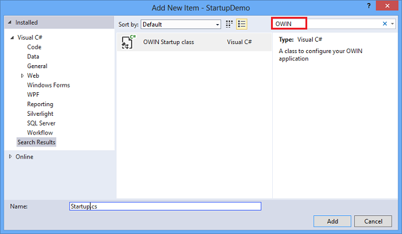
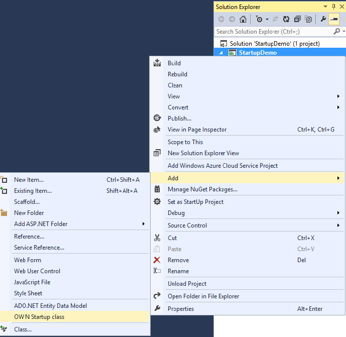
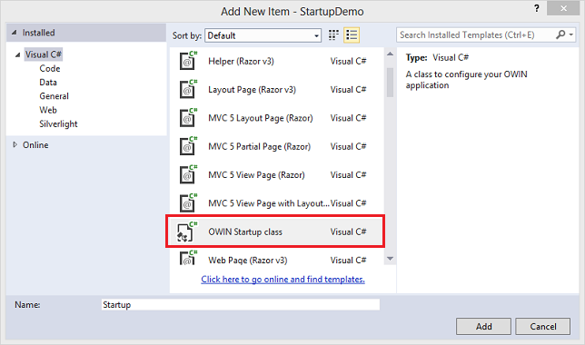
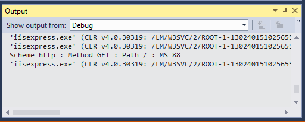
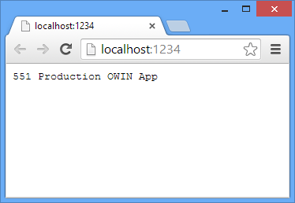
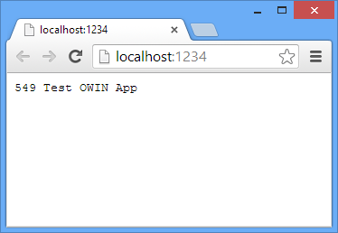
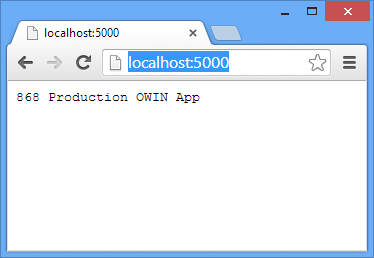

OWIN Startup Class Detection
====================
by [Praburaj Thiagarajan](https://github.com/Praburaj), [Rick Anderson](https://github.com/Rick-Anderson)

> This tutorial shows how to configure which OWIN startup class is loaded. For more information on OWIN, see [An Overview of Project Katana](an-overview-of-project-katana.md). This tutorial was written by Rick Anderson ( [@RickAndMSFT](https://twitter.com/#!/RickAndMSFT) ), Praburaj Thiagarajan, and Howard Dierking ( [@howard\_dierking](https://twitter.com/howard_dierking) ).
> 
> ## Prerequisites
> 
> [Visual Studio 2013](https://www.microsoft.com/visualstudio/eng/2013-downloads)

## OWIN Startup Class Detection

 Every OWIN Application has a startup class where you specify components for the application pipeline. There are different ways you can connect your startup class with the runtime, depending on the hosting model you choose (OwinHost, IIS, and IIS-Express). The startup class shown in this tutorial can be used in every hosting application. You connect the startup class with the hosting runtime using one of the these approaches:  

1. **Naming Convention**: Katana looks for a class named `Startup` in namespace matching the assembly name or the global namespace.
2. **OwinStartup Attribute**: This is the approach most developers will take to specify the startup class. The following attribute will set the startup class to the `TestStartup` class in the `StartupDemo` namespace. 

        [assembly: OwinStartup(typeof(StartupDemo.TestStartup))]

 The     `OwinStartup`  attribute overrides the naming convention. You can also specify a friendly name with this attribute, however, using a friendly name requires you to also use the     `appSetting`  element in the configuration file.
3. **The appSetting element in the Configuration file**: The `appSetting` element overrides the `OwinStartup a` ttribute and naming convention. You can have multiple startup classes (each using an `OwinStartup` attribute) and configure which startup class will be loaded in a configuration file using markup similar to the following:  

        <appSettings>  
          <add key="owin:appStartup" value="StartupDemo.ProductionStartup" />
        </appSettings>

 The following key, which explicitly specifies the startup class and assembly can also be used: 

        <add key="owin:appStartup" value="StartupDemo.ProductionStartup, StartupDemo" />

 The following XML in the configuration file specifies a friendly startup class name of     `ProductionConfiguration` .  

        <appSettings>  
          <add key="owin:appStartup" value="ProductionConfiguration" />       
        </appSettings>

 The above markup must be used with the following     `OwinStartup a`  ttribute which specifies a friendly name and causes the     `ProductionStartup2`  class to run.

    [!code[Main](owin-startup-class-detection/samples/sample1.xml?highlight=1,16)]
4. To disable OWIN startup discovery add the `appSetting owin:AutomaticAppStartup` with a value of `"false"` in the web.config file.

        <add key="owin:AutomaticAppStartup " value="false" />

## Create an ASP.NET Web App using OWIN Startup

1. Create an empty Asp.Net web application and name it **StartupDemo**. - Install `Microsoft.Owin.Host.SystemWeb` using the NuGet package manager. From the **Tools** menu, select **Library Package Manager**, and then **Package Manager Console**. Enter the following command:  

        Install-Package Microsoft.Owin.Host.SystemWeb
- Add an OWIN startup class. In Visual Studio 2013 right click the project and select **Add Class**.- In the **Add New Item** dialog box, enter *OWIN* in the search field, and change the name to Startup.cs, and then click **Add**.  
  
       
  
 The next time you want to add an     *Owin Startup class* , it will be in available from the     **Add** menu.  
   
      
  
 Alternatively, you can right click the project and select     **Add** , then select     **New Item** , and then select the     **Owin Startup class** .  
  
      
  
- Replace the generated code in the *Startup.cs* file with the following:  

    [!code[Main](owin-startup-class-detection/samples/sample2.xml?highlight=5,7,15-28,31-34)]
  
 The     `app.Use` lambda expression is used to register the specified middleware component to the OWIN pipeline. In this case we are setting up logging of incoming requests before responding to the incoming request. The     `next` parameter is the delegate (     [Func](https://msdn.microsoft.com/en-us/library/vstudio/bb534960(v=vs.100).aspx) &lt;    [Task](https://msdn.microsoft.com/en-us/library/vstudio/dd321424(v=vs.100).aspx) &gt; ) to the next component in the pipeline. The     `app.Run` lambda expression hooks up the pipeline to incoming requests and provides the response mechanism.     > [!NOTE] In the code above we have commented out the     `OwinStartup`  attribute and we're relying on the convention of running the class named     `Startup` .- Press ***F5*** to run the application. Hit refresh a few times.  
  
      
Note: The number shown in the images in this tutorial will not match the number you see. The millisecond string is used to show a new response when you refresh the page.  
 You can see the trace information in the     **Output** window.  
  
    

## Add More Startup Classes

In this section we'll add another Startup class. You can add multiple OWIN startup class to your application. For example, you might want to create startup classes for development, testing and production.

1. Create a new OWIN Startup class and name it `ProductionStartup`.
2. Replace the generated code with the following:

    [!code[Main](owin-startup-class-detection/samples/sample3.xml?highlight=14-18)]
3. Press Control F5 to run the app. The `OwinStartup` attribute specifies the production startup class is run.  
  
    
4. Create another OWIN Startup class and name it `TestStartup`.
5. Replace the generated code with the following:  

    [!code[Main](owin-startup-class-detection/samples/sample4.xml?highlight=6,14-18)]

 The     `OwinStartup`  attribute overload above specifies     `TestingConfiguration`  as the     *friendly* name of the Startup class.
6. Open the *web.config* file and add the OWIN App startup key which specifies the friendly name of the Startup class:

    [!code[Main](owin-startup-class-detection/samples/sample5.xml?highlight=3-5)]
7. Press Control F5 to run the app. The app settings element takes precedent, and the test configuration is run.  
  
    
8. Remove the *friendly*name from the `OwinStartup` attribute in the `TestStartup` class.

        [assembly: OwinStartup(typeof(StartupDemo.TestStartup))]
9. Replace the OWIN App startup key in the *web.config* file with the following:

        <add key="owin:appStartup" value="StartupDemo.TestStartup" />
10. Revert the `OwinStartup` attribute in each class to the default attribute code generated by Visual Studio:  

        [assembly: OwinStartup(typeof(StartupDemo.Startup))]
        [assembly: OwinStartup(typeof(StartupDemo.ProductionStartup))]
        [assembly: OwinStartup(typeof(StartupDemo.TestStartup))]

 Each of the OWIN App startup keys below will cause the production class to run. 

        <add key="owin:appStartup" value="StartupDemo.ProductionStartup" />
        <add key="owin:appStartup" value="StartupDemo.ProductionStartup, StartupDemo" />
        <add key="owin:appStartup" value="StartupDemo.ProductionStartup.Configuration, StartupDemo" />

 The last startup key specifies the startup configuration method. The following OWIN App startup key allows you to change the name of the configuration class to     `MyConfiguration` .

        <add key="owin:appStartup" value="StartupDemo.ProductionStartup2.MyConfiguration" />

## Using Owinhost.exe

1. Replace the Web.config file with the following markup:  

    [!code[Main](owin-startup-class-detection/samples/sample6.xml?highlight=3-6)]

 The last key wins, so in this case     `TestStartup`  is specified.
2. Install Owinhost from the PMC:   
  
    `Install-Package OwinHost`
3. Navigate to the application folder (the folder containing the *Web.config* file) and in a command prompt and type:   
  
    `..\packages\Owinhost<Version>\tools\Owinhost.exe` The command window will show:  

        C:\StartupDemo\StartupDemo>..\packages\OwinHost.2.0.0\tools\Owin
        
        Host.exe
        Starting with the default port: 5000 (http://localhost:5000/)
        
        Started successfully
        Press Enter to exit
4. Launch a browser with the URL `http://localhost:5000/`. zz  
  
      
  
 OwinHost honored the startup conventions listed above.
5. In the command window, press Enter to exit OwinHost.
6. In the `ProductionStartup` class, add the following OwinStartup attribute which specifies a friendly name of *ProductionConfiguration*.

        [assembly: OwinStartup("ProductionConfiguration", 
                   typeof(StartupDemo.ProductionStartup))]
7. In the command prompt and type:   
    `..\packages\OwinHost.2.0.0\tools\OwinHost.exe ProductionConfiguration`  
  
 The Production startup class is loaded.  
       
 Our application has multiple startup classes, and in this example we have deferred which startup class to load until runtime.
8. Test the following runtime startup options:

        ..\packages\OwinHost.2.0.0-rc1\tools\OwinHost.exe StartupDemo.TestStartup
        ..\packages\OwinHost.2.0.0-rc1\tools\OwinHost.exe "StartupDemo.TestStartup,StartupDemo"
        ..\packages\OwinHost.2.0.0-rc1\tools\OwinHost.exe StartupDemo.TestStartup.Configuration
        ..\packages\OwinHost.2.0.0-rc1\tools\OwinHost.exe "StartupDemo.TestStartup.Configuration,StartupDemo"