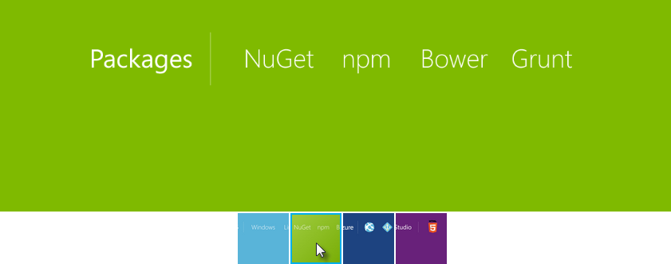

Manage Client-Side Packages with Bower
======================================

By `Noel Rice`_ and `Scott Addie <http://scottaddie.com>`_

Bower is a "package manager for the web." Bower lets you install and restore client-side packages, including JavaScript and CSS libraries. For example, with Bower you can install CSS files, fonts, client frameworks, and JavaScript libraries from external sources. Bower resolves dependencies and will automatically download and install all the packages you need. For example, if you configure Bower to load the Bootstrap package, the necessary jQuery package will automatically come along for the ride. For server-side libraries like the MVC 6 framework, you will still use NuGet Package Manager.

.. note:: Visual Studio developers are already familiar with NuGet, so why not use NuGet instead of Bower? Mainly because Bower already has a rich ecosystem with over 33,000 packages in play; and, it integrates well with the Gulp and Grunt task runners.

Getting Started with Bower
--------------------------

The ASP.NET 5 Starter Web MVC project pre-constructs the client build process for you. The ubiquitous jQuery and Bootstrap packages are installed, and the plumbing for NPM, Gulp, and Bower is already in place. The following screenshot depicts the initial project in Solution Explorer. 

.. image:: bower/_static/mvc-project.png
	:width: 300px

Client-side packages are listed in the bower.json file. The ASP.NET 5 Starter Web project pre-configures bower.json with jQuery, jQuery validation, Bootstrap, and `Hammer.js <http://hammerjs.github.io/>`_. 

Let’s add support for photo albums by installing the `Fotorama <http://fotorama.io/>`_ jQuery plugin. 

#.	At the end of the ``dependencies`` section in bower.json, add a comma and type "fotorama". Notice as you type that you get Intellisense with a list of available packages. Select "fotorama" from the list. 

	.. image:: bower/_static/add-package.png
		:width: 150px

#.	Add a colon and then select the latest stable version of the package from the drop down list. The double quotes will be added automatically.

	.. image:: bower/_static/version-intellisense.png
		:width: 200px

#.	Save the bower.json file.

	.. note:: Visual Studio watches the bower.json file for changes. Upon saving, the `bower install` command is executed. See the Output window's "Bower/npm" view for the exact command which was executed. 

#.  Expand the twisty to the left of bower.json, and locate the .bowerrc file. Open it, and notice that the ``directory`` property is set to "wwwroot/lib". This setting indicates the location at which Bower will install the package assets.

	.. code-block:: none

		{
			"directory": "wwwroot/lib"
		}

#.	In Solution Explorer, expand the *wwwroot* node. The *lib* directory should now contain all of the packages, including the fotorama package. 

	.. image:: bower/_static/package-lib.png
		:width: 300px

Next, let's add an HTML page to the project. In Solution Explorer, right-click *wwwroot* node and select **Add** > **New Item** > **HTML Page**. Name the page Index.html. Replace the contents of the file with the following:

.. code-block:: html

	<!DOCTYPE html>
	<html>
	<head>
		<meta charset="utf-8" />
		<title>Bower and Fotorama</title>
		<link href="lib/fotorama/fotorama.css" rel="stylesheet" />
	</head>
	<body>
		

			
			
			
			
		

		
		
	</body>
	</html>
	
This example uses images currently available inside *wwwroot/images*, but you can add any images on hand. 

Press ``Ctrl+Shift+W`` to display the page in the browser. The control displays the images and allows navigation by clicking the thumbnail list below the main image. This quick test shows that Bower installed the correct packages and dependencies. 

Exploring the Client Build Process
----------------------------------

The **ASP.NET 5 Starter Web** project has everything you need for Bower already setup. This next walkthrough starts with the **Empty** project template and adds each piece manually, so you can get a feel for how Bower is used in a project. See what happens to the project structure and the runtime output as each configuration change is made to the project. 

The general steps to use the client-side build process with Bower are: 

- Define and download packages used in your project. 
- Reference packages from your web pages.  

Define Packages
^^^^^^^^^^^^^^^ 

The first step is to define the packages your application needs and to download them. This example uses Bower to load jQuery and Bootstrap in the desired location. 

#.	In Visual Studio 2015, create a new ASP.NET Web Application.
#.	In the **New ASP.NET Project** dialog, select the **ASP.NET 5 Empty** template and click **OK**.
#.	In Solution Explorer, the *src* directory includes a project.json file, and *wwwroot* and *Dependencies* nodes. The project directory will look like the screenshot below.

	.. image:: bower/_static/empty-project.png
		:width: 300px

#.	In Solution Explorer, right-click the project and add the following item:

	- Bower Configuration File – bower.json
	
	.. note:: The Bower Configuration File item template also adds a .bowerrc file.

#.	Open bower.json, and add jquery and bootstrap to the ``dependencies`` section. The resulting bower.json file should look like the example here. The versions will change over time, so use the latest stable build version from the drop-down list.

	.. code-block:: none

		{
			"name": "ASP.NET",
			"private": true,
			"dependencies": {
				"jquery": "2.1.4",
				"bootstrap": "3.3.5"
			}
		}

#.	Save the bower.json file.

The project should now include *bootstrap* and *jQuery* directories in two locations: *Dependencies/Bower* and *wwwroot/lib*. It's the .bowerrc file which instructed Bower to install the assets within *wwwroot/lib*. 

.. image:: bower/_static/bower-dependencies.png
	:width: 300px
 

Reference Packages
^^^^^^^^^^^^^^^^^^

Now that Bower has copied the client support packages needed by the application, you can test that an HTML page can use the deployed jQuery and Bootstrap functionality. 

#.	Right-click *wwwroot* and select **Add** > **New Item** > **HTML Page**. Name the page Index.html.
#.	Add the CSS and JavaScript references. 

	- In Solution Explorer, expand *wwwroot/lib/bootstrap* and locate bootstrap.css. Drag this file into the ``head`` element of the HTML page. 
	- Drag jquery.js and bootstrap.js to the end of the ``body`` element. 

Make sure bootstrap.js follows jquery.js, so that jQuery is loaded first. 

.. code-block:: html

	<!DOCTYPE html>
	<html>
	<head>
		<meta charset="utf-8" />
		<title>Bower Example</title>
		<link href="lib/bootstrap/dist/css/bootstrap.css" rel="stylesheet" />
	</head>
	<body>

		
		
	</body>
	</html>

Use the Installed Packages
^^^^^^^^^^^^^^^^^^^^^^^^^^

Add jQuery and Bootstrap components to the page to verify that the web application is configured correctly.

#.	Inside the ``body`` tag, above the ``script`` references, add a ``div`` element with the Bootstrap **jumbotron** class and an anchor tag.

	.. code-block:: html

		

			<h1>Using the jumbotron style</h1>
			
<a class="btn btn-primary btn-lg" role="button">
			   Stateful button</a>

		

#.	Add the following code after the jQuery and Bootstrap ``script`` references. 

	.. code-block:: html
	
		

#.  Validate that the ``Configure`` method of the Startup.cs file contains a call to the ``UseStaticFiles`` extension method. This middleware adds files, found within the web root, to the request pipeline. This line of code will look as follows:

	.. code-block:: c#
	
		app.UseStaticFiles();
		
	.. note:: Be sure to install the ``Microsoft.AspNet.StaticFiles`` NuGet package. Without it, the ``UseStaticFiles`` extension method will not resolve.

#.	Press ``Ctrl+Shift+W`` to view the Index.html page in the browser. Verify that the jumbotron styling is applied, the jQuery code responds when the button is clicked, and that the Bootstrap button changes state. 

	.. image:: bower/_static/jumbotron.png

