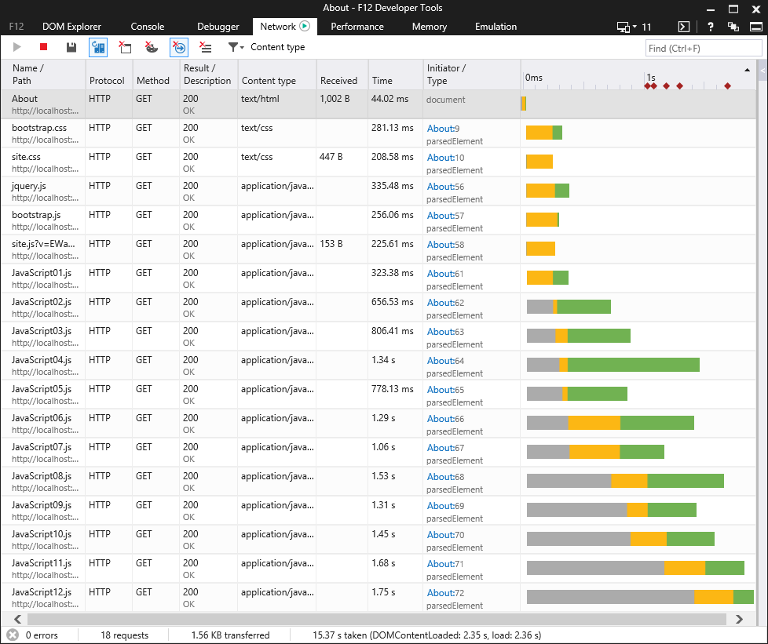
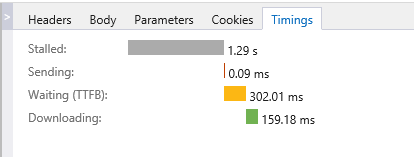
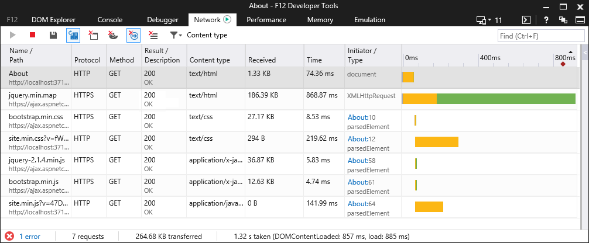
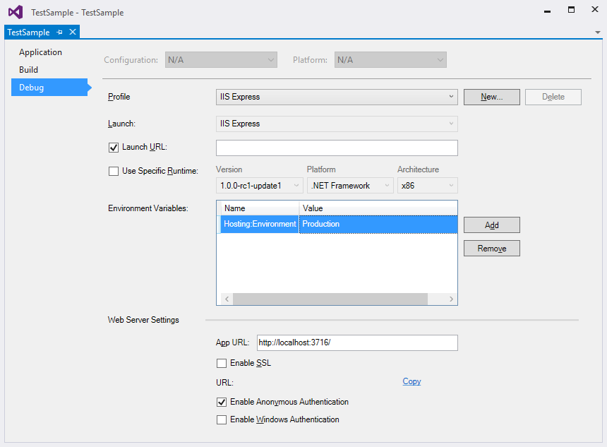

Bundling and Minification
=========================

By `Rick Anderson`_ and `Erik Reitan`_ 

Bundling and minification are two techniques you can use in ASP.NET 5 to improve page load performance for your web application. Bundling makes it easy to combine or bundle multiple files into a single file. Minification performs a variety of different code optimizations to scripts and CSS, which results in smaller payloads. Used together, bundling and minification improves load time performance by reducing the number of requests to the server and reducing the size of the requested assets (such as CSS and JavaScript files).

This article explains the benefits of using bundling and minification, including how these features are used in the **ASP.NET 5 Web Application** template of `Visual Studio 2015 <http://go.microsoft.com/fwlink/?LinkId=517106>`_. 

.. contents:: In this article:
  :local:
  :depth: 1

Overview
--------
Bundling and minification primarily improve the first page request load time. Once a web page has been requested, the browser caches the assets (JavaScript, CSS and images) so bundling and minification won’t provide any performance boost when requesting the same page, or pages on the same site requesting the same assets. If you don’t set the expires header correctly on your assets, and you don’t use bundling and minification, the browsers freshness heuristics will mark the assets stale after a few days and the browser will require a validation request for each asset. In this case, bundling and minification provide a performance increase after the first page request. 

Most of the current major browsers limit the number of `simultaneous connections <http://www.browserscope.org/?category=network>`_ per each hostname to six. That means that while six requests are being processed, additional requests for assets on a host will be queued by the browser. In the image below, the IE F12 developer tools network tabs shows the timing for assets required by the *About* view of a sample application.

The gray bars show the time the request is queued by the browser waiting on the six connection limit. The yellow bar is the request time to first byte, which is the time taken to send the request and receive the first response from the server. The green bars show the time taken to receive the response data from the server. You can click on an asset to get detailed timing information. For example, the following image shows the timing details for loading the *JavaScript12.js* file.

The preceding image shows the timing of each event. Notice that the request was *stalled* for 1.29 seconds before the asset was requested. Then, another 302.01 milliseconds (ms) of waiting time before the asset was downloaded.

Bundling
--------

Bundling is a feature that makes it easy to combine or bundle multiple files into a single file. You can create CSS, JavaScript and other bundles. Fewer files means fewer HTTP requests, which that can improve first page load  performance.

Because bundling combines multiple files into a single file, it reduces the number of requests to the server that is required to retrieve and display a web asset, such as a web page. You can create CSS, JavaScript and other bundles. Fewer files, means fewer HTTP requests from your browser to the server or from the service providing your application. This results in improved first page load performance.

The following image shows the same timing view of the *About* view shown previously, but this time with bundling and minification enabled.

Minification
------------
Minification performs a variety of different code optimizations to reduce the size of requested assets (such as CSS, image, JavaScript files). Common results of minification include removing unnecessary white space and comments, and shortening variable names to one character. 

Consider the following JavaScript function:

.. code-block:: javascript

	AddAltToImg = function (imageTagAndImageID, imageContext) {
		///<signature>
		///
 Adds an alt tab to the image
		// 

		//<param name="imgElement" type="String">The image selector.</param>
		//<param name="ContextForImage" type="String">The image context.</param>
		///</signature>
		var imageElement = $(imageTagAndImageID, imageContext);
		imageElement.attr('alt', imageElement.attr('id').replace(/ID/, ''));
	}

After minification, the function is reduced to the following:

.. code-block:: javascript

	AddAltToImg=function(t,a){var r=$(t,a);r.attr("alt",r.attr("id").replace(/ID/,""))};
	
In addition to removing the comments and unnecessary whitespace, the following parameters and variable names were renamed (shortened) as follows:

==================  =======  
Original            Renamed      
==================  =======  
imageTagAndImageID  t  
imageContext        a  
imageElement        r   
==================  =======  

Impact of Bundling and Minification
-----------------------------------

The following table shows several important differences between listing all the assets individually and using bundling and minification based on the above *About* page.

==================  ==========  ============  ============  
Action              With B/M    Without B/M   Change    
==================  ==========  ============  ============  
File Requests       7           18            157%
KB Transferred      156         264.68        70%
Load Time (MS)      885         2360          167%  
==================  ==========  ============  ============  

The bytes sent had a significant reduction with bundling as browsers are fairly verbose with the HTTP headers that they apply on requests. The load time shows a big improvement, however this example was run locally. You will get greater gains in performance when using bundling and minification with assets transferred over a network. To simulate the transfer time of a slow network, you can use the `Fiddler <http://www.telerik.com/fiddler>`_ tool. Within Fiddler, select the **Fiddler Rules** menu, **Performance** > **Simulate Modem Speeds**.

Controlling Bundling and Minification
-------------------------------------

When working with an app created using the **ASP.NET 5 Web Application** template in Visual Studio, bundling and minification is enabled by setting the ``Hosting:Environment`` value to ``Production``. 

The following steps allow you to set the ``Hosting:Environment`` value:

1. In **Solution Explorer** of Visual Studio, right-click the project name and select **Properties**. 
The property sheet for the app will be displayed.

2. Set the value of the ``Hosting:Environment`` variable to ``Production`` and save your changes. 

The next time you run your app, the bundled and minified assets will be used rather than the regular assets. The **Web Application** template includes code that recognizes when it use the bundled and minified assets. 

To see an example of the template uses the ``Hosting:Environment`` value, use the following steps:

1. In **Solution Explorer**, find and open *Views/Shared/_Layout.cshtml*.

2. Review the following HTML to see the different ``<environment>`` options:

.. code-block:: html

	<environment names="Development">
		<link rel="stylesheet" href="~/lib/bootstrap/dist/css/bootstrap.css" />
		<link rel="stylesheet" href="~/css/site.css" />
	</environment>
	<environment names="Staging,Production">
		<link rel="stylesheet" href="https://ajax.aspnetcdn.com/ajax/bootstrap/3.3.5/css/bootstrap.min.css"
				asp-fallback-href="~/lib/bootstrap/dist/css/bootstrap.min.css"
				asp-fallback-test-class="sr-only" asp-fallback-test-property="position" asp-fallback-test-value="absolute" />
		<link rel="stylesheet" href="~/css/site.min.css" asp-append-version="true" />
	</environment>

The *_Layout.cshtml* file uses the **environment** tag helper to provide two different versions of CSS files. One version of CSS files is for development and the other version is optimized for both staging and production. In Visual Studio 2015, when you change the **Hosting:Environment** environment variable to ``Production`` or ``Staging``, Visual Studio will build the Web app and link to the minimized CDN version. If the CDN request to the minimized file fails, the fallback version will be used.

Using the "*" Wildcard Character to Select Files
------------------------------------------------

The virtual path specified in the ``Include`` method  and  the search pattern in the ``IncludeDirectory`` method can accept one "*" wildcard character as a  prefix or suffix to in the last path segment. The search string is case insensitive. The ``IncludeDirectory``  method has the option of searching subdirectories.

Consider a project with the following JavaScript files:
- *Scripts\Common\AddAltToImg.js*
- *Scripts\Common\ToggleDiv.js*
- *Scripts\Common\ToggleImg.js*
- *Scripts\Common\Sub1\ToggleLinks.js*

.. image:: bundling-and-minification/_static/05-ScriptsFiles.png

The following table shows the files added to a bundle using the wildcard as shown:

===================================================  ===========================================================================================  
Call                                                 Files Added or Exception Raised      
===================================================  ===========================================================================================  
``Include("~/Scripts/Common/*.js")``                 *AddAltToImg.js*, *ToggleDiv.js*, *ToggleImg.js* 
``Include("~/Scripts/Common/T*.js")``                Invalid pattern exception. The wildcard character is only allowed on the prefix or suffix. 
``Include("~/Scripts/Common/*og.*")``                Invalid pattern exception. Only one wildcard character is allowed. 
``Include("~/Scripts/Common/T*")``                   *ToggleDiv.js*, *ToggleImg.js* 
``Include("~/Scripts/Common/*")``                    Invalid pattern exception. A pure wildcard segment is not valid. 
``IncludeDirectory("~/Scripts/Common", "T*")``       *ToggleDiv.js*, *ToggleImg.js* 
``IncludeDirectory("~/Scripts/Common", "T*",true)``  *ToggleDiv.js*, *ToggleImg.js*, *ToggleLinks.js* 
===================================================  ===========================================================================================  

Explicitly adding each file to a bundle  is generally the preferred over wildcard loading of files for the following reasons:

- Adding scripts by wildcard defaults to loading them in alphabetical order, which is typically not what you want. CSS and JavaScript files frequently need to be added in a specific (non-alphabetic) order. You can mitigate this risk by adding a custom  IBundleOrderer implementation, but explicitly adding each file is less error prone. For example, you might add new assets to a folder in the future which might require you to modify your  IBundleOrderer implementation.
- View specific files added to a directory using wild card loading can be included in all views referencing that bundle. If the view specific script is added to a bundle, you may get a JavaScript error on other views that reference the bundle. 
- CSS files that import other files result in the imported files loaded twice. 

Bundle Considerations
---------------------

Bundling and minification primarily improve the first page request load time. Once a webpage has been requested, the browser caches the assets (JavaScript, CSS and images) so bundling and minification won’t provide any performance boost when requesting the same page, or pages on the same site requesting the same assets. If you don’t set the expires header correctly on your assets, and you don’t use bundling and minification, the browsers freshness heuristics will mark the assets stale after a few days and the browser will require a validation request for each asset. In this case, bundling and minification provide a performance increase after the first page request. For details, see the blog `Using CDNs and Expires to Improve Web Site Performance <http://blogs.msdn.com/b/rickandy/archive/2011/05/21/using-cdns-to-improve-web-site-performance.aspx>`_.

The browser limitation of six simultaneous connections per each hostname can be mitigated by using a  CDN. Because the CDN will have a different hostname than your hosting site, asset requests from the CDN will not count against the six simultaneous connections limit to your hosting environment. A CDN can also provide common package caching and edge caching advantages.

Gulp
----
Gulp is a JavaScript-based streaming build toolkit for client-side code. It is commonly used to stream client-side files through a series of processes when a specific event is triggered in a build environment. Gulp can specifically be used to automate the process of asset minification. Visual Studio's **ASP.NET 5 Web Application** project template includes a *gulpfile.js* file, which defines a set of Gulp tasks, including default tasks for minimizing JavaScript and CSS files during *design-time*. These tasks can be run from the **Task Runner Explorer** window in Visual Studio. For more information, see :doc:`using-gulp`.

See Also
--------
- :doc:`using-gulp`
- `Using CDNs and Expires to Improve Web Site Performance <http://blogs.msdn.com/b/rickandy/archive/2011/05/21/using-cdns-to-improve-web-site-performance.aspx/>`_
- `Bundler & Minifier <https://visualstudiogallery.msdn.microsoft.com/9ec27da7-e24b-4d56-8064-fd7e88ac1c40>`_
- `Cutting Edge - Programming CSS: Bundling and Minification <https://msdn.microsoft.com/en-us/magazine/dn451436.aspx>`_
- `Fiddler tool <http://www.telerik.com/fiddler>`_
	
	