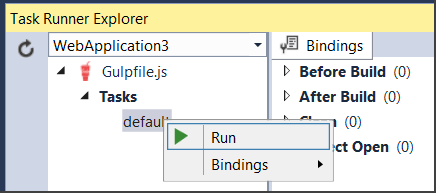

Using Gulp
========================================

By Noel Rice and Mike Wasson_

Modern web development has lots of moving parts. To build a typical web app, you might:

-	Compile LESS or SASS files to CSS.
-	Compile CoffeeScript or TypeScript files to JS.
-	Bundle and minify your JS files.
-	Run tools like JSHint.

A *task runner* is an app that automates these routine development tasks. Visual Studio 2015 provides built-in support for two popular JavaScript-based task runners, `Gulp <http://gulpjs.com>`_ and `Grunt <http://gruntjs.com/>`_. 

Using Gulp
----------
This topic will cover the following typical steps in using Gulp in your ASP.NET project.

-	Use NPM to add the Gulp.js package.

-	Use NPM to add one or more `Gulp plugins <http://gulpjs.com/plugins>`_. By itself, Gulp is just an engine for running tasks. Plugins are the modules that actually do the work.

-	Define Gulp tasks.

-	Run tasks in Task Runner Explorer.

-	Bind tasks to build events.

ASP.NET Project Templates
-------------------------
New ASP.NET Web Applications created in Visual Studio 2015 start with the *Empty*, *Web API", and *Web Site* templates. The *Web Site* template includes NPM and Gulp by default. NPM is preconfigured to add the Gulp.js package. Gulp is configured to copy Bootstrap, Hammer and jQuery client libraries to your web app directory.       

Add the Gulp package
--------------------
NPM (Node Package Manager) is a package manager that was originally created for Node.js. We'll use NPM to install the Gulp.js package.
Add an NPM configuration file.

1.	In Solution Explorer, right-click the project.

#.	Select **Add** > **New Item**.

#.	Select **NPM configuration file**.

#.	Leave the default name, "package.json".

#.	Click **Add**.

Open package.json. In the dependencies section, add an entry for "gulp":

.. code-block:: javascript
   :emphasize-lines: 6

	{
	  "version": "1.0.0",
	  "name": "MyWebApp",
	  "private": true,
	  "devDependencies": {
	    "gulp": "3.9.0"
	  }
	}

The packages are identified using the numbering scheme **<major>.<minor>.<patch>** according to the `SemVer <http://semver.org/>`_ (semantic versioning) standard.

After typing the name of the package and a colon, Intellisense shows a simplified list of versions with the most common choices:  

.. image:: using-gulp/_static/semver.png

-  The top item in the Intellisense list is considered the latest stable version of the package. 
-  The carat ^ symbol matches the most recent major version.
-  The tilde ~ matches the most recent minor version. 

Add the Gulp config file
------------------------
1.	In Solution Explorer, right-click the project.

#.	Select Add > New Item.

#.	Select **Gulp Configuration file**.

#.	Leave the default name, "gulpfile.js".

#.	Click **Add**.

#.  Right-click **Dependencies** > **NPM** and select **Restore Packages** from the context menu.

Define a "Hello World" task
---------------------------
Now you're ready to define some Gulp tasks. Open gulpfile.js and add the following line.

.. code-block:: javascript
   :emphasize-lines: 4

	var gulp = require('gulp');

	gulp.task('default', function () {
	    console.log('hello, world');
	});

In Solution Explorer, right-click gulpfile.js and select Task Runner Explorer. This opens the Task Runner Explorer window.
Task Runner Explorer shows the list of Gulp tasks. So far, we've only defined one ('default').
 
.. image:: using-gulp/_static/task-runner-1.png

Right-click the default task and select **Run**.
 

You will see the output from the task. In this case, the task just writes "hello, world" to the console.

.. image:: using-gulp/_static/task-runner-3.png

Use Gulp to copy files
----------------------
Here is an example of a more useful task.

.. code-block:: javascript

	var gulp = require('gulp');

	var paths = {
	    src: "./Assets/**/*.js",
	    dest: "./wwwroot/js/"
	}

	gulp.task('default', function () {
	    return gulp.src(paths.src)         // Returns a stream
	        .pipe(gulp.dest(paths.dest))   // Pipes the stream somewhere
	});

This task copies JS files from an *Assets* folder into *wwwroot/js*.
 
-	The gulp.src method returns a stream of files. You can use `file globbing <https://github.com/isaacs/node-glob>`_ to match multiple files. In this case, we are matching every .js file under Assets. 
-	The gulp.dest method writes the streamed files to a destination folder.
-	The pipe method pipes the files from src to dest.

The real power of Gulp is that you can pipe a file through multiple plugins. The output from each stage becomes the input to the next. For example, your pipeline might have these stages:

compile TypeScript > run JSHint > minify 

Using Gulp to run JSHint
------------------------
To do real work with Gulp, you'll use `plugins <http://gulpjs.com/plugins/>`_. This section shows an example of using the *JSHint* plugin to detect JavaScript problems. The example also demonstrates creating a "cleanup" task to remove files and directories.

Open package.json and add entries for "gulp-jshint" and "del":

.. code-block:: javascript
   :emphasize-lines: 7,8

	{
	  "version": "1.0.0",
	  "name": " MyWebApp",
	  "private": true,
	  "devDependencies": {
	    "gulp": "3.9.0",
	    "gulp-jshint": "1.11.0",
	    "del": "1.2.0"
	  }
	}

In the Solution Explorer, right-click Dependencies > NPM and choose **Restore Packages** from the context menu.  

Edit gulpfile.js:

.. code-block:: javascript

	var gulp = require('gulp');
	var jshint = require('gulp-jshint');
	var del = require('del');

	var paths = {
	    src: "./Assets/**/*.js",
	    dest: "./wwwroot/js/"
	}

	gulp.task("clean", function () {
	    del(paths.dest + '**/*');    // Delete everything in 'wwwroot/js'
	});

	gulp.task('default', ['clean'], function () {
	    return gulp.src(paths.src)         // Returns a stream
	        .pipe(jshint())
	        .pipe(jshint.reporter('default'))
	        .pipe(gulp.dest(paths.dest))   // Pipes the stream somewhere
	});

Now the 'default' task includes JSHint in the pipeline:

.. code-block:: javascript

	.pipe(jshint())
	.pipe(jshint.reporter('default'))

In addition, 'default' now includes the 'clean' task as a dependency:

.. code-block:: javascript

	gulp.task('default', ['clean'], function () {

The 'clean' task deletes everything under wwwooot/js, using the `del <https://github.com/sindresorhus/del>`_ module. (For more information, see https://github.com/gulpjs/gulp/blob/master/docs/recipes/delete-files-folder.md) Now when you run the 'default' task, Gulp will run 'clean' first.

In Task Runner Explorer, right-click the **default** task and select **Run**. 

.. image:: using-gulp/_static/running-default-task.png

Now the Task Runner Explorer first runs the 'clean' task, then the 'default' task.

Bind tasks to build events
--------------------------
Unless you want to manually start every task in Visual Studio, you can bind tasks to **Before Build**, **After Build**, **Clean**, and **Project Open** events. 

Let's bind 'default' so that it runs every time Visual Studio builds the project. In Task Runner Explorer, right-click the 'default' task and select **Bindings > After Build** from the context menu. 

.. image:: using-gulp/_static/task-binding.png

In the Solution Explorer, right-click and **Build** the project. After the project build, the 'default' task runs automatically.