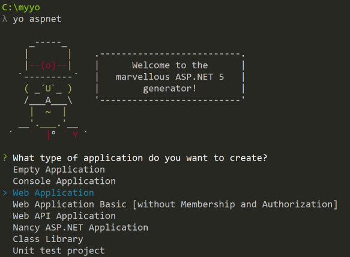
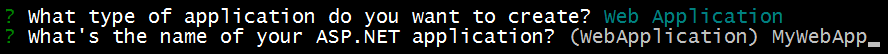
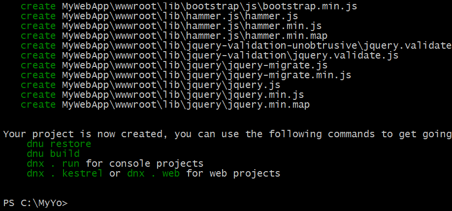

Building Projects with Yeoman
=============================
By `Noel Rice`_

`Yeoman <http://yeoman.io/>`_ generates complete, running projects for a given set of client-tools. You may be overwhelmed by "feature-shock" for the latest glut of client-tools (NPM, Gulp, Angular, etc.) or have simply run out of time to work through each feature set, much less the details, of every client tool. Yeoman generates everything you need to get over your first hurdle, the "hello world" that demonstrates that a group of technologies function together. 

Yeoman is an open-source tool that works like a Visual Studio project template, but targets a wide developer audience that ranges from Ruby, browser extensions, PhoneGap, FaceBook React, jQuery-Mobile, and Microsoft technologies like ASP.NET.

Yeoman is *opinionated*, that is, it prescribes tools and best practices for your target technologies so you don't have to decide "Use version X or Y?" or "What directory structure should I use?" Yeoman gets you stared with a known-good project that runs.

The Yeoman command line tool **yo** works alongside a Yeoman generator. Generators define the technologies that go into a project. Here are a few sample `generators <http://yeoman.io/generators/>`_:

- `AngularJS Generator <https://github.com/yeoman/generator-angular>`_ creates a starting point for a new single-page Angular application. 
- `JQuery Generator <https://github.com/yeoman/generator-jquery>`_ creates the shell code for a jQuery plug-in.
- `Chrome App Generator <https://github.com/yeoman/generator-chromeapp>`_ generates everything you need to create an extension for the Chrome browser.
- The `Flux-React generator <https://github.com/banderson/generator-flux-react>`_ creates an application based on Facebook's Flux/React architecture.
- `ASP.NET generator <https://www.npmjs.com/package/generator-aspnet>`_ creates ASP.NET 5, DNX projects.
- You can even `generate your own Yeoman generator <https://github.com/yeoman/generator-generator>`_.

In this article:
	- `Getting Started`_
	- `Building and Running from Visual Studio`_
	- `Client-Side Build Support`_
	- `Restoring, Building and Hosting from the Command Line`_
	- `Adding to Your Project with Sub Generators`_
	
Getting Started
---------------
The `ASPNET generator <https://www.npmjs.com/package/generator-aspnet>`_ creates ASP.NET 5, DNX projects that can 
be loaded into Visual Studio 2015 or run from the command line. The generator creates the following project types:
  
- Empty Application: An empty Web application with minimal dependencies.     
- Console Application: A DNX-based console application.
- Web Application: A complete MVC web application with a simple home page and examples for managing accounts and login.  
- Web API Application: A Web API built with MVC.   
- Nancy ASP.NET Application: A light-weight HTTP service with one module built using `Nancy <nancyfx.org>`_.
- Class Library: A DNX-based class library.

This walk-through demonstrates how to use Yeoman to generate an ASP.NET 5 web application. 
 
1.  Follow the instructions on http://yeoman.io/learning/ to install **yo** and other required tools. 

2.	On the command line, install the ASP.NET generator:  

.. code-block:: console

 npm install -g generator-aspnet

.. note:: The **–g** flag installs the generator globally so that you can use it from any path on your system.
 
3.	Make a new directory where your project will be generated:

.. code-block:: console

 mkdir c:\MyYo

4.	On the command line, make the new directory the current directory.

.. code-block:: console
 
 cd c:\MyYo

5.	Run the ``yo`` command and pass the name of the generator.

.. code-block:: console 

 yo aspnet

6.	The aspnet generator displays a menu. Select the **Web Application** and press ``Enter``.

7.	Provide an application name "MyWebApp" and press ``Enter``.

Yeoman will create the project and supporting files. 

Client-Side Build Support
-------------------------

The `ASPNET generator <https://www.npmjs.com/package/generator-aspnet>`_ creates support files to configure client-side build tools. `Grunt or Gulp task runners <http://docs.asp.net/en/latest/client-side/grunt-gulp.html>`_ files are added to your project to automate build tasks for Web Application projects. By default, aspnet-generator creates **gruntfile.js** to run tasks. Running the generator with the **--gulp** argument generates **gulpfile.js** instead.

.. code-block:: console 

 yo aspnet --gulp
 
The generator also configures **package.json** to load Grunt or Gulp and adds bower.json to restore client-side packages using the `Bower client-side package manager <http://docs.asp.net/en/latest/client-side/bower.html>`_.  

Building and Running from Visual Studio
---------------------------------------

You can load your generated ASP.NET 5 web project directly into Visual Studio 2015, then build and run your project from there.

1. Open Visual Studio 2015. From the File menu select :menuselection:`Open --> Project/Solution`.

2. In the Open Project dialog, navigate to the ``project.json`` file, select it and click the **Open** button. In the Solution Explorer, the project should look something like the screenshot below.

 .. image:: yeoman/_static/yeoman-solution.png
 
.. note:: Yeoman creates a MVC web application complete with server and client side build support. Server-side dependencies are listed under the **References** node, and client-side dependencies in the **Dependencies** node/ of Solution Explorer. Dependencies are restored automatically when you load this project.

 .. image:: yeoman/_static/yeoman-loading-dependencies.png 

3.	When all the dependencies are restored, press **F5** to run the project. The default home page displays in the browser.
 
 .. image:: yeoman/_static/yeoman-home-page.png 
 
Restoring, Building and Hosting from the Command Line
-----------------------------------------------------

You can prepare and host your web application using commands **dnu** (Microsoft .NET Development Utility) and 
**dnx** (Micorosft .NET Execution Environment). 

.. note:: For more information on DNX see :doc:`/dnx/overview`  

1. From the command line, change the current directory to the folder containing the project (that is, the folder that contains the `project.json` file). 

.. code-block:: console

 cd c:\MyYo\MyWebApp 
 
2. From the command line, restore the project's package dependencies.   

.. code-block:: console

 dnu restore

3. Also from the command line, build the project assemblies.   

.. code-block:: console

 dnu build

4. To run the development web server run **dnx** command. 

.. code-block:: console

 dnx . web

The web server will listen on port 5000. The URL and port are defined in project.json in the **commands** section.

.. code-block:: json
	:emphasize-lines: 2

	"commands": {
		"web": "Microsoft.AspNet.Hosting --server Microsoft.AspNet.Server.WebListener --server.urls http://localhost:5000",
		"kestrel": "Microsoft.AspNet.Hosting --server Kestrel --server.urls http://localhost:5001",
		"gen": "Microsoft.Framework.CodeGeneration",
		"ef": "EntityFramework.Commands"
	},

5. Open a web browser and navigate to http://localhost:5000. 

 .. image:: yeoman/_static/yeoman-home-page_5000.png 

.. note:: You can also run the cross-platform Kestrel development server using the **dnx . kestrel** command. By default, Kestrel listens on port 5001 as defined in the **project.json**, **commands** section.  

Adding to Your Project with Sub Generators
------------------------------------------
You can add new generated files using Yeoman even after the project is created. Use `sub generators <https://www.npmjs.com/package/generator-aspnet#sub-generators>`_ to add any of the file types
that make up your project. For example, to add a new class to your project, enter the **yo aspnet:Class** command followed by the 
name of the class. Run the command from the directory where the file should be created. 

.. code-block:: console

 yo aspnet:Class Person

The command creates Person.cs.

.. code-block:: C#

 using System;
 
 namespace MyNamespace
 {
     public class Person
     {
 
     }
 } 
 
Summary
-------
Yeoman generates complete running projects for a wide range of technology combinations. The generated files can be loaded into Visual Studio. Task Runner Explorer and other Visual Studio tooling help configure and automate unfamiliar technologies in a familiar environment. 