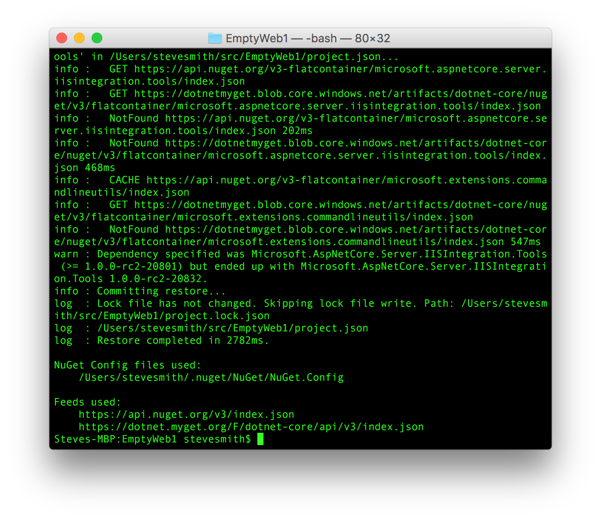
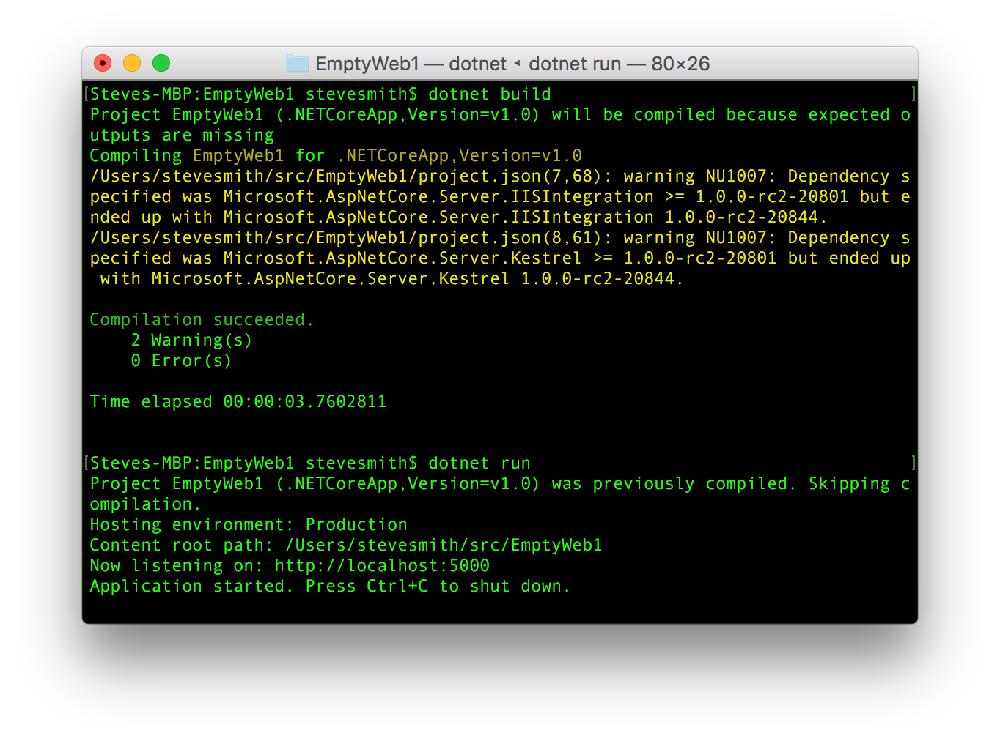
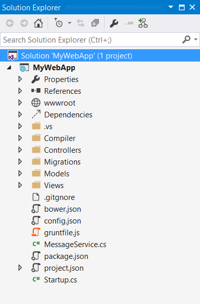
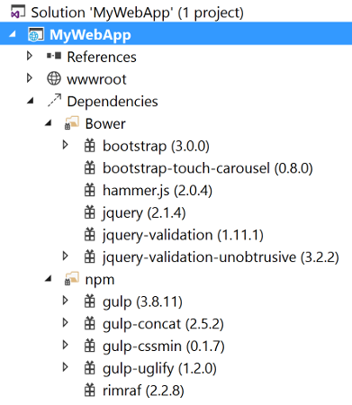
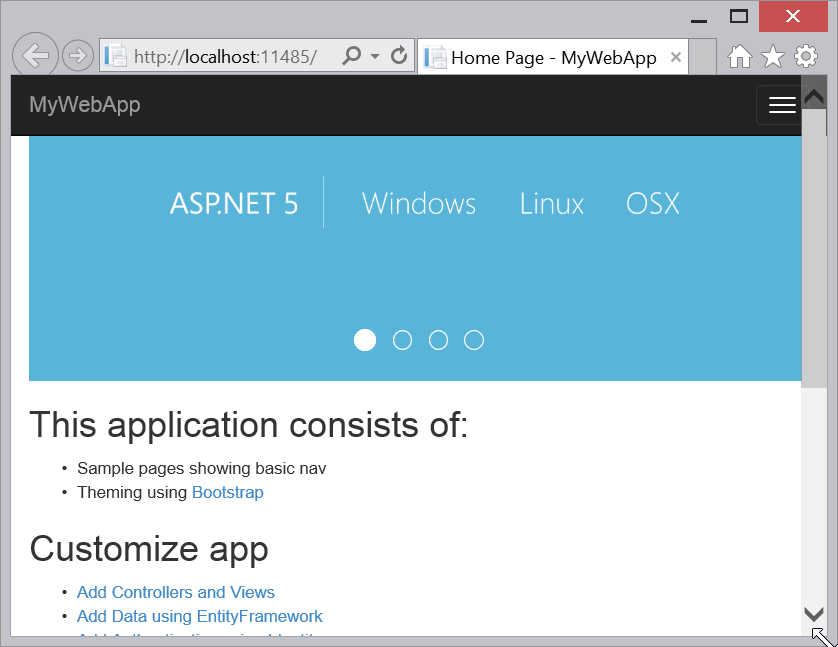
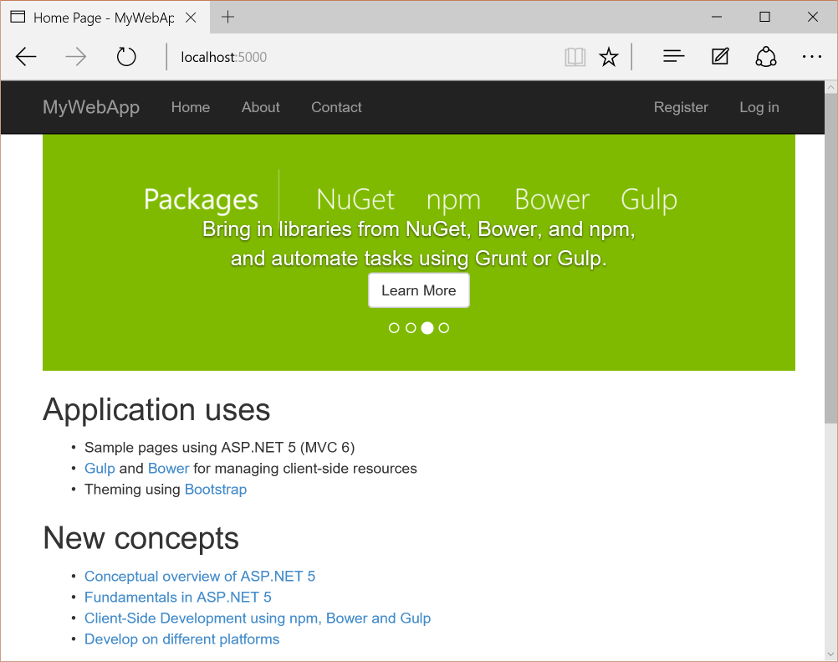

Building Projects with Yeoman
=============================

By `Steve Smith`_, `Scott Addie`_, `Rick Anderson`_ and `Noel Rice`_

`Yeoman <http://yeoman.io/>`_ generates complete projects for a given set of client tools. Yeoman is an open-source tool that works like a Visual Studio project template. The Yeoman command line tool `yo <https://github.com/yeoman/yo>`__ works alongside a Yeoman generator. Generators define the technologies that go into a project. 

.. contents:: Sections:
  :local:
  :depth: 1

Install Node.js, npm, and Yeoman
--------------------------------

To get started with Yeoman install `Node.js <https://nodejs.org/en/>`__. The installer includes `Node.js <https://nodejs.org/en/>`__ and `npm <https://www.npmjs.com/>`__.
 
Follow the instructions on http://yeoman.io/learning/ to install `yo <https://github.com/yeoman/yo>`__, bower, grunt, and gulp.

.. code-block:: console
  
  ``npm install -g yo bower grunt-cli gulp``
    
.. note:: If you get the error ``npm ERR! Please try running this command again as root/Administrator.`` on Mac OS, run the following command using `sudo <https://developer.apple.com/library/mac/documentation/Darwin/Reference/ManPages/man8/sudo.8.html>`__: ``sudo npm install -g yo bower grunt-cli gulp``

From the command line, install the ASP.NET generator: 

.. code-block:: console

  npm install -g generator-aspnet
 
.. note:: If you get a permission error, run the command under ``sudo`` as described above.

The ``–g`` flag installs the generator globally, so that it can be used from any path.

Create an ASP.NET app
---------------------
 
Create a directory for your projects

.. code-block:: console

  mkdir src
  cd src

Run the ASP.NET generator for ``yo``

.. code-block:: console 

  yo aspnet
 
The generator displays a menu. Arrow down to the **Empty Web Application** project and tap **Enter**:

.. image:: yeoman/_static/yeoman-yo-aspnet.png

Use "EmptyWeb1" for the app name and then tap **Enter**

Yeoman will scaffold the project and its supporting files. Suggested next steps are also provided in the form of commands. 

.. image:: yeoman/_static/yeoman-yo-aspnet-created.png

The `ASP.NET generator <https://www.npmjs.com/package/generator-aspnet>`__ creates ASP.NET Core projects that can be loaded into Visual Studio Code, Visual Studio, or run from the command line.

Restore, build and run
----------------------

Follow the suggested commands by changing directories to the ``EmptyWeb1`` directory. Then run ``dotnet restore``.

Build and run the app using ``dotnet build`` and ``dotnet run``:

At this point you can navigate to the URL shown to test the newly created ASP.NET Core app.

.. tip:: If you were directed to this tutorial from :doc:`/tutorials/your-first-mac-aspnet`, you can return now.

Specifying the client-side task runner
--------------------------------------

The `ASP.NET generator <https://www.npmjs.com/package/generator-aspnet>`_ creates supporting files to configure client-side build tools. A :doc:`Grunt </client-side/using-grunt>` or :doc:`Gulp </client-side/using-gulp>` task runner file is added to your project to automate build tasks for Web projects. The default generator creates *gulpfile.js* to run tasks. Running the generator with the ``--grunt`` argument generates *Gruntfile.js*:

.. code-block:: console 

  yo aspnet --grunt
 
The generator also configures *package.json* to load :doc:`Grunt </client-side/using-grunt>` or :doc:`Gulp </client-side/using-gulp>` dependencies. It also adds *bower.json* and *.bowerrc* files to restore client-side packages using the :doc:`Bower </client-side/bower>` client-side package manager. 

Building and Running from Visual Studio
---------------------------------------

You can load your generated ASP.NET Core web project directly into Visual Studio, then build and run your project from there. Follow the instructions above to scaffold a new ASP.NET Core app using yeoman. This time, choose **Web Application** from the menu and name the app ``MyWebApp``.

Open Visual Studio. From the File menu, select :menuselection:`Open --> Project/Solution`.

In the Open Project dialog, navigate to the *project.json* file, select it, and click the **Open** button. In the Solution Explorer, the project should look something like the screenshot below.

 
Yeoman scaffolds a MVC web application, complete with both server- and client-side build support. Server-side dependencies are listed under the **References** node, and client-side dependencies in the **Dependencies** node of Solution Explorer. Dependencies are restored automatically when the project is loaded.

When all the dependencies are restored, press **F5** to run the project. The default home page displays in the browser.
 

Restoring, Building, and Hosting from the Command Line
------------------------------------------------------

You can prepare and host your web application using the `.NET Core`_ command-line interface. 

From the command line, change the current directory to the folder containing the project (that is, the folder containing the `project.json` file):

.. code-block:: console

  cd src\MyWebApp 
 
From the command line, restore the project's NuGet package dependencies: 

.. code-block:: console

  dotnet restore

Run the application:

.. code-block:: console

  dotnet run

The cross-platform :ref:`Kestrel <kestrel>` web server will begin listening on port 5000.

Open a web browser, and navigate to \http://localhost:5000. 

Adding to Your Project with Sub Generators
------------------------------------------

You can add new generated files using Yeoman even after the project is created. Use `sub generators <https://www.npmjs.com/package/generator-aspnet#sub-generators>`_ to add any of the file types that make up your project. For example, to add a new class to your project, enter the ``yo aspnet:Class`` command followed by the name of the class. Execute the following command from the directory in which the file should be created: 

.. code-block:: console

  yo aspnet:Class Person

The result is a file named Person.cs with a class named ``Person``:

.. code-block:: c#

  using System;
  using System.Collections.Generic;
  using System.Linq;
  using System.Threading.Tasks;

  namespace MyNamespace
  {
      public class Person
      {
          public Person()
          {
          }
      }
  }
 
Related Resources
-----------------

- :doc:`Servers (HttpPlatformHandler, Kestrel and WebListener) </fundamentals/servers>`
- :doc:`/tutorials/your-first-mac-aspnet`
- :doc:`/fundamentals/index` 
