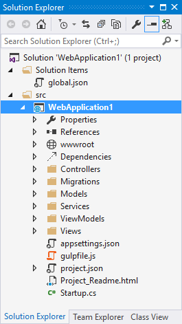
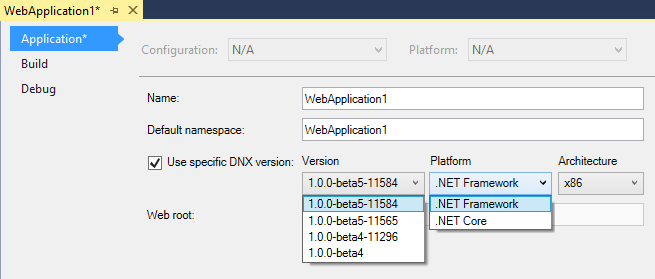
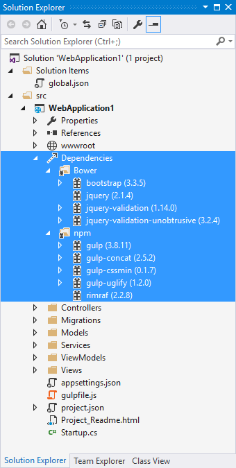
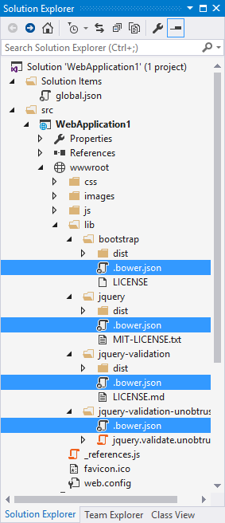
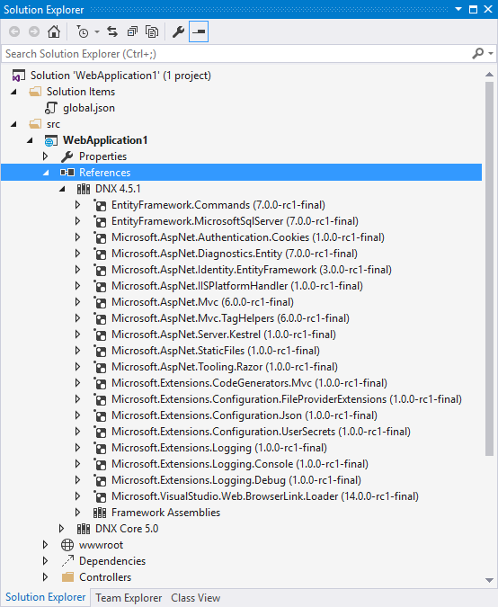

Understanding ASP.NET 5 Web Apps
================================

By `Steve Smith`_ and `Erik Reitan`_

ASP.NET 5 introduces several new fundamental concepts of web programming that are important to understand in order to productively create web apps. These concepts are not necessarily new to web programming in general, but are new to ASP.NET and thus are likely new to many developers whose experience with web programming has mainly been using ASP.NET and Visual Studio.

.. contents:: Sections:
  :local:
  :depth: 1

ASP.NET Project Structure
-------------------------

ASP.NET 5's project structure adds new concepts and replaces some legacy elements found in previous versions of ASP.NET projects. The new default web project template creates a solution and project structure like the one shown here:

The first thing you may notice about this new structure is that it includes a **Solution Items** folder with a *global.json* file, and the web
project itself is located within a *src* folder within the solution. The new structure also includes a special *wwwroot* folder and a
**Dependencies** section in addition to the References section that was present in past versions of ASP.NET (but which has been updated in this
version). In the root of the project, there are also several new files such as *bower.json, appsettings.json, gulpfile.js, package.json, project.json*,
and *Startup.cs*. You may notice that the files *global.asax, packages.config*, and *web.config* are gone. In previous versions of
ASP.NET, a great deal of application configuration was stored in these files and in the project file. In ASP.NET 5, this information and logic
has been refactored into files that are generally smaller and more focused.

Framework Target
----------------

ASP.NET 5 can target multiple frameworks, allowing the application to be deployed into different hosting environments. By default, applications will target the full version of .NET, but they can also target the :doc:`.NET Core </conceptual-overview/dotnetcore>`. Most legacy apps will target the full ASP.NET 5, at least initially, since they're likely to have dependencies that include framework base class libraries that are not available in .NET Core today. .NET Core is a small version of the .NET framework that is optimized for web apps and supports Linux and Mac environments. It can be deployed with an application, allowing multiple apps on the same server to target different versions of .NET Core. It is also modular, allowing additional functionality to be added only when it is required, as separate `NuGet <https://docs.nuget.org>`_ packages.

You can see which framework is currently being targeted in the web application project's properties, by right-clicking on the web project in **Solution Explorer** and selecting **Properties**:

By default, the **Use Specific Runtime** checkbox within the **Debug** tab is unchecked. To target a specific version, check the box and choose the appropriate *Version*, *Platform*, and *Architecture*.

.. _the-project-json-file:

The project.json File
---------------------

The *project.json* file is new to ASP.NET 5. It is used to define the project's server side dependencies (discussed below), as well as other project-specific information. The top-level default sections included in *project.json* of the default web project template are highlighted below:

.. literalinclude:: /../common/samples/WebApplication1/src/WebApplication1/project.json
    :language: json
    :emphasize-lines: 1-4,8,30,35,40,44,48	

The **userSecretsId** property contains a value that acts as a unique ID for your web app. For more information, see :doc:`/security/app-secrets`.

The **version** property specifies the current version of the project. You can also specify other metadata about the project such as **authors** and **description**. 

You can use the **compilationOptions** section to set app settings, such as the `languageVersion` and `useOssSigning`. 

Typically values located in the **dependencies** section refer to an installed NuGet package or to another  project. Package versions can be specified specifically, as shown above, or using wildcards to allow dependencies on a major version but automatically pull in minor version updates. 

ASP.NET 5 has a great deal of support for command line tooling, and the **commands** section allows you to configure commands that can be run from a command line(for instance, launch a web site or run tests).

.. literalinclude:: /../common/samples/WebApplication1/src/WebApplication1/project.json
    :language: json
    :lines: 30-33

The **frameworks** section designates which targeted frameworks will be built, and what dependencies need to be included. For instance, if you were using LINQ and collections, you could ensure these were included with your .NET Core build by adding them to the ``dnxcore50`` list of dependencies as shown.

The **exclude** section is used to identify files and folders that should be excluded from builds. Likewise, **publishExclude** is used to identify content portions of the project that should be excluded when publishing the site (for example, in production).

The **scripts** section is used to specify when build automation scripts should run. Visual Studio now has built-in support for running such scripts before and after specified events. The default ASP.NET project template has scripts in place to run during ``postrestore`` and ``prepare`` that install `client side dependencies`_ using npm and bower. For more information about bower, see :doc:`/client-side/bower`.

The global.json File
--------------------

The *global.json* file is used to configure the solution as a whole. It includes just two sections, ``projects`` and ``sdk`` by default.

.. literalinclude:: /../common/samples/WebApplication1/global.json
	:language: json

The ``projects`` property designates which folders contain source code for the solution. By default the project structure places source files in a *src* folder, allowing build artifacts to be placed in a sibling folder, making it easier to exclude such things from source control.

.. image:: understanding-aspnet5-apps/_static/solution-files.png

The ``sdk`` property specifies the version of the DNX (.Net Execution Environment) that Visual Studio will use when opening the solution. It's set here, rather than in *project.json*, to avoid scenarios where different projects within a solution are targeting different versions of the SDK. For more information about DNX, see :doc:`/dnx/overview`.

The wwwroot Folder
------------------

In previous versions of ASP.NET, the root of the project was typically the root of the web app. If you placed a *Default.aspx* file in the project root of an early version of ASP.NET, it would load if a request was made to the web application’s root. In later versions of ASP.NET, support for routing was added, making it possible to decouple the locations of files from their corresponding URLs (thus, ``HomeController`` in the *Controllers* folder is able to serve requests made to the root of the site, using a default route implementation). However, this routing was used only for ASP.NET-specific application logic, not static files needed by the client to properly render the resulting page. Resources like images, script files, and stylesheets were generally still loaded based on their location within the file structure of the application, based off of the root of the project.

.. image:: understanding-aspnet5-apps/_static/wwwroot.png

The file based approach presented several problems. First, protecting sensitive project files required framework-level protection of certain filenames or extensions, to prevent having things like *web.config* or *global.asax* served to a client in response to a request. Having to specifically block access (also known as blacklisting) to certain files is much less secure than granting access only to those files which should be accessible (also known as whitelisting). Typically, different versions were required for dev/test and production (for example *web.config*).  Scripts would typically be referenced individually and in a readable format during development. It’s beneficial to deploy only production files to production, but handling these kinds of scenarios was difficult with the previous file structure.

Enter the *wwwroot* folder in ASP.NET 5. The *wwwroot* folder represents the actual root of the web app when running on a web server. Static files, like *appsettings.json*, which are not located in *wwwroot* will never be accessible, and there is no need to create special rules to block access to sensitive files. Instead of blacklisting access to sensitive files, a more secure whitelist approach is taken whereby only those files in the *wwwroot* folder are accessible via web requests. Additionally, while the *wwwroot* folder is default web root folder, the specific web root folder can be configured in *project.json*.

.. _`client side dependencies` :

Client Side Dependency Management
---------------------------------

The *Dependencies* folder contains two subfolders: *Bower* and *NPM*. These folders correspond to two package managers by the same names, and they’re used to pull in client-side dependencies and tools (e.g. `jQuery <http://jquery.com/>`_, `Bootstrap <http://getbootstrap.com/>`_, or `Gulp <http://gulpjs.com/>`_). Expanding the folders reveals which dependencies are currently managed by each tool, and the current version being used by the project.

The bower dependencies are controlled by the *bower.json* files, located in each of the sub-folders of *wwwroot/lib*. You'll notice that each of the items listed in the figure above correspond to dependencies listed in the *bower.json* files:

Each dependency is then further configured within its corresponding section using its own *bower.json* file, indicating how it should be deployed to the *wwwroot* folder. For more information, see :doc:`/client-side/index`.

Server Side Dependency Management
---------------------------------

The *References* folder, shown within **Solution Explorer** in Visual Studio, details the server-side references for the project. It should be familiar to ASP.NET developers, but it has been modified to differentiate between references for different framework targets, such as the full DNX 4.5.1 vs. DNX Core 5.0.  Within each framework target, you will find individual references, with icons indicating whether the reference is to an assembly, a NuGet package, or a project. Note that these dependencies are checked at compile time, with missing dependencies downloaded from the configured NuGet package source (specified under **Tools** > **NuGet Package Manager** > **Package Manager Settings** > **Package Sources**).

For more information, see `NuGet <https://docs.nuget.org>`_.

.. _fundamentalconcepts-application-startup:

Application Startup
-------------------

ASP.NET 5 has decomposed its feature set into a variety of modules that can be individually added to a web app. This allows for lean web apps that do not import or bring in features they don't use. When your ASP.NET app starts, the ASP.NET runtime calls ``Configure`` in the ``Startup`` class. If you create a new ASP.NET web project using the Empty template, you will find that the *Startup.cs* file has only a couple lines of code. The default Web project’s ``Startup`` class wires up configuration, MVC, EF, Identity services, logging, routes, and more. It provides a good example for how to configure the services used by your ASP.NET app. There are three parts to the sample startup class: a constructor, ``ConfigureServices``, and ``Configure``. The ``Configure`` method is called after ``ConfigureServices`` and is used to configure :doc:`/fundamentals/middleware`.

The constructor specifies how configuration will be handled by the app. Configuration is a property of the ``Startup`` class and can be read from a variety of file formats as well as from environment variables. The default project template uses a ``ConfigurationBuilder`` to create an `IConfiguration <https://github.com/aspnet/Configuration/blob/1.0.0-rc1/src/Microsoft.Extensions.Configuration.Abstractions/IConfiguration.cs>`_ instance that loads *appsettings.json* and environment variables.

.. literalinclude:: /../common/samples/WebApplication1/src/WebApplication1/Startup.cs
    :language: c#
    :lines: 19-34
    :dedent: 8

Learn more about :doc:`/fundamentals/configuration`.

The ``ConfigureServices`` method is used to specify which services are available to the app. The default template uses helper methods to add a variety of services used for EF, Identity, and MVC. This is also where you can add your own services, as we did above to expose the configuration as a service. The complete ``ConfigureServices`` method, including the call to add ``Configuration`` as a service, is shown here:

.. literalinclude:: /../common/samples/WebApplication1/src/WebApplication1/Startup.cs
    :language: c#
    :lines: 39-57
    :dedent: 8

Finally, the ``Configure`` method will be called by the runtime after ``ConfigureServices``. In the sample project, ``Configure`` is used to wire up a console logger, add several useful features for the development environment, add support for static files, Identity, and MVC routing. Note that adding Identity and MVC in ``ConfigureServices`` isn’t sufficient - they also need to be configured in  the request pipeline via these calls in ``Configure``.

.. literalinclude:: /../common/samples/WebApplication1/src/WebApplication1/Startup.cs
    :language: c#
    :lines: 59-102
    :dedent: 8

As you can see, configuring which services are available and how the request pipeline is configured is now done completely in code in the ``Startup`` class, as opposed to using HTTP Modules and Handlers managed via *web.config*. For more information, see :doc:`/fundamentals/startup`, :doc:`/fundamentals/configuration` and :doc:`/fundamentals/index`.

.. TODO: You can learn more about how the request pipeline is configured as well as how to write your own middleware components.

Summary
-------

ASP.NET 5 introduces a few concepts that didn't exist in previous versions of ASP.NET. Rather than working with *web.config*, packages.config, and a variety of project properties stored in the .csproj/.vbproj file, developers can now work with specific files and folders devoted to specific purposes. Although at first there is some learning curve, the end result is more secure, more maintainable, works better with source control, and has better separation of concerns than the approach used in previous versions of ASP.NET.
