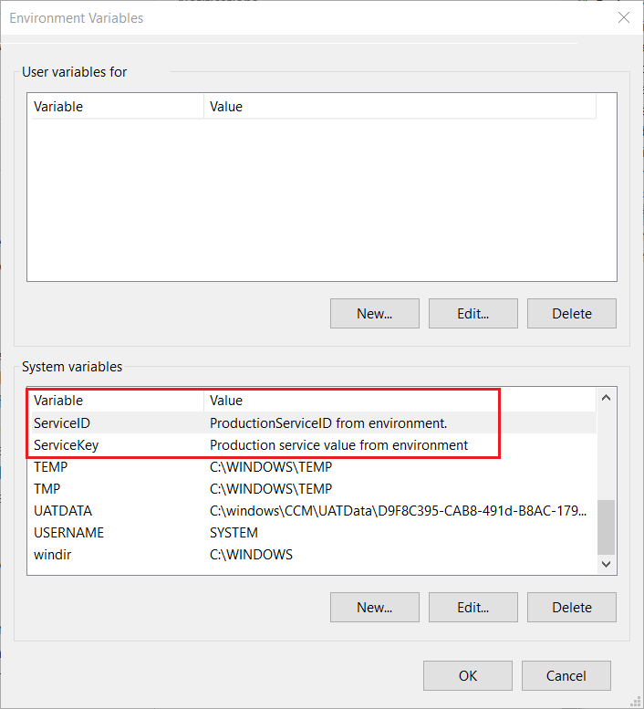
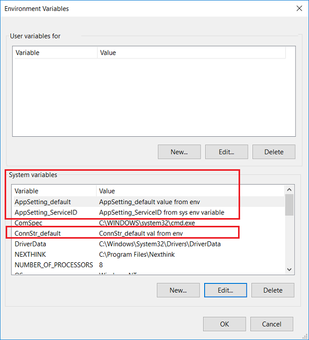

# Configuration builders for ASP.NET

By [Stephen Molloy](https://github.com/StephenMolloy) and [Rick Anderson](https://twitter.com/RickAndMSFT)

Configuration builders provide a modern and agile mechanism for ASP.NET apps to get configuration values from external sources.

Configuration builders:

* Are available in .NET Framework 4.7.1 and later.
* Provide a flexible mechanism for reading configuration values.
* Address some of the basic needs of apps as they move into a container and cloud focused environment.
* Can be used to improve protection of configuration data by drawing from sources previously unavailable (for example, Azure Key Vault and environment variables) in the .NET configuration system.

## Key/value configuration builders

A common scenario that can be handled by configuration builders is to provide a basic key/value replacement mechanism for configuration sections that follow a key/value pattern. The .NET Framework concept of ConfigurationBuilders is not limited to specific configuration sections or patterns. However, many of the configuration builders in `Microsoft.Configuration.ConfigurationBuilders` ([github](https://github.com/aspnet/MicrosoftConfigurationBuilders), [NuGet](https://www.nuget.org/packages?q=Microsoft.Configuration.ConfigurationBuilders)) work within the key/value pattern.

## Key/value configuration builders settings

The following settings apply to all key/value configuration builders in `Microsoft.Configuration.ConfigurationBuilders`.

### Mode

The configuration builders use an external source of key/value information to populate selected key/value elements of the configuration system. Specifically, the `<appSettings/>` and `<connectionStrings/>` sections receive special treatment from the configuration builders. The builders work in three modes:

* `Strict` - The default mode. In this mode, the configuration builder only operates on well-known key/value-centric configuration sections. `Strict` mode enumerates each key in the section. If a matching key is found in the external source:

   * The configuration builders replace the value in the resulting configuration section with the value from the external source.
* `Greedy` - This mode is closely related to `Strict` mode. Rather than being limited to keys that already exist in the original configuration:

  * The configuration builders adds all key/value pairs from the external source into the resulting configuration section.

* `Expand` - Operates on the raw XML before it's parsed into a configuration section object. It can be thought of as an expansion of tokens in a string. Any part of the raw XML string that matches the pattern `${token}` is a candidate for token expansion. If no corresponding value is found in the external source, then the token is not changed. Builders in this mode are not limited to the `<appSettings/>` and `<connectionStrings/>` sections.

The following markup from *web.config* enables the [EnvironmentConfigBuilder](https://www.nuget.org/packages/Microsoft.Configuration.ConfigurationBuilders.Environment/) in `Strict` mode:

[!code-xml[Main](config-builder/MyConfigBuilders/WebDefault.config?name=snippet)]

The following code reads the `<appSettings/>` and `<connectionStrings/>` shown in the preceding *web.config* file:

[!code-csharp[Main](config-builder/MyConfigBuilders/About.aspx.cs)]

The preceding code will set the property values to:

* The values in the *web.config* file if the keys are not set in environment variables.
* The values of the environment variable, if set.

For example, `ServiceID` will contain:

* "ServiceID value from web.config", if the environment variable `ServiceID` is not set.
* The value of the `ServiceID` environment variable, if set.

The following image shows the `<appSettings/>` keys/values from the preceding *web.config* file set in the environment editor:



Note: You might need to exit and restart Visual Studio to see changes in environment variables.

### Prefix handling

Key prefixes can simplify setting keys because:

* The .NET Framework configuration is complex and nested.
* External key/value sources are commonly basic and flat by nature. For example, environment variables are not nested.

Use any of the following approaches to inject both `<appSettings/>` and `<connectionStrings/>` into the configuration via environment variables:

* With the `EnvironmentConfigBuilder` in the default `Strict` mode and the appropriate key names in the configuration file. The preceding code and markup takes this approach. Using this approach you can **not** have identically named keys in both `<appSettings/>` and `<connectionStrings/>`.
* Use two `EnvironmentConfigBuilder`s in `Greedy` mode with distinct prefixes and `stripPrefix`. With this approach, the app can read `<appSettings/>` and `<connectionStrings/>` without needing to update the configuration file. The next section,  [stripPrefix](#stripprefix),  shows how to do this.
* Use two `EnvironmentConfigBuilder`s in `Greedy` mode with distinct prefixes. With this approach you can't have duplicate key names as key names must differ by prefix.  For example:

[!code-xml[Main](config-builder/MyConfigBuilders/WebPrefix.config?name=snippet&highlight=11-99)]

With the preceding markup, the same flat key/value source can be used to populate configuration for two different sections.

The following image shows the `<appSettings/>` and `<connectionStrings/>` keys/values from the preceding *web.config* file set in the environment editor:



The following code reads the `<appSettings/>` and `<connectionStrings/>` keys/values contained in the preceding *web.config* file:

[!code-csharp[Main](config-builder/MyConfigBuilders/Contact.aspx.cs?name=snippet)]

The preceding code will set the property values to:

* The values in the *web.config* file if the keys are not set in environment variables.
* The values of the environment variable, if set.

For example, using the previous *web.config* file, the keys/values in the previous  environment editor image, and the previous code, the following values are set:

|  Key              | Value |
| ----------------- | ------------ |
|     AppSetting_ServiceID           | AppSetting_ServiceID from env variables|
|    AppSetting_default            | AppSetting_default value from env |
|       ConnStr_default         | ConnStr_default val from env|

### stripPrefix

`stripPrefix`: boolean, defaults to `false`. 

The preceding XML markup separates app settings from connection strings but requires all the keys in the *web.config* file to use the specified prefix. For example, the prefix `AppSetting` must be added to the `ServiceID` key ("AppSetting_ServiceID"). With `stripPrefix`, the prefix is not used in the *web.config* file. The prefix is required in the configuration builder source (for example, in the environment.) We anticipate most developers will use `stripPrefix`.

Applications typically strip off the prefix. The following *web.config* strips the prefix:

[!code-xml[Main](config-builder/MyConfigBuilders/WebPrefixStrip.config?name=snippet&highlight=14,19)]

In the preceding *web.config* file, the `default` key is in both the `<appSettings/>` and `<connectionStrings/>`.

The following image shows the `<appSettings/>` and `<connectionStrings/>` keys/values from the preceding *web.config* file set in the environment editor:


The following code reads the `<appSettings/>` and `<connectionStrings/>` keys/values contained in the preceding *web.config* file:

[!code-csharp[Main](config-builder/MyConfigBuilders/About2.aspx.cs?name=snippet)]

The preceding code will set the property values to:

* The values in the *web.config* file if the keys are not set in environment variables.
* The values of the environment variable, if set.

For example, using the previous *web.config* file, the keys/values in the previous  environment editor image, and the previous code, the following values are set:

|  Key              | Value |
| ----------------- | ------------ |
|     ServiceID           | AppSetting_ServiceID from env variables|
|    default            | AppSetting_default value from env |
|    default         | ConnStr_default val from env|

### tokenPattern

`tokenPattern`: String, defaults to `@"\$\{(\w+)\}"`

The `Expand` behavior of the builders searches the raw XML for tokens that look like `${token}`. Searching is done with the default regular expression `@"\$\{(\w+)\}"`. The set of characters that matches `\w` is more strict than XML and many configuration sources allow. Use `tokenPattern` when more characters than `@"\$\{(\w+)\}"` are required in the token name.

`tokenPattern`: String:

* Allows developers to change the regex that is used for token matching.
* No validation is done to make sure it is a well-formed, non-dangerous regex.
* It must contain a capture group. The entire regex must match the entire token. The first capture must be the token name to look up in the configuration source.

## Configuration builders in Microsoft.Configuration.ConfigurationBuilders

### EnvironmentConfigBuilder

```xml
<add name="Environment"
    [mode|prefix|stripPrefix|tokenPattern] 
    type="Microsoft.Configuration.ConfigurationBuilders.EnvironmentConfigBuilder,
    Microsoft.Configuration.ConfigurationBuilders.Environment" />
```

The [EnvironmentConfigBuilder](https://www.nuget.org/packages/Microsoft.Configuration.ConfigurationBuilders.Environment/):

* Is the simplest of the configuration builders.
* Reads values from the environment.
* Does not have any additional configuration options.
* The `name` attribute value is arbitrary.

**Note:** In a Windows container environment, variables set at run time are only injected into the EntryPoint process environment. Apps that run as a service or a non-EntryPoint process do not pick up these variables unless they are otherwise injected through a mechanism in the container. For [IIS](https://github.com/Microsoft/iis-docker/pull/41)/[ASP.NET](https://github.com/Microsoft/aspnet-docker)-based
 containers, the current version of [ServiceMonitor.exe](https://github.com/Microsoft/iis-docker/pull/41) handles this in the *DefaultAppPool* only. Other Windows-based container variants may need to develop their own injection mechanism for non-EntryPoint processes.

### UserSecretsConfigBuilder

> [!WARNING]
> Never store passwords, sensitive connection strings, or other sensitive data in source code. Production secrets should not be used for development or test.

```xml
<add name="UserSecrets"
    [mode|prefix|stripPrefix|tokenPattern]
    (userSecretsId="{secret string, typically a GUID}" | userSecretsFile="~\secrets.file")
    [optional="true"]
    type="Microsoft.Configuration.ConfigurationBuilders.UserSecretsConfigBuilder,
    Microsoft.Configuration.ConfigurationBuilders.UserSecrets" />
```

This configuration builder provides a feature similar to [ASP.NET Core Secret Manager](/aspnet/core/security/app-secrets).

The [UserSecretsConfigBuilder](https://www.nuget.org/packages/Microsoft.Configuration.ConfigurationBuilders.UserSecrets/) can be used in .NET Framework projects, but a secrets file must be specified. Alternatively, you can define the `UserSecretsId` property in the project file and create the raw secrets file in the correct location for reading. To keep external dependencies out of your project, the secret file is XML formatted. The XML formatting is an implementation detail, and the format should not be relied upon. If you need to share a *secrets.json* file with .NET Core projects, consider using the [SimpleJsonConfigBuilder](#simplejsonconfig). The `SimpleJsonConfigBuilder` format for .NET Core should also be considered an implementation detail subject to change.

Configuration attributes for `UserSecretsConfigBuilder`:

* `userSecretsId` - This is the preferred method for identifying an XML secrets file. It works similar to .NET Core, which uses a `UserSecretsId` project property to store this identifier. The string must be unique, it doesn't need to be a GUID. With this attribute, the `UserSecretsConfigBuilder` look in a well-known local location (`%APPDATA%\Microsoft\UserSecrets\<UserSecrets Id>\secrets.xml`) for a secrets file belonging to this identifier.
* `userSecretsFile` - An optional attribute specifying the file containing the secrets. The `~` character can be used at the start to reference the application root. Either this attribute or the `userSecretsId` attribute is required. If both are specified, `userSecretsFile` takes precedence.
* `optional`: boolean, default value `true` - Prevents an exception if the secrets file cannot be found. 
* The `name` attribute value is arbitrary.

The secrets file has the following format:

```xml
<?xml version="1.0" encoding="utf-8" ?>
<root>
  <secrets ver="1.0">
    <secret name="secret key name" value="secret value" />
  </secrets>
</root>
```

### AzureKeyVaultConfigBuilder

```xml
<add name="AzureKeyVault"
    [mode|prefix|stripPrefix|tokenPattern]
    (vaultName="MyVaultName" |
     uri="https:/MyVaultName.vault.azure.net")
    [connectionString="connection string"]
    [version="secrets version"]
    [preloadSecretNames="true"]
    type="Microsoft.Configuration.ConfigurationBuilders.AzureKeyVaultConfigBuilder,
    Microsoft.Configuration.ConfigurationBuilders.Azure" />
```

The [AzureKeyVaultConfigBuilder](https://www.nuget.org/packages/Microsoft.Configuration.ConfigurationBuilders.Azure/) reads values stored in the [Azure Key Vault](/azure/key-vault/key-vault-whatis).

`vaultName` is required (either the name of the vault or a URI to the vault). The other attributes allow control about which vault to connect to, but are only necessary if the application is not running in an environment that works with `Microsoft.Azure.Services.AppAuthentication`. The Azure Services Authentication library is used to automatically pick up connection information from the execution environment if possible. You can override automatically pick up of connection information by providing a connection string.

* `vaultName` - Required if `uri` in not provided. Specifies the name of the vault in your Azure subscription from which to read key/value pairs.
* `connectionString` - A connection string usable by [AzureServiceTokenProvider](https://docs.microsoft.com/en-us/azure/key-vault/service-to-service-authentication#connection-string-support)
* `uri` - Connects to other Key Vault providers with the specified `uri` value. If not specified, Azure (`vaultName`) is the vault provider.
* `version` - Azure Key Vault provides a versioning feature for secrets. If `version` is specified, the builder only retrieves secrets matching this version.
* `preloadSecretNames` - By default, this builder querys **all** key names in the key vault when it is initialized. To prevent reading all key values, set this attribute to `false`. Setting this to `false` reads secrets one at a time. Reading secrets one at a time can useful if the vault allows "Get" access but not "List" access. **Note:** When using `Greedy` mode, `preloadSecretNames` must be `true` (the default.)

### KeyPerFileConfigBuilder

```xml
<add name="KeyPerFile"
    [mode|prefix|stripPrefix|tokenPattern]
	(directoryPath="PathToSourceDirectory")
    [ignorePrefix="ignore."]
    [keyDelimiter=":"]
    [optional="false"]
    type="Microsoft.Configuration.ConfigurationBuilders.KeyPerFileConfigBuilder,
    Microsoft.Configuration.ConfigurationBuilders.KeyPerFile" />
```

[KeyPerFileConfigBuilder](https://www.nuget.org/packages/Microsoft.Configuration.ConfigurationBuilders.KeyPerFile/) is a basic configuration builder that uses a directory's files as a source of values. A file's name is the key, and the contents are the value. This configuration builder can be useful when running in an orchestrated container environment. Systems like Docker Swarm and Kubernetes provide `secrets` to their orchestrated windows containers in this key-per-file manner.

Attribute details:

* `directoryPath` - Required. Specifies a path to look in for values. Docker for Windows secrets are stored in the *C:\ProgramData\Docker\secrets* directory by default.
* `ignorePrefix` - Files that start with this prefix are excluded. Defaults to "ignore.".
* `keyDelimiter` - Default value is `null`. If specified, the configuration builder traverses multiple levels of the directory, building up key names with this delimiter. If this value is `null`, the configuration builder only looks at the top level of the directory.
* `optional` -  Default value is `false`. Specifies whether the configuration builder should cause errors if the source directory doesn't exist.

### SimpleJsonConfigBuilder

> [!WARNING]
> Never store passwords, sensitive connection strings, or other sensitive data in source code. Production secrets should not be used for development or test.

```xml
<add name="SimpleJson"
    [mode|prefix|stripPrefix|tokenPattern]
    jsonFile="~\config.json"
    [optional="true"]
    [jsonMode="(Flat|Sectional)"]
    type="Microsoft.Configuration.ConfigurationBuilders.SimpleJsonConfigBuilder,
    Microsoft.Configuration.ConfigurationBuilders.Json" />
```

.NET Core projects frequently use JSON files for configuration. The [SimpleJsonConfigBuilder](https://www.nuget.org/packages/Microsoft.Configuration.ConfigurationBuilders.Json/) builder allows .NET Core JSON files to be used in the .NET Framework. This configuration builder is provides a basic mapping from a flat key/value source into specific key/value areas of .NET Framework configuration. This configuration builder does **not** provide for hierarchical configurations. The JSON backing file is similar to a dictionary, not a complex hierarchical object. A multi-level hierarchical file can be used. This provider `flatten`s the depth by appending the property name at each level using `:` as a delimiter.

Attribute details:

* `jsonFile` - Required. Specifies the JSON file to read from. The `~` character can be used at the start to reference the app root.
* `optional` - Boolean,  default value is `true`. Prevents throwing exceptions if the JSON file cannot be found.
* `jsonMode` - `[Flat|Sectional]`. `Flat` is the default. When `jsonMode` is `Flat`, the JSON file is a single flat key/value source. The `EnvironmentConfigBuilder` and `AzureKeyVaultConfigBuilder` are also single flat key/value sources. When the `SimpleJsonConfigBuilder` is configured in `Sectional` mode:

  * The JSON file is conceptually divided just at the top level into multiple dictionaries.
  * Each of the dictionaries is only applied to the configuration section that matches the top-level property name attached to them. For example:

```json
    {
        "appSettings" : {
            "setting1" : "value1",
            "setting2" : "value2",
            "complex" : {
                "setting1" : "complex:value1",
                "setting2" : "complex:value2",
            }
        }
    }
```

## Implementing a custom key/value configuration builder

If the configuration builders don't meet your needs, you can write a custom one. The `KeyValueConfigBuilder` base class handles substitution modes and most prefix concerns. An implementing project need only:

* Inherit from the base class and implement a basic source of key/value pairs through the `GetValue` and `GetAllValues`:
* Add the [Microsoft.Configuration.ConfigurationBuilders.Base](https://www.nuget.org/packages/Microsoft.Configuration.ConfigurationBuilders.Base/) to the project.

[!code-csharp[Main](config-builder/MyConfigBuilders/MyCustomConfigBuilder.cs)]

The `KeyValueConfigBuilder` base class provides much of the work and consistent behavior across key/value configuration builders.

## Additional resources

* [Configuration Builders GitHub repository](https://github.com/aspnet/MicrosoftConfigurationBuilders)
* [Service-to-service authentication to Azure Key Vault using .NET](/azure/key-vault/service-to-service-authentication#connection-string-support)
