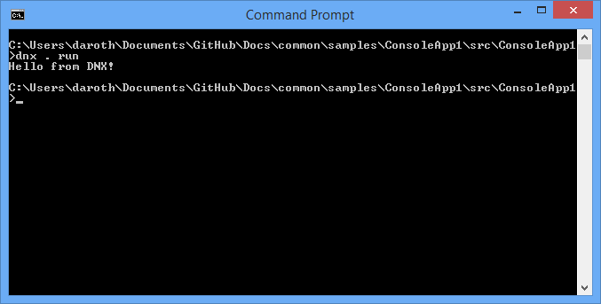
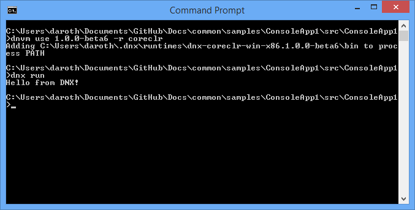
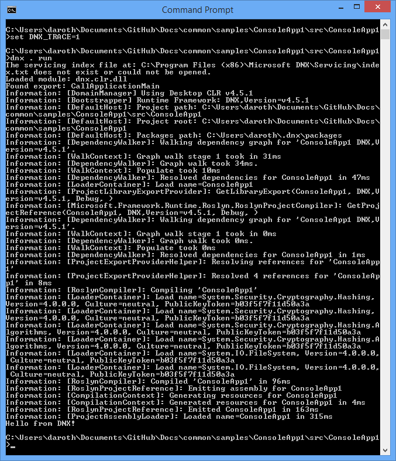

Creating a Cross-Platform Console App with DNX
==============================================

By `Steve Smith`_

Using the .NET Execution environment (DNX), it's very easy to run a simple console application.

In this article:
	- `Creating a Console App`_
	- `Specifying Project Settings`_
	- `Running the App`_
	
You can `view and download the source <https://github.com/aspnet/Docs/tree/master/common/samples/ConsoleApp1>`_ from the project created in this article.

Creating a Console App
----------------------

Before you begin, make sure you have successfully installed DNX on your system:
	- :doc:`Installing on Windows </getting-started/installing-on-windows>`
	- :doc:`Installing on Mac OS X </getting-started/installing-on-mac>`
	- :doc:`Installing on Linux </getting-started/installing-on-linux>`

Open a console or terminal window in an empty working folder, where ``dnx`` is configured.

Creating a console application is extremely straightforward. For this article, we're going to use the following C# class, which has just one line of executable code:

.. literalinclude:: /../common/samples/ConsoleApp1/src/ConsoleApp1/Program.cs
	:linenos:
	:language: c#
	
It really doesn't get any simpler than this. First create a new folder named `ConsoleApp1` (the name is important, so don't try to use another name). Then, create a file with these contents and save it as `Program.cs` in the `ConsoleApp1` folder.

Specifying Project Settings
---------------------------

Next, we need to provide the project settings DNX will use. Create a new ``project.json`` file in the same folder, and edit it to match the listing shown here:

.. literalinclude:: /../common/samples/ConsoleApp1/src/ConsoleApp1/project.json
	:linenos:
	:language: json

The ``project.json`` files defines the app dependencies and target frameworks in addition to various metadata properties about the app. See :doc:`projects` for more details.

Save your changes.

Running the App
---------------

At this point, we're ready to run the app. You can do this by simply entering ``dnx run`` from the command prompt. You should see a result like this one:

.. note:: The ``dnx`` command is used to execute a managed entry point (a ``Program.Main`` function) in an assembly. By default, the ``dnx run`` command looks in the current directory for the project to run. To specify a different directory, use the --project switch.

You can select which CLR to run on using the .NET Version Manager (DNVM). To run on CoreCLR first run ``dnvm use [version] -r CoreCLR``. To return to using the .NET Framework CLR run ``dnvm use [version] -r CLR``.

You can see the app continues to run after switching to use CoreCLR:

The ``dnx`` command references several `environment variables <https://github.com/aspnet/Home/wiki/Environment-Variables>`_, such as ``DNX_TRACE``, that affect its behavior.

Set the ``DNX_TRACE`` environment variable to 1, and run the application again. You should see a great deal more output:

Summary
-------

Creating and running your first console application on DNX is very simple, and only requires two files.

