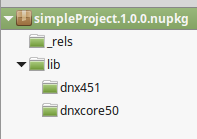

Working with DNX Projects
=========================

DNX projects are used to build and run .NET applications for Windows, Mac and Linux. DNX provides a host process, CLR hosting logic and managed entry point discovery. 

.. note:: To see and create an example of a DNX project, follow the steps provided in the tutorial `Create an ASP.NET 5 web app in Visual Studio Code <https://azure.microsoft.com/en-us/documentation/articles/web-sites-create-web-app-using-vscode/>`_. After creating the app and opening it in VSCode, you will be able to view the **project.json** file.

Creating a new project 
----------------------

At its simplest form, a DNX project is a **project.json** file along with a code file:

::

    -MyApp (folder)
    --project.json
    --Program.cs

There are two mandatory conditions for a project. The *project.json* file must contain valid json, where brackets *{ }* are used inside the file, and that your *program.cs* file contains valid C#. 

The presence of a *project.json* file defines a DNX project. It is the *project.json* file that contains all the information that DNX needs to run and package your project. For additional details, including the *project.json* file schema, see `Project.json <https://github.com/aspnet/Home/wiki/Project.json-file>`_.

When using some editors there are other files that you'll see. For instance, when using Visual Studio you may see a .xproj file. These other types of files are requirements of their specific tool, but are not a requirement of DNX. The .xproj file type, for example, is an MSBuild file that is used by Visual Studio and keeps information that is important to Visual Studio, but this type of file does not impact DNX.

Targeting frameworks
--------------------

One of the sections you can add to the *project.json* is the ``frameworks`` section. The ``frameworks`` section looks like this:

.. code-block:: json

    {
      "frameworks": {
        "dnx451": {},
        "dnxcore50": {}
      }
    }

Each of the values in the ``frameworks`` section of the *project.json* file is a framework that your project will compile. The above snippet will build for the full .NET Framework (dnx451) and .NET Core (dnxcore50). 

If you pack this project, using ``dnu pack`` then you will get a NuGet package that looks like the following:

Notice that the ``nupkg`` has a folder for each of the frameworks you specified, allowing this NuGet package to work on any of the frameworks. You can also specify a .NET Portable profile by using the full name of that profile, for example:

.. code-block:: json

    {
      "frameworks": {
        "dnxcore50":{},
        ".NETPortable,Version=v4.5,Profile=Profile7":{}
      }
    }

With the above ``frameworks`` section, you'll generate a package with a *portable-net45+win* folder that will be used when running on platforms that match that portable profile.

Adding dependencies
-------------------

You manage the dependencies of your application with the ``dependencies`` section of your *project.json* file. The dependencies are defined by name and version, where the runtime loaders determine what should be loaded.

.. code-block:: json

    {
      "dependencies":{
        "Microsoft.AspNet.Mvc": "6.0.0-beta4"
      }
    }

The above *project.json* section tells DNX that you depend upon ``Microsoft.AspNet.Mvc``, which means you also depend on everything that MVC depends on.

The schema for dependency types adheres to following pattern:

.. code-block:: json

	{
		"dependencies": {
			"type": "object",
			"additionalProperties": {
				"type": [ "string", "object" ],
				"properties": {
					"version": {
						"type": "string"
					},
					"type": {
						"type": "string",
						"default": "default",
						"enum": [ "default", "build" ]
					}
				}
			}
		}
	}
		
For additional information about how dependency versions are chosen, see `Dependency Resolution <https://github.com/aspnet/Home/wiki/Dependency-Resolution>`_.
		
Package dependencies
^^^^^^^^^^^^^^^^^^^^

The .NET Development Utility (DNU) is responsible for all operations involving packages in your application. You use the **Install** command to download a package based on the package id and add it to your application::

	dnu install <package id>
	
For a list of usage, arguments, and options of the ``install`` command, enter the following in the command windows::

	dnu help install
	
For more information about ``dnu`` commands, see `.NET Development Utility (DNU) <https://github.com/aspnet/Home/wiki/DNX-utility>`_.

The more common way of installing packages is to just edit the *project.json* file. Editors like Visual Studio provide IntelliSense for all packages, making editing the file far easier than running ``dnu install``. However, you can use ``dnu install`` if you prefer. 

Assembly references
^^^^^^^^^^^^^^^^^^^

You can also specify a list of framework assemblies for some frameworks:

.. code-block:: json

    {
      "frameworks": {
        "dnx451":{
          "frameworkAssemblies":{
            "System.Text": ""
          }
        }
      }
    }

Generally, you use this frameworkAssemblies section when you want to depend on an assembly that is:
- In the Global Assembly Cache (GAC)
- Part of the framework you are targeting 

The *frameworkAssemblies* section is separate from the rest of the dependencies list to remove the possibility of accidentally depending on a NuGet package that happens to have the same name as a .NET Framework assembly. 

Project references
^^^^^^^^^^^^^^^^^^

The *global.json* file is used to configure all the projects within a directory. It includes just two default sections, the ``projects`` section and the ``sdk`` section.

.. code-block:: json

	{
	  "projects": [ "src", "test" ],
	  "sdk": {
		"version": "1.0.0-beta5",
		"runtime": "clr",
		"architecture": "x86"
	  }
	}

The ``projects`` property designates which folders contain source code for the solution. By default, the project structure places source files in a *src* folder, allowing build artifacts to be placed in a sibling folder, making it easier to exclude such things from source control.

Specifying required SDK version
^^^^^^^^^^^^^^^^^^^^^^^^^^^^^^^

The ``sdk`` property specifies the version of DNX (.NET Execution Environment) that Visual Studio will use when opening the solution. It’s set in the *global.json* file, rather than in *project.json* file, to avoid scenarios where different projects within a solution are targeting different versions of the SDK. 

.. note:: The SDK version of *global.json* does not determine DNX version used when run from the command line. You will still need to use DNVM to select the correct DNX version.
	
Referencing non-DNX projects
^^^^^^^^^^^^^^^^^^^^^^^^^^^^

You can use Visual Studio to add a reference to a non-DNX project by using the **Add Reference** dialog box. This will add a *project.json* file to your solution at the root folder which represents the referenced project.

Framework-specific dependencies
^^^^^^^^^^^^^^^^^^^^^^^^^^^^^^^^^^^^^^^^^

You can also add dependencies for a particular framework like this:

.. code-block:: json

    {
      "frameworks": {
        "dnxcore50":{
          "dependencies":{
            "System.Console": "4.0.0.0"
          }
        },
        "dnx451":{}
      }
    }

In the above example, the ``System.Console`` dependency is only needed for the *dnxcore50* target, not *dnx451*. It is often the case that you will have extra dependencies on Core CLR, because there are packages that you need to depend on in Core CLR that are part of .NET 4.5.x.

.. note:: While it is technically true that you do not need the ``System.Console`` package on .NET 4.5.1, it also doesn't matter if you add it as a top level dependency. Each of the ``System.*`` packages will work as a top level dependency. So, you don't always have to have this separation. You could add ``System.Console`` as a top level dependency and it will not impact your application when on .NET 4.5.1.

Restoring packages
------------------

The .NET Development Utility (DNU) wraps the functionality of NuGet to do package restore, which means that it uses the *NuGet.config* file to determine where to download the package. If you want to get packages from somewhere other than NuGet.org, you can edit your NuGet.config.

For instructions about how to get development builds of the latest ASP.NET and DNX packages, see `Configuring the feed used by dnu to restore packages <https://github.com/aspnet/Home/wiki/Configuring-the-feed-used-by-dnu-to-restore-packages>`_.

Using DNU Restore
^^^^^^^^^^^^^^^^^

The restore command will look at the dependencies listed in the *project.json* file and download them, adding them to your app's packages directory. It downloads the entire graph of dependencies, even though you only explicitly declare the top level dependency that you directly require. It uses NuGet internally to download packages. 

The following is an example of using the ``restore`` command from the command window, where the command is executed from the folder containing the application (including the *project.json* file)::

	dnu restore

Project lock file
^^^^^^^^^^^^^^^^^

When doing a package restore, DNU builds up a great deal of information about the dependencies of your application, this information is persisted to disk in the *project.lock.json* file.

DNX reads the lock file when running your application instead of rebuilding all the information that the DNU already generated. To understand the reason for that, imagine what DNX has to do without the lock file:

1. Find each dependency listed in the *project.json* file.
2. Open the nuspec of each package and get all of their dependencies.
3. Repeat step 2 for each dependency until it has the entire graph.
4. Load all the dependencies.

By using the lock file, this process is reduced to:

1. Read the lock file.
2. Load all the dependencies.

There is significantly less disk IO involved in the second list.

The lock file ensures that after you run ``dnu restore``, you have a fixed set of packages that you are referencing. When restoring, the DNU generates the lock file which specifies the exact versions that your project will use. This way, versions only get modified when you run ``dnu restore``, not during run-time. Restoring also ends up improving performance at run-time since DNX no longer has to probe the packages directory to find the right version to use, DNX just does what the lock file instructs DNX to do. 

.. Note:: The primary advantage of the lock file is to prevent the application from be affected by someone else installing a package into your global install directory. For this reason, the lock file is mandatory to run. If you do not have a lock file, DNX will fail to load your application.

There is a field in the lock file, ``locked``, which can be set to true either manually or via ``dnu restore —lock``. Setting this field to ``true`` specifies that ``dnu restore`` will just download the versions specified in the lock file and will not do any dependency graph walking or version selection. You can run ``dnu restore —lock`` to generate a locked lock file. Future restores will not change your installed version, unless you use ``dnu restore --unlock`` to remove the lock. You could lock your lock file and check it in on a release branch to ensure that you always get the exact version you expect, but leave it unlocked ()and ignored by source control on development branch(es).

Specifying an alternative package locations
^^^^^^^^^^^^^^^^^^^^^^^^^^^^^^^^^^^^^^^^^^^

You can add ``nupkg`` (NuGet packages) and ``source`` packages (not on a NuGet feed) to a project. To specify the location of these packages you must include the path to the NuGet package or to a packages folder, such as::

	 dnu packages add newPackage.1.0.0.nupkg c:\packageStore  
	 
For additional details, run the help command::

	dnu packages add --help

Using commands
--------------

A command is an alias for a package to use as an entry point and also provides an initial set of arguments. You can define commands in your *project.json* file:

.. code-block:: json

    {
      "version": "1.0.0",
      "webroot": "wwwroot",
      "exclude": [
        "wwwroot"
      ],
      "dependencies": {
        "Kestrel": "1.0.0-beta4",
        "Microsoft.AspNet.Diagnostics": "1.0.0-beta4",
        "Microsoft.AspNet.Hosting": "1.0.0-beta4",
        "Microsoft.AspNet.Server.IIS": "1.0.0-beta4",
        "Microsoft.AspNet.Server.WebListener": "1.0.0-beta4",
        "Microsoft.AspNet.StaticFiles": "1.0.0-beta4"
      },
      "commands": {
		"web": "Microsoft.AspNet.Hosting --server Microsoft.AspNet.Server.WebListener --server.urls http://localhost:5000",
		"kestrel": "Microsoft.AspNet.Hosting --server Kestrel --server.urls http://localhost:5001",
		"gen": "Microsoft.Framework.CodeGeneration",
		"ef": "EntityFramework.Commands"
      },
      "frameworks": {
        "dnx451": { },
        "dnxcore50": { }
      }
    }

The commands are a set of arguments that will be passed to DNX. The entry-point provided by a command should either be the name of a project within your solution, or an assembly provided by a package that your application depends on. 
	
Running your app
----------------

By specifying a command as an argument that is passed to DNX, you can run your app locally. For instance, you can use the ``kestrel`` command (specified in the ``commands`` section of your project's *project.json* file) to run a Web Application as follows::

    dnx kestrel

To view the running web application, you can open a browser and navigate to the path specified in the *project.json* file::

	http://localhost:5001
	
To run a Console Application using the Command Window from the project directory, you can use the following statement::

	dnx run
	
To run a Web API application, you can use the following command from the Command Window::

	dnx web
	
In the case of the *web* command, the ``Microsoft.AspNet.Hosting`` assembly has a ``Main`` entry point method that is called whenever you run the web command. The rest of the values in the *web* command are used by the hosting assembly to host your web application.

To run commands out of a different project, you can use the ``--project`` option. The short form of ``--project`` is ``--p``. For example::

	dnx -p tests\MyTestProject test
	
For a Console Application, the entry point is the ``Main`` method of the ``Program`` class. For more information about the Web Application startup process, see :doc:`/fundamentals/startup`.

When your run your app, you can specify whether to compile in Debug mode or in Release mode. You can specify the ``configuration`` option as follows::

	dnx --configuration Debug

For more compilation related information, see :ref:`dnx-projects-CompiliationSettings`).

Building
--------

You use DNX projects to build NuGet packages. You can use the .NET Development Utility (DNU) to build, package, and publish DNX projects. 

DNU build
^^^^^^^^^

The *project.json* file defines your package metadata, your project dependencies, and which frameworks that you want to target your build. 

All the files in the folder are by default part of the project unless explicitly excluded in *project.json*. You specify which frameworks to target by using the "frameworks" property. DNX will cross-compile for each specified framework and create the corresponding *lib* folder in the built NuGet package.

Building a project produces the binary outputs for the project. 

.. _dnx-projects-CompiliationSettings:

Compilation settings
^^^^^^^^^^^^^^^^^^^^^

Compilation settings allow you to pass options through to the compiler. The language version can be set in this section of the *project.json* file, as well as defines and other options.

.. code-block:: json

    {
      "compilationOptions": {
        "define": ["SOMETHING"],
        "allowUnsafe": true,
        "warningsAsErrors" : true,
        "languageVersion": "experimental"
      }
    }

Configurations are named groups of compilation settings. There are two default compilation settings, **Debug** and **Release**. You can override these (or add more) by modifying to the configurations section in the *project.json*.

.. code-block:: json

    {
      "configurations": {
        "Debug": {
          "compilationOptions": {
            "define": ["DEBUG", "TRACE"]
          }
        },
        "Release": {
          "compilationOptions": {
            "define": ["RELEASE", "TRACE"],
            "optimize": true
          }
        }
      }
    }

When building a DNX based application, such as by using ``dnu build`` or via pack/publish with ``dnu pack`` or ``dnu publish``, you can pass ``--configuration <configuration>`` to have DNX use the named configuration. 

For a list of usage, arguments, and options of the ``build`` command, enter the following in the command windows::

	dnu help build

Including/Excluding files
^^^^^^^^^^^^^^^^^^^^^^^^^

By default all code files in a directory containing a *project.json* are included in the project. You can control this with the include/exclude sections of the *project.json*.

The most common sections that you will see for including and excluding files are:

.. code-block:: json

    {
      "compile": "*.cs",
      "exclude": [
        "node_modules",
        "bower_components"
      ],
      "publishExclude": [
        "**.xproj",
        "**.user",
        "**.vspscc"
      ]
    }

* The *compile* section specifies that only .cs files will be compiled.

* The *exclude* section excludes any files in the ``node_modules`` and ``bower_components`` directories. Even if sections have .cs extensions.

* The *publishExclude* section allows you to exclude files from the publish output of your project. In this example, all *.xproj*, *.user*, and *.vspscc* files from the output of the publish command. 

.. note:: Most sections of the *project.json* file that deal with files allow `glob patterns <https://en.wikipedia.org/wiki/Glob_programming>`_, which often called wildcards. 

List of include/exclude properties
^^^^^^^^^^^^^^^^^^^^^^^^^^^^^^^^^^

+---------------------+--------------------------------------+-----------------------------------+
| name                | default value                        | remark                            |
+=====================+======================================+===================================+
| compile             |                                      |                                   |
+---------------------+--------------------------------------+-----------------------------------+
| compileExclude      |                                      |                                   |
+---------------------+--------------------------------------+-----------------------------------+
| content             | ``**/*``                             |                                   |
+---------------------+--------------------------------------+-----------------------------------+
| contentExclude      |                                      |                                   |
+---------------------+--------------------------------------+-----------------------------------+
| preprocess          | ``compiler/preprocess/**/*.cs``      |                                   |
+---------------------+--------------------------------------+-----------------------------------+
| preprocessExclude   |                                      |                                   |
+---------------------+--------------------------------------+-----------------------------------+
| resource            |``compiler/preprocess/resources/**/*``|                                   |
+---------------------+--------------------------------------+-----------------------------------+
| resourceExclude     |                                      |                                   |
+---------------------+--------------------------------------+-----------------------------------+
| shared              | ``compiler/shared/**/*.cs``          |                                   |
+---------------------+--------------------------------------+-----------------------------------+
| sharedExclude       |                                      |                                   |
+---------------------+--------------------------------------+-----------------------------------+
| bundleExclude       | ``bin/**;obj/**;**/.*/**``           |                                   |
+---------------------+--------------------------------------+-----------------------------------+
| exclude             |                                      |                                   |
+---------------------+--------------------------------------+-----------------------------------+

Advanced Properties
^^^^^^^^^^^^^^^^^^^

In addition to the above table there are some extra properties that you will not use as often.

* The names ending in BuiltIn control the built in values of their associated key. E.g. *compile* always has the value of *compileBuiltIn* appended to it.
* The names ending in Files are ways to specify an individual file, without globbing. These are here so that you can do things like "exclude all files in folder x except this one file that I care about".

+---------------------+-------------------------------------+-----------------------------------+
| name                | default value                       | remark                            |
+=====================+=====================================+===================================+
| compileBuiltIn      | ``**/*.cs``                         | Concatenated to compile.          |
+---------------------+-------------------------------------+-----------------------------------+
| excludeBuiltIn      | ``bin/**;obj/**;*.kproj``           |                                   |
+---------------------+-------------------------------------+-----------------------------------+
| compileFiles        |                                     | Wildcard is not allowed           |
+---------------------+-------------------------------------+-----------------------------------+
| contentFiles        |                                     | Wildcard is not allowed           |
+---------------------+-------------------------------------+-----------------------------------+
| preprocessFiles     |                                     | Wildcard is not allowed           |
+---------------------+-------------------------------------+-----------------------------------+
| resourceFiles       |                                     | Wildecard is not allowed          |
+---------------------+-------------------------------------+-----------------------------------+
| sharedFiles         |                                     | Wildecard is not allowed          |
+---------------------+-------------------------------------+-----------------------------------+

Precedence
^^^^^^^^^^

The sequence of searching are:

1. Gather files from include patterns
2. Exclude files from ignore patterns
3. Exclude files from includes of mutually exclusive types (see below)
4. Adding individually specified files

The following describes the exact lists that are built up with the following notation:

* \+ means included
* \- means excluded
* glob() means the values are used in the globbing algorithm.

::

    CompileList =
      +Glob( +compile +compileBuiltIn -compileExclude -exclude -excludeBuiltIn) 
      -SharedList
      -PreprocessList
      +compileFiles
    
    PreprocessList =
      +Glob( +preprocess -preprocessExclude -exclude -excludeBuiltIn) 
      +preprocessFiles
    
    SharedList =
      +Glob( +shared -sharedExclude -exclude -excludeBuiltIn) 
      +sharedFiles
    
    ResourceList =
      +Glob( +resource -resourceExclude -exclude -excludeBuiltIn) 
      +resourceFiles
    
    ContentList =
      +Glob( +content -contentExclude -exclude -excludeBuiltIn) 
      -CompileList
      -PreprocessList
      -SharedList
      -ResourcesList
      +contentFiles
    
    BundleExcludeList =
      +Glob ( +bundleExclude )

Sharing files
^^^^^^^^^^^^^

The *shared* section of the *project.json* is designed to allow you to create a project that shares its source with other projects, rather than being compiled to a binary.

.. code-block:: json

    {
      "shared": "*.cs"
    }

When you have shared source in your project it will generate a NuGet package with a directory called *shared* containing the shared files. Depending on this package will cause DNX to compile the code files that are in the shared directory as if they were part of your project.

.. important::

    Because you are adding to the source of a project that depends on your shared code, it is recommended that all the shared code be internal. Having public surface area in the types you are adding to another project is likely to cause problems in the future.

.. note::

    By convention shared project names should end in sources. ``Microsoft.AspNet.Common.Sources``, **not** ``Microsoft.AspNet.Common``.

Per framework compilation
^^^^^^^^^^^^^^^^^^^^^^^^^

You can target a specific framework to build for your application by using the ``--framework`` option when using the ``build`` command. For example::

	dnu build --framework dnxcore50

Packaging
---------

You use the ``dnu pack`` command to build NuGet packages to a given directory for your project.

DNU pack
^^^^^^^^

You can pack a project by specifying the project or default to the current directory. In addition, you can specify the following as options:

- A list of target frameworks to build.
- A list of configurations to build.
- The output directory.
- An output of dependencies.
- Whether to show output such as the source or destination of the nupkgs.
- A output of help information.

For example, you can pack the current project based on the current directory::

	dnu pack --out c:\projectOutput

For additional details, run the help command::

	dnu pack --help

Adding package metadata
^^^^^^^^^^^^^^^^^^^^^^^

Project metadata is information such as the version of your app, author, etc.

To specify this in the *project.json* file you create a key for each of the metadata attributes you care about:

.. code-block:: json

    {
      "version": "0.1-alpha",
      "authors": ["John Doe"],
      "description": "A wonderful library that does nice stuff"
    }
    
* Version: The version of the NuGet package and assemblies generated if you pack/publish your application.
* Authors: The authors and owners section of the NuGet packages nuspec.
* Description: The description of the NuGet package.

.. note:: There is additional metadata that can be put into the *project.json* file.

Publishing
----------

You use the ``dnu publish`` command to package your application into a self-contained directory that can be launched. It will create the following directory structure:
- output/
- output/packages
- output/appName
- output/commandName.cmd

The packages directory contains all the packages your application needs to run.

The appName directory will contain all of your applications code, if you have project references they will appear as their own directory with code at this level as well.

The publish command will also hoist any commands from your *project.json* file into batch files. Running any of these commands is the same as running  ``dnx <command>``. For a list of usage, arguments, and options of the ``publish`` command, enter the following in the command windows::

	dnu help publish

Scripts
-------

The scripts section of the *project.json* allows you to hook into events that happen as you work on your application:

.. code-block:: json

    {
      "scripts": {
        "prebuild": "executed before building",
        "postbuild": "executed after building",
        "prepack": "executed before packing",
        "postpack": "executed after packing",
        "prepublish": "executed before publish",
        "postpublish": "executed after publish",
        "prerestore": "executed before restoring packages",
        "postrestore": "executed after restoring packages",
        "prepare": "After postrestore but before prepublish"
      }
    }

Most of these are fairly self-explanatory and each matches an explicit command in the DNU. Except for *prepare*. *Prepare* runs both after a restore and before a publish and is intended to be used to make sure everything is ready for either development or publishing. For example, you often need to make sure that you run all of your gulp tasks after you restore packages, to make sure you get things like css copied from new bower packages, and you also want to make sure that gulp is run before you publish so that you are publishing the latest code generated from your tasks.

The values of the scripts are commands that will be run in your environment as if you had opened a terminal and run them. For example, the following is scaffolded when creating a new application in Visual Studio:

.. code-block:: json

    {
      "scripts": {
        "postrestore": [ "npm install", "bower install" ],
        "prepare": [ "gulp copy" ]
      }
    }
	
Token substitution
^^^^^^^^^^^^^^^^^^

There are also several tokens that will be replaced if they appear inside the scripts value:

==================== =============================
Token                Replaced with                
==================== =============================
%project:Directory%  The project directory
%project:Name%       The project name
%project:Version%    The project version
==================== =============================

If any of the above tokens appear in the value of the script key they will be replaced with the associated value.