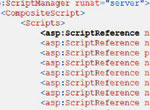
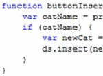

[Edit .md file](C:\Projects\msc\dev\Msc.Www\Web.ASP\App_Data\github\downloads\35-sp1\overview.md) | [Edit dev content](http://www.aspdev.net/umbraco#/content/content/edit/36270) | [View dev content](http://docs.aspdev.net/tutorials/downloads/35-sp1/overview.html) | [View prod content](http://www.asp.net/downloads/35-sp1/overview) | Picker: 36270

ASP.NET in .NET 3.5 Service Pack 1
====================
> ASP.NET in the .NET Framework 3.5 Service Pack 1 release includes numerous bug fixes. In addition, it includes features for the following:
> 
> - Enabling high-productivity data scenarios by using **ASP.NET Dynamic Data**.
> - Supporting the browser navigation in ASP.NET AJAX applications by using **ASP.NET AJAX browser history**.
> - Increasing the download speed for ASP.NET applications by using **ASP.NET AJAX script combining.**
> 
> **Read on to find answers to the following questions:** 
> 
> - [What are the new features?](#features)
> - [Where can I find these new features?](#find)
> - [Where can I ask questions and discuss these features?](#questions)
> - [Where can I learn more?](#learnmore)

## What are the new features?

[**ASP.NET Dynamic Data**](../../web-forms/videos/aspnet-dynamic-data/getting-started-with-dynamic-data.md "Watch the Video")  
ASP.NET Dynamic Data helps you quickly build a fully customizable, data-driven application without writing code. Dynamic Data provides a rich scaffolding framework that is easily extensible by using the traditional ASP.NET programming model.

[**ASP.NET AJAX browser history**](../../web-forms/videos/aspnet-35/aspnet-ajax/introduction-to-aspnet-ajax-history.md "Watch the Video")  
ASP.NET AJAX history provides support for navigating *within* an AJAX application by using the Forward and Back buttons in the browser.

[**ASP.NET AJAX script combining**](../../web-forms/videos/aspnet-35/aspnet-ajax/using-script-combining-to-improve-ajax-performance.md "Watch the Video")  
The ASP.NET AJAX script combining feature improves the performance of AJAX applications by reducing the number of scripts that have to be individually downloaded to the browser.

[**ADO.NET Data Services**](../../web-forms/videos/aspnet-35/aspnet-ajax/adonet-data-services-with-aspnet-ajax-support.md "Watch the Video")  
ADO.NET Data Services provide new services that find, manipulate and deliver data over the web using simple URIs. Benefits include an easy and flexible way to access data over the web, while enabling the separation of presentation and data access code.

See the [readme](readme.md) for more information about how to use these features in existing ASP.NET and ASP.NET AJAX applications, and about how to work with these features in applications that were created with the ASP.NET 3.5 Extensions December 2007 CTP release.

## Where can I find these new features?

- [Combined Visual Studio 2008 Service Pack 1 and .NET Framework 3.5 Service Pack 1](https://www.microsoft.com/downloads/details.aspx?FamilyId=FBEE1648-7106-44A7-9649-6D9F6D58056E&amp;displaylang=en)  
 The update for Visual Studio 2008 SP1 and .NET Framework 3.5 Service Pack 1 in a single install.
- [.NET Framework 3.5 Service Pack 1](https://www.microsoft.com/downloads/details.aspx?FamilyId=AB99342F-5D1A-413D-8319-81DA479AB0D7&amp;displaylang=en)  
 The update for just the .NET 3.5 Service Pack 1, it does not include updates for Visual Studio 2008.

## Where can I ask questions and discuss these features?

- [ASP.NET 3.5 SP1 Forum](https://forums.asp.net/1147.aspx)  
 For setup issues and general questions regarding the ASP.NET 3.5 SP1 release.
- [ASP.NET Dynamic Data Forum](https://forums.asp.net/1145.aspx)  
 For questions and discussions related to ASP.NET Dynamic Data.
- [ASP.NET AJAX UI Forum](https://forums.asp.net/1022.aspx)  
 For questions and discussions related to ASP.NET AJAX.  

## Where can I learn more?

The following are good resources for more information about this release:

- Visit the [ASP.NET Extensions Quickstarts](https://quickstarts.asp.net/3-5-extensions/) for more information on ASP.NET MVC Preview 3, the ASP.NET Controls for Silverlight
- [Watch the videos](#) to find out more about ASP.NET MVC, ASP.NET Dynamic Data, and other ASP.NET 3.5 SP1 topics.