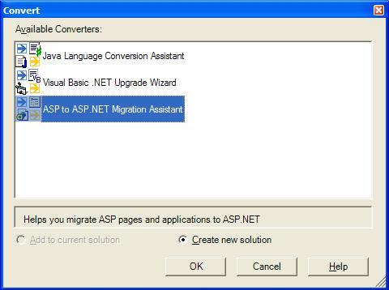
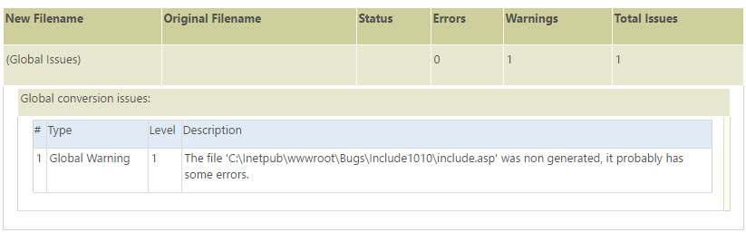

ASP to ASP.NET Migration Assistant - Getting Started
====================
> The ASP to ASP.NET Migration Assistant is designed to help you convert ASP pages and applications to ASP.NET. It does not make the conversion process completely automatic, but it will speed up your project by automating some of the steps required for migration.
> 
> Please also visit the [ASP.NET Conversion and Migration](https://msdn.microsoft.com/en-us/library/bb398858.aspx) section of MSDN for more information.
> 
> If you have questions or feedback on the Migration Assistant or about about moving from ASP to ASP.NET, please visit the [Migrate from Other Web Technologies to ASP.NET](https://forums.asp.net/29.aspx) forum.
> 
> Thanks!
> 
> The ASP.NET Team

## Before you begin

We recommend that you take the following steps before you run the migration assistant:

1. If you have never used ASP.NET before, we recommend that you familiarize yourself with ASP.NET before attempting to migrate any ASP applications. Please visit [this site](https://msdn.microsoft.com/en-us/library/ms228211.aspx) to get started.
2. Read this entire Getting Started page.
3. Back up your existing ASP application before attempting to migrate it.

* * *

Contents:

[How to run the assistant](#HowToRun)

[What the assistant will do](#WhatWillDo)

[What the assistant will not do](#WhatWillNotDo)

[What to do after the conversion](#AfterTheConversion)

[Questions and Feedback](#QuestionsFeedback)

* * *

## How to run the assistant

You can run the assistant from within Visual Studio .NET 2003 or from a command line interface.

### Visual Studio .NET

Open Visual Studio .NET and go to the Convert menu option: File - Open - Convert. Please refer to the following image:

Next, select the ASP to ASP.NET Migration Assistant converter, and decide whether to create a new solution or add the project that is going to be converted to the current solution.

After that, follow the instructions provided by the ASP to ASP.NET Migration Assistant Wizard.

### Console

ASP to ASP.NET Migration Assistant Command-Line Syntax: the AspUpgrade.exe command-line tool can be used to upgrade ASP files to ASP.NET.

The command line syntax for AspUpgrade.exe is:

- Running 

    [!code[Main](overview/samples/sample1.xml)]
- Help 

    [!code[Main](overview/samples/sample2.xml)]

#### Options

**DirectoryName**: Required. Specify the path of the ASP file(s) to be upgraded.

**/Out DirectoryName**: Specifies the path for the folder where the ASP.NET project will be created. The default path is OutDir.

**/Verbose**: Displays all output to the DOS window during upgrade.

**/NoLog**: Does not create a log file during upgrade.

**/LogFile filename**: Specify the path and file name for the log file created during upgrade. If the path and file name are not specified, a log file will be created in the same folder as the ASP.NET project. The default file name is ProjectName.log, where ProjectName is the name of the project file.

**/?** or **/Help**: Display a list of command-line options.

#### Remarks

Paths or file names that contain spaces must be surrounded by quotation marks.

## What the assistant will do

### Changes asp file name and its references to aspx equivalent

The ASP to ASP.NET Migration Assistant will generate the files of the new project with the extensions used in ASP.NET (\*.aspx) and will automatically correct all the references to the original files. These references can be found inside the file migrated and in other asp or html files involved in the migration process. There are several places in a file where a reference to another file can be found:

- Include directive
- Included files using the Script tag
- href tag
- Response.Redirect and Application.execute instructions
- Form action attribute

### Include files:

The upgrade tool migrate the files included using the &lt;!-- #INCLUDE ... --&gt; and &lt;SCRIPT src="filename" &gt; directive as if they were other ASP files.   
  
The files included using the &lt;!-- #INCLUDE ... --&gt; directive can contain HTML code, scripting code or a mix of both. Because of this, the Migration Tool also migrates these files to update them to the ASP.NET syntax, and resolve variables and functions that might be declared inside these files that are being used by the current ASP file.   
  
Without mattering their extentions these files are treated by the Migration Tool as if they were other ASP files.   
  
The &lt;SCRIPT src="filename" &gt; tag allows to include functions, procedures and variable declarations stored on other files by specifying the src attribute. The &lt;SCRIPT ...&gt; tag syntax remains the same in ASP.NET as it was in ASP. The &lt;SCRIPT src="filename" &gt; tag only allows to import files containing pure script code, no HTML code or &gt;%...%&lt; are allowed on these files, otherwise a compiler error will rise.

### Resolution of late binding

In VBScript it is common to find variable declarations which don't specify data types as well as undeclared variables. In these cases it is not possible to perform deductions based on the data types of those variables, such as the applicable methods and default properties.

The ASP to ASP.NET Migration Assistant will inspect the code and will analyze the way variables are used in order to infer the variable's data types for simple cases, such as the creation of objects by means of the CreateObject(), and will include the corresponding declarations. This way, the increase the quality of the code generated by the Upgrade Assistant and will ease the expansion of the default properties.

### Code relocation

ASP allows the declaration of sub-routines and variables inside the render tags (&lt;% ...%&gt;). On the other hand, ASP.NET requires that the declarations be inside the script tags (&lt;script ...&gt; ... &lt;/script ...&gt;). Also, ASP allows the execution of statements in server scripts, while in ASP.NET the execution of statements is restricted to render tags. 

The migration tool will perform the required relocations of Visual Basic code to the corresponding block, either a script tags or render tags.

- Functions declared inside render tags &lt;% ... %&gt; : *ASP allows mixing function declarations and any other kind of code within render tags. However, in ASP.NET that is not possible, because it only accepts statements and variable declarations within render tags. Any other code, like function and subroutine declarations, must be moved into a script tag global which language attribute is set to VB and runat attribute set to server.*
- Statements into Script runat=Server : *ASP allows mixing function declarations and any other kind of code within script tags. However, in ASP.NET that is not supported, because it only accepts function, subroutine and variable declarations within script tags. Any other code, like statements or comments, must be moved into a render tag.*
- Variable and Constant Declaration : *In ASP variables and constants declared inside render tags had a global scope. On the other hand, in ASP.NET variable are not visible outside the render tags. To emulate the ASP behavior, the migration tool extracts all these variables and declares them inside a script tag at the beginning of the file. The same process is applied to all variables not declared used in the file. All variables and constants declared inside the script tag should be left inside the script tag.*

## What the assistant will not do

### Changes Mix of scripting languages in server side

ASP allows mixing more than one scripting language on the server side in the same page. However, this is not allowed in ASP.NET. Because of this, the ASP Upgrade Assistant will not make any conversion/analysis of server side code written in scripting languages others from VBScript. An Error Warning an Issue (EWI) will be printed before all server side scripting code whose language differs from VBScript. This is not an issue for client-side scripts.

### Rendering functions

The ASP Upgrade Assistant will not modify the complex rendering functions. This limitation will affect the visualization of the ASPX pages in the designer view of the Visual Studio .NET IDE, and will produce compilation errors. Nonetheless, the converter will migrate simpler rendering functions.

### Security Model

ASP.NET handles the security configuration by means of the settings in the web.config file. The ASP Upgrade Assistant will not perform any conversion of the security model. It will be the user's responsibility to re-architect the application in order to take advantage of the security features of ASP.NET and IIS. [This article](https://msdn.microsoft.com/library/default.asp?url=/library/en-us/cpguide/html/cpconaspnetwebapplicationsecurity.asp) provides an overview of ASP.NET security.

## What to do after the conversion

### Conversion Report File

Review the Conversion Report file in order to work around issues that may have come up during the conversion process

### Error Warning and Issues (EWI)

Review all Error Warning and Issues inside your code and follow, if any, the instructions specified to achieve functionality. For example this could be a converted code snipped:

&lt;% 'UPGRADE\_NOTE: '#INCLUDE' tag is malformed. Copy this link in your browser for more info: ms-help://MS.MSDNVS/aspcon/html/aspup1004.htm %&gt;   
&lt;!--#include file="./Include/Table.asp --&gt;

## Questions and Feedback

Please visit the [Migrate from Other Web Technologies to ASP.NET](https://forums.asp.net/29.aspx) to ask questions and provide feedback.