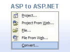

[Edit .md file](C:\Projects\msc\dev\Msc.Www\Web.ASP\App_Data\github\downloads\archived-v11\migration-assistants\overview.md) | [Edit dev content](http://www.aspdev.net/umbraco#/content/content/edit/36259) | [View dev content](http://docs.aspdev.net/tutorials/downloads/archived-v11/migration-assistants/overview.html) | [View prod content](http://www.asp.net/downloads/archived-v11/migration-assistants/overview) | Picker: 36259

Migration Assistants
====================
Microsoft provides several code migration assistants free of charge to help developers move their web applications to ASP.NET 1.x. Although these migration assistants do not make the conversion process completely automatic, they will speed up your project by automating some of the steps required for migration.

The MSDN section for ASP.NET Conversion and Migration can be found here: [ASP.NET Conversion and Migration](https://msdn.microsoft.com/en-us/library/bb398858.aspx)

## Archived Migration Assistants

## [ASP to ASP.NET 1.x Migration Assistant](asp-to-aspnet.md)

The ASP to ASP.NET 1.x Migration Assistant is designed to help you convert ASP pages and applications to ASP.NET.

## [PHP to ASP.NET 1.x Migration Assistant](php-to-aspnet.md)

The PHP to ASP.NET 1.x Migration Assistant is designed to help you convert PHP pages and applications to ASP.NET.