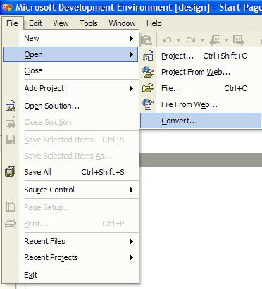
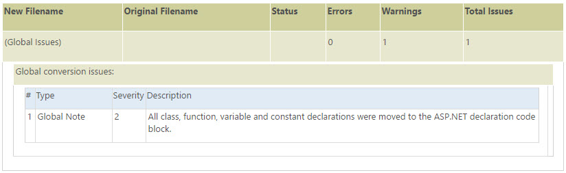

PHP to ASP.NET Migration Assistant - Getting Started
====================
> The PHP to ASP.NET Migration Assistant is designed to help you convert PHP pages and applications to ASP.NET. It does not make the conversion process completely automatic, but it will speed up your project by automating some of the steps required for migration.
> 
> Complete documentation and best practices for using the Migration Assistant can be found at [https://msdn.microsoft.com/en-us/library/aa479002.aspx](https://msdn.microsoft.com/en-us/library/aa479002.aspx).
> 
> If you have questions or feedback on the Migration Assistant or about about moving from PHP to ASP.NET, please visit the [Migrate from Other Web Technologies to ASP.NET](https://forums.asp.net/29.aspx) forum.
> 
> Thanks!
> 
> The ASP.NET Team

## Before you begin

**We recommend that you take the following steps before you run the migration assistant:** 

1. Read this entire Getting Started page.
2. Review the Migration Assistant [best practices whitepapers](https://msdn.microsoft.com/en-us/library/aa479002.aspx).
3. Back up your existing PHP application before attempting to migrate it.

* * *

**Contents:** 

[How to run the assistant](#HowToRun)

[What the migration assistant will do](#WhatWillDo)

[What the migration assistant will not do](#WhatWillNotDo)

[What to do after the migration](#AfterTheConversion)

[Questions and Feedback](#QuestionsFeedback)

* * *

## How to Run the Migration Assistant

You can run the assistant from within Visual Studio .NET 2003 or from a command line interface.

### Visual Studio .NET

Open Visual Studio .NET and go to the Convert menu option: File - Open - Convert. Please refer to the following image:

Next, select the PHP to ASP.NET Migration Assistant migrator, and decide whether to create a new solution or add the project that is going to be converted to the current solution.

After that, follow the instructions provided by the PHP to ASP.NET Migration Assistant Wizard.

### Console

The PHPConvert.exe command-line tool can be used to migrate PHP files to ASP.NET.

The command line syntax for PHPConvert.exe is:

- Running 

        PHPConvert[.exe] { <DirectoryName> [/Out <DirectoryName>] [/NoLog | /LogFile <filename>] [/NoLogo] [/Verbose] [/ProjectName <ProjectName>] [/ForceOverwrite] }
- Help 

        PHPConvert[.exe] /? or /Help

### Options

**/?** or **/Help**: *Display a list of command-line options.*

**DirectoryName**: *Required. Name of the Directory with PHP source files and related (.php) to migrate.*

**/Out DirectoryName**: *Specifies the path for the folder where the ASP.NET project will be created. The default path is OutDir.*

**/NoLog**: *Suppresses writing a log file.*

**/LogFile filename**: *Specifies the path and file name for the log file created during migration. If the path and file name are not specified, a log file will be created in the same folder as the ASP.NET project. The default file name is ProjectName.xml, where ProjectName is the name of the project file.*

**/Verbose**: *Displays all output to the DOS window during migration.*

**/ProjectName**: *Specifies the project name for the new ASP.NET project.*

**/ForceOverwrite**: *Suppresses prompting to confirm overwriting of existing destination directory.*

#### Remarks

Paths or file names that contain spaces must be surrounded by quotation marks.

## What the migration assistant will do

### Language migration

The migration assistant will convert most of the PHP language components to C# equivalents as follows:

- **Classes and Objects:** This feature is fully supported; class declaration, inheritance, object initialization, and others are converted to C# classes and objects.
- **Constants:** Constant definitions (using the 'define' function) are converted to a C# constant declaration.
- **Control Structures:** The migration assistant supports almost all the PHP control structures (except the 'declare' statement), the migration assistant even supports the control structures' alternative syntax.
- **Functions:** The most important function features are automatically converted: conditional functions, declaring functions, default arguments, functions within functions, invoking functions and class functions. The assistant does not support variable functions nor invoking functions without parameters.
- **Operators:** The most important operators are supported by migration assistant.
- **References:** The migration assistant supports passing by reference, the rest of the references are not converted.
- **Syntax:** Syntax elements, such as comments, html escaping and instruction separation are also converted by the migration assistant.
- **Types:** Fully supported by the migration assistant, including arrays (converted to a helper class). Other type features such as type conversion, special types (i.e. null, resources) are also supported.
- **Variables:** The migration assistant converts variables including predefined variables. Since in PHP it is not necessary to declare variables, the migration assistant analyses the code and declares the variables with the correct type as needed.

### Changes php file name and its references by aspx equivalent

The PHP to ASP.NET Migration Assistant will generate the files of the new project with the extensions used in ASP.NET (\*.aspx) and will automatically correct all the references in the original files. There are several places in a php file where a reference to another file can be found:

- Include functions
- Included files using the Script tag
- href tag
- Form action attribute

### Include files

The migration tool converts the local included files using the &lt;!--INCLUDE...--&gt; directive (only files with extension "php", "php3" and "inc" are migrated, the rest are just copied to target directory).  
The included files can contain HTML code, scripting code or a mix of both. Because of this, the Migration Tool considers these files when analyzing and relocating the code.

### Type Inferring mechanism

PHP is not a strongly typed language. Types for variables, functions, constants, and other language elements are determined by the context in which those elements are used. On the other hand, .NET languages, specifically c#, are strongly typed languages; that is, variables, constants, methods and others elements must be typed when declared. In order to obtain a strong-typed migrated ASP.NET application, the PHP to ASP.NET Migration Assistant will inspect the source code and will analyze the way variables and other languages elements are used to infer those elements' data types, which will be used to declare the elements.

### Code relocation

PHP allows the declaration of functions and variables inside the PHP html escaping tags (normally *&lt;?php ...?&gt;*). On the other hand, ASP.NET requires those declarations to be inside of script tags (*&lt;script language="C#" runat=server&gt; ... &lt;/script&gt;*). Besides that, PHP allows the execution of statements in server scripts, while in ASP.NET the execution of statements is restricted to render tags (*&lt;%...%&gt;*).  
  
The migration tool will perform the required relocations of PHP code to the corresponding block, either a script tags or render tags as follows:

- **Functions declarations:** PHP allows function declarations and any other kind of code within render tags. However, in ASP.NET that is not possible, render tags only accept statements and variable declarations. Any other code, like function declarations, must be moved into a script tag (language attribute is set to c# and runat attribute set to server).
- **Statements:** Statements are always moved to ASP.NET render tags (*&lt;%...%&gt;*).
- **Variable and Constant declaration:** In PHP variables and constants declared inside render tags have a global scope. On the other hand, in ASP.NET variable are not visible outside the render tags. To emulate the PHP behavior, the migration tool extracts all these variables and constants and declares them inside a script tag at the beginning of the file. All variables and constants declared inside the script tag should be left inside the script tag.

### Built-in functions support

The main PHP core functions are also converted by the migration assistant. The most important functions of the following groups are supported by the migration assistant:

- Apache
- Array
- Calendar
- Classes &amp; Objects
- COM
- Constants
- Language Constructs
- Date &amp; Time
- Directory
- Error Handling
- File System
- Function Handling
- Http
- Mail
- Mathematics
- Miscellaneous
- MS-SQL
- MySQL
- ODBC
- Oracle
- PHP Options
- Predefined Variables
- Program Execution
- Perl Regular Expressions
- POSIX Regular Expressions
- Session
- String
- URL
- Variable
- XML Parser

## What the migration assistant will not do

### Dynamic includes

The migration assistant will not convert dynamic includes properly, manual changes are needed to successfully convert dynamic includes. Dynamic includes are those server-side file includes that are made dynamically, for example, using a variable as the name of the file to be included.

### Declare statement

The 'declare' statement is the only control structure not supported by the migration assistant.

### PHP functions not completed in current script.

In PHP it is possible to have a functions divided into two or more scripts. The migration assistant might encounter problems with this kind code, an wrong converted code might be generated.

### Variable functions / variable variables

Variable variable and variable functions, that is variable of function names which can be used dynamically are not supported by the migration assistant.

### References

The only kind of references supported by the migration assistant is passing arguments by reference to methods, the rest of references is not supported.

### Other limited features

The migration assistant has limited support (in other words, the feature is not fully supported) to the following features:

- COM Objects
- User functions with variable length parameters
- Functions groups not listed in the built-in functions support section
- Scripts wrote in other languages than PHP are not migrated

## What to do after the migration

### Conversion Report File

Review the Conversion Report file in order to work around issues that may have come up during the conversion process, the report might look like this:

### Error Warning and Issues (EWI)

Review all Error Warning and Issues inside your code and follow, if any, the instructions specified to achieve functionality. For example this could be a converted code snipped:

    <!--CONVERSION_TODO: Language construct 'include' was converted to '#include' which has a different behavior.-->
    <!-- #include file = "file.aspx" -->

## Questions and Feedback

If you have questions or feedback on the Migration Assistant or about about moving from PHP to ASP.NET, please visit the [Migrate from Other Web Technologies to ASP.NET](https://forums.asp.net/29.aspx) forum.