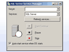
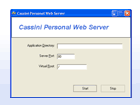
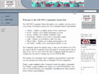
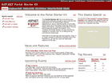
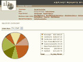
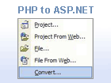

Archived Downloads v1.1
====================
- [Archived Applications](#applications)
- [Archived Projects](#projects)
- [Archived Starter Kits](#kits)
- [Archived Migration Assistants](#migration)

The Microsoft ASP.NET team and the ASP.NET community released a number of applications, sample projects, and starter kits designed to allow you to quickly build ASP.NET 1.x applications. The projects and starter kits designed for earlier versions of ASP.NET are archived on this page.

## Archived Applications

## Microsoft SQL Server Desktop Engine (MSDE)

Microsoft SQL Server Desktop Engine (MSDE) offers application developers new opportunities to build desktop and shared solutions that are freely distributable and can be easily migrated to SQL Server 2000.

## Archived Projects

## Cassini Sample Web Server

The ASP.NET Cassini Web Server Sample is a sample web server written using the Microsoft® .NET® Framework, and demonstrates hosting ASP.NET using the ASP.NET hosting APIs (System.Web.Hosting).

## Archived Starter Kits

The ASP.NET Starter Kits are sample ASP.NET applications that provide code to accomplish common Web development tasks. Each sample is complete and well-documented so that you can use the code to kickstart your ASP.NET development projects today.

## [Commerce Web Site](starter-kits/commerce.md)

The Commerce Starter Kit demonstrates an ecommerce storefront application complete with shopping cart, product catalog, and a web service to submit orders.

## [Community Web Site](starter-kits/community.md)

The Community Starter Kit enables an individual or an ISP to quickly create a community Web site such as a user group site, a developer resource site, or a news site.

## [Issue Tracker Web Site](starter-kits/issue-tracker.md)

The Issue Tracker enables project teams to keep track of outstanding issues, assigned owners, history and related issues through a Web-based interface.

## [Portal Web Site](starter-kits/portal.md)

The ASP.NET Portal Starter Kit demonstrates how you can use ASP.NET and the .NET Framework to build a dynamic portal application. The ASP.NET Portal Starter Kit offers all the functionality of typical portal applications.

## [Reports Web Site](starter-kits/reports.md)

The Reports Starter Kit demonstrates a simple data reporting solution for displaying multiple views on data, creating charts, and rendering any type of data in a Web application.

## Archived Migration Assistants

## [ASP to ASP.NET 1.x Migration Assistant](migration-assistants/asp-to-aspnet.md)

The ASP to ASP.NET 1.x Migration Assistant is designed to help you convert ASP pages and applications to ASP.NET.

## [PHP to ASP.NET 1.x Migration Assistant](migration-assistants/php-to-aspnet.md)

The PHP to ASP.NET 1.x Migration Assistant is designed to help you convert PHP pages and applications to ASP.NET.