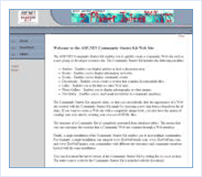

Community Web Site
====================
> The Community Starter Kit enables an individual or an ISP to quickly create a community Web site such as a user group site, a developer resource site, or a news site.
> 
> - [Download Visual Basic version for Web Matrix](https://download.microsoft.com/download/d/9/a/d9ae0c5c-47a4-4754-b82c-5498304760cd/ASP.NET Community (VBSDK) Installer v1.0.msi)
> - [Download Visual Basic version for Visual Studio](https://download.microsoft.com/download/d/9/a/d9ae0c5c-47a4-4754-b82c-5498304760cd/ASP.NET Community (VBVS) Installer v1.0.msi)
> 
> - [Download Visual C# version for Web Matrix](https://download.microsoft.com/download/d/9/a/d9ae0c5c-47a4-4754-b82c-5498304760cd/ASP.NET Community (CSSDK) Installer v1.0.msi)
> - [Download Visual C# version for Visual Studio](https://download.microsoft.com/download/d/9/a/d9ae0c5c-47a4-4754-b82c-5498304760cd/ASP.NET Community (CSVS) Installer v1.0.msi)
> 
> - [Download Visual J# version for Web Matrix](https://download.microsoft.com/download/d/9/a/d9ae0c5c-47a4-4754-b82c-5498304760cd/ASP.NET Community (VJSSDK) v0.5.msi) *(Requires ASP.NET 1.1)*
> - [Download Visual J# version for Visual Studio](https://download.microsoft.com/download/d/9/a/d9ae0c5c-47a4-4754-b82c-5498304760cd/ASP.NET Community (VJSVS) v0.5.msi) *(Requires ASP.NET 1.1)*

### Features

#### Easy Customization with Themes

- Skin your site with the click of a button
- Includes eight themes
- Can be customized with your own themes

#### Includes Six Standard Content Modules

- Articles
- Links
- Downloads
- Photo Gallery
- Events
- Books

#### Create Multiple Communities with a Single Installation

- Set community quotas

#### Additional Features

- Send Newsletters
- Create voting polls
- Supports RSS news feeds and XML Web services