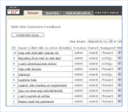

[Edit .md file](C:\Projects\msc\dev\Msc.Www\Web.ASP\App_Data\github\downloads\archived-v11\starter-kits\issue-tracker.md) | [Edit dev content](http://www.aspdev.net/umbraco#/content/content/edit/36267) | [View dev content](http://docs.aspdev.net/tutorials/downloads/archived-v11/starter-kits/issue-tracker.html) | [View prod content](http://www.asp.net/downloads/archived-v11/starter-kits/issue-tracker) | Picker: 36267

Issue Tracker Web Site
====================
> The Issue Tracker enables project teams to keep track of outstanding issues, assigned owners, history and related issues through a Web-based interface.
> 
> - [Download Visual Basic version for Web Matrix](https://download.microsoft.com/download/0/3/c/03cd34c8-5813-42a1-a94b-fa07a3363b28/IssueTrackerVBSDK.msi)
> - [Download Visual Basic version for Visual Studio](https://download.microsoft.com/download/b/4/0/b403d362-2812-40be-9954-21675ae4b10d/IssueTrackerVBVS.msi)
> 
> - [Download Visual C# version for Web Matrix](https://download.microsoft.com/download/6/9/8/698c0edc-b710-4d4c-b4ad-6759c398bdd2/IssueTrackerCSSDK.msi)
> - [Download Visual C# version for Visual Studio](https://download.microsoft.com/download/6/2/9/6290d2b2-fcec-4624-9d04-5606e0c05b5c/IssueTrackerCSVS.msi)

### Features

#### Create Projects

- Define project name and description
- Create issue categories and custom fields
- Add project members and permissions

#### Create and Track Issues

- Assign issue owners and add notes
- Track issue status, related issues and history
- Query and sort issues using a boolean search

#### Technologies and Design Approaches Demonstrated:

- Best practices for building applications in preparation for ASP.NET 2.0
- Multiple database support, with Access (Jet) and SQL Server
- Mobile web application development