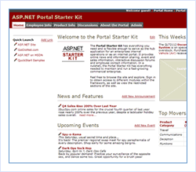

[Edit .md file](C:\Projects\msc\dev\Msc.Www\Web.ASP\App_Data\github\downloads\archived-v11\starter-kits\portal.md) | [Edit dev content](http://www.aspdev.net/umbraco#/content/content/edit/36269) | [View dev content](http://docs.aspdev.net/tutorials/downloads/archived-v11/starter-kits/portal.html) | [View prod content](http://www.asp.net/downloads/archived-v11/starter-kits/portal) | Picker: 36269

Portal Web Site
====================
> The ASP.NET Portal Starter Kit demonstrates how you can use ASP.NET and the .NET Framework to build a dynamic portal application. The ASP.NET Portal Starter Kit offers all the functionality of typical portal applications.
> 
> - [Download Visual Basic version for Web Matrix](https://download.microsoft.com/download/1/a/f/1af888ec-deaa-4881-8525-6401da22889b/ASP.NET Portal (VBSDK) Installer v1.0.msi)
> - [Download Visual Basic version for Visual Studio](https://download.microsoft.com/download/1/a/f/1af888ec-deaa-4881-8525-6401da22889b/ASP.NET Portal (VBVS) Installer v1.0.msi)
> 
> - [Download Visual C# version for Web Matrix](https://download.microsoft.com/download/1/a/f/1af888ec-deaa-4881-8525-6401da22889b/ASP.NET Portal (CSSDK) Installer v1.0.msi)
> - [Download Visual C# version for Visual Studio](https://download.microsoft.com/download/1/a/f/1af888ec-deaa-4881-8525-6401da22889b/ASP.NET Portal (CSVS) Installer v1.0.msi)
> 
> - [Download Visual J# version for Web Matrix](https://download.microsoft.com/download/1/a/f/1af888ec-deaa-4881-8525-6401da22889b/ASP.NET Portal (JSSDK) .NET1.1 Installer v1.0.msi) *(Requires ASP.NET 1.1)*
> - [Download Visual J# version for Visual Studio](https://download.microsoft.com/download/1/a/f/1af888ec-deaa-4881-8525-6401da22889b/ASP.NET Portal (JSVS) .NET1.1 Installer v1.0.msi) *(Requires ASP.NET 1.1)*

### Features

#### Dynamic Portal Infrastructure

- 10 basic portal modules for common types of content
- A "pluggable" framework that is simple to extend with custom portal modules
- Online administration of portal layout, content and security
- XML based definition of portal layout
- Roles-based security for viewing content, editing content, and administering the portal
- Full mobile support using the ASP.NET Mobile Controls

#### Technologies and Design Approaches Demonstrated:

- ASP.NET Mobile Controls
- Three-tier architecture with ASP.NET
- Role Based Security