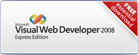

[Edit .md file](C:\Projects\msc\dev\Msc.Www\Web.ASP\App_Data\github\downloads\essential.md) | [Edit dev content](http://www.aspdev.net/umbraco#/content/content/edit/36252) | [View dev content](http://docs.aspdev.net/tutorials/downloads/essential.html) | [View prod content](http://www.asp.net/downloads/essential) | Picker: 36252

Essential Downloads
====================
> To get started creating dynamic web sites with ASP.NET, you will need the following two downloads. Both downloads are free, and both are provided in your choice of language. For more information on whats new in Visual Studio 2008 and ASP.NET 3.5 go to the [new features page](vs2008.md). For more information on ASP.NET in the .NET Framework 3.5 Service Pack 1 go to the [SP1 page](35-sp1/index.md)

## WEB PI V2

With WebPI 2.0 in addition to the Microsoft Web Platform the install now includes popular web applications like Blogs, Media Galleries, Content Management Systems and Wikis. The list of web applications is driven by the Web Application Gallery with new applications being added every day.

| All Languages | [Download](https://go.microsoft.com/fwlink/?LinkID=145510) |
| --- | --- |

## Microsoft .NET Framework Version 3.5 SP1

The Microsoft .NET Framework is a component of the Windows operating system. It provides the foundation for next-generation applications, including ASP.NET web applications.

**The Microsoft .NET Framework Version 3.5 SP1 can be downloaded from here:** 

| All Languages | [Download](https://download.microsoft.com/download/0/6/1/061F001C-8752-4600-A198-53214C69B51F/dotnetfx35setup.exe) |
| --- | --- |

## Visual Web Developer 2008 Express Edition SP1

[Visual Web Developer 2008 Express Edition](index.md) is a free easy to use and easy to learn program that allows everyone, from the novice to the professional developer, to create ASP.NET web sites.

**The 2008 version of Visual Web Developer Express Edition can be downloaded from here:** 

| English | [Download](https://go.microsoft.com/?linkid=7729281) |
| --- | --- |
| Chinese (Simplified) | [Download](https://go.microsoft.com/?linkid=8328409 ) |
| Chinese (Traditional) | [Download](https://go.microsoft.com/?linkid=8328339) |
| French | [Download](https://go.microsoft.com/?linkid=8212665) |
| German | [Download](https://go.microsoft.com/?linkid=8212502) |
| Italian | [Download](https://go.microsoft.com/?linkid=8310623) |
| Japanese | [Download](https://go.microsoft.com/?linkid=7969098) |
| Korean | [Download](https://go.microsoft.com/?linkid=8310628) |
| Spanish | [Download](https://go.microsoft.com/?linkid=8310517) |