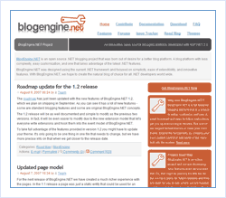

BlogEngine.NET Starter Kit
====================
> BlogEngine.NET is a full-featured blogging platform that is a breeze to set up, customize, and use. BlogEngine.NET works with your choice of data source; you may use SQL Server, or you may take the plug'n'play approach using XML files.
> 
> - [Download the BlogEngine.NET Web Site](http://www.codeplex.com/blogengine/Release/ProjectReleases.aspx)
> - [Review the Features](http://www.dotnetblogengine.net/page/features.aspx)

[See it Live!](http://www.dotnetblogengine.net/)

### Overview

- **Plug 'n' Play**  
 BlogEngine.NET is very easy to setup and customize. To make it work, just upload the files to an ASP.NET 2.0 webserver and you're ready to start writing. No database configuration, just plug'n'play.
- **Full Featured**  
 BlogEngine.NET comes with all the features you would expect from a modern blog engine as well as new unique features such as AJAX comments and screenshot trackbacks.
- **Web 2.0**  
 BlogEngine.NET features social bookmarks, OpenSearch support, XFN tags, AJAX, Microsummaries, Gravatars, coComments, tag cloud, Google sitemap and other so-called Web 2.0 features.
- **Cool Themes**  
 BlogEngine.NET comes with some very cool themes for you to choose from. If you want to modify or create a new theme you can do so easily with just a basic understanding of HTML and CSS.
- **XHTML Compliance**  
 All the controls in BlogEngine.NET are 100% XHTML 1.0 compliant. All posts you write automatically becomes compliant thanks to the tinyMCE text editor.
- **Extendable**  
 BlogEngine.NET is built from the ground up using nothing but C# and ASP.NET 2.0 all with simplicity in mind. It means that you can write new controls and themes by using the skills you already have as a .NET developer.

### Frequently Asked Questions

<dl style="margin-left: 12px;"><dt><strong>Q. What are the demands for the web server?</strong></dt><dd><strong>A.</strong> The only thing needed to run BlogEngine.NET is a web server that support ASP.NET 2.0 and write permissions on the App_Data folder.</dd><dt style="margin-top:.6em;"><strong>Q. What database is it running on?</strong></dt><dd><strong>A.</strong> None. BlogEngine.NET uses XML to store all posts, pages etc. by default. If you prefer to use a database, a SQL Server provider is included. You can find information about how to set up the SQL Server provider on our Wiki. For any other databases, you can write your own provider, which is very easy and simple to do.</dd></dl>

### License

- BlogEngine.NET is licensed under the [Microsoft Permissive License](http://www.codeplex.com/blogengine/Project/License.aspx).