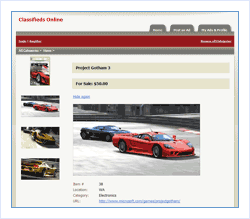

Classifieds Site Starter Kit
====================
> The Classifieds Site Starter Kit provides a complete, ready to run, fully customizable, Web site for listing and managing classified advertisements.
> 
> - [Download the Classifieds Site Starter Kit](https://msdn.microsoft.com/en-us/cc533489.aspx)

### Easily create ad listings

- Creating an ad is as simple as selecting the category, entering the ad details, and uploading images

### Built-in search and categories simplifies finding ads

- Built-in search enables visitors to easily find what they want
- Customizable categories make it easy for administrators to tailor the site as needed

### Built-In Site Administration

- Advertisements and Locations
- Users
- Site Settings

### Technologies and Design Approaches Demonstrated:

- Three-tier architecture
- User controls
- Theming and Master pages