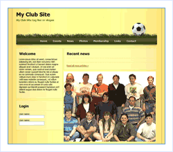

Club Site Starter Kit
====================
> A starting point for creating a web site for your club or organization. Includes a news posting, calendaring, member directory, and photo album systems.
> 
> Create news announcements and news articles with photos or links to a photo album. Create and view Membership lists of club members. Create photo albums and share the photos from your club activities.
> 
> - [Download the Club Web Site Starter Kit](https://msdn.microsoft.com/en-us/cc533487.aspx)
> - [Download Generic Scripts for SQL Server 2000 &amp; MSDE](https://www.microsoft.com/downloads/details.aspx?FamilyId=0DD83A11-6980-4951-A192-DA6EACC6A19E&amp;displaylang=en)
> - [Download the Event Calendar Control](club/_static/eventcalendar1.zip)
> - [View Discussion Forum](https://forums.asp.net/1004.aspx/1?Club+Web+Site+Starter+Kit)

[Try it Live!](https://starterkits.asp.net/Club/)

**Login Information:** 

Username: Admin  
Password: 1.admin.1

Create news announcements and news articles with photos or links to a photo album

### Event calendaring

- Create club events viewable as a list or calendar
- Download events to Outlook or other calendaring application

### Event locations

- Separate pages for club events occurring in different locations
- Use for directions and facility information

Create photo albums and share the photos from your club activities

Create and view Membership lists of club members

Technologies and Design Approaches Demonstrated:

- Databound events calendar
- Customized web controls
- Data binding

### Update!

Visit the [Community Projects](https://www.asp.net/web-forms/open-source) page and view the *"Extended Club Site Starter Kit"* created by Brendon Schwartz.