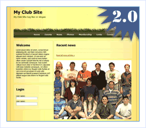

[Edit .md file](C:\Projects\msc\dev\Msc.Www\Web.ASP\App_Data\github\downloads\starter-kits\codeplex-club.md) | [Edit dev content](http://www.aspdev.net/umbraco#/content/content/edit/36276) | [View dev content](http://docs.aspdev.net/tutorials/downloads/starter-kits/codeplex-club.html) | [View prod content](http://www.asp.net/downloads/starter-kits/codeplex-club) | Picker: 36276

Codeplex Club Site Starter Kit
====================
> The Codeplex Club Web Site in an open-source project that enhances the original [Club starter kit](club.md). The project provides an extended architecture, improved Photo and Blogging components, and better administration options.
> 
> - [Download the Codeplex Club Starter Kit](http://www.codeplex.com/ClubStarterKit/)
> - [View Discussion Forum](https://forums.asp.net/1134.aspx)

The Codeplex Club Site Starter Kit provides the following enhancements over the original [Club Site Starter Kit](club.md):

- A full Business Logic Layer
- Poll Control
- League Management
- Rearchitected Forums
- Better User Administration
- Improved Photo System 

    - Photos on file system
- Improved Blogging system 

    - Member name from Membership Key
    - User's personal blog

The project makes use of the [SubSonic](http://subsonicproject.com/) toolset.