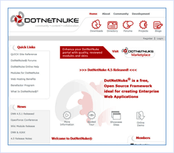

DotNetNuke Portal Starter Kit
====================
> DotNetNuke is an open source web application framework ideal for creating, deploying and managing interactive web, intranet and extranet sites. The combination of an enterprise portal, built-in content management system, elegant skinning engine, and the ability to display static and dynamic content makes DotNetNuke an essential tool for ASP.NET developers.
> 
> - [Download the DotNetNuke Portal Web Site](http://www.dotnetnuke.com/tabid/125/default.aspx)
> - [Review the Features](http://www.dotnetnuke.com/portals/_default/Skins/DNN-Minimal/DotNetNuke%20Feature%20Sheet.pdf) (PDF file)
> - [View Discussion Forum](http://www.dotnetnuke.com/tabid/795/Default.aspx)

[See it Live!](http://www.dotnetnuke.com)

### Overview

- Fully dynamic web site allows for an unlimited number of Pages
- Pages can contain an unlimited number of Content regions and Content types
- Advanced Content Management enabled via a standard Web Browser
- Build an online Community with robust Membership Management
- Secure your Content using advanced Roles and Permissions
- Multi-tenancy allows for multiple Sites to be hosted from a single installation

### License

- Unrestricted Open Source BSD license
- FREE use in non-commercial and commercial environment

### Extensibility

- Modular architecture enables hundreds of third party plug-in Modules
- Designer-friendly Skinning engine for total site customization
- Multiple database support through Providers
- More than 70 Language Packs to support International users

### Support

- More than 550,000 registered users since Dec 24, 2002
- Maintained and supported by DotNetNuke Corporation