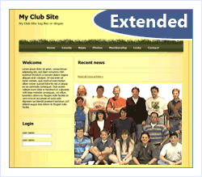

Extended Club Site Starter Kit
====================
> The Extended Club Web Site provides an extended version of the original [Club starter kit](club.md). New administration pages provide for the management of user roles and of the site map structure. Web Parts allow the user to personalize the home page, and alternative Themes allow the user to select the site's appearance.
> 
> - [Download the Extended Club Starter Kit](http://extendedclubsite.codeplex.com/)

An extended version of the [Club Site starter kit](club.md) that includes a Role Management page, Web Parts, Page management, and Themes.

- Many user groups want a way to manage the roles of the users through the user interface. To provide for this a role management page has been created to add users, delete users, or move users to roles in the site. In addition to being able to manage the users in roles, you can also create new or delete roles for the entire site.
- Not every site wants to have their information in the same location. The extended club starter kit has the ability for end users to move data to the location they want on the home page using ASP.NET 2.0 Profiles and ASP.NET 2.0 Web Parts.
- To help manage the pages that are in the site, a management page has been created to update the sitemap file to change the location of a page.
- Each site might want a different look and feel. The club starter kit has been extended to allow the user to change the ASP.NET 2.0 Theme that is used. This can allow the end user to change the look and feel of the site quickly by just adding a new ASP.NET 2.0 Theme. The extended Club Starter Kit includes 3 themes as examples of a different look and feel. The themes that are provided with the kit are the default Club Starter Kit called Club, a user group theme called DevCow, and a Event site called CodeCamp. This functionality could be extended as well as extending the core functionality of the Club Starter Kit.