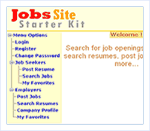

[Edit .md file](C:\Projects\msc\dev\Msc.Www\Web.ASP\App_Data\github\downloads\starter-kits\job.md) | [Edit dev content](http://www.aspdev.net/umbraco#/content/content/edit/36281) | [View dev content](http://docs.aspdev.net/tutorials/downloads/starter-kits/job.html) | [View prod content](http://www.asp.net/downloads/starter-kits/job) | Picker: 36281

Job Site Starter Kit
====================
> Job Site Starter Kit (JSSK) is an ASP.NET starter kit demonstrating many new features of ASP.NET 2.0 including themes, master pages, new data controls, membership, roles and profiles.
> 
> JSSK is a web application that provides a platform for candidates seeking job and the employers to share their needs.
> 
> - [Download the Job Site Starter Kit (ASP.NET 2.0)](http://www.binaryintellect.net/articles/displayarticle.aspx?id=4)
> - [Download the Job Site Starter Kit (ASP.NET 3.5)](http://www.binaryintellect.net/articles/a203c824-aec1-41b7-b3ec-49a15d5c9ebb.aspx)
> - [More Information](http://www.binaryintellect.net/articles/displayarticle.aspx?id=4)

### Overview

- Enables job seekers to post resumes
- Enables job seekers to search for job postings
- Enables employers to enter profile of their company
- Enables employers to post one or more job postings

### ASP.NET Features used

- Forms based authentication
- User management via Membership providers
- Role based security
- Profiles
- Themes
- Master pages
- New data source controls - ObjectDataSource
- New data bound controls GridView and DetailsView
- New navigational controls TreeView
- New login controls Login, PasswordRecovery, LoginName and LoginStatus
- Web parts for customization