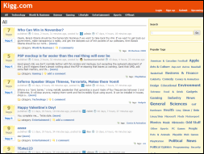

[Edit .md file](C:\Projects\msc\dev\Msc.Www\Web.ASP\App_Data\github\downloads\starter-kits\kigg.md) | [Edit dev content](http://www.aspdev.net/umbraco#/content/content/edit/36282) | [View dev content](http://docs.aspdev.net/tutorials/downloads/starter-kits/kigg.html) | [View prod content](http://www.asp.net/downloads/starter-kits/kigg) | Picker: 36282

Kigg Starter Kit
====================
> Kigg is a Digg like application developed with ASP.NET MVC Framework, LINQ to SQL and ASP.NET AJAX.
> 
> - [Download Kigg Starter Kit](http://www.codeplex.com/Kigg/Release/ProjectReleases.aspx?ReleaseId=10931)
> - [Review the Features](http://codeplex.com/Kigg)

### ASP.NET features used

- MVC Framework
- LINQ
- ASP.NET AJAX