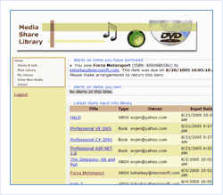

[Edit .md file](C:\Projects\msc\dev\Msc.Www\Web.ASP\App_Data\github\downloads\starter-kits\media-library.md) | [Edit dev content](http://www.aspdev.net/umbraco#/content/content/edit/36283) | [View dev content](http://docs.aspdev.net/tutorials/downloads/starter-kits/media-library.html) | [View prod content](http://www.asp.net/downloads/starter-kits/media-library) | Picker: 36283

Media Library Starter Kit
====================
> The Media Share Library Starter Kit enables you to easily create an application that allows registered users to present a collection of media items (such as movie DVDs, music CDs, books, and more) for other registered users to borrow.
> 
> - [Download the Media Library Starter Kit](https://download.microsoft.com/download/0/F/3/0F39BA3D-0719-4234-ADEA-9E672F5D22B0/MediaShareLibraryIntro.msi)
> - [Read Introductory Article](https://msdn.microsoft.com/en-us/library/aa479392.aspx)

### Overview

- Learn how to create an ASP.NET Starter Kit from beginning to finish
- Manage your collection of videos, DVD's and more
- Integrate with Amazon Web services
- Share your library with friends

### ASP.NET Features used

- Data access using SQL Server Express Edition
- Themes
- Membership and Roles
- Navigation
- Web Service integration