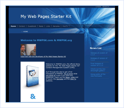

[Edit .md file](C:\Projects\msc\dev\Msc.Www\Web.ASP\App_Data\github\downloads\starter-kits\my-web-pages.md) | [Edit dev content](http://www.aspdev.net/umbraco#/content/content/edit/36284) | [View dev content](http://docs.aspdev.net/tutorials/downloads/starter-kits/my-web-pages.html) | [View prod content](http://www.asp.net/downloads/starter-kits/my-web-pages) | Picker: 36284

My Web Pages Starter Kit
====================
> The My Web Pages Starter Kit is a dynamic content management system (CMS). It is designed to meet the needs of computer enthusiasts who want to deploy and maintain their own website — and it is also easy to modify the look and feel or even extend the feature set.
> 
> - [Download the My Web Pages Starter Kit](http://www.codeplex.com/MyWebPagesStarterKit/)
> - [View Discussion Forum](http://www.codeplex.com/MyWebPagesStarterKit/Thread/List.aspx)

The My Web Pages Site Starter Kit provides the following features:

- Dynamic Content Management System 

    - Easy UI for everyday content management
    - Pre-built components: HTML, Events, Links, Guest Book, Contact Form, Downloads, RSS, Gallery

- Easily configurable localizations 

    - Prepared for localization right from the start. All required resources are to be found in just three files: one for the application and two for the manual.

- ASP.NET 2.0 based 

    - Themes, Masterpages, Data binding, Security, Navigation, Membership provider work as expected.

- File based 

    - No database is used to store data. All data is serialized into XML files within the "App\_Data" folder. Of course do SQL Server databases offer great advantages, but we tried to focus on simplicity and decided to use a file based method to store the data.

- Complete source code available 

    - Permissive license and full source code offers flexibility to customize the kit to individual requirements

- Runs in medium trust 

    - No special privileges are required to run the kit in a hosted environment. Aligns with shared hosting environments.

- Security model 

    - Simple user management and access control is included (Custom ASP.NET 2.0 membership provider)